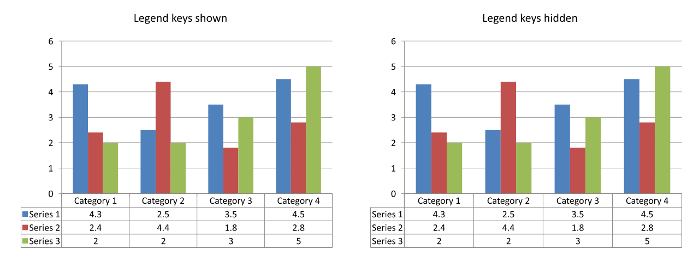

## **Ikhtisar**

Aspose.Slides for C++ memungkinkan Anda menampilkan tabel data diagram dan menyesuaikan pemformatan teks, batas, serta kunci legenda. Artikel ini menjelaskan cara mengaktifkan tabel, memformat teksnya, mengontrol masing‑masing jenis batas, dan menampilkan atau menyembunyikan kunci legenda. Contoh‑contohnya menyimpan diagram yang telah dikonfigurasi ke dalam berkas PPTX.

## **Atur Properti Font**

Untuk menampilkan tabel data diagram, berikan `true` ke [IChart::set_HasDataTable](https://reference.aspose.com/slides/id/cpp/aspose.slides.charts/ichart/set_hasdatatable/). Gunakan [IChart::get_ChartDataTable](https://reference.aspose.com/slides/id/cpp/aspose.slides.charts/ichart/get_chartdatatable/) untuk mengakses tabel dan mengatur pemformatan teksnya.

1. Muat presentasi menggunakan kelas [Presentation](https://reference.aspose.com/slides/id/cpp/aspose.slides/presentation/).
1. Tambahkan diagram kolom berkelompok ke slide pertama.
1. Aktifkan tabel data diagram.
1. Aktifkan teks tebal dengan [IBasePortionFormat::set_FontBold](https://reference.aspose.com/slides/id/cpp/aspose.slides/ibaseportionformat/set_fontbold/) dan berikan `20` ke [IBasePortionFormat::set_FontHeight](https://reference.aspose.com/slides/id/cpp/aspose.slides/ibaseportionformat/set_fontheight/) untuk teks berukuran 20 poin.
1. Simpan presentasi yang telah dimodifikasi.

Contoh berikut memerlukan `test.pptx` di direktori kerja dengan setidaknya satu slide. Ia menambahkan diagram dengan data bawaan pada posisi (50, 50), dengan lebar 600 poin dan tinggi 400 poin. Berkas `output.pptx` yang disimpan berisi diagram dengan tabel datanya diaktifkan serta pengaturan font yang telah diterapkan.

```cpp
#include <DOM/Chart/ChartType.h>
#include <DOM/Chart/IChartPortionFormat.h>
#include <DOM/Chart/IChartTextFormat.h>
#include <DOM/Chart/IDataTable.h>
#include <DOM/IChart.h>
#include <DOM/IShapeCollection.h>
#include <DOM/ISlide.h>
#include <DOM/NullableBool.h>
#include <DOM/Presentation.h>
#include <Export/SaveFormat.h>

using namespace Aspose::Slides;
using namespace Aspose::Slides::Charts;
using namespace Aspose::Slides::Export;

auto presentation = System::MakeObject<Presentation>(u"test.pptx");
auto slide = presentation->get_Slide(0);

auto chart = slide->get_Shapes()->AddChart(ChartType::ClusteredColumn, 50.0f, 50.0f, 600.0f, 400.0f);
chart->set_HasDataTable(true);

auto portionFormat = chart->get_ChartDataTable()->get_TextFormat()->get_PortionFormat();
portionFormat->set_FontBold(NullableBool::True);
portionFormat->set_FontHeight(20.0f);

presentation->Save(u"output.pptx", SaveFormat::Pptx);
```

## **Sesuaikan Garis Tabel Data**

Aktifkan tabel dengan [IChart::set_HasDataTable](https://reference.aspose.com/slides/id/cpp/aspose.slides.charts/ichart/set_hasdatatable/) dan akses melalui [IChart::get_ChartDataTable](https://reference.aspose.com/slides/id/cpp/aspose.slides.charts/ichart/get_chartdatatable/). Anda dapat mengontrol tiga jenis batas secara terpisah:

- [IDataTable::set_HasBorderHorizontal](https://reference.aspose.com/slides/id/cpp/aspose.slides.charts/idatatable/set_hasborderhorizontal/) mengontrol batas sel horizontal.
- [IDataTable::set_HasBorderVertical](https://reference.aspose.com/slides/id/cpp/aspose.slides.charts/idatatable/set_hasbordervertical/) mengontrol batas sel vertikal.
- [IDataTable::set_HasBorderOutline](https://reference.aspose.com/slides/id/cpp/aspose.slides.charts/idatatable/set_hasborderoutline/) mengontrol batas luar tabel.

Berikan `true` ke masing‑masing setter untuk menampilkan batasnya atau `false` untuk menyembunyikannya. Contoh berikut membuat diagram kolom berkelompok dengan data bawaan, menampilkan batas horizontal dan batas luar, serta menyembunyikan batas vertikal. Tidak memerlukan berkas input. Posisi dan ukuran diagram ditentukan dalam poin.

```cpp
#include <DOM/Chart/ChartType.h>
#include <DOM/Chart/IChartPortionFormat.h>
#include <DOM/Chart/IChartTextFormat.h>
#include <DOM/Chart/IDataTable.h>
#include <DOM/IChart.h>
#include <DOM/IShapeCollection.h>
#include <DOM/ISlide.h>
#include <DOM/NullableBool.h>
#include <DOM/Presentation.h>
#include <Export/SaveFormat.h>

using namespace Aspose::Slides;
using namespace Aspose::Slides::Charts;
using namespace Aspose::Slides::Export;

auto presentation = System::MakeObject<Presentation>();
auto slide = presentation->get_Slide(0);

auto chart = slide->get_Shapes()->AddChart(ChartType::ClusteredColumn, 50.0f, 50.0f, 600.0f, 400.0f);
chart->set_HasDataTable(true);

auto dataTable = chart->get_ChartDataTable();
dataTable->set_HasBorderHorizontal(true);
dataTable->set_HasBorderVertical(false);
dataTable->set_HasBorderOutline(true);

presentation->Save(u"data-table-borders.pptx", SaveFormat::Pptx);
```

Perbandingan di bawah ini menggunakan data diagram dan pengaturan kunci legenda yang sama pada keempat kasus. Dimulai dengan semua batas diaktifkan, setiap varian yang tersisa menonaktifkan hanya satu pengaturan batas. Varian kiri‑bawah mencocokkan pengaturan batas pada contoh.


## **Tampilkan atau Sembunyikan Kunci Legenda**

Kunci legenda adalah penanda berwarna kecil di sebelah nama seri dalam tabel data. Mereka membantu pembaca mencocokkan setiap baris tabel dengan seri diagram. Berikan `true` ke [IDataTable::set_ShowLegendKey](https://reference.aspose.com/slides/id/cpp/aspose.slides.charts/idatatable/set_showlegendkey/) untuk menampilkan penanda ini atau `false` untuk menyembunyikannya.

Legenda terpisah diagram dikontrol oleh [IChart::set_HasLegend](https://reference.aspose.com/slides/id/cpp/aspose.slides.charts/ichart/set_haslegend/). Pengaturan ini bersifat independen: menyembunyikan legenda terpisah tidak menyembunyikan kunci dalam tabel data, dan sebaliknya.

Contoh berikut membuat diagram dengan data bawaan, mengaktifkan tabel datanya, serta menampilkan kunci legenda di dalamnya sambil menyembunyikan legenda terpisah. Semua batas tabel secara eksplisit diaktifkan. Tidak memerlukan presentasi input. Untuk menyembunyikan hanya kunci tabel, berikan `false` ke [IDataTable::set_ShowLegendKey](https://reference.aspose.com/slides/id/cpp/aspose.slides.charts/idatatable/set_showlegendkey/).

```cpp
#include <DOM/Chart/ChartType.h>
#include <DOM/Chart/IChartPortionFormat.h>
#include <DOM/Chart/IChartTextFormat.h>
#include <DOM/Chart/IDataTable.h>
#include <DOM/IChart.h>
#include <DOM/IShapeCollection.h>
#include <DOM/ISlide.h>
#include <DOM/NullableBool.h>
#include <DOM/Presentation.h>
#include <Export/SaveFormat.h>

using namespace Aspose::Slides;
using namespace Aspose::Slides::Charts;
using namespace Aspose::Slides::Export;

auto presentation = System::MakeObject<Presentation>();
auto slide = presentation->get_Slide(0);

auto chart = slide->get_Shapes()->AddChart(ChartType::ClusteredColumn, 50.0f, 50.0f, 600.0f, 400.0f);
chart->set_HasDataTable(true);
chart->set_HasLegend(false);

auto dataTable = chart->get_ChartDataTable();
dataTable->set_HasBorderHorizontal(true);
dataTable->set_HasBorderVertical(true);
dataTable->set_HasBorderOutline(true);
dataTable->set_ShowLegendKey(true);

presentation->Save(u"data-table-legend-keys.pptx", SaveFormat::Pptx);
```

Perbandingan di bawah menunjukkan tabel yang sama dengan kunci legenda diaktifkan dan dinonaktifkan. Semua batas tetap aktif, dan legenda diagram terpisah disembunyikan pada kedua kasus.



## **FAQ**

**Apakah saya dapat menampilkan kunci legenda dalam tabel data diagram?**

Ya. Berikan `true` ke [IDataTable::set_ShowLegendKey](https://reference.aspose.com/slides/id/cpp/aspose.slides.charts/idatatable/set_showlegendkey/) untuk menampilkan kunci legenda atau `false` untuk menyembunyikannya.

**Apakah tabel data akan tetap dipertahankan saat mengekspor presentasi ke PDF, HTML, atau gambar?**

Ya. Aspose.Slides merender diagram dan tabel data yang ditampilkan sebagai bagian dari slide saat mengekspor ke [PDF](/slides/id/cpp/convert-powerpoint-to-pdf/), [HTML](/slides/id/cpp/convert-powerpoint-to-html/), atau [images](/slides/id/cpp/convert-powerpoint-to-png/).

**Apakah saya dapat bekerja dengan tabel data pada diagram yang dimuat dari templat?**

Ya. Untuk diagram yang dimuat dari presentasi atau templat yang ada, gunakan [IChart::get_HasDataTable](https://reference.aspose.com/slides/id/cpp/aspose.slides.charts/ichart/get_hasdatatable/) untuk memeriksa apakah tabel data ditampilkan dan [IChart::set_HasDataTable](https://reference.aspose.com/slides/id/cpp/aspose.slides.charts/ichart/set_hasdatatable/) untuk mengubah visibilitasnya.

**Bagaimana cara menemukan diagram yang memiliki tabel data diaktifkan?**

Iterasikan bentuk‑bentuk pada setiap slide, identifikasi diagramnya, dan periksa hasil [IChart::get_HasDataTable](https://reference.aspose.com/slides/id/cpp/aspose.slides.charts/ichart/get_hasdatatable/). Nilai `true` menunjukkan bahwa tabel data diaktifkan.