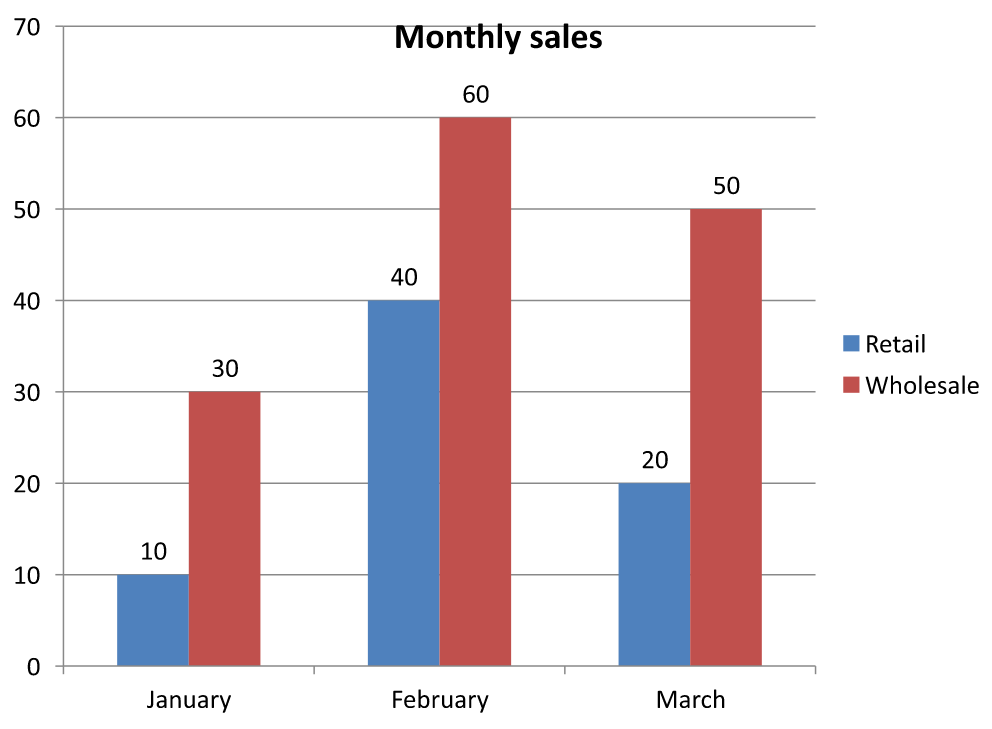

## **Ikhtisar**

Artikel ini menjelaskan cara bekerja dengan workbook diagram di Aspose.Slides. Ini menunjukkan cara membaca dan menulis data diagram melalui aliran workbook, menggunakan sel workbook sebagai label data diagram, mengakses koleksi lembar kerja, dan menentukan jenis sumber data untuk nilai diagram.

Artikel ini juga membahas penggunaan workbook eksternal sebagai sumber data diagram. Contoh-contoh menunjukkan cara membuat dan menetapkan workbook eksternal, mengambil jalur workbook eksternal yang terhubung ke diagram, dan mengedit data diagram ketika workbook tersedia.

Untuk sel workbook yang mewakili data yang hilang, lihat [Control the Display of Empty Cells](/slides/id/cpp/chart-series/) untuk perbedaan antara sel kosong dan nol, serta perbandingan diagram garis dari mode tampilan yang tersedia.

## **Sertakan Data dari Baris dan Kolom Tersembunyi**

Gunakan [IChart::set_PlotVisibleCellsOnly](https://reference.aspose.com/slides/id/cpp/aspose.slides.charts/ichart/set_plotvisiblecellsonly/) untuk mengontrol apakah diagram memplot data dari baris dan kolom lembar kerja yang tersembunyi. Atur ke `true` untuk memplot hanya sel yang terlihat, atau `false` untuk menyertakan sel yang terlihat dan tersembunyi. Pengaturan ini mengontrol pemetaan diagram; tidak menyembunyikan atau menampilkan ulang baris atau kolom lembar kerja.

Unduh [hidden-source-data.pptx](hidden-source-data.pptx) dan letakkan di direktori kerja. Slide pertama berisi diagram kolom sebagai bentuk pertama. Worksheet yang disisipkan, `Sheet1`, berisi rentang sumber berikut, `A1:C4`. Baris 3 dan kolom C tersembunyi, tetapi sel‑selnya tetap berisi nilai.

| Baris worksheet | A: Month | B: Retail | C: Wholesale (hidden column) |
| --- | --- | --- | --- |
| 2 | January | 10 | 30 |
| 3 (hidden row) | February | 40 | 60 |
| 4 | March | 20 | 50 |

Akses sel sumber melalui [IChartData::get_ChartDataWorkbook](https://reference.aspose.com/slides/id/cpp/aspose.slides.charts/ichartdata/get_chartdataworkbook/) dan baca [IChartDataCell::get_IsHidden](https://reference.aspose.com/slides/id/cpp/aspose.slides.charts/ichartdatacell/get_ishidden/) untuk memeriksa status tersembunyi mereka. Properti ini hanya dapat dibaca. Dalam file ini, B2 terlihat, B3 termasuk dalam baris tersembunyi, dan C2 termasuk dalam kolom tersembunyi; contoh mencetak `False`, `True`, dan `True`, secara berurutan.

Untuk contoh ini, segarkan data diagram setelah mengubah pengaturan plot: pertahankan workbook yang disisipkan dengan [ReadWorkbookStream](https://reference.aspose.com/slides/id/cpp/aspose.slides.charts/ichartdata/readworkbookstream/) dan muat ulang dengan [WriteWorkbookStream](https://reference.aspose.com/slides/id/cpp/aspose.slides.charts/ichartdata/writeworkbookstream/). Saat menyertakan semua sel, gunakan juga [SetRange](https://reference.aspose.com/slides/id/cpp/aspose.slides.charts/ichartdata/setrange/) untuk mengembalikan rentang lengkap, termasuk kategori Februari yang tersembunyi. Mengubah flag saja tidak cukup untuk menyegarkan data diagram yang di‑cache dalam contoh ini serta label kategori.

```cpp
#include <DOM/Chart/IChartData.h>
#include <DOM/Chart/IChartDataCell.h>
#include <DOM/Chart/IChartDataWorkbook.h>
#include <DOM/IChart.h>
#include <DOM/IShapeCollection.h>
#include <DOM/ISlide.h>
#include <DOM/Presentation.h>
#include <Export/SaveFormat.h>
#include <initializer_list>
#include <system/console.h>
#include <system/io/memory_stream.h>
#include <system/object_ext.h>

using namespace Aspose::Slides;
using namespace Aspose::Slides::Charts;
using namespace System;

auto presentation = MakeObject<Presentation>(u"hidden-source-data.pptx");
auto slide = presentation->get_Slide(0);
auto chart = slide->get_Shapes()->get_Count() > 0 ? AsCast<IChart>(slide->get_Shape(0)) : nullptr;
if (chart != nullptr)
{
    auto workbook = chart->get_ChartData()->get_ChartDataWorkbook();
    Console::WriteLine(u"B2 hidden: {0}", workbook->GetCell(0, u"B2")->get_IsHidden());
    Console::WriteLine(u"B3 hidden: {0}", workbook->GetCell(0, u"B3")->get_IsHidden());
    Console::WriteLine(u"C2 hidden: {0}", workbook->GetCell(0, u"C2")->get_IsHidden());

    auto workbookStream = chart->get_ChartData()->ReadWorkbookStream();
    for (auto visibleOnly : {true, false})
    {
        chart->set_PlotVisibleCellsOnly(visibleOnly);

        // Segarkan data diagram dari workbook yang disisipkan.
        workbookStream->set_Position(0);
        chart->get_ChartData()->WriteWorkbookStream(workbookStream);
        if (!visibleOnly)
        {
            // Pulihkan rentang sumber lengkap, termasuk kategori tersembunyi.
            chart->get_ChartData()->SetRange(u"Sheet1!$A$1:$C$4");
        }

        auto outputPath = visibleOnly ? u"hidden_cells_True.pptx" : u"hidden_cells_False.pptx";
        presentation->Save(outputPath, Export::SaveFormat::Pptx);
    }
}
else
{
    Console::WriteLine(u"The first shape is not a chart.");
}
```

Contoh menyimpan `hidden_cells_True.pptx` hanya dengan nilai Retail yang terlihat (10 dan 20), dan `hidden_cells_False.pptx` dengan semua enam nilai. Gambar di bawah mengilustrasikan dua mode plot. Baris 3 dan kolom C tetap tersembunyi di kedua workbook yang disisipkan.

| Hanya sel yang terlihat (`true`) | Semua sel (`false`) |
| --- | --- |
|  |  |

Sebuah sel tersembunyi yang berisi nilai berbeda dari sel kosong. [IChart::get_DisplayBlanksAs](https://reference.aspose.com/slides/id/cpp/aspose.slides.charts/ichart/get_displayblanksas/) mengontrol bagaimana nilai yang hilang ditampilkan; tidak menyertakan atau mengecualikan data sumber yang tersembunyi. Lihat [Control the Display of Empty Cells](/slides/id/cpp/chart-series/#control-the-display-of-empty-cells) untuk contoh.

## **Baca dan Tulis Data Diagram dari Workbook**

Aspose.Slides untuk C++ menyediakan metode [ReadWorkbookStream](https://reference.aspose.com/slides/id/cpp/aspose.slides.charts/ichartdata/readworkbookstream/) dan [WriteWorkbookStream](https://reference.aspose.com/slides/id/cpp/aspose.slides.charts/ichartdata/writeworkbookstream/) yang memungkinkan Anda membaca dan menulis workbook data diagram (yang berisi data diagram yang diedit dengan Aspose.Cells). **Catatan** bahwa data diagram harus diatur dengan cara yang sama atau memiliki struktur yang mirip dengan sumbernya.

Contoh ini membuka `chart.pptx`, yang harus berisi diagram sebagai bentuk pertama pada slide pertama. Ia membaca workbook yang disisipkan ke dalam aliran, menghapus seri dan kategori yang ada, dan menulis kembali workbook yang sama. Perubahan tetap berada di memori; contoh tidak menyimpan presentasi.

```cpp
#include <DOM/Chart/IChartCategoryCollection.h>
#include <DOM/Chart/IChartData.h>
#include <DOM/Chart/IChartSeriesCollection.h>
#include <DOM/IChart.h>
#include <DOM/IShapeCollection.h>
#include <DOM/ISlide.h>
#include <DOM/Presentation.h>
#include <system/console.h>
#include <system/io/memory_stream.h>
#include <system/object_ext.h>

using namespace Aspose::Slides;
using namespace Aspose::Slides::Charts;
using namespace System;

auto presentation = MakeObject<Presentation>(u"chart.pptx");
auto slide = presentation->get_Slide(0);
auto chart = slide->get_Shapes()->get_Count() > 0 ? AsCast<IChart>(slide->get_Shape(0)) : nullptr;
if (chart != nullptr)
{
    auto chartData = chart->get_ChartData();
    auto workbookStream = chartData->ReadWorkbookStream();

    chartData->get_Series()->Clear();
    chartData->get_Categories()->Clear();

    workbookStream->set_Position(0);
    chartData->WriteWorkbookStream(workbookStream);
}
else
{
    Console::WriteLine(u"The first shape is not a chart.");
}
```

### **Validasi Tata Letak Diagram Setelah Modifikasi Workbook**

Ketika Anda mengganti workbook yang disisipkan dengan yang telah dimodifikasi, diagram mempertahankan koleksi seri dan kategori aslinya. Ketidaksesuaian ini dapat menyebabkan [IChart::ValidateChartLayout](https://reference.aspose.com/slides/id/cpp/aspose.slides.charts/ichart/validatechartlayout/) gagal dengan kesalahan indeks di luar jangkauan. Hapus seri dan kategori yang ada sebelum menulis kembali workbook yang diperbarui ke diagram. Contoh ini memerlukan `chart.pptx` dengan diagram sebagai bentuk pertama pada slide pertama. Komentar menandai tempat pengeditan workbook; contoh yang dapat dijalankan menulis kembali workbook asli dan memvalidasi tata letak di memori.

```cpp
#include <DOM/Chart/IChartCategoryCollection.h>
#include <DOM/Chart/IChartData.h>
#include <DOM/Chart/IChartSeriesCollection.h>
#include <DOM/IChart.h>
#include <DOM/IShapeCollection.h>
#include <DOM/ISlide.h>
#include <DOM/Presentation.h>
#include <system/console.h>
#include <system/io/memory_stream.h>
#include <system/object_ext.h>

using namespace Aspose::Slides;
using namespace Aspose::Slides::Charts;
using namespace System;

auto presentation = MakeObject<Presentation>(u"chart.pptx");
auto slide = presentation->get_Slide(0);
auto chart = slide->get_Shapes()->get_Count() > 0 ? AsCast<IChart>(slide->get_Shape(0)) : nullptr;
if (chart != nullptr)
{
    auto chartData = chart->get_ChartData();
    auto workbookStream = chartData->ReadWorkbookStream();

    // Ubah aliran workbook di sini, misalnya, menggunakan Aspose.Cells.

    chartData->get_Series()->Clear();
    chartData->get_Categories()->Clear();

    workbookStream->set_Position(0);
    chartData->WriteWorkbookStream(workbookStream);
    chart->ValidateChartLayout();
}
else
{
    Console::WriteLine(u"The first shape is not a chart.");
}
```

Menghapus koleksi menghilangkan referensi data usang sebelum workbook ditulis kembali. Bangun kembali pemetaan seri dan kategori yang diperlukan untuk workbook yang diperbarui sebelum menggunakan diagram.

## **Atur Sel Workbook sebagai Label Data Diagram**

Anda dapat menggunakan teks dari sel workbook sebagai label data diagram. Langkah‑langkah berikut menunjukkan cara menautkan label pada diagram gelembung ke sel di workbook datanya.

1. Buat instance kelas [Presentation](https://reference.aspose.com/slides/id/cpp/aspose.slides/presentation/).
2. Akses slide pertama dengan indeks berbasis nol.
3. Tambahkan diagram gelembung dengan data default.
4. Akses seri diagram.
5. Atur sel workbook sebagai label data.
6. Simpan presentasi.

Contoh ini membuka `chart2.pptx`, yang harus berisi setidaknya satu slide, dan menambahkan diagram gelembung dengan data default. Ia menggunakan sel A10:A12 pada worksheet 0 untuk tiga label pertama dalam seri pertama, mengaktifkan label dari sel, dan menyimpan hasilnya ke `resultchart.pptx`.

```cpp
#include <DOM/Chart/ChartType.h>
#include <DOM/Chart/IChartData.h>
#include <DOM/Chart/IChartDataCell.h>
#include <DOM/Chart/IChartDataWorkbook.h>
#include <DOM/Chart/IChartSeries.h>
#include <DOM/Chart/IChartSeriesCollection.h>
#include <DOM/Chart/IDataLabel.h>
#include <DOM/Chart/IDataLabelCollection.h>
#include <DOM/Chart/IDataLabelFormat.h>
#include <DOM/IChart.h>
#include <DOM/IShapeCollection.h>
#include <DOM/ISlide.h>
#include <DOM/Presentation.h>
#include <Export/SaveFormat.h>
#include <system/object_ext.h>

using namespace Aspose::Slides;
using namespace Aspose::Slides::Charts;
using namespace System;

auto presentation = MakeObject<Presentation>(u"chart2.pptx");
auto slide = presentation->get_Slide(0);

auto chart = slide->get_Shapes()->AddChart(ChartType::Bubble, 50, 50, 600, 400, true);
auto series = chart->get_ChartData()->get_Series()->idx_get(0);
auto workbook = chart->get_ChartData()->get_ChartDataWorkbook();

series->get_Labels()->get_DefaultDataLabelFormat()->set_ShowLabelValueFromCell(true);
auto firstLabelCell = workbook->GetCell(0, u"A10", ObjectExt::Box<String>(u"Label 0 cell value"));
auto secondLabelCell = workbook->GetCell(0, u"A11", ObjectExt::Box<String>(u"Label 1 cell value"));
auto thirdLabelCell = workbook->GetCell(0, u"A12", ObjectExt::Box<String>(u"Label 2 cell value"));
series->get_Labels()->idx_get(0)->set_ValueFromCell(firstLabelCell);
series->get_Labels()->idx_get(1)->set_ValueFromCell(secondLabelCell);
series->get_Labels()->idx_get(2)->set_ValueFromCell(thirdLabelCell);

presentation->Save(u"resultchart.pptx", Export::SaveFormat::Pptx);
```

## **Kelola Worksheet**

Metode [IChartDataWorkbook::get_Worksheets](https://reference.aspose.com/slides/id/cpp/aspose.slides.charts/ichartdataworkbook/get_worksheets/) menyediakan akses ke worksheet dalam workbook diagram. Contoh ini membuat diagram pai dengan data default dan mencetak setiap nama worksheet ke konsol.

```cpp
#include <DOM/Chart/ChartType.h>
#include <DOM/Chart/IChartData.h>
#include <DOM/Chart/IChartDataWorkbook.h>
#include <DOM/Chart/IChartDataWorksheet.h>
#include <DOM/Chart/IChartDataWorksheetCollection.h>
#include <DOM/IChart.h>
#include <DOM/IShapeCollection.h>
#include <DOM/ISlide.h>
#include <DOM/Presentation.h>
#include <system/console.h>
#include <system/object_ext.h>

using namespace Aspose::Slides;
using namespace Aspose::Slides::Charts;
using namespace System;

auto presentation = MakeObject<Presentation>();
auto slide = presentation->get_Slide(0);

auto chart = slide->get_Shapes()->AddChart(ChartType::Pie, 50, 50, 400, 500);
auto workbook = chart->get_ChartData()->get_ChartDataWorkbook();

for (auto i = 0; i < workbook->get_Worksheets()->get_Count(); i++)
{
    Console::WriteLine(workbook->get_Worksheets()->idx_get(i)->get_Name());
}
```

## **Tentukan Jenis Sumber Data**

Contoh ini membuat diagram kolom 3D dengan data default dan menetapkan dua nama seri menggunakan sumber data yang berbeda. Nama pertama menggunakan literal string; nama kedua menggunakan sel C1 pada worksheet 0. Enumerasi [DataSourceType](https://reference.aspose.com/slides/id/cpp/aspose.slides.charts/datasourcetype/) memilih sumber untuk setiap nama. Hasil disimpan ke `pres.pptx`.

```cpp
#include <DOM/Chart/ChartType.h>
#include <DOM/Chart/DataSourceType.h>
#include <DOM/Chart/IChartData.h>
#include <DOM/Chart/IChartDataCell.h>
#include <DOM/Chart/IChartDataWorkbook.h>
#include <DOM/Chart/IChartSeries.h>
#include <DOM/Chart/IChartSeriesCollection.h>
#include <DOM/Chart/IStringChartValue.h>
#include <DOM/IChart.h>
#include <DOM/IShapeCollection.h>
#include <DOM/ISlide.h>
#include <DOM/Presentation.h>
#include <Export/SaveFormat.h>
#include <system/object_ext.h>

using namespace Aspose::Slides;
using namespace Aspose::Slides::Charts;
using namespace System;

auto presentation = MakeObject<Presentation>();
auto slide = presentation->get_Slide(0);

auto chart = slide->get_Shapes()->AddChart(ChartType::Column3D, 50, 50, 600, 400, true);
auto literalName = chart->get_ChartData()->get_Series()->idx_get(0)->get_Name();

literalName->set_DataSourceType(DataSourceType::StringLiterals);
literalName->set_Data(ObjectExt::Box<String>(u"LiteralString"));

auto cellName = chart->get_ChartData()->get_Series()->idx_get(1)->get_Name();
auto nameCell = chart->get_ChartData()->get_ChartDataWorkbook()->GetCell(0, u"C1", ObjectExt::Box<String>(u"NewCell"));
cellName->set_DataSourceType(DataSourceType::Worksheet);
cellName->set_Data(nameCell);

presentation->Save(u"pres.pptx", Export::SaveFormat::Pptx);
```

## **Deteksi Format Workbook Embedded yang Tidak Didukung**

Aspose.Slides tidak mendukung format workbook Excel biner (.xlsb) yang dapat disisipkan di beberapa diagram. Anda dapat menggunakan metode [get_EmbeddedWorkbookType](https://reference.aspose.com/slides/id/cpp/aspose.slides.charts/ichartdata/get_embeddedworkbooktype/) pada [IChartData](https://reference.aspose.com/slides/id/cpp/aspose.slides.charts/ichartdata/) bersama dengan enumerasi [WorkbookType](https://reference.aspose.com/slides/id/cpp/aspose.slides.charts/workbooktype/) untuk mendeteksi format yang tidak didukung dan melewatkan diagram‑diagram tersebut. Contoh ini memeriksa bentuk pada slide pertama `sample.pptx`, melewatkan bentuk non‑diagram, dan mencetak pesan diagnostik untuk setiap diagram dengan workbook .xlsb yang disisipkan.

```cpp
#include <DOM/Chart/ChartDataSourceType.h>
#include <DOM/Chart/IChartData.h>
#include <DOM/Chart/WorkbookType.h>
#include <DOM/IChart.h>
#include <DOM/IShapeCollection.h>
#include <DOM/ISlide.h>
#include <DOM/Presentation.h>
#include <system/console.h>
#include <system/enumerator_adapter.h>
#include <system/object_ext.h>

using namespace Aspose::Slides;
using namespace Aspose::Slides::Charts;
using namespace System;

auto presentation = MakeObject<Presentation>(u"sample.pptx");
auto slide = presentation->get_Slide(0);

for (auto shape : IterateOver(slide->get_Shapes()))
{
    auto chart = AsCast<IChart>(shape);
    if (chart == nullptr)
    {
        continue;
    }

    auto chartData = chart->get_ChartData();
    auto isInternalWorkbook = chartData->get_DataSourceType() == ChartDataSourceType::InternalWorkbook;
    auto isBinaryMacro = chartData->get_EmbeddedWorkbookType() == WorkbookType::WorkbookBinaryMacro;

    if (isInternalWorkbook && isBinaryMacro)
    {
        Console::WriteLine(u"Skipping a chart with an unsupported .xlsb workbook.");
        continue;
    }

    // Baca atau ubah data workbook diagram yang didukung di sini.
}
```

## **Workbook Eksternal**

Aspose.Slides mendukung penggunaan workbook eksternal sebagai sumber data untuk diagram.

### **Buat Workbook Eksternal**

Gunakan [ReadWorkbookStream](https://reference.aspose.com/slides/id/cpp/aspose.slides.charts/ichartdata/readworkbookstream/) dan [SetExternalWorkbook](https://reference.aspose.com/slides/id/cpp/aspose.slides.charts/ichartdata/setexternalworkbook/) untuk mengekspor workbook diagram yang disisipkan ke file dan menautkan diagram ke workbook eksternal tersebut.

Contoh ini membuat diagram pai dengan data default, menulis workbook‑nya ke `externalWorkbook1.xlsx`, dan menutup aliran output sebelum menetapkan file tersebut sebagai sumber data diagram. Ia menyimpan presentasi yang ditautkan ke `externalWorkbook.pptx`.

```cpp
#include <DOM/Chart/ChartType.h>
#include <DOM/Chart/IChartData.h>
#include <DOM/IChart.h>
#include <DOM/IShapeCollection.h>
#include <DOM/ISlide.h>
#include <DOM/Presentation.h>
#include <Export/SaveFormat.h>
#include <system/io/file.h>
#include <system/io/file_stream.h>
#include <system/io/memory_stream.h>
#include <system/io/path.h>

using namespace Aspose::Slides;
using namespace Aspose::Slides::Charts;
using namespace System;

auto presentation = MakeObject<Presentation>();
auto slide = presentation->get_Slide(0);

auto chart = slide->get_Shapes()->AddChart(ChartType::Pie, 50, 50, 400, 600);
auto workbookPath = IO::Path::GetFullPath(u"externalWorkbook1.xlsx");
auto workbookStream = chart->get_ChartData()->ReadWorkbookStream();
auto fileStream = IO::File::Create(workbookPath);
workbookStream->CopyTo(fileStream);
fileStream->Close();

chart->get_ChartData()->SetExternalWorkbook(workbookPath);
presentation->Save(u"externalWorkbook.pptx", Export::SaveFormat::Pptx);
```

### **Atur Workbook Eksternal**

Dengan menggunakan metode [SetExternalWorkbook](https://reference.aspose.com/slides/id/cpp/aspose.slides.charts/ichartdata/setexternalworkbook/), Anda dapat menetapkan workbook eksternal ke diagram sebagai sumber datanya. Metode ini juga dapat digunakan untuk memperbarui jalur ke workbook eksternal (jika workbook tersebut dipindahkan).

Meskipun Anda tidak dapat mengedit data di workbook yang disimpan di lokasi atau sumber daya remote, Anda tetap dapat menggunakan workbook tersebut sebagai sumber data eksternal. Jika jalur relatif untuk workbook eksternal diberikan, jalur tersebut secara otomatis dikonversi ke jalur penuh.

Contoh ini memerlukan `externalWorkbook.xlsx` di direktori kerja. Worksheet‑nya yang bernama `Sheet1` harus berisi nama seri di B1, nama kategori di A2:A4, dan nilai numerik di B2:B4. Contoh ini membuat diagram pai, menautkan workbook, dan menggunakan [SetRange](https://reference.aspose.com/slides/id/cpp/aspose.slides.charts/ichartdata/setrange/) untuk memetakan A1:B4 ke satu seri dan tiga kategori. Ia menyimpan hasilnya ke `Presentation_with_externalWorkbook.pptx`.

```cpp
#include <DOM/Chart/ChartType.h>
#include <DOM/Chart/IChartData.h>
#include <DOM/IChart.h>
#include <DOM/IShapeCollection.h>
#include <DOM/ISlide.h>
#include <DOM/Presentation.h>
#include <Export/SaveFormat.h>
#include <system/io/path.h>

using namespace Aspose::Slides;
using namespace Aspose::Slides::Charts;
using namespace System;

auto presentation = MakeObject<Presentation>();
auto slide = presentation->get_Slide(0);

auto chart = slide->get_Shapes()->AddChart(ChartType::Pie, 50, 50, 400, 600, true);
auto chartData = chart->get_ChartData();
auto workbookPath = IO::Path::GetFullPath(u"externalWorkbook.xlsx");

chartData->SetExternalWorkbook(workbookPath);
chartData->SetRange(u"Sheet1!$A$1:$B$4");

presentation->Save(u"Presentation_with_externalWorkbook.pptx", Export::SaveFormat::Pptx);
```

Parameter `updateChartData` pada [SetExternalWorkbook](https://reference.aspose.com/slides/id/cpp/aspose.slides.charts/ichartdata/setexternalworkbook/) mengontrol apakah workbook dimuat.

* Ketika `updateChartData` bernilai `false`, hanya jalur workbook yang diperbarui. Data diagram tidak dimuat atau diperbarui dari workbook target, sehingga workbook dapat tidak tersedia.
* Ketika `updateChartData` bernilai `true`, data diagram diperbarui dari workbook target.

Contoh berikut menetapkan URL placeholder dengan `updateChartData` diatur ke `false`. Ia mempertahankan data default diagram pai dan menyimpan presentasi tanpa memuat workbook yang tidak tersedia.

```cpp
#include <DOM/Chart/ChartType.h>
#include <DOM/Chart/IChartData.h>
#include <DOM/IChart.h>
#include <DOM/IShapeCollection.h>
#include <DOM/ISlide.h>
#include <DOM/Presentation.h>
#include <Export/SaveFormat.h>

using namespace Aspose::Slides;
using namespace Aspose::Slides::Charts;
using namespace System;

auto presentation = MakeObject<Presentation>();
auto slide = presentation->get_Slide(0);

auto chart = slide->get_Shapes()->AddChart(ChartType::Pie, 50, 50, 400, 600, true);

chart->get_ChartData()->SetExternalWorkbook(u"https://example.com/unavailable-workbook.xlsx", false);
presentation->Save(u"SetExternalWorkbookWithUpdateChartData.pptx", Export::SaveFormat::Pptx);
```

### **Dapatkan Jalur Workbook Sumber Data Eksternal dari Diagram**

Untuk mengidentifikasi workbook yang ditautkan ke diagram, pertama periksa apakah diagram menggunakan sumber data eksternal. Jika ya, Anda dapat mengambil jalur workbook dengan mengikuti langkah‑langkah berikut.

1. Buat instance kelas [Presentation](https://reference.aspose.com/slides/id/cpp/aspose.slides/presentation/).
2. Akses slide pertama dengan indeks berbasis nol.
3. Periksa bahwa bentuk pertama adalah diagram.
4. Baca jenis sumber data diagram.
5. Jika sumbernya adalah workbook eksternal, baca jalurnya.

Contoh ini membuka `externalWorkbook.pptx`, yang dibuat pada contoh sebelumnya, dan memeriksa bentuk pertama pada slide pertama. Jika itu adalah diagram yang ditautkan ke workbook eksternal, contoh mencetak [get_ExternalWorkbookPath](https://reference.aspose.com/slides/id/cpp/aspose.slides.charts/ichartdata/get_externalworkbookpath/) ke konsol. Kemudian ia menyimpan salinan presentasi ke `Result.pptx`.

```cpp
#include <DOM/Chart/ChartDataSourceType.h>
#include <DOM/Chart/IChartData.h>
#include <DOM/IChart.h>
#include <DOM/IShapeCollection.h>
#include <DOM/ISlide.h>
#include <DOM/Presentation.h>
#include <Export/SaveFormat.h>
#include <system/console.h>
#include <system/object_ext.h>

using namespace Aspose::Slides;
using namespace Aspose::Slides::Charts;
using namespace System;

auto presentation = MakeObject<Presentation>(u"externalWorkbook.pptx");
auto slide = presentation->get_Slide(0);
auto chart = slide->get_Shapes()->get_Count() > 0 ? AsCast<IChart>(slide->get_Shape(0)) : nullptr;
if (chart != nullptr)
{
    auto chartData = chart->get_ChartData();
    if (chartData->get_DataSourceType() == ChartDataSourceType::ExternalWorkbook)
    {
        Console::WriteLine(chartData->get_ExternalWorkbookPath());
    }
    else
    {
        Console::WriteLine(u"The chart does not use an external workbook.");
    }
}
else
{
    Console::WriteLine(u"The first shape is not a chart.");
}

presentation->Save(u"Result.pptx", Export::SaveFormat::Pptx);
```

### **Edit Data Diagram**

Anda dapat mengedit data di workbook eksternal dengan cara yang sama seperti mengubah isi workbook internal. Ketika workbook eksternal tidak dapat dimuat, sebuah pengecualian akan dilempar.

Contoh ini memerlukan `presentation.pptx` dengan diagram sebagai bentuk pertama pada slide pertama dan workbook eksternal yang dapat diakses. Ia menetapkan nilai yang didukung sel untuk titik data pertama dalam seri pertama menjadi 100 dan menyimpan presentasi ke `presentation_out.pptx`. Mengedit nilai sel dapat memperbarui file XLSX eksternal yang ditautkan, jadi gunakan salinan jika Anda perlu mempertahankan workbook asli.

```cpp
#include <DOM/Chart/IChartData.h>
#include <DOM/Chart/IChartDataCell.h>
#include <DOM/Chart/IChartDataPoint.h>
#include <DOM/Chart/IChartDataPointCollection.h>
#include <DOM/Chart/IChartDataWorkbook.h>
#include <DOM/Chart/IChartSeries.h>
#include <DOM/Chart/IChartSeriesCollection.h>
#include <DOM/Chart/IDoubleChartValue.h>
#include <DOM/IChart.h>
#include <DOM/IShapeCollection.h>
#include <DOM/ISlide.h>
#include <DOM/Presentation.h>
#include <Export/SaveFormat.h>
#include <system/console.h>
#include <system/object_ext.h>

using namespace Aspose::Slides;
using namespace Aspose::Slides::Charts;
using namespace System;

auto presentation = MakeObject<Presentation>(u"presentation.pptx");
auto slide = presentation->get_Slide(0);
auto chart = slide->get_Shapes()->get_Count() > 0 ? AsCast<IChart>(slide->get_Shape(0)) : nullptr;
if (chart != nullptr)
{
    auto series = chart->get_ChartData()->get_Series();
    if (series->get_Count() > 0 && series->idx_get(0)->get_DataPoints()->get_Count() > 0)
    {
        auto valueCell = series->idx_get(0)->get_DataPoints()->idx_get(0)->get_Value()->get_AsCell();
        if (valueCell != nullptr)
        {
            valueCell->set_Value(ObjectExt::Box<int32_t>(100));
            presentation->Save(u"presentation_out.pptx", Export::SaveFormat::Pptx);
        }
        else
        {
            Console::WriteLine(u"The first data point is not linked to a workbook cell.");
        }
    }
    else
    {
        Console::WriteLine(u"The chart has no data points to edit.");
    }
}
else
{
    Console::WriteLine(u"The first shape is not a chart.");
}
```

### **Pulihkan Workbook dari Cache Diagram**

Jika sebuah diagram menggunakan workbook eksternal yang hilang atau tidak tersedia, Aspose.Slides dapat merekonstruksi workbook diagram dari data yang di‑cache dalam presentasi. Buat [LoadOptions](https://reference.aspose.com/slides/id/cpp/aspose.slides/loadoptions/), konfigurasikan dengan [set_SpreadsheetOptions](https://reference.aspose.com/slides/id/cpp/aspose.slides/loadoptions/set_spreadsheetoptions/), dan panggil [ISpreadsheetOptions::set_RecoverWorkbookFromChartCache](https://reference.aspose.com/slides/id/cpp/aspose.slides/ispreadsheetoptions/set_recoverworkbookfromchartcache/) dengan `true` sebelum membuka presentasi.

Contoh C++ berikut membuka `presentation.pptx`, di mana bentuk pertama pada slide pertama harus merupakan diagram yang merujuk ke workbook eksternal yang tidak tersedia, dan mengakses data yang dipulihkan melalui [IChart::get_ChartData](https://reference.aspose.com/slides/id/cpp/aspose.slides.charts/ichart/get_chartdata/) dan [IChartData::get_ChartDataWorkbook](https://reference.aspose.com/slides/id/cpp/aspose.slides.charts/ichartdata/get_chartdataworkbook/):

```cpp
#include <DOM/Chart/IChartData.h>
#include <DOM/Chart/IChartDataWorkbook.h>
#include <DOM/IChart.h>
#include <DOM/IShapeCollection.h>
#include <DOM/ISlide.h>
#include <DOM/LoadOptions.h>
#include <DOM/Presentation.h>
#include <DOM/SpreadsheetOptions.h>
#include <system/console.h>
#include <system/object_ext.h>

using namespace Aspose::Slides;
using namespace Aspose::Slides::Charts;
using namespace System;

auto spreadsheetOptions = MakeObject<SpreadsheetOptions>();
spreadsheetOptions->set_RecoverWorkbookFromChartCache(true);

auto loadOptions = MakeObject<LoadOptions>();
loadOptions->set_SpreadsheetOptions(spreadsheetOptions);

auto presentation = MakeObject<Presentation>(u"presentation.pptx", loadOptions);
auto slide = presentation->get_Slide(0);
auto chart = slide->get_Shapes()->get_Count() > 0 ? AsCast<IChart>(slide->get_Shape(0)) : nullptr;
if (chart != nullptr)
{
    auto recoveredWorkbook = chart->get_ChartData()->get_ChartDataWorkbook();

    // Baca atau ubah data workbook yang dipulihkan di sini.
}
else
{
    Console::WriteLine(u"The first shape is not a chart.");
}
```

Jika workbook eksternal tidak tersedia dan pemulihan dinonaktifkan, Aspose.Slides akan melempar [System::InvalidOperationException](https://reference.aspose.com/slides/id/cpp/system/details_invalidoperationexception/). Aktifkan pemulihan hanya ketika penggunaan data diagram yang di‑cache dapat diterima sebagai alternatif, karena cache mungkin tidak berisi perubahan yang dibuat pada workbook eksternal setelah presentasi terakhir kali diperbarui.

## **FAQ**

**Apakah saya dapat menentukan apakah diagram tertentu terhubung ke workbook eksternal atau yang disisipkan?**

Ya. Diagram memiliki [jenis sumber data](https://reference.aspose.com/slides/id/cpp/aspose.slides.charts/chartdata/get_datasourcetype/) dan [jalur ke workbook eksternal](https://reference.aspose.com/slides/id/cpp/aspose.slides.charts/chartdata/get_externalworkbookpath/); jika sumbernya adalah workbook eksternal, Anda dapat membaca jalur lengkap untuk memastikan file eksternal sedang digunakan.

**Apakah jalur relatif ke workbook eksternal didukung, dan bagaimana cara penyimpanannya?**

Ya. Jika Anda menentukan jalur relatif, jalur tersebut secara otomatis dikonversi menjadi jalur absolut. Presentasi menyimpan jalur absolut dalam file PPTX, jadi memindahkan workbook mungkin memerlukan pembaruan tautan.

**Bisakah saya menggunakan workbook yang berada di sumber daya/jaringan bersama?**

Ya, workbook tersebut dapat digunakan sebagai sumber data eksternal. Namun, mengedit workbook remote secara langsung dari Aspose.Slides tidak didukung—mereka hanya dapat digunakan sebagai sumber.

**Apakah Aspose.Slides menimpa XLSX eksternal saat menyimpan presentasi?**

Presentasi menyimpan [tautan ke file eksternal](https://reference.aspose.com/slides/id/cpp/aspose.slides.charts/chartdata/get_externalworkbookpath/). Mengedit data diagram yang didukung sel juga dapat memperbarui file XLSX lokal yang ditautkan. Gunakan salinan workbook jika file asli harus tetap tidak berubah.

**Apa yang harus saya lakukan jika file eksternal dilindungi kata sandi?**

Aspose.Slides tidak menerima kata sandi saat menautkan. Pendekatan umum adalah menghapus perlindungan terlebih dahulu atau menyiapkan salinan yang telah didekripsi (misalnya, menggunakan [Aspose.Cells](https://reference.aspose.com/cells/cpp/)) dan menautkan ke salinan tersebut.

**Bisakah beberapa diagram merujuk ke workbook eksternal yang sama?**

Ya. Setiap diagram menyimpan tautannya masing‑masing. Jika semuanya menunjuk ke file yang sama, memperbarui file tersebut akan tercermin di setiap diagram pada saat data dimuat berikutnya.