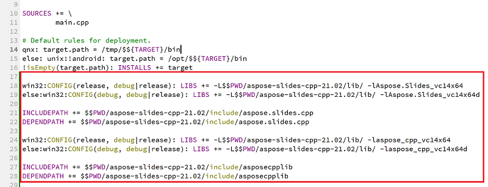

## **Pendahuluan**

Qt adalah kerangka kerja pengembangan aplikasi lintas platform berbasis C++ yang banyak digunakan untuk mengembangkan berbagai aplikasi desktop, seluler, dan sistem tertanam. Aspose.Slides untuk C++ dapat diintegrasikan ke dalam Qt untuk membuat dan memanipulasi dokumen PowerPoint di aplikasi Qt Anda.

## **Menggunakan Aspose.Slides untuk C++ dalam Qt Creator**

Untuk menggunakan Aspose.Slides untuk C++ dalam aplikasi Qt Anda, unduh versi terbaru API dari bagian [downloads](https://downloads.aspose.com/slides/id/cpp). Setelah API diunduh, Anda dapat mengintegrasikan pustaka C++ ke dalam Qt Creator atau Visual Studio.

Untuk mengintegrasikan dan menggunakan pustaka Aspose.Slides untuk C++ dalam *Qt Console Application* yang dikembangkan di Qt Creator, ikuti langkah‑langkah berikut:

- Buka Qt Creator dan buat *Qt Console Application* baru.

- Pilih opsi QMake dari daftar dropdown *Build System*.

- Pilih kit yang sesuai dan selesaikan wizard.
- Salin folder aspose-slides-cpp-21.02 dari paket yang diekstrak Aspose.Slides untuk C++ ke root proyek.

- Untuk menambahkan jalur ke folder lib dan include, klik kanan pada proyek di panel kiri dan pilih *Add Library*.

- Pilih opsi External Library dan telusuri jalur ke folder lib satu per satu.

- Setelah selesai, file proyek .pro Anda akan berisi entri berikut:

- Bangun aplikasi dan Anda selesai dengan integrasi.  

{}
Catatan: Lihat [proyek demo lengkap](https://github.com/aspose-slides/Aspose.Slides-for-C/tree/master/QtDemos/QtCreator/Qt_AsposeSlides_QMake) untuk informasi lebih lanjut.
{}

## **Menggunakan Aspose.Slides untuk C++ dalam Aplikasi Qt di Visual Studio**

Untuk mengembangkan aplikasi Qt menggunakan Visual Studio, Anda perlu menginstal [Qt Visual Studio Tools](https://marketplace.visualstudio.com/items?itemName=TheQtCompany.QtVisualStudioTools-19123). Setelah Anda menginstalnya, unduh versi terbaru API dari bagian [downloads](https://downloads.aspose.com/slides/id/cpp) dan ikuti langkah‑langkah di bawah ini:

- Buka Microsoft Visual Studio dan buat *Qt Console Application* baru.

- Pilih kit yang sesuai dan selesaikan wizard.
- Untuk mengintegrasikan dan menggunakan pustaka Aspose.Slides untuk C++, klik kanan pada proyek dan pilih *Manage NuGet Packages...*.

- Temukan dan instal paket *Aspose.Slides.Cpp* yang diperlukan.

- Bangun proyek dan Anda selesai dengan integrasi.  

{}
Catatan: Lihat [proyek demo lengkap](https://github.com/aspose-slides/Aspose.Slides-for-C/tree/master/QtDemos/Visual%20Studio/Qt_AsposeSlides_VS) untuk informasi lebih lanjut.
{}