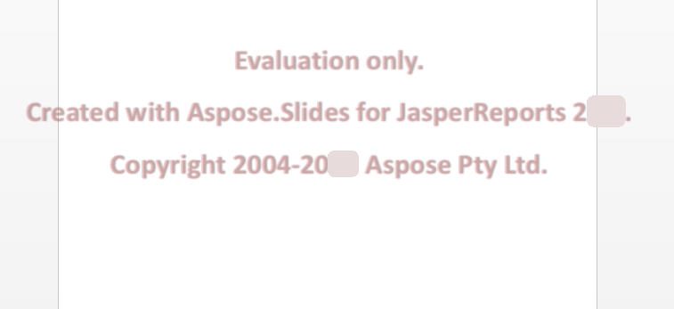

{} 

Aspose.Slides untuk JasperReports tersedia sebagai evaluasi gratis tanpa batas waktu dari [halaman unduhan](https://downloads.aspose.com/slides/id/jasperreport). Versi evaluasi dan versi berlisensi dari produk diunduh dari tautan yang sama.

Jika Anda puas dengan evaluasi, [beli lisensi](https://purchase.aspose.com/buy). Pastikan Anda memahami dan menyetujui ketentuan berlangganan.

Lisensi dapat diunduh dari halaman pemesanan setelah pembayaran selesai. Lisensi adalah file XML teks jelas yang ditandatangani secara digital, berisi informasi seperti nama klien, produk yang dibeli, dan jenis lisensi. Jangan mengubah isi file lisensi dengan cara apa pun: tindakan tersebut akan membuat lisensi tidak berlaku.

Unduh lisensi ke komputer Anda dan salin ke folder yang sesuai (misalnya folder aplikasi Anda atau **JasperReports\lib**).

## **Batasan Versi Evaluasi**
Versi evaluasi Aspose.Slides (tanpa lisensi yang ditentukan) menyediakan semua fungsionalitas produk, tetapi (ketika Anda menyimpan presentasi) akan menyisipkan watermark evaluasi di tengah setiap slide seperti yang ditampilkan pada gambar di bawah ini:

 

## **Menerapkan Lisensi**
Ada beberapa cara untuk menerapkan lisensi, tergantung apakah Anda bekerja pada JasperReports atau JasperServer.

### **Menerapkan Lisensi untuk JasperReports**
Gunakan pemanggilan metode setLicense secara langsung yang mirip dengan Aspose.Slides untuk Java.

```java
import com.aspose.slides.jasperreports.License;

..... 

try {
    //Buat objek stream yang berisi file lisensi
    FileInputStream fstream=new FileInputStream("Aspose.Slides.JasperReports.Developer.lic");
	
    //Instansiasi kelas License
    License license = new License();
	
    //Setel lisensi melalui objek stream
    license.setLicense(fstream);
} catch(Exception ex) {
    System.out.println(ex.toString());
}
```

Atau, atur parameter exporter dalam kode.

```java
ASPptExporter exporter = new ASPptExporter (); 
exporter.setParameter(ASExporterParameters.PPT_LICENSE, "Aspose.Slides.JasperReports.Developer.lic");
exporter.exportReport();
```

### **Menerapkan Lisensi pada JasperServer**
Atur parameter exporter dalam applicationContext.xml.

``` xml
<bean id="asExportParametersBean" class="com.aspose.slides.jasperreports.ASExportParametersBean">
    <property name="licenseFile" value="C:/jasperserver-3.0/apache-tomcat/webapps/jasperserver/WEB-INF/Aspose.Slides.JasperReports.Developer.lic"/>
</bean>
```