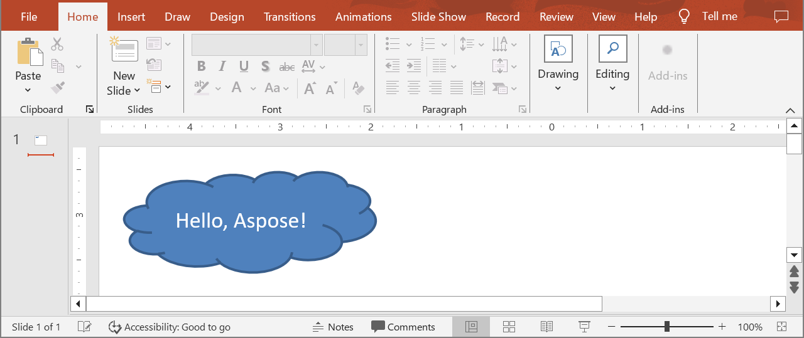

## **Gambaran Umum**

Artikel ini menunjukkan cara membuat presentasi di Aspose.Slides, menambahkan bentuk dengan teks ke slide pertama, dan menyimpan hasilnya sebagai file PPTX. Untuk membuka presentasi yang sudah ada dan menyimpannya dalam format lain, lihat [Buka Presentasi](/slides/id/java/open-presentation/) dan [Simpan Presentasi](/slides/id/java/save-presentation/). FAQ singkat di bagian akhir mencakup pertanyaan umum tentang format, templat, ukuran slide, satuan, penggunaan memori, threading, lisensi, tanda tangan digital, dan dukungan VBA.

Sebelum memulai, tambahkan Aspose.Slides for Java ke proyek Anda dari repositori Maven Aspose. Lihat [Instalasi](/slides/id/java/installation/) untuk pengaturan Maven dan apa yang diperlukan Linux secara tambahan.

## **Buat Presentasi**

Membuat file PowerPoint dari awal di Aspose.Slides for Java dimulai dengan instance dari kelas [Presentation](https://reference.aspose.com/slides/java/com.aspose.slides/presentation/). Konstruktor menyediakan presentasi kosong dengan satu slide, siap untuk bentuk, teks, diagram, atau konten lain yang dibutuhkan aplikasi Anda. Setelah Anda memodifikasi slide tersebut, atau menambahkan slide baru, Anda dapat menyimpan hasilnya ke format PPTX, PPT lama, atau OpenDocument.

Untuk membuat presentasi dan menempatkan bentuk dengan teks pada slide pertama, ikuti langkah-langkah berikut:

1. Buat instance dari kelas [Presentation](https://reference.aspose.com/slides/java/com.aspose.slides/presentation/). Presentasi baru sudah berisi satu slide kosong.
1. Dapatkan slide tersebut dengan indeksnya, 0, dari koleksi yang dikembalikan oleh [getSlides](https://reference.aspose.com/slides/java/com.aspose.slides/presentation/#getSlides--).
1. Tambahkan sebuah [IAutoShape](https://reference.aspose.com/slides/java/com.aspose.slides/iautoshape/) bertipe `Cloud` dengan metode [addAutoShape](https://reference.aspose.com/slides/java/com.aspose.slides/ishapecollection/#addAutoShape-int-float-float-float-float-), dan atur teksnya dengan [setText](https://reference.aspose.com/slides/java/com.aspose.slides/itextframe/#setText-java.lang.String-).
1. Simpan presentasi sebagai file PPTX dengan metode [save](https://reference.aspose.com/slides/java/com.aspose.slides/presentation/#save-java.lang.String-int-).

Contoh di bawah ini adalah program lengkap. Dalam proyek Maven dari [Instalasi](/slides/id/java/installation/), simpan sebagai *src/main/java/HelloSlides.java* dan jalankan `mvn compile exec:java`.

```java
import com.aspose.slides.*;

public class HelloSlides {
    public static void main(String[] args) {
        // Buat presentasi. Sudah berisi satu slide kosong.
        Presentation presentation = new Presentation();
        try {
            // Dapatkan slide pertama.
            ISlide slide = presentation.getSlides().get_Item(0);

            // Tambahkan bentuk awan dan letakkan teks di dalamnya.
            IAutoShape autoShape = slide.getShapes().addAutoShape(ShapeType.Cloud, 20, 20, 200, 80);
            autoShape.getTextFrame().setText("Hello, Aspose!");

            // Simpan presentasi sebagai file PPTX.
            presentation.save("new_presentation.pptx", SaveFormat.Pptx);
        } finally {
            presentation.dispose();
        }
    }
}
```

Sudut kiri atas awan berada 20 poin dari tepi kiri dan 20 poin dari tepi atas slide, dan bentuknya berukuran 200 poin lebar dan 80 poin tinggi. Program menyimpan *new_presentation.pptx* dengan satu slide yang memuat awan dan teksnya. Tanpa lisensi, Aspose.Slides juga menambahkan watermark evaluasi pada setiap slide yang disimpan; lihat [Lisensi](/slides/id/java/licensing/).

Hasilnya:



## **FAQ**

### Format apa yang dapat saya simpan untuk presentasi baru?

Anda dapat menyimpan ke [PPTX, PPT, dan ODP](/slides/id/java/save-presentation/), dan mengekspor ke [PDF](/slides/id/java/convert-powerpoint-to-pdf/), [XPS](/slides/id/java/convert-powerpoint-to-xps/), [HTML](/slides/id/java/convert-powerpoint-to-html/), [SVG](/slides/id/java/render-a-slide-as-an-svg-image/), serta [gambar](/slides/id/java/convert-powerpoint-to-png/), di antara lainnya.

### Bisakah saya memulai dari templat (POTX/POTM) dan menyimpan sebagai PPTX biasa?

Ya. Muat templat tersebut dan simpan ke format yang diinginkan; format POTX/POTM/PPTM dan sejenisnya [didukung](/slides/id/java/supported-file-formats/).

### Bagaimana cara mengontrol ukuran/rasio aspek slide saat membuat presentasi?

Atur [ukuran slide](/slides/id/java/slide-size/) (termasuk preset seperti 4:3 dan 16:9 atau dimensi khusus) dan pilih bagaimana konten harus diskalakan.

### Dalam satuan apa ukuran dan koordinat diukur?

Dalam poin: 1 inci sama dengan 72 satuan.

### Bagaimana cara menangani presentasi yang sangat besar (dengan banyak file media) untuk mengurangi penggunaan memori?

Gunakan [strategi manajemen BLOB](/slides/id/java/manage-blob/), batasi penyimpanan dalam memori dengan memanfaatkan file sementara, dan lebih pilih alur kerja berbasis file dibandingkan aliran hanya dalam memori.

### Bisakah saya membuat/menyimpan presentasi secara paralel?

Anda tidak dapat mengoperasikan instance [Presentation](https://reference.aspose.com/slides/java/com.aspose.slides/presentation/) yang sama dari [beberapa thread](/slides/id/java/multithreading/). Jalankan instance terpisah dan terisolasi per thread atau proses.

### Bagaimana cara menghapus watermark evaluasi dan batasan?

[Terapkan lisensi](/slides/id/java/licensing/) sekali per proses. XML lisensi harus tetap tidak diubah, dan pengaturan lisensi harus disinkronkan jika beberapa thread terlibat.

### Bisakah saya menandatangani digital PPTX yang saya buat?

Ya. [Tanda tangan digital](/slides/id/java/digital-signature-in-powerpoint/) (penambahan dan verifikasi) didukung untuk presentasi.

### Apakah makro (VBA) didukung dalam presentasi yang dibuat?

Ya. Anda dapat [membuat/mengedit proyek VBA](/slides/id/java/presentation-via-vba/) dan menyimpan file yang mendukung makro seperti PPTM/PPSM.