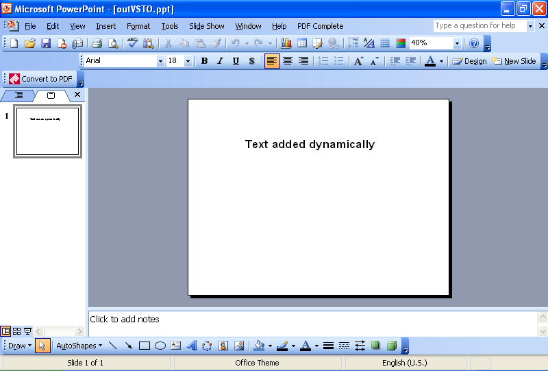

{} 

Tugas umum yang harus dilakukan pengembang adalah menambahkan teks ke slide secara dinamis. Artikel ini menampilkan contoh kode untuk menambahkan teks secara dinamis menggunakan [VSTO](/slides/id/java/adding-text-dynamically-using-vsto-and-aspose-slides-for-java/) dan [Aspose.Slides for Java](/slides/id/java/adding-text-dynamically-using-vsto-and-aspose-slides-for-java/).

{} 
## **Menambahkan Teks Secara Dinamis**
Kedua metode mengikuti langkah-langkah berikut:

1. Buat presentasi.
1. Tambahkan slide kosong.
1. Tambahkan kotak teks.
1. Setel teks.
1. Tuliskan presentasi.
## **Contoh Kode VSTO**
Potongan kode di bawah menghasilkan presentasi dengan slide biasa dan sebuah string teks di atasnya.

**Presentasi yang dibuat di VSTO** 


## **Contoh Aspose.Slides for Java**
Potongan kode di bawah menggunakan Aspose.Slides untuk membuat presentasi dengan slide biasa dan sebuah string teks di atasnya.

**Presentasi yang dibuat menggunakan Aspose.Slides for Java** 

