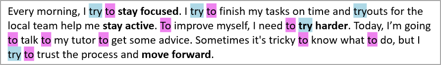

## **Gambaran Umum**

Artikel ini menunjukkan cara memformat teks dalam presentasi PowerPoint dan OpenDocument menggunakan Aspose.Slides for Java. Topik yang dibahas meliputi penyorotan, warna latar belakang, transparansi, jarak antar karakter, properti font, rotasi, jarak paragraf, perilaku autofit, penempatan teks, tabulasi, dan pengaturan bahasa.

Dalam contoh di bawah, kami akan menggunakan file bernama "sample.pptx", yang berisi satu kotak teks pada slide pertama dengan teks berikut:


## **Menyorot Teks**

Gunakan [ITextFrame.highlightText](https://reference.aspose.com/slides/id/java/com.aspose.slides/itextframe/#highlightText-java.lang.String-java.awt.Color-) ketika Anda perlu menyorot teks yang cocok dengan contoh tertentu dalam sebuah bingkai teks. Metode ini menerapkan warna sorot pada fragmen teks yang cocok dan dapat dipadukan dengan [TextSearchOptions](https://reference.aspose.com/slides/id/java/com.aspose.slides/textsearchoptions/) untuk mengontrol cara pencarian dilakukan, misalnya untuk mencocokkan hanya kata lengkap.

Contoh kode di bawah menyorot semua kemunculan karakter **"try"** dan kemudian menyorot hanya kata lengkap **"to"**.

```java
Presentation presentation = new Presentation("sample.pptx");
try {
    // Dapatkan shape pertama dari slide pertama.
    IAutoShape shape = (IAutoShape)presentation.getSlides().get_Item(0).getShapes().get_Item(0);

    // Sorot kata "try" pada shape.
    shape.getTextFrame().highlightText("try", Color.LIGHT_GRAY);

    TextSearchOptions searchOptions = new TextSearchOptions();
    searchOptions.setWholeWordsOnly(true);

    // Sorot kata "to" pada shape.
    shape.getTextFrame().highlightText("to", Color.MAGENTA, searchOptions, null);

    presentation.save("highlighted_text.pptx", SaveFormat.Pptx);
} finally {
    presentation.dispose();
}
```

Hasilnya:



## **Menyorot Teks Menggunakan Ekspresi Reguler**

Metode [ITextFrame.highlightRegex](https://reference.aspose.com/slides/id/java/com.aspose.slides/itextframe/#highlightRegex-java.util.regex.Pattern-java.awt.Color-com.aspose.slides.IFindResultCallback-) menyorot teks yang cocok dengan pola ekspresi reguler. Di Java, API ini tersedia pada [ITextFrame](https://reference.aspose.com/slides/id/java/com.aspose.slides/itextframe/).

Contoh kode di bawah menyorot semua kata yang mengandung **tujuh karakter atau lebih**:

```java
Presentation presentation = new Presentation("sample.pptx");
try {
    IAutoShape shape = (IAutoShape)presentation.getSlides().get_Item(0).getShapes().get_Item(0);

    java.util.regex.Pattern regex = java.util.regex.Pattern.compile("\\b[^\\s]{7,}\\b");

    // Sorot semua kata dengan tujuh karakter atau lebih.
    shape.getTextFrame().highlightRegex(regex, Color.YELLOW, null);

    presentation.save("highlighted_text_using_regex.pptx", SaveFormat.Pptx);
} finally {
    presentation.dispose();
}
```

Hasilnya:


## **Mengatur Warna Latar Belakang Teks**

Gunakan [IParagraphFormat.getDefaultPortionFormat](https://reference.aspose.com/slides/id/java/com.aspose.slides/iparagraphformat/#getDefaultPortionFormat--) untuk mengatur warna sorot default bagi sebuah paragraf, atau gunakan [IBasePortionFormat.getHighlightColor](https://reference.aspose.com/slides/id/java/com.aspose.slides/ibaseportionformat/#getHighlightColor--) untuk bagian teks individual.

Contoh kode berikut memperlihatkan cara mengatur warna latar belakang untuk **seluruh paragraf**:

```java
Presentation presentation = new Presentation("sample.pptx");
try {
    IAutoShape autoShape = (IAutoShape)presentation.getSlides().get_Item(0).getShapes().get_Item(0);
    IParagraph paragraph = autoShape.getTextFrame().getParagraphs().get_Item(0);

    // Atur warna sorotan untuk seluruh paragraf.
    paragraph.getParagraphFormat().getDefaultPortionFormat().getHighlightColor().setColor(Color.LIGHT_GRAY);

    presentation.save("gray_paragraph.pptx", SaveFormat.Pptx);
} finally {
    presentation.dispose();
}
```

Hasilnya:


Contoh kode di bawah menunjukkan cara mengatur warna latar belakang untuk **bagian teks dengan font tebal**:

```java
Presentation presentation = new Presentation("sample.pptx");
try {
    IAutoShape autoShape = (IAutoShape)presentation.getSlides().get_Item(0).getShapes().get_Item(0);
    IParagraph paragraph = autoShape.getTextFrame().getParagraphs().get_Item(0);

    for (IPortion portion : paragraph.getPortions()) {
        if (portion.getPortionFormat().getEffective().getFontBold()) {
            // Atur warna sorotan untuk bagian teks.
            portion.getPortionFormat().getHighlightColor().setColor(Color.LIGHT_GRAY);
        }
    }

    presentation.save("gray_text_portions.pptx", SaveFormat.Pptx);
} finally {
    presentation.dispose();
}
```

Hasilnya:


## **Menyelaraskan Paragraf Teks**

Gunakan [IParagraphFormat.setAlignment](https://reference.aspose.com/slides/id/java/com.aspose.slides/iparagraphformat/#setAlignment-int-) untuk mengatur perataan paragraf dalam sebuah bingkai teks. Nilainya dapat berupa tengah, rata kiri, rata kanan, justify, dan sebagainya.

Contoh kode berikut memperlihatkan cara menyejajarkan paragraf ke **tengah**:

```java
Presentation presentation = new Presentation("sample.pptx");
try {
    IAutoShape autoShape = (IAutoShape)presentation.getSlides().get_Item(0).getShapes().get_Item(0);
    IParagraph paragraph = autoShape.getTextFrame().getParagraphs().get_Item(0);

    // Atur perataan paragraf ke tengah.
    paragraph.getParagraphFormat().setAlignment(TextAlignment.Center);

    presentation.save("aligned_paragraph.pptx", SaveFormat.Pptx);
} finally {
    presentation.dispose();
}
```

Hasilnya:


## **Mengatur Transparansi untuk Teks**

Transparansi teks diatur melalui komponen alfa pada warna yang diberikan ke [IBasePortionFormat.getFillFormat](https://reference.aspose.com/slides/id/java/com.aspose.slides/ibaseportionformat/#getFillFormat--). Dalam contoh di bawah, `alpha = 50` adalah nilai kanal alfa ARGB pada skala 0‑255, bukan persentase transparansi.

Contoh kode berikut memperlihatkan cara menerapkan transparansi pada **seluruh paragraf**:

```java
int alpha = 50;

Presentation presentation = new Presentation("sample.pptx");
try {
    IAutoShape autoShape = (IAutoShape)presentation.getSlides().get_Item(0).getShapes().get_Item(0);
    IParagraph paragraph = autoShape.getTextFrame().getParagraphs().get_Item(0);

    // Atur warna isi teks menjadi warna transparan.
    paragraph.getParagraphFormat().getDefaultPortionFormat().getFillFormat().setFillType(FillType.Solid);
    paragraph.getParagraphFormat().getDefaultPortionFormat().getFillFormat().getSolidFillColor().setColor(new Color(0, 0, 0, alpha));

    presentation.save("transparent_paragraph.pptx", SaveFormat.Pptx);
} finally {
    presentation.dispose();
}
```

Hasilnya:


Contoh kode berikut memperlihatkan cara menerapkan transparansi pada **bagian teks dengan font tebal**:

```java
int alpha = 50;

Presentation presentation = new Presentation("sample.pptx");
try {
    IAutoShape autoShape = (IAutoShape)presentation.getSlides().get_Item(0).getShapes().get_Item(0);
    IParagraph paragraph = autoShape.getTextFrame().getParagraphs().get_Item(0);

    for (IPortion portion : paragraph.getPortions()) {
        if (portion.getPortionFormat().getEffective().getFontBold()) {
            // Atur transparansi bagian teks.
            portion.getPortionFormat().getFillFormat().setFillType(FillType.Solid);
            portion.getPortionFormat().getFillFormat().getSolidFillColor().setColor(new Color(0, 0, 0, alpha));
        }
    }

    presentation.save("transparent_text_portions.pptx", SaveFormat.Pptx);
} finally {
    presentation.dispose();
}
```

Hasilnya:


## **Mengatur Jarak Antar Karakter untuk Teks**

Gunakan [IBasePortionFormat.setSpacing](https://reference.aspose.com/slides/id/java/com.aspose.slides/ibaseportionformat/#setSpacing-float-) untuk memperlebar atau mempersempit jarak antar karakter dalam sebuah kotak teks.

Kode Java berikut memperlihatkan cara memperlebar jarak karakter pada **seluruh paragraf**:

```java
Presentation presentation = new Presentation("sample.pptx");
try {
    IAutoShape autoShape = (IAutoShape)presentation.getSlides().get_Item(0).getShapes().get_Item(0);
    IParagraph paragraph = autoShape.getTextFrame().getParagraphs().get_Item(0);

    // Catatan: Gunakan nilai negatif untuk memperkecil jarak karakter.
    paragraph.getParagraphFormat().getDefaultPortionFormat().setSpacing(3); // Perluas jarak karakter.

    presentation.save("character_spacing_in_paragraph.pptx", SaveFormat.Pptx);
} finally {
    presentation.dispose();
}
```

Hasilnya:


Contoh kode berikut memperlihatkan cara memperlebar jarak karakter pada **bagian teks dengan font tebal**:

```java
Presentation presentation = new Presentation("sample.pptx");
try {
    IAutoShape autoShape = (IAutoShape)presentation.getSlides().get_Item(0).getShapes().get_Item(0);
    IParagraph paragraph = autoShape.getTextFrame().getParagraphs().get_Item(0);

    for (IPortion portion : paragraph.getPortions()) {
        if (portion.getPortionFormat().getEffective().getFontBold()) {
            // Catatan: Gunakan nilai negatif untuk memperkecil jarak karakter.
            portion.getPortionFormat().setSpacing(3); // Perluas jarak karakter.
        }
    }

    presentation.save("character_spacing_in_text_portions.pptx", SaveFormat.Pptx);
} finally {
    presentation.dispose();
}
```

Hasilnya:


### **Menonaktifkan Kerning untuk Font Tertentu**

Dalam beberapa kasus, teks yang dirender oleh Aspose.Slides dapat tampak sedikit lebih rapat dibandingkan dengan teks yang sama di PowerPoint. Hal ini dapat terjadi karena PowerPoint mengabaikan data kerning untuk font tertentu, meski font tersebut memiliki informasi kerning yang valid dan kerning diaktifkan di pengaturan PowerPoint.

Untuk membuat hasil render lebih mendekati tampilan PowerPoint, Anda dapat menonaktifkan kerning untuk bagian teks yang menggunakan font yang terdampak. Atur [IBasePortionFormat.setKerningMinimalSize](https://reference.aspose.com/slides/id/java/com.aspose.slides/ibaseportionformat/#setKerningMinimalSize-float-) ke nilai yang jauh lebih besar daripada ukuran font sebenarnya:

```java
Presentation presentation = new Presentation("presentation.pptx");
try {
    IAutoShape autoShape = (IAutoShape)presentation.getSlides().get_Item(0).getShapes().get_Item(0);
    String targetFont = "Roboto";

    for (IParagraph paragraph : autoShape.getTextFrame().getParagraphs()) {
        for (IPortion portion : paragraph.getPortions()) {
            IPortionFormat portionFormat = portion.getPortionFormat();

            if ((portionFormat.getLatinFont() != null &&
                 portionFormat.getLatinFont().getFontName().equals(targetFont)) ||
                (portionFormat.getEastAsianFont() != null &&
                 portionFormat.getEastAsianFont().getFontName().equals(targetFont)) ||
                (portionFormat.getComplexScriptFont() != null &&
                 portionFormat.getComplexScriptFont().getFontName().equals(targetFont))) {
                portionFormat.setKerningMinimalSize(100);
            }
        }
    }

    presentation.save("output.pptx", SaveFormat.Pptx);
} finally {
    presentation.dispose();
}
```

Pengaturan ini mencegah kerning diterapkan pada bagian teks yang cocok dan dapat membantu menyelaraskan rendering Aspose.Slides dengan output visual PowerPoint untuk font yang dipengaruhi perilaku khusus PowerPoint ini.

## **Mengelola Properti Font Teks**

Properti font dapat diatur pada tingkat paragraf melalui [IParagraphFormat.getDefaultPortionFormat](https://reference.aspose.com/slides/id/java/com.aspose.slides/iparagraphformat/#getDefaultPortionFormat--) atau pada bagian individual melalui [IPortionFormat](https://reference.aspose.com/slides/id/java/com.aspose.slides/iportionformat/).

Kode berikut mengatur font dan gaya teks untuk seluruh paragraf: ia menerapkan ukuran font, tebal, miring, garis bawah titik, dan font Times New Roman ke semua bagian dalam paragraf.

```java
Presentation presentation = new Presentation("sample.pptx");
try {
    IAutoShape autoShape = (IAutoShape)presentation.getSlides().get_Item(0).getShapes().get_Item(0);
    IParagraph paragraph = autoShape.getTextFrame().getParagraphs().get_Item(0);

    // Atur properti font untuk paragraf.
    paragraph.getParagraphFormat().getDefaultPortionFormat().setFontHeight(12);
    paragraph.getParagraphFormat().getDefaultPortionFormat().setFontBold(NullableBool.True);
    paragraph.getParagraphFormat().getDefaultPortionFormat().setFontItalic(NullableBool.True);
    paragraph.getParagraphFormat().getDefaultPortionFormat().setFontUnderline(TextUnderlineType.Dotted);
    paragraph.getParagraphFormat().getDefaultPortionFormat().setLatinFont(new FontData("Times New Roman"));

    presentation.save("font_properties_for_paragraph.pptx", SaveFormat.Pptx);
} finally {
    presentation.dispose();
}
```

Hasilnya:


Contoh kode berikut menerapkan properti serupa pada **bagian teks dengan font tebal**:

```java
Presentation presentation = new Presentation("sample.pptx");
try {
    IAutoShape autoShape = (IAutoShape)presentation.getSlides().get_Item(0).getShapes().get_Item(0);
    IParagraph paragraph = autoShape.getTextFrame().getParagraphs().get_Item(0);

    for (IPortion portion : paragraph.getPortions()) {
        if (portion.getPortionFormat().getEffective().getFontBold()) {
            // Atur properti font untuk bagian teks.
            portion.getPortionFormat().setFontHeight(13);
            portion.getPortionFormat().setFontItalic(NullableBool.True);
            portion.getPortionFormat().setFontUnderline(TextUnderlineType.Dotted);
            portion.getPortionFormat().setLatinFont(new FontData("Times New Roman"));
        }
    }

    presentation.save("font_properties_for_text_portions.pptx", SaveFormat.Pptx);
} finally {
    presentation.dispose();
}
```

Hasilnya:


## **Mengatur Rotasi Teks**

Gunakan [ITextFrameFormat.setTextVerticalType](https://reference.aspose.com/slides/id/java/com.aspose.slides/itextframeformat/#setTextVerticalType-byte-) untuk menetapkan orientasi teks bawaan dalam sebuah bentuk.

Contoh kode berikut mengatur orientasi teks dalam bentuk ke `Vertical270`, yang memutar teks **90 derajat berlawanan arah jarum jam**:

```java
Presentation presentation = new Presentation("sample.pptx");
try {
    IAutoShape autoShape = (IAutoShape)presentation.getSlides().get_Item(0).getShapes().get_Item(0);

    autoShape.getTextFrame().getTextFrameFormat().setTextVerticalType(TextVerticalType.Vertical270);

    presentation.save("text_rotation.pptx", SaveFormat.Pptx);
} finally {
    presentation.dispose();
}
```

Hasilnya:


## **Mengatur Rotasi Kustom untuk Bingkai Teks**

Gunakan [ITextFrameFormat.setRotationAngle](https://reference.aspose.com/slides/id/java/com.aspose.slides/itextframeformat/#setRotationAngle-float-) untuk menetapkan sudut rotasi kustom bagi sebuah [ITextFrame](https://reference.aspose.com/slides/id/java/com.aspose.slides/itextframe/).

Contoh kode berikut memutar bingkai teks sebesar 3 derajat searah jarum jam dalam bentuk:

```java
Presentation presentation = new Presentation("sample.pptx");
try {
    IAutoShape autoShape = (IAutoShape)presentation.getSlides().get_Item(0).getShapes().get_Item(0);

    autoShape.getTextFrame().getTextFrameFormat().setRotationAngle(3);

    presentation.save("custom_text_rotation.pptx", SaveFormat.Pptx);
} finally {
    presentation.dispose();
}
```

Hasilnya:


## **Mengatur Jarak Baris Paragraf**

Aspose.Slides menyediakan [IParagraphFormat.setSpaceAfter](https://reference.aspose.com/slides/id/java/com.aspose.slides/iparagraphformat/#setSpaceAfter-float-), [IParagraphFormat.setSpaceBefore](https://reference.aspose.com/slides/id/java/com.aspose.slides/iparagraphformat/#setSpaceBefore-float-), dan [IParagraphFormat.setSpaceWithin](https://reference.aspose.com/slides/id/java/com.aspose.slides/iparagraphformat/#setSpaceWithin-float-) untuk mengontrol jarak paragraf. Properti‑proporsi ini digunakan sebagai berikut:

* Gunakan nilai positif untuk menentukan jarak baris sebagai persentase tinggi baris.
* Gunakan nilai negatif untuk menentukan jarak baris dalam poin.

Contoh kode berikut memperlihatkan cara menentukan jarak baris di dalam paragraf:

```java
Presentation presentation = new Presentation("sample.pptx");
try {
    IAutoShape autoShape = (IAutoShape)presentation.getSlides().get_Item(0).getShapes().get_Item(0);
    IParagraph paragraph = autoShape.getTextFrame().getParagraphs().get_Item(0);

    paragraph.getParagraphFormat().setSpaceWithin(200);

    presentation.save("line_spacing.pptx", SaveFormat.Pptx);
} finally {
    presentation.dispose();
}
```

Hasilnya:


## **Mengatur Tipe Autofit untuk Bingkai Teks**

[ITextFrameFormat.setAutofitType](https://reference.aspose.com/slides/id/java/com.aspose.slides/itextframeformat/#setAutofitType-byte-) menentukan bagaimana teks berperilaku ketika melebihi batas kontainernya. Gunakan untuk mengontrol apakah teks menyusut, meluap, atau mengubah ukuran bentuk secara otomatis.

```java
Presentation presentation = new Presentation("sample.pptx");
try {
    IAutoShape autoShape = (IAutoShape)presentation.getSlides().get_Item(0).getShapes().get_Item(0);

    autoShape.getTextFrame().getTextFrameFormat().setAutofitType(TextAutofitType.Shape);

    presentation.save("autofit_type.pptx", SaveFormat.Pptx);
} finally {
    presentation.dispose();
}
```

## **Mengatur Penahan (Anchor) Bingkai Teks**

[ITextFrameFormat.setAnchoringType](https://reference.aspose.com/slides/id/java/com.aspose.slides/itextframeformat/#setAnchoringType-byte-) mendefinisikan bagaimana teks diposisikan secara vertikal di dalam sebuah bentuk, misalnya di bagian atas, tengah, atau bawah.

```java
Presentation presentation = new Presentation("sample.pptx");
try {
    IAutoShape autoShape = (IAutoShape)presentation.getSlides().get_Item(0).getShapes().get_Item(0);

    autoShape.getTextFrame().getTextFrameFormat().setAnchoringType(TextAnchorType.Bottom);

    presentation.save("text_anchor.pptx", SaveFormat.Pptx);
} finally {
    presentation.dispose();
}
```

## **Mengatur Tabulasi Teks**

Gunakan [IParagraphFormat.setDefaultTabSize](https://reference.aspose.com/slides/id/java/com.aspose.slides/iparagraphformat/#setDefaultTabSize-float-) dan [IParagraphFormat.getTabs](https://reference.aspose.com/slides/id/java/com.aspose.slides/iparagraphformat/#getTabs--) untuk mengonfigurasi posisi tab dalam sebuah paragraf.

```java
Presentation presentation = new Presentation("sample.pptx");
try {
    IAutoShape autoShape = (IAutoShape)presentation.getSlides().get_Item(0).getShapes().get_Item(0);
    IParagraph paragraph = autoShape.getTextFrame().getParagraphs().get_Item(0);

    paragraph.getParagraphFormat().setDefaultTabSize(100);
    paragraph.getParagraphFormat().getTabs().add(30, TabAlignment.Left);

    presentation.save("paragraph_tabs.pptx", SaveFormat.Pptx);
} finally {
    presentation.dispose();
}
```

Hasilnya:


## **Mengatur Bahasa Proofing**

Aspose.Slides menyediakan [IBasePortionFormat.setLanguageId](https://reference.aspose.com/slides/id/java/com.aspose.slides/ibaseportionformat/#setLanguageId-java.lang.String-), yang memungkinkan Anda mengatur bahasa proofing untuk sebuah bagian teks. Bahasa proofing menentukan bahasa yang digunakan untuk pemeriksaan ejaan dan tata bahasa di PowerPoint.

Contoh kode berikut memperlihatkan cara mengatur bahasa proofing untuk sebuah bagian teks:

```java
Presentation presentation = new Presentation("presentation.pptx");
try {
    IAutoShape autoShape = (IAutoShape)presentation.getSlides().get_Item(0).getShapes().get_Item(0);

    IParagraph paragraph = autoShape.getTextFrame().getParagraphs().get_Item(0);
    paragraph.getPortions().clear();

    FontData font = new FontData("SimSun");

    Portion textPortion = new Portion();
    textPortion.getPortionFormat().setComplexScriptFont(font);
    textPortion.getPortionFormat().setEastAsianFont(font);
    textPortion.getPortionFormat().setLatinFont(font);

    // Atur Id bahasa proofing.
    textPortion.getPortionFormat().setLanguageId("zh-CN");

    textPortion.setText("1.");
    paragraph.getPortions().add(textPortion);

    presentation.save("proofing_language.pptx", SaveFormat.Pptx);
} finally {
    presentation.dispose();
}
```

## **Mengatur Bahasa Default**

Gunakan [LoadOptions.setDefaultTextLanguage](https://reference.aspose.com/slides/id/java/com.aspose.slides/loadoptions/#setDefaultTextLanguage-java.lang.String-) untuk mendefinisikan bahasa default bagi teks yang dibuat saat memuat atau membuat presentasi.

```java
LoadOptions loadOptions = new LoadOptions();
loadOptions.setDefaultTextLanguage("en-US");

Presentation presentation = new Presentation(loadOptions);
try {
    ISlide slide = presentation.getSlides().get_Item(0);

    // Tambahkan bentuk persegi panjang baru dengan teks.
    IAutoShape shape = slide.getShapes().addAutoShape(ShapeType.Rectangle, 20, 20, 150, 50);
    shape.getTextFrame().setText("Sample text");

    // Periksa bahasa bagian pertama.
    IPortion portion = shape.getTextFrame().getParagraphs().get_Item(0).getPortions().get_Item(0);
    System.out.println(portion.getPortionFormat().getLanguageId());
} finally {
    presentation.dispose();
}
```

## **Mengatur Gaya Teks Default**

Untuk menerapkan pemformatan teks default pada tingkat presentasi, gunakan [IPresentation.getDefaultTextStyle](https://reference.aspose.com/slides/id/java/com.aspose.slides/ipresentation/#getDefaultTextStyle--).

Contoh kode berikut memperlihatkan cara mengatur font tebal default dengan ukuran 14 pt untuk semua teks di seluruh slide dalam sebuah presentasi baru.

```java
Presentation presentation = new Presentation();
try {
    // Ambil format paragraf tingkat teratas.
    IParagraphFormat paragraphFormat = presentation.getDefaultTextStyle().getLevel(0);

    if (paragraphFormat != null) {
        paragraphFormat.getDefaultPortionFormat().setFontHeight(14);
        paragraphFormat.getDefaultPortionFormat().setFontBold(NullableBool.True);
    }

    presentation.save("default_text_style.pptx", SaveFormat.Pptx);
} finally {
    presentation.dispose();
}
```

## **Mengekstrak Teks dengan Efek Semua Huruf Kapital (All‑Caps)**

Di PowerPoint, menerapkan efek font **All Caps** membuat teks muncul dalam huruf kapital pada slide meskipun awalnya diketik dengan huruf kecil. Saat Anda mengambil bagian teks tersebut dengan Aspose.Slides, perpustakaan mengembalikan teks persis seperti yang dimasukkan. Untuk mencocokkan teks yang ditampilkan, periksa [TextCapType](https://reference.aspose.com/slides/id/java/com.aspose.slides/textcaptype/) dan ubah string yang dikembalikan menjadi huruf kapital ketika nilainya `All`.

Misalkan kita memiliki kotak teks berikut pada slide pertama file sample2.pptx.


Contoh kode berikut memperlihatkan cara mengekstrak teks dengan efek **All Caps** yang diterapkan:

```java
Presentation presentation = new Presentation("sample2.pptx");
try {
    IAutoShape autoShape = (IAutoShape)presentation.getSlides().get_Item(0).getShapes().get_Item(0);
    IPortion textPortion = autoShape.getTextFrame().getParagraphs().get_Item(0).getPortions().get_Item(0);

    System.out.println("Original text: " + textPortion.getText());

    IPortionFormatEffectiveData textFormat = textPortion.getPortionFormat().getEffective();
    if (textFormat.getTextCapType() == TextCapType.All) {
        String text = textPortion.getText().toUpperCase();
        System.out.println("All-Caps effect: " + text);
    }
} finally {
    presentation.dispose();
}
```

Output:

```text
Original text: Hello, Aspose!
All-Caps effect: HELLO, ASPOSE!
```

## **FAQ**

**Bagaimana cara memodifikasi teks dalam tabel pada slide?**

Untuk memodifikasi teks dalam tabel pada slide, gunakan [ITable](https://reference.aspose.com/slides/id/java/com.aspose.slides/itable/). Iterasi melalui sel‑sel dan perbarui setiap sel melalui [ICell.getTextFrame](https://reference.aspose.com/slides/id/java/com.aspose.slides/icell/#getTextFrame--) serta pemformatan paragraf melalui [IParagraph.getParagraphFormat](https://reference.aspose.com/slides/id/java/com.aspose.slides/iparagraph/#getParagraphFormat--).

**Bagaimana cara menerapkan warna gradien ke teks dalam slide PowerPoint?**

Untuk menerapkan warna gradien ke teks, gunakan [IBasePortionFormat.getFillFormat](https://reference.aspose.com/slides/id/java/com.aspose.slides/ibaseportionformat/#getFillFormat--). Atur [IFillFormat.setFillType](https://reference.aspose.com/slides/id/java/com.aspose.slides/ifillformat/#setFillType-byte-) ke [FillType.Gradient](https://reference.aspose.com/slides/id/java/com.aspose.slides/filltype/) dan konfigurasikan titik‑titik gradien, arah, serta transparansi.