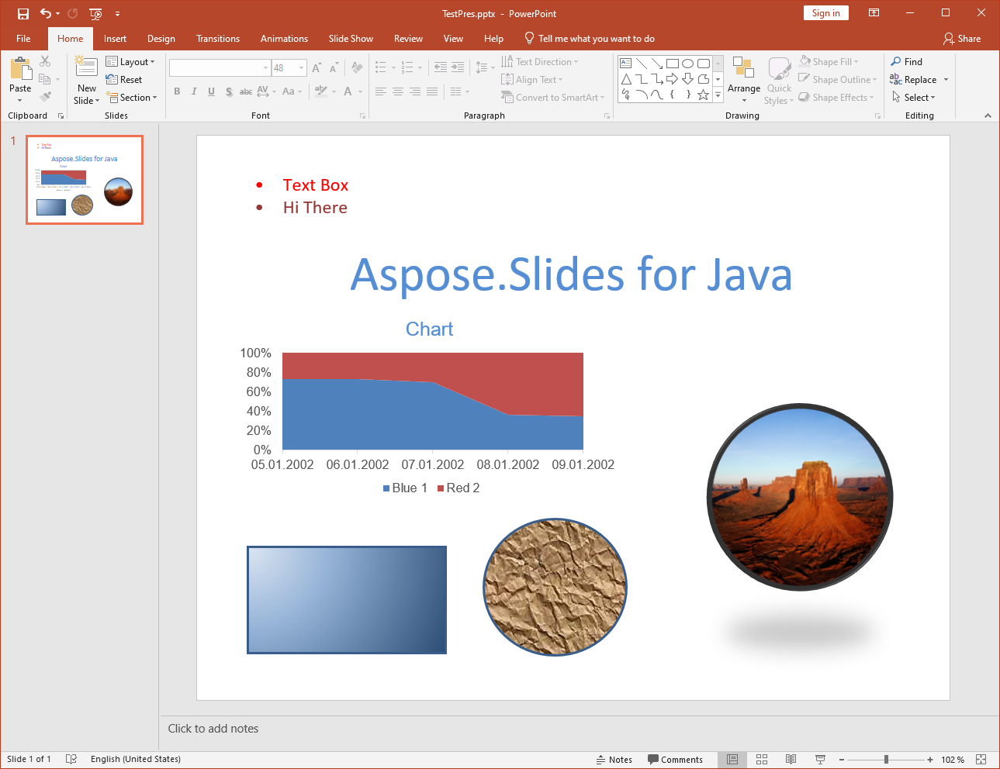

{} 

[Portable Document Format](https://en.wikipedia.org/wiki/PDF) adalah format file yang dibuat oleh Adobe Systems untuk pertukaran dokumen antar organisasi. Tujuan format ini adalah agar konten dan tata letak tetap sama, terlepas dari platform tempatnya dilihat. Aspose.Slides for Java memungkinkan Anda mengonversi file presentasi ke PDF.

{} 

## **PDF di Aspose.Slides for Java**
Setiap presentasi yang dapat dimuat ke dalam Aspose.Slides for Java dapat dikonversi ke PDF yang mematuhi [PDF 1.5](https://en.wikipedia.org/wiki/PDF/A), [PDF/A-1a](https://en.wikipedia.org/wiki/PDF/A), [PDF/A-1b](https://en.wikipedia.org/wiki/PDF/A) atau [PDF/UA](https://en.wikipedia.org/wiki/PDF/UA), tergantung pilihan Anda. Aspose.Slides for Java mengekspor presentasi ke PDF dan dalam kebanyakan kasus, PDF hasilnya terlihat persis seperti presentasi asli.

Aspose.Slides mendukung fitur presentasi berikut saat mengonversi ke PDF:

- Gambar, kotak teks, dan bentuk lainnya.
- Teks dan pemformatan.
- Paragraf dan pemformatan.
- Tautan hiper.
- Header dan footer.
- Bullet.
- Tabel.

Anda dapat mengekspor presentasi ke PDF secara langsung menggunakan Aspose.Slides for Java: Anda tidak memerlukan komponen lain. Selanjutnya, Anda dapat menyesuaikan ekspor presentasi ke PDF dengan berbagai opsi seperti dijelaskan dalam [Mengonversi ke PDF](/slides/id/java/converting-a-presentation/).

**Presentasi input** 

**Presentasi yang dikonversi ke PDF menggunakan Aspose.Slides for Java** 

