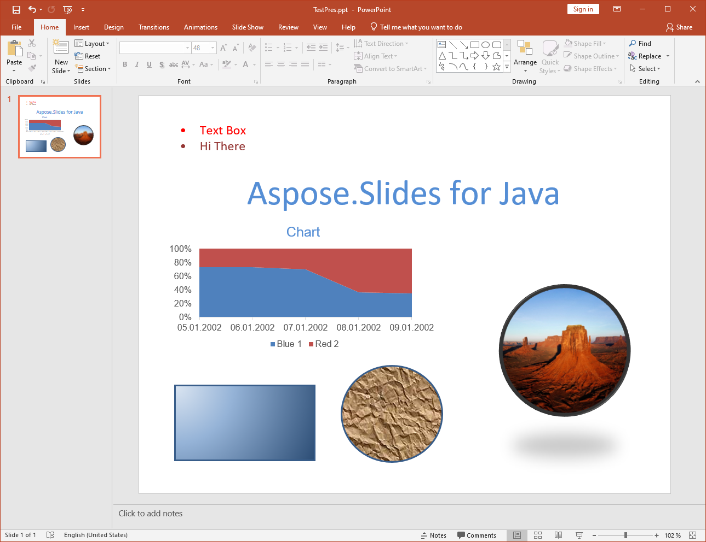

{} 

Konversi PPT ke PPTX didukung oleh Aspose.Slides for Java. Sebagian besar fitur presentasi – slide master, struktur, dan sebagainya – tetap dipertahankan saat dikonversi dari satu format ke format lainnya, namun ada [beberapa batasan](/slides/id/java/ppt-to-pptx-conversion/).

{} 
## **Fitur yang Didukung dalam Konversi**
Aspose.Slides for Java menyediakan dukungan parsial untuk mengonversi format file PPT ke PPTX. Dukungan konversi baru saja diperkenalkan pada Aspose.Slides for Java, sehingga memiliki beberapa keterbatasan dan paling cocok untuk presentasi sederhana. Keuntungan utama yang diberikan Aspose.Slides for Java saat mengonversi PPT ke PPTX adalah kemudahan penggunaan API. Untuk melihat contoh kode, bacalah tentang [Mengonversi PPT ke PPTX](). Di bawah ini, daftar menjelaskan fitur mana yang didukung dan mana yang tidak untuk konversi PPT ke PPTX.

**Presentasi PPT sumber**

**Setelah konversi ke PPTX**

## **Fitur yang Didukung**
Fitur berikut didukung untuk konversi:

- Mengonversi struktur master, tata letak, dan slide.
- Mengonversi diagram.
- Bentuk grup.
- Mengonversi bentuk otomatis termasuk persegi panjang dan elips. 
- Bentuk dengan geometri khusus.
- Gaya isi tekstur dan gambar untuk bentuk otomatis.
- Mengonversi placeholder.
- Mengonversi garis dan polyline.
- Format garis dan isi.
- Gaya isi gradien.
- Bingkai OLE, tabel, bingkai video dan audio, dll.
- Properti animasi dan slideshow.
- Mengonversi teks dalam bingkai teks dan pemegang teks.