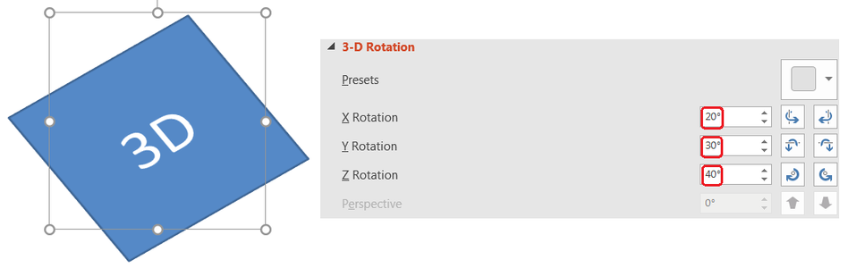

## **Ikhtisar**

Aspose.Slides untuk .NET dapat membuat, mengedit, mempertahankan, dan merender pemformatan 3D gaya PowerPoint untuk bentuk dan teks. Artikel ini mencakup efek 3D seperti rotasi, ekstrusi, bevel, pencahayaan, material, isi gradien atau gambar, dan teks 3D.

{}
Artikel ini membahas efek pemformatan 3D pada bentuk dan teks PowerPoint. Ini bukan tentang memasukkan atau mengedit file model 3D terpisah. Saat Anda mengekspor slide ke gambar, PDF, atau HTML, Aspose.Slides merender efek 3D tersebut ke output 2D yang diekspor.
{}

## **Konsep Pemformatan 3D**

Gunakan properti [IShape.ThreeDFormat](https://reference.aspose.com/slides/id/net/aspose.slides/ishape/properties/threedformat) untuk menerapkan pemformatan 3D pada sebuah bentuk. Properti tersebut mengekspos [IThreeDFormat](https://reference.aspose.com/slides/id/net/aspose.slides/ithreedformat), yang mengontrol adegan 3D untuk bentuk tersebut.

Untuk teks, gunakan properti [ITextFrameFormat.ThreeDFormat](https://reference.aspose.com/slides/id/net/aspose.slides/itextframeformat/properties/threedformat). Ini menerapkan pemformatan 3D pada bingkai teks alih-alih badan bentuk.

Properti terpenting adalah:

| Properti | Apa yang dikendalikan | Kapan digunakan |
|---|---|---|
| [Camera](https://reference.aspose.com/slides/id/net/aspose.slides/ithreedformat/properties/camera) | Titik pandang, tipe kamera preset, rotasi, zoom, dan perspektif. | Putar objek dalam ruang 3D atau cocokkan dengan preset rotasi 3D PowerPoint. |
| [LightRig](https://reference.aspose.com/slides/id/net/aspose.slides/ithreedformat/properties/lightrig) | Preset cahaya, arah, dan rotasi cahaya. | Ubah bagaimana sorotan dan bayangan muncul pada permukaan 3D. |
| [Material](https://reference.aspose.com/slides/id/net/aspose.slides/ithreedformat/properties/material) | Material permukaan, seperti datar, matte, plastik, atau logam. | Buat geometri yang sama terlihat lebih datar, lebih lembut, mengkilap, atau logam. |
| [ExtrusionHeight](https://reference.aspose.com/slides/id/net/aspose.slides/ithreedformat/properties/extrusionheight) | Seberapa jauh bentuk menonjol ke belakang dari permukaan depannya. | Ubah bentuk datar menjadi objek 3D yang tebal terlihat. |
| [ExtrusionColor](https://reference.aspose.com/slides/id/net/aspose.slides/ithreedformat/properties/extrusioncolor) | Warna sisi yang diekstrusi. | Buat kedalaman terlihat atau sesuaikan warna sisi dengan isi depan. |
| [Depth](https://reference.aspose.com/slides/id/net/aspose.slides/ithreedformat/properties/depth) | Kedalaman 3D tambahan yang digunakan oleh pemformatan 3D PowerPoint. | Sesuaikan kedalaman untuk bentuk atau teks, terutama bersama pengaturan bevel dan material. |
| [BevelTop](https://reference.aspose.com/slides/id/net/aspose.slides/ithreedformat/properties/beveltop) dan [BevelBottom](https://reference.aspose.com/slides/id/net/aspose.slides/ithreedformat/properties/bevelbottom) | Tepi yang terangkat atau melengkung pada permukaan depan dan belakang. | Tambahkan tepi yang lembut atau dibentuk alih-alih permukaan datar yang tajam. |
| [ContourColor](https://reference.aspose.com/slides/id/net/aspose.slides/ithreedformat/properties/contourcolor) dan [ContourWidth](https://reference.aspose.com/slides/id/net/aspose.slides/ithreedformat/properties/contourwidth) | Garis luar di sekitar objek 3D. | Tekankan batas objek dalam output yang dirender. |

## **Buat Bentuk 3D**

Suatu bentuk biasanya membutuhkan empat jenis pengaturan sebelum terlihat meyakinkan sebagai 3D:

- Pengaturan kamera, karena tampilan depan default dapat menyembunyikan ekstrusi.
- Pengaturan cahaya, karena pencahayaan membuat permukaan dan sisi dapat dilihat.
- Pengaturan material, karena permukaan memengaruhi cara cahaya dirender.
- Pengaturan ekstrusi atau kedalaman, karena bentuk datar memerlukan ketebalan.

Contoh berikut membuat sebuah persegi panjang, menambahkan teks ke permukaan depannya, menerapkan pemformatan 3D, menyimpan presentasi sebagai PPTX, dan merender slide ke gambar PNG.

```csharp
using System.Drawing;
using Aspose.Slides;
using Aspose.Slides.Export;

const float imageScale = 2;

using var presentation = new Presentation();

var slide = presentation.Slides[0];
var shape = slide.Shapes.AddAutoShape(ShapeType.Rectangle, 200, 150, 200, 200);
shape.TextFrame.Text = "3D";
shape.TextFrame.Paragraphs[0].ParagraphFormat.DefaultPortionFormat.FontHeight = 64;

shape.FillFormat.FillType = FillType.Solid;
shape.FillFormat.SolidFillColor.Color = Color.CornflowerBlue;

shape.ThreeDFormat.Camera.CameraType = CameraPresetType.OrthographicFront;
shape.ThreeDFormat.Camera.SetRotation(20, 30, 40);
shape.ThreeDFormat.LightRig.LightType = LightRigPresetType.Flat;
shape.ThreeDFormat.LightRig.Direction = LightingDirection.Top;
shape.ThreeDFormat.Material = MaterialPresetType.Flat;
shape.ThreeDFormat.ExtrusionHeight = 100;
shape.ThreeDFormat.ExtrusionColor.Color = Color.Blue;

using var thumbnail = slide.GetImage(imageScale, imageScale);
thumbnail.Save("shape_3d.png");

presentation.Save("shape_3d.pptx", SaveFormat.Pptx);
```

Gambar slide yang dirender menunjukkan persegi panjang sebagai balok 3D yang tebal:


## **Putar Bentuk dengan Kamera**

Di PowerPoint, rotasi 3D dikonfigurasi melalui panel Rotasi 3-D. Nilai rotasi X, Y, dan Z sesuai dengan rotasi yang Anda atur melalui API kamera.



Di Aspose.Slides, atur tipe kamera dan rotasi melalui [IThreeDFormat.Camera](https://reference.aspose.com/slides/id/net/aspose.slides/ithreedformat/properties/camera):

```csharp
using Aspose.Slides;

using var presentation = new Presentation();

var slide = presentation.Slides[0];
var shape = slide.Shapes.AddAutoShape(ShapeType.Rectangle, 200, 150, 200, 200);

shape.ThreeDFormat.Camera.CameraType = CameraPresetType.OrthographicFront;
shape.ThreeDFormat.Camera.SetRotation(20, 30, 40);
```

Gunakan kamera bila Anda perlu mengubah cara pemirsa melihat objek. Ini tidak mengubah geometri bentuk 2D pada slide. Ini mengubah sudut pandang 3D yang digunakan oleh PowerPoint dan Aspose.Slides saat merender.

## **Tambah Ekstrusi dan Kedalaman**

Ekstrusi membuat bentuk tampak tebal dengan memperpanjangnya ke belakang permukaan depan. Di PowerPoint, kontrol kedalaman mengatur ketebalan yang terlihat, dan kontrol warna mengatur warna sisi.


Atur [IThreeDFormat.ExtrusionHeight](https://reference.aspose.com/slides/id/net/aspose.slides/ithreedformat/properties/extrusionheight) untuk ketebalan dan [IThreeDFormat.ExtrusionColor](https://reference.aspose.com/slides/id/net/aspose.slides/ithreedformat/properties/extrusioncolor) untuk warna sisi:

```csharp
using System.Drawing;
using Aspose.Slides;

using var presentation = new Presentation();

var slide = presentation.Slides[0];
var shape = slide.Shapes.AddAutoShape(ShapeType.Rectangle, 200, 150, 200, 200);

shape.ThreeDFormat.Camera.SetRotation(20, 30, 40);
shape.ThreeDFormat.ExtrusionHeight = 100;
shape.ThreeDFormat.ExtrusionColor.Color = Color.Purple;
```

Gunakan [IThreeDFormat.Depth](https://reference.aspose.com/slides/id/net/aspose.slides/ithreedformat/properties/depth) ketika Anda perlu bekerja langsung dengan nilai kedalaman PowerPoint atau menggabungkan kedalaman dengan bevel, material, dan efek teks. Dalam banyak skenario bentuk, `ExtrusionHeight` adalah pengaturan yang lebih jelas karena secara langsung mengekspresikan ekstrusi yang terlihat.

## **Gunakan Isi Gradien atau Gambar dengan Efek 3D**

Pemformatan 3D bersifat independen dari isi bentuk. Anda dapat menerapkan warna solid, gradien, pola, atau isi gambar pada permukaan depan dan tetap menggunakan kamera, cahaya, material, serta pengaturan ekstrusi yang sama.

Contoh ini menerapkan isi gradien pada bentuk dan warna ekstrusi yang lebih gelap pada sisi:

```csharp
using System.Drawing;
using Aspose.Slides;

const float imageScale = 2;

using var presentation = new Presentation();

var slide = presentation.Slides[0];
var shape = slide.Shapes.AddAutoShape(ShapeType.Rectangle, 200, 150, 250, 250);
shape.TextFrame.Text = "3D Gradient";
shape.TextFrame.Paragraphs[0].ParagraphFormat.DefaultPortionFormat.FontHeight = 64;

shape.FillFormat.FillType = FillType.Gradient;
shape.FillFormat.GradientFormat.GradientStops.Add(0, Color.Blue);
shape.FillFormat.GradientFormat.GradientStops.Add(100, Color.Orange);

shape.ThreeDFormat.Camera.CameraType = CameraPresetType.OrthographicFront;
shape.ThreeDFormat.Camera.SetRotation(10, 20, 30);
shape.ThreeDFormat.LightRig.LightType = LightRigPresetType.Flat;
shape.ThreeDFormat.LightRig.Direction = LightingDirection.Top;
shape.ThreeDFormat.Material = MaterialPresetType.Flat;
shape.ThreeDFormat.ExtrusionHeight = 150;
shape.ThreeDFormat.ExtrusionColor.Color = Color.DarkOrange;

using var thumbnail = slide.GetImage(imageScale, imageScale);
thumbnail.Save("gradient_3d.png");
```

Hasil yang dirender mempertahankan gradien pada permukaan depan dan merender ekstrusi secara terpisah:


Untuk menggunakan isi gambar sebagai gantinya, tambahkan gambar ke presentasi dan tetapkan ke isi bentuk:

```csharp
using System.Drawing;
using Aspose.Slides;

using var presentation = new Presentation();

var slide = presentation.Slides[0];
var shape = slide.Shapes.AddAutoShape(ShapeType.Rectangle, 200, 150, 250, 250);

var imageData = File.ReadAllBytes("image.jpg");
var image = presentation.Images.AddImage(imageData);

shape.FillFormat.FillType = FillType.Picture;
shape.FillFormat.PictureFillFormat.Picture.Image = image;
shape.FillFormat.PictureFillFormat.PictureFillMode = PictureFillMode.Stretch;

shape.ThreeDFormat.Camera.SetRotation(10, 20, 30);
shape.ThreeDFormat.ExtrusionHeight = 150;
shape.ThreeDFormat.ExtrusionColor.Color = Color.DarkOrange;
```

Gambar dirender pada permukaan depan, sementara ekstrusi dirender sebagai permukaan sisi 3D:


## **Terapkan Pemformatan 3D pada Teks**

Pemformatan 3D pada bentuk memengaruhi badan bentuk. Pemformatan 3D pada teks memengaruhi bingkai teks. Ini berguna untuk efek mirip WordArt di mana huruf itu sendiri memerlukan ekstrusi, material, pencahayaan, dan pengaturan kamera.

Contoh berikut membuat teks dengan isi pola, menerapkan transformasi WordArt, dan mengonfigurasi pengaturan 3D pada [ITextFrameFormat](https://reference.aspose.com/slides/id/net/aspose.slides/itextframeformat):

```csharp
using System.Drawing;
using Aspose.Slides;
using Aspose.Slides.Export;

const float imageScale = 2;

using var presentation = new Presentation();

var slide = presentation.Slides[0];
var shape = slide.Shapes.AddAutoShape(ShapeType.Rectangle, 200, 150, 250, 250);
shape.FillFormat.FillType = FillType.NoFill;
shape.LineFormat.FillFormat.FillType = FillType.NoFill;
shape.TextFrame.Text = "3D Text";

var portion = shape.TextFrame.Paragraphs[0].Portions[0];
portion.PortionFormat.FillFormat.FillType = FillType.Pattern;
portion.PortionFormat.FillFormat.PatternFormat.ForeColor.Color = Color.DarkOrange;
portion.PortionFormat.FillFormat.PatternFormat.BackColor.Color = Color.White;
portion.PortionFormat.FillFormat.PatternFormat.PatternStyle = PatternStyle.LargeGrid;

shape.TextFrame.Paragraphs[0].ParagraphFormat.DefaultPortionFormat.FontHeight = 128;

var textFrameFormat = shape.TextFrame.TextFrameFormat;
textFrameFormat.Transform = TextShapeType.ArchUp;
textFrameFormat.ThreeDFormat.ExtrusionHeight = 3.5f;
textFrameFormat.ThreeDFormat.Depth = 3;
textFrameFormat.ThreeDFormat.Material = MaterialPresetType.Plastic;
textFrameFormat.ThreeDFormat.LightRig.Direction = LightingDirection.Top;
textFrameFormat.ThreeDFormat.LightRig.LightType = LightRigPresetType.Balanced;
textFrameFormat.ThreeDFormat.LightRig.SetRotation(0, 0, 40);
textFrameFormat.ThreeDFormat.Camera.CameraType = CameraPresetType.PerspectiveContrastingRightFacing;

using var thumbnail = slide.GetImage(imageScale, imageScale);
thumbnail.Save("text_3d.png");

presentation.Save("text_3d.pptx", SaveFormat.Pptx);
```

Teks dirender sebagai huruf 3D melengkung dan diekstrusi:


## **Perilaku Ekspor dan Rendering**

Aspose.Slides mempertahankan pemformatan 3D saat menyimpan ke format PowerPoint seperti PPTX. Saat merender atau mengekspor ke format tata letak tetap, adegan 3D diubah menjadi raster atau digambar ke output sebagai hasil 2D. Hal ini berlaku ketika Anda merender slide ke [PNG](/slides/id/net/convert-powerpoint-to-png/), mengekspor ke [PDF](/slides/id/net/convert-powerpoint-to-pdf/), mengekspor ke [HTML](/slides/id/net/convert-powerpoint-to-html/), atau menghasilkan frame untuk [video conversion](/slides/id/net/convert-powerpoint-to-video/).

Ingat hal-hal berikut:

- Gambar dan PDF yang diekspor tidak interaktif. Objek tidak dapat diputar oleh pemirsa setelah diekspor.
- Penampilan akhir tergantung pada kombinasi kamera, light rig, material, ekstrusi, isi, dan skala slide.
- Jika Anda perlu memeriksa nilai pemformatan yang diwariskan atau berbasis tema, baca [properti bentuk efektif](/slides/id/net/shape-effective-properties/).
- Beberapa format output tidak dapat menyimpan pemformatan 3D PowerPoint yang dapat diedit. Pada format tersebut, hasil visual dirender alih-alih dipertahankan sebagai pengaturan 3D yang dapat diedit.

## **FAQ**

### Apakah Aspose.Slides dapat membuat presentasi 3D interaktif?

Aspose.Slides membuat dan merender efek 3D PowerPoint untuk bentuk dan teks. Ia tidak membuat gambar, PDF, atau halaman HTML yang diekspor menjadi adegan 3D interaktif yang dapat diputar oleh pemirsa. Pada PPTX, pemformatan 3D tetap dapat diedit di PowerPoint bila format tersebut mendukungnya.

### Apa perbedaan antara model 3D dan efek 3D?

Model 3D adalah objek 3D terpisah yang dimasukkan ke dalam presentasi. Efek 3D adalah pemformatan yang diterapkan pada bentuk atau teks PowerPoint biasa, seperti rotasi, ekstrusi, bevel, pencahayaan, dan material. Artikel ini membahas efek 3D.

### Pengaturan apa yang diperlukan untuk bentuk 3D yang terlihat?

Minimal, atur rotasi kamera dan salah satu antara ekstrusi atau kedalaman. Praktiknya, juga atur light rig dan material agar permukaan yang dirender memiliki sorotan dan bayangan yang jelas.

### Bisakah saya menerapkan efek 3D pada bentuk dan teks?

Ya. Gunakan [IShape.ThreeDFormat](https://reference.aspose.com/slides/id/net/aspose.slides/ishape/properties/threedformat) untuk badan bentuk dan [ITextFrameFormat.ThreeDFormat](https://reference.aspose.com/slides/id/net/aspose.slides/itextframeformat/properties/threedformat) untuk teks.

### Akankah efek 3D muncul saat mengekspor ke gambar, PDF, HTML, atau frame video?

Ya. Aspose.Slides merender efek 3D saat menghasilkan gambar slide, output PDF, output HTML, dan frame yang digunakan untuk konversi video. Output yang diekspor berisi tampilan yang dirender, bukan objek 3D yang dapat diedit.

### Bisakah saya membaca nilai 3D akhir setelah pewarisan dan pengaturan tema diterapkan?

Ya. Gunakan API pemformatan yang efektif yang dijelaskan dalam [Shape Effective Properties](/slides/id/net/shape-effective-properties/) untuk membaca nilai kamera, light rig, bevel, dan nilai 3D terkait akhir.