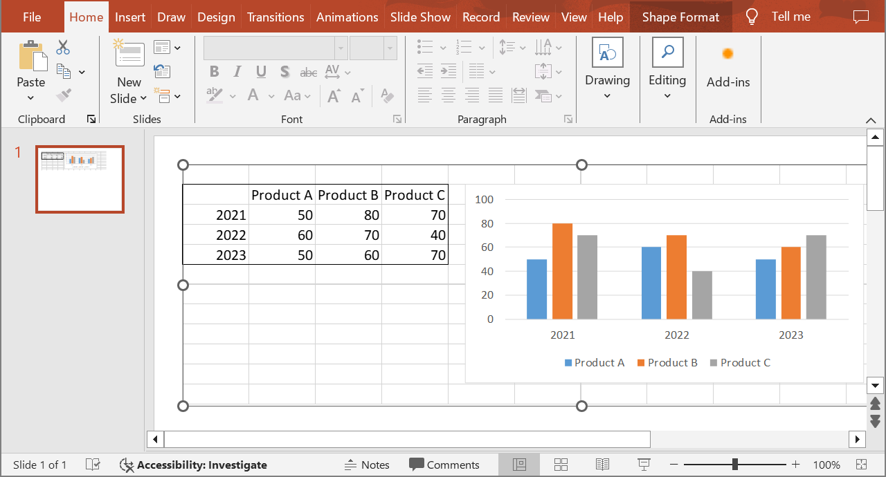

## **Pendahuluan**

Dengan menggunakan Aspose.Slides untuk .NET, ketika Anda menambahkan [OleObjectFrame](https://reference.aspose.com/slides/id/net/aspose.slides/oleobjectframe) ke sebuah slide, pesan "EMBEDDED OLE OBJECT" ditampilkan pada slide keluaran. Pesan ini bersifat sengaja dan BUKAN bug.

Untuk informasi lebih lanjut tentang cara bekerja dengan objek OLE, lihat [Manage OLE](/slides/id/net/manage-ole/).

## **Penjelasan dan Solusi**

Aspose.Slides menampilkan pesan "EMBEDDED OLE OBJECT" untuk memberi tahu Anda bahwa objek OLE telah diubah dan gambar pratinjau harus diperbarui. 

Sebagai contoh, jika Anda menambahkan grafik Microsoft Excel sebagai sebuah [OleObjectFrame](https://reference.aspose.com/slides/id/net/aspose.slides/oleobjectframe) ke sebuah slide (untuk detail lebih lanjut, lihat artikel "Manage OLE") dan kemudian membuka presentasi di Microsoft PowerPoint, Anda akan melihat gambar ini pada slide:


Jika Anda ingin memeriksa dan memastikan bahwa objek OLE Anda telah ditambahkan ke slide, Anda harus mengklik ganda pada pesan "EMBEDDED OLE OBJECT", atau Anda dapat mengklik kanan pada pesan tersebut dan melalui opsi **Object > Edit**.


PowerPoint kemudian membuka objek OLE yang disematkan.


Slide mungkin masih menampilkan pesan "EMBEDDED OLE OBJECT". Setelah Anda mengklik objek OLE, pratinjau slide akan diperbarui dan pesan "EMBEDDED OLE OBJECT" akan digantikan oleh gambar sebenarnya untuk objek OLE tersebut. 



Sekarang, Anda mungkin ingin menyimpan presentasi Anda untuk memastikan gambar untuk OLE Object diperbarui dengan benar. Dengan cara ini, setelah menyimpan presentasi, ketika Anda membuka presentasi kembali, Anda TIDAK akan melihat pesan "EMBEDDED OLE OBJECT". 

## **Solusi Lain**

### **Solusi 1: Ganti Pesan "Embedded OLE Object" dengan Gambar**

Jika Anda tidak ingin menghapus pesan "EMBEDDED OLE OBJECT" dengan membuka presentasi di PowerPoint dan kemudian menyimpannya, Anda dapat mengganti pesan tersebut dengan gambar pratinjau pilihan Anda. Baris kode berikut menunjukkan prosesnya:

```cs
using var presentation = new Presentation("embeddedOLE.pptx");

var slide = presentation.Slides[0];
var oleFrame = (IOleObjectFrame)slide.Shapes[0];

// Tambah gambar ke sumber daya presentasi.
using var imageStream = File.OpenRead("myImage.png");
var oleImage = presentation.Images.AddImage(imageStream);

// Setel judul dan gambar untuk pratinjau objek OLE.
oleFrame.SubstitutePictureTitle = "My title";
oleFrame.SubstitutePictureFormat.Picture.Image = oleImage;
oleFrame.IsObjectIcon = false;

presentation.Save("embeddedOLE-newImage.pptx", SaveFormat.Pptx);
```

Slide yang berisi `OleObjectFrame` kemudian berubah menjadi ini:


### **Solusi 2: Buat Add-On untuk PowerPoint**

Anda juga dapat membuat add-on untuk Microsoft PowerPoint yang memperbarui semua objek OLE ketika Anda membuka presentasi dalam program tersebut.