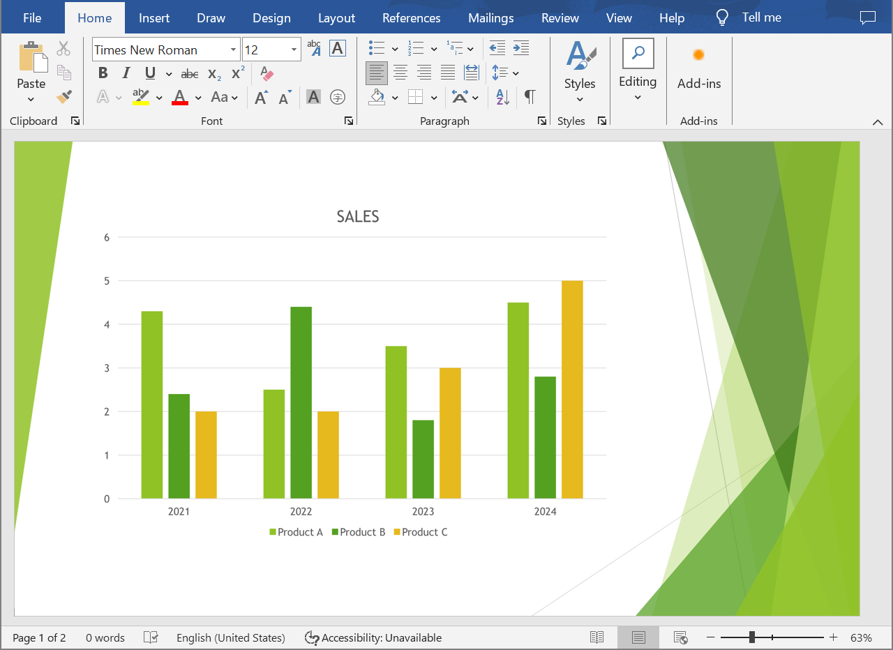

## **Gambaran Umum**

Artikel ini menyediakan solusi bagi pengembang untuk mengonversi presentasi PowerPoint dan OpenDocument menjadi dokumen Word menggunakan Aspose.Slides untuk .NET dan Aspose.Words untuk .NET. Panduan langkah demi langkah ini membawa Anda melalui setiap tahap proses konversi.

## **Mengonversi Presentasi ke Dokumen Word**

Ikuti instruksi di bawah untuk mengonversi presentasi PowerPoint atau OpenDocument ke dokumen Word:

1. Buat instance kelas [Presentation](https://reference.aspose.com/slides/id/net/aspose.slides/presentation/) dan muat file presentasi.
2. Buat instance kelas [Document](https://reference.aspose.com/words/net/aspose.words/document/) dan [DocumentBuilder](https://reference.aspose.com/words/net/aspose.words/documentbuilder/) untuk menghasilkan dokumen Word.
3. Atur ukuran halaman untuk dokumen Word agar sesuai dengan presentasi menggunakan properti [DocumentBuilder.PageSetup](https://reference.aspose.com/words/net/aspose.words/documentbuilder/pagesetup/).
4. Atur margin di dokumen Word menggunakan properti [DocumentBuilder.PageSetup](https://reference.aspose.com/words/net/aspose.words/documentbuilder/pagesetup/).
5. Iterasi semua slide presentasi menggunakan properti [Presentation.Slides](https://reference.aspose.com/slides/id/net/aspose.slides/presentation/slides/id/).
   - Hasilkan gambar slide menggunakan metode `GetImage` dari antarmuka [ISlide](https://reference.aspose.com/slides/id/net/aspose.slides/islide/) dan simpan ke aliran memori.
   - Tambahkan gambar slide ke dokumen Word menggunakan metode `InsertImage` dari kelas [DocumentBuilder](https://reference.aspose.com/words/net/aspose.words/documentbuilder/).
6. Simpan dokumen Word ke file.

Misalkan kita memiliki presentasi "sample.pptx" yang terlihat seperti ini:


Contoh kode C# berikut menunjukkan cara mengonversi presentasi PowerPoint ke dokumen Word:

```cs
using Aspose.Slides;
using Aspose.Words;

// Muat file presentasi.
using var presentation = new Presentation("sample.pptx");

// Buat objek Document dan DocumentBuilder.
var document = new Document();
var builder = new DocumentBuilder(document);

// Atur ukuran halaman dalam dokumen Word.
var slideSize = presentation.SlideSize.Size;
builder.PageSetup.PageWidth = slideSize.Width;
builder.PageSetup.PageHeight = slideSize.Height;

// Atur margin dalam dokumen Word.
builder.PageSetup.LeftMargin = 0;
builder.PageSetup.RightMargin = 0;
builder.PageSetup.TopMargin = 0;
builder.PageSetup.BottomMargin = 0;

const float scaleX = 2, scaleY = 2;

// Iterasi semua slide presentasi.
foreach (var slide in presentation.Slides)
{
    // Hasilkan gambar slide dan simpan ke aliran memori.
    using var image = slide.GetImage(scaleX, scaleY);
    using var imageStream = new MemoryStream();
    image.Save(imageStream, ImageFormat.Png);

    // Tambahkan gambar slide ke dokumen Word.
    imageStream.Seek(0, SeekOrigin.Begin);
    builder.InsertImage(imageStream.ToArray(), builder.PageSetup.PageWidth, builder.PageSetup.PageHeight);

    builder.InsertBreak(BreakType.PageBreak);
}

// Simpan dokumen Word ke file.
document.Save("output.docx");
```

Hasilnya:



{} 
Coba [**Online PPT to Word Converter**](https://products.aspose.app/slides/id/conversion/ppt-to-word) kami untuk melihat apa yang bisa Anda dapatkan dengan mengonversi presentasi PowerPoint dan OpenDocument ke dokumen Word. 
{}

## **FAQ**

### Komponen apa yang perlu dipasang untuk mengonversi presentasi PowerPoint dan OpenDocument ke dokumen Word?

Anda hanya perlu menambahkan paket NuGet yang sesuai untuk [Aspose.Slides for .NET](https://www.nuget.org/packages/Aspose.Slides.NET) dan [Aspose.Words for .NET](https://www.nuget.org/packages/Aspose.Words/) ke proyek C# Anda. Kedua pustaka beroperasi sebagai API mandiri, dan tidak ada keharusan untuk menginstal Microsoft Office.

### Apakah semua format presentasi PowerPoint dan OpenDocument didukung?

Aspose.Slides untuk .NET [mendukung semua format presentasi](/slides/id/net/supported-file-formats/), termasuk PPT, PPTX, ODP, dan tipe file umum lainnya. Ini memastikan Anda dapat bekerja dengan presentasi yang dibuat dalam berbagai versi Microsoft PowerPoint.