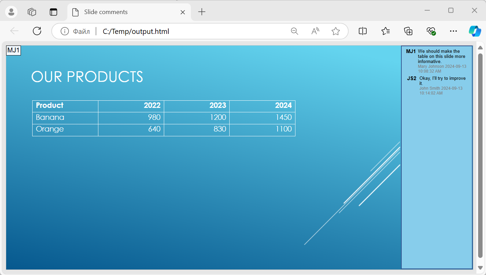

## **Ikhtisar**

Artikel ini menjelaskan cara mengonversi presentasi PowerPoint ke HTML5 menggunakan Aspose.Slides. Artikel ini mencakup ekspor HTML5 dasar tanpa ekstensi web atau ketergantungan tambahan, serta opsi untuk mengontrol animasi bentuk dan transisi slide. Artikel ini juga menunjukkan proses ekspor standar dari PowerPoint ke HTML, menjelaskan cara menghasilkan output HTML5 dalam mode tampilan slide, dan mendemonstrasikan cara menyertakan komentar dalam dokumen yang diekspor dengan mengonfigurasi tata letaknya.

## **Ekspor PowerPoint ke HTML5**

Kode C# ini menunjukkan cara mengekspor presentasi ke HTML5 tanpa ekstensi web dan ketergantungan:

```c#
using (Presentation pres = new Presentation("pres.pptx"))
{
   pres.Save("pres.html", SaveFormat.Html5);
}
```

{} 
Dalam kasus ini, Anda mendapatkan HTML yang bersih. 
{}

Anda mungkin ingin menentukan pengaturan untuk animasi bentuk dan transisi slide dengan cara berikut:

```c#
using (Presentation pres = new Presentation("pres.pptx"))
{
   pres.Save("pres5.html", SaveFormat.Html5, new Html5Options
   {
       AnimateShapes = false,
       AnimateTransitions = false
   });
}
```

## **Ekspor PowerPoint ke HTML**

Kode C# ini memperlihatkan proses standar dari PowerPoint ke HTML:

```c#
using (Presentation pres = new Presentation("pres.pptx"))
{
   pres.Save("pres.html", SaveFormat.Html);
}
```

Dalam kasus ini, konten presentasi dirender melalui SVG dalam bentuk seperti ini:

```html
<body>
<div class="slide" name="slide" id="slideslideIface1">
     <svg version="1.1">
         <g> THE SLIDE CONTENT GOES HERE </g>
     </svg>
</div>
</body>
```

{} 
Saat Anda menggunakan metode ini untuk mengekspor PowerPoint ke HTML, karena rendering SVG, Anda tidak dapat menerapkan gaya atau menganimasikan elemen tertentu. 
{}

## **Ekspor PowerPoint ke Tampilan Slide HTML5**

**Aspose.Slides** memungkinkan Anda mengonversi presentasi PowerPoint ke dokumen HTML5 di mana slide disajikan dalam mode tampilan slide. Dalam hal ini, ketika Anda membuka file HTML5 hasil di peramban, Anda akan melihat presentasi dalam mode tampilan slide pada halaman web. 

Kode C# ini memperlihatkan proses ekspor PowerPoint ke Tampilan Slide HTML5:

```c#
using (Presentation pres = new Presentation("pres.pptx"))
{
   pres.Save("HTML5-slide-view.html", SaveFormat.Html5, new Html5Options
   {
       AnimateShapes = true,
       AnimateTransitions = true
   });
}
```

## **Mengonversi Presentasi ke Dokumen HTML5 dengan Komentar**

Komentar di PowerPoint adalah alat yang memungkinkan pengguna meninggalkan catatan atau umpan balik pada slide presentasi. Mereka sangat berguna dalam proyek kolaboratif, di mana banyak orang dapat menambahkan saran atau catatan pada elemen slide tertentu tanpa mengubah konten utama. Setiap komentar menampilkan nama penulis, sehingga mudah melacak siapa yang memberikan catatan.

Misalkan kita memiliki presentasi PowerPoint berikut yang disimpan dalam file "sample.pptx".


Saat Anda mengonversi presentasi PowerPoint ke dokumen HTML5, Anda dapat dengan mudah menentukan apakah akan menyertakan komentar dari presentasi dalam dokumen output. Untuk melakukannya, Anda perlu menentukan parameter tampilan untuk komentar pada properti `NotesCommentsLayouting` dari kelas [Html5Options](https://reference.aspose.com/slides/id/net/aspose.slides.export/html5options/).

Contoh kode berikut mengonversi presentasi ke dokumen HTML5 dengan komentar yang ditampilkan di sebelah kanan slide.

```cs
var html5Options = new Html5Options
{
    NotesCommentsLayouting =
    {
        CommentsPosition = CommentsPositions.Right
    }
};

using var presentation = new Presentation("sample.pptx");
presentation.Save("output.html", SaveFormat.Html5, html5Options);
```

Dokumen "output.html" ditampilkan pada gambar di bawah ini.



## **FAQ**

**Apakah saya dapat mengontrol apakah animasi objek dan transisi slide akan diputar di HTML5?**

Ya, HTML5 menyediakan opsi terpisah untuk mengaktifkan atau menonaktifkan [shape animations](https://reference.aspose.com/slides/id/net/aspose.slides.export/html5options/animateshapes/) dan [slide transitions](https://reference.aspose.com/slides/id/net/aspose.slides.export/html5options/animatetransitions/).

**Apakah output komentar didukung, dan di mana komentar dapat ditempatkan relatif terhadap slide?**

Ya, komentar dapat ditambahkan dalam HTML5 dan diposisikan (misalnya, di sebelah kanan slide) melalui [layout settings](https://reference.aspose.com/slides/id/net/aspose.slides.export/html5options/notescommentslayouting/) untuk catatan dan komentar.

**Apakah saya dapat melewatkan tautan yang memanggil JavaScript demi keamanan atau alasan CSP?**

Ya, ada [setting](https://reference.aspose.com/slides/id/net/aspose.slides.export/saveoptions/skipjavascriptlinks/) yang memungkinkan Anda melewatkan hyperlink dengan panggilan JavaScript saat menyimpan. Ini membantu mematuhi kebijakan keamanan yang ketat.