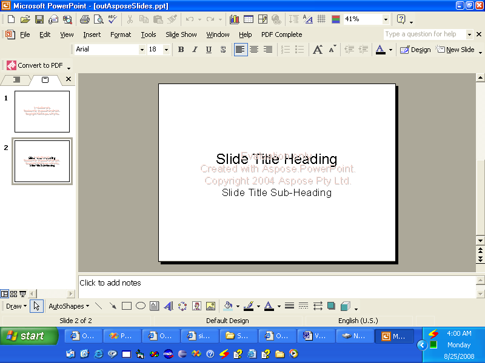

{} 

VSTO dikembangkan untuk memungkinkan pengembang membuat aplikasi yang dapat berjalan di dalam Microsoft Office. VSTO berbasis COM tetapi dibungkus dalam objek .NET sehingga dapat digunakan dalam aplikasi .NET. VSTO memerlukan dukungan .NET Framework serta runtime berbasis CLR Microsoft Office. Meskipun dapat digunakan untuk membuat add‑in Microsoft Office, hampir tidak mungkin menggunakannya sebagai komponen sisi server. Itu juga memiliki masalah penyebaran yang serius.

Aspose.Slides for .NET adalah komponen yang dapat digunakan untuk memanipulasi presentasi Microsoft PowerPoint, sama seperti VSTO, namun memiliki beberapa keunggulan:

- Aspose.Slides hanya berisi kode yang dikelola dan tidak memerlukan runtime Microsoft Office untuk diinstal.
- Ini dapat digunakan sebagai komponen sisi klien atau sebagai komponen sisi server.
- Penyebaran mudah karena Aspose.Slides terkandung dalam satu file DLL.

{} 
## **Membuat Presentasi**
Di bawah ini ada dua contoh kode yang menggambarkan bagaimana VSTO dan Aspose.Slides for .NET dapat digunakan untuk mencapai tujuan yang sama. Contoh pertama adalah [VSTO](/slides/id/net/create-a-new-presentation/); [contoh kedua](/slides/id/net/create-a-new-presentation/) menggunakan Aspose.Slides.
### **Contoh VSTO**
**Output VSTO** 


```c#
//Catatan: PowerPoint adalah namespace yang telah didefinisikan di atas seperti ini
//using PowerPoint = Microsoft.Office.Interop.PowerPoint;

//Buat presentasi
PowerPoint.Presentation pres = Globals.ThisAddIn.Application
	.Presentations.Add(Microsoft.Office.Core.MsoTriState.msoFalse);

//Dapatkan tata letak slide judul
PowerPoint.CustomLayout layout = pres.SlideMaster.
	CustomLayouts[PowerPoint.PpSlideLayout.ppLayoutTitle];

//Tambahkan slide judul.
PowerPoint.Slide slide = pres.Slides.AddSlide(1, layout);

//Atur teks judul
slide.Shapes.Title.TextFrame.TextRange.Text = "Slide Title Heading";

//Atur teks sub judul
slide.Shapes[2].TextFrame.TextRange.Text = "Slide Title Sub-Heading";

//Tulis output ke disk
pres.SaveAs("c:\\outVSTO.ppt",
	PowerPoint.PpSaveAsFileType.ppSaveAsPresentation,
	Microsoft.Office.Core.MsoTriState.msoFalse);
```


### **Contoh Aspose.Slides for .NET**
**Output dari Aspose.Slides** 




```c#
using Aspose.Slides;
using Aspose.Slides.Export;

//Buat presentasi
Presentation pres = new Presentation();

//Tambahkan slide judul
ISlide slide = pres.Slides.AddEmptySlide(pres.LayoutSlides[0]);


//Atur teks judul
((IAutoShape)slide.Shapes[0]).TextFrame.Text = "Slide Title Heading";

//Atur teks sub judul
((IAutoShape)slide.Shapes[1]).TextFrame.Text = "Slide Title Sub-Heading";

//Tulis output ke disk
pres.Save("outAsposeSlides.pptx", SaveFormat.Ppt);
```