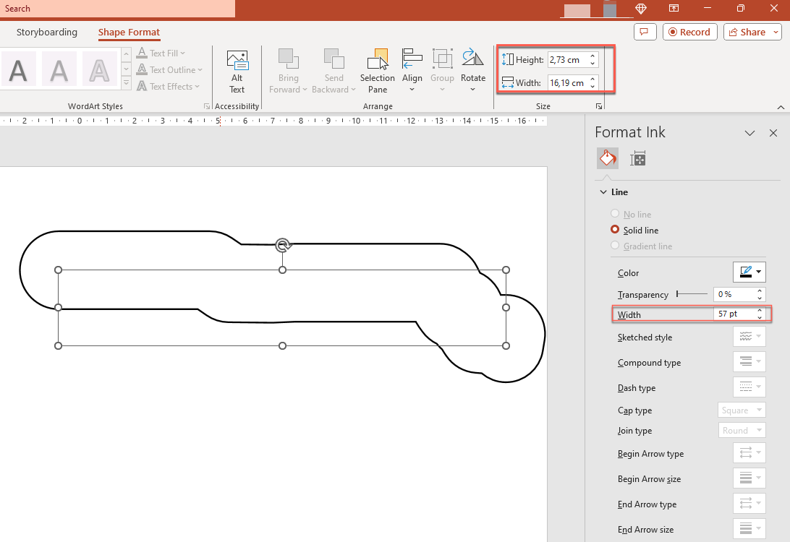

## **Pendahuluan**

PowerPoint menyediakan fungsi tinta yang memungkinkan Anda menggambar bentuk non‑standar, yang dapat digunakan untuk menyorot objek lain, menunjukkan koneksi dan proses, serta menarik perhatian ke item tertentu pada slide.

Aspose.Slides menyediakan antarmuka [Aspose.Slides.Ink](https://reference.aspose.com/slides/id/net/aspose.slides.ink/) yang berisi tipe‑tipe yang Anda perlukan untuk membuat dan mengelola objek tinta.

## **Perbedaan antara Objek Biasa dan Objek Tinta**

Objek pada slide PowerPoint biasanya direpresentasikan oleh objek shape. Sebuah objek shape, dalam bentuk paling sederhana, adalah wadah yang mendefinisikan area objek itu sendiri (bingkainya) beserta propertinya. Properti tersebut mencakup ukuran area wadah, bentuk wadah, latar belakang wadah, dll. Untuk informasi lebih lanjut, lihat [Shape Layout Format](https://docs.aspose.com/slides/id/net/shape-manipulations/#access-layout-formats-for-shape).

Namun, ketika PowerPoint menangani objek tinta, ia mengabaikan semua properti bingkai objek (wadah) kecuali ukurannya. Ukuran area wadah ditentukan oleh nilai standar `width` dan `height`:


## **Jejak Inkshape**

Jejak adalah elemen dasar atau standar yang digunakan untuk merekam lintasan pena saat pengguna menulis tinta digital. Jejak adalah rekaman yang menggambarkan urutan titik‑titik yang terhubung.

Bentuk enkoding paling sederhana menentukan koordinat X dan Y setiap titik sampel. Ketika semua titik yang terhubung dirender, mereka menghasilkan gambar seperti ini:


## **Properti Kuas untuk Menggambar**

Anda dapat menggunakan kuas untuk menggambar garis yang menghubungkan titik‑titik elemen jejak. Kuas memiliki warna dan ukuran sendiri, yang sesuai dengan properti `Brush.Color` dan `Brush.Size`.

### **Atur Warna Kuas Tinta**

Kode C# berikut memperlihatkan cara mengatur warna untuk sebuah kuas:

```c#
using (Presentation pres = new Presentation("pres.pptx"))
{
    IInk ink = (IInk)pres.Slides[0].Shapes[0];
    IInkTrace[] traces = ink.Traces;
    IInkBrush brush = traces[0].Brush;
    Color brushColor = brush.Color;
    brush.Color = Color.Red;
}
```

### **Atur Ukuran Kuas Tinta**

Kode C# berikut memperlihatkan cara mengatur ukuran untuk sebuah kuas:

```c#
using (Presentation pres = new Presentation("pres.pptx"))
{
    IInk ink = (IInk)pres.Slides[0].Shapes[0];
    IInkTrace[] traces = ink.Traces;
    IInkBrush brush = traces[0].Brush;
    SizeF brushSize = brush.Size;
    brush.Size = new SizeF(5f, 10f);
}
```

Secara umum, lebar dan tinggi kuas tidak sama, sehingga PowerPoint tidak menampilkan ukuran kuas (bagian data berwarna abu‑abu). Namun ketika lebar dan tinggi kuas cocok, PowerPoint menampilkan ukurannya seperti ini:


Untuk kejelasan, mari tingkatkan tinggi objek tinta dan tinjau dimensi penting:


Wadah (bingkai) tidak memperhitungkan ukuran kuas—ia selalu mengasumsikan ketebalan garis nol (lihat gambar terakhir).

Oleh karena itu, untuk menentukan area yang terlihat dari seluruh objek tinta, kita harus mempertimbangkan ukuran kuas pada objek jejak. Di sini, objek target (jejak teks tulisan tangan) telah diskalakan ke ukuran wadah (bingkai). Ketika ukuran wadah (bingkai) berubah, ukuran kuas tetap konstan dan sebaliknya.



PowerPoint menunjukkan perilaku yang sama saat menangani teks:


**Bacaan lebih lanjut**

* Untuk membaca tentang shape secara umum, lihat bagian [PowerPoint Shapes](https://docs.aspose.com/slides/id/net/powerpoint-shapes/). 
* Untuk informasi lebih lanjut tentang nilai efektif, lihat [Shape Effective Properties](https://docs.aspose.com/slides/id/net/shape-effective-properties/#get-effective-font-height-value).