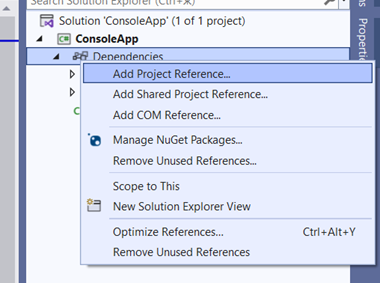

## **Gambaran Umum**

Artikel ini menjelaskan cara menggunakan Aspose.Slides untuk .NET 6 Cross-Platform dari paket ZIP. Artikel ini menjelaskan cara mengunduh paket, mengekstrak file dari folder `net6.0/crossplatform`, menambahkan referensi ke `Aspose.Slides.dll`, dan mengonfigurasi file proyek sehingga pustaka dependensi yang diperlukan disalin ke direktori output aplikasi.

Artikel ini juga menjelaskan isi paket cross-platform, termasuk assembly .NET utama Aspose.Slides dan pustaka subsystem grafik spesifik platform untuk Windows, Linux, dan macOS.

{}
Aspose.Slides untuk .NET 6 Cross-Platform juga tersedia di [NuGet](https://www.nuget.org/packages/Aspose.Slides.NET6.CrossPlatform).
{}

## **Menggunakan Aspose.Slides Cross-Platform dari Paket ZIP**

1. Unduh paket ZIP Aspose.Slides terbaru dari [Halaman Rilis](https://releases.aspose.com/slides/id/net/).

2. Ekstrak file dari *Aspose.Slides.zip\Aspose.Slides\net6.0\crossplatform* dan letakkan di folder yang akan digunakan untuk dependensi dalam proyek Anda.

3. Tambahkan referensi ke Aspose.Slides.dll.

   

   Pada contoh kami (di bawah), pustaka berada di folder proyek dengan jalur berikut: *ConsoleApp\libs\Aspose.Slides\net6.0\crossplatform\...*

   

4. Tempatkan file sisa (yang menjadi dependensi Aspose.Slides) di direktori output dengan menambahkan instruksi ke file proyek csproj dengan cara berikut:

```xml
<ItemGroup>

   <None Update="libs\Aspose.Slides\net6.0\crossplatform\aspose.slides.drawing.capi_vc14x64.dll">
         <CopyToOutputDirectory>PreserveNewest</CopyToOutputDirectory>
         <TargetPath>aspose.slides.drawing.capi_vc14x64.dll</TargetPath>
   </None>

   <None Update="libs\Aspose.Slides\net6.0\crossplatform\aspose.slides.drawing.capi_vc14x86.dll">
         <CopyToOutputDirectory>PreserveNewest</CopyToOutputDirectory>
         <TargetPath>aspose.slides.drawing.capi_vc14x86.dll</TargetPath>
   </None>

   <None Update="libs\Aspose.Slides\net6.0\crossplatform\Aspose.Slides.xml">
         <CopyToOutputDirectory>PreserveNewest</CopyToOutputDirectory>
         <TargetPath>Aspose.Slides.xml</TargetPath>
   </None>

   <None Update="libs\Aspose.Slides\net6.0\crossplatform\libaspose.slides.drawing.capi_appleclang_x86_64.dylib">
         <CopyToOutputDirectory>PreserveNewest</CopyToOutputDirectory>
         <TargetPath>libaspose.slides.drawing.capi_appleclang_x86_64.dylib</TargetPath>
   </None>

   <None Update="libs\Aspose.Slides\net6.0\crossplatform\libaspose.slides.drawing.capi_appleclang_arm64.dylib">
         <CopyToOutputDirectory>PreserveNewest</CopyToOutputDirectory>
         <TargetPath>libaspose.slides.drawing.capi_appleclang_arm64.dylib</TargetPath>
   </None>

   <None Update="libs\Aspose.Slides\net6.0\crossplatform\libaspose.slides.drawing.capi_x86_64_libstdcpp_libc2.23.so">
         <CopyToOutputDirectory>PreserveNewest</CopyToOutputDirectory>
         <TargetPath>libaspose.slides.drawing.capi_x86_64_libstdcpp_libc2.23.so</TargetPath>
   </None>

</ItemGroup>
```

5. Perhatikan `TargetPath`.

   Secara default, `<CopyToOutputDirectory>` menyalin file sambil mempertahankan jalur relatifnya, tetapi kita memerlukan pustaka dependensi agar ditempatkan di folder yang sama dengan output yang dihasilkan (lokasi Aspose.Slides.dll).

## **Catatan**

### **Subsystem Grafik Proprietari**

Aspose.Slides cross-platform adalah kumpulan pustaka:

| Aspose.Slides.dll                                          | Assembly .NET Utama yang Bertanggung Jawab untuk Semua Logika Aspose.Slides |
| ---------------------------------------------------------- | --------------------------------------------------------------------------- |
| aspose.slides.drawing.capi_vc14x64.dll                     | Dependensi: implementasi subsystem grafik untuk Win x64                    |
| aspose.slides.drawing.capi_vc14x86.dll                     | Dependensi: implementasi subsystem grafik untuk Win x86                    |
| libaspose.slides.drawing.capi_x86_64_libstdcpp_libc2.23.so | Dependensi: implementasi subsystem grafik untuk Linux (x86/x64)            |
| libaspose.slides.drawing.capi_appleclang_x86_64.dylib      | Dependensi: implementasi subsystem grafik untuk macOS AMD64 (x86-64/x64)   |
| libaspose.slides.drawing.capi_appleclang_arm64.dylib       | Dependensi: implementasi subsystem grafik untuk macOS ARM64 (AArch64)      |

Aspose.Slides.dll menggunakan pustaka yang dibutuhkan oleh sistem tempat ia dijalankan. Pustaka-pustaka biasanya berada di lokasi yang sama dengan Aspose.Slides.dll pada sistem file manapun.

### **Struktur Paket ZIP**

Paket ZIP berisi struktur folder berikut:

  Aspose.Slides

  ├─── net6.0

  │  ├─── crossplatform

  │  └─── default

  ├─── net20

  ├─── net462

  └─── netstandard2.0

* Setiap folder berisi assembly untuk versi .NET yang bersesuaian. Terdapat dua versi untuk net6.0: default dan crossplatform. Yang terakhir berisi Aspose.Slides.dll cross-platform dan semua dependensinya. Isi yang sudah diekstrak dari folder ini dapat digunakan sebagai penambahan dependensi dalam proyek untuk pengembangan cross-platform dan contoh penggunaan Aspose.Slides lainnya.

## **Lihat Juga**

- [Persyaratan Sistem](/slides/id/net/system-requirements/)