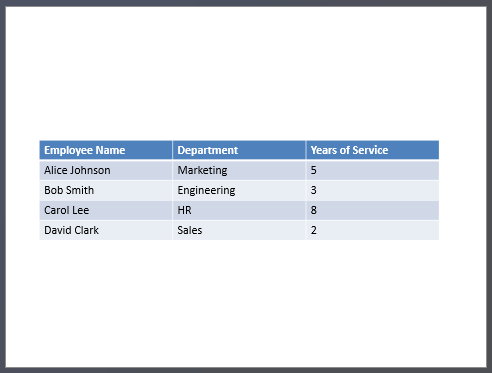

## **Pendahuluan**

Presentasi PowerPoint adalah cara yang kuat untuk menampilkan dan menyampaikan informasi. Mereka sering digunakan bersama buku kerja Excel, di mana Excel berfungsi sebagai sumber data terstruktur yang sangat baik dan PowerPoint unggul dalam memvisualisasikan data tersebut untuk audiens.

Ada banyak skenario praktis di mana menggabungkan Excel dan PowerPoint menjadi penting: mail merge, mengisi tabel data, menghasilkan satu slide per catatan data (pembuatan slide batch), membuat materi pelatihan, dan mengkonsolidasikan beberapa laporan Excel menjadi satu presentasi, dan sebagainya.

Sebelumnya, mengimplementasikan fitur-fitur tersebut dengan API Aspose.Slides memerlukan ketergantungan pada solusi pihak ketiga seperti Aspose.Cells. Meskipun alat‑alat ini kuat, mereka dapat menjadi terlalu kompleks dan mahal bagi pengguna yang hanya membutuhkan fungsionalitas integrasi data dasar.

## **Cara Kerjanya**

Agar bekerja dengan data Excel lebih mudah dan lebih terstruktur, Aspose.Slides telah memperkenalkan kelas baru untuk membaca data dari buku kerja Excel dan mengimpor konten ke dalam presentasi. Fitur ini membuka kemungkinan baru yang kuat bagi pengguna API yang ingin memanfaatkan Excel sebagai sumber data dalam alur kerja presentasi mereka.

Fungsionalitas baru ini dirancang untuk akses data umum dan tidak terintegrasi ke dalam Presentation Document Object Model (DOM). Artinya *tidak memungkinkan pengeditan atau penyimpanan file Excel* — tujuan utamanya hanyalah membuka buku kerja dan menelusuri isinya untuk mengambil data sel.

Inti dari fitur ini adalah kelas baru [ExcelDataWorkbook](https://reference.aspose.com/slides/id/net/aspose.slides.excel/exceldataworkbook/). Kelas ini memungkinkan Anda memuat sebuah buku kerja Excel dari file lokal atau stream. Setelah dimuat, kelas ini menyediakan beberapa overload dari metode [GetCell](https://reference.aspose.com/slides/id/net/aspose.slides.excel/exceldataworkbook/getcell/), yang dapat Anda gunakan untuk mengambil sel tertentu berdasarkan posisinya (misalnya indeks baris dan kolom atau rentang bernama).

Setiap pemanggilan [GetCell](https://reference.aspose.com/slides/id/net/aspose.slides.excel/exceldataworkbook/getcell/) mengembalikan sebuah instance dari kelas [ExcelDataCell](https://reference.aspose.com/slides/id/net/aspose.slides.excel/exceldatacell/). Objek ini mewakili satu sel dalam buku kerja Excel dan memberi Anda akses ke nilainya secara sederhana dan intuitif.

#### **Mengimpor Diagram Excel**

Langkah selanjutnya untuk memperluas fungsionalitas adalah kelas [ExcelWorkbookImporter](https://reference.aspose.com/slides/id/net/aspose.slides.import/excelworkbookimporter/). Kelas utilitas ini menyediakan fungsi untuk mengimpor konten dari sebuah buku kerja Excel ke dalam presentasi. Kelas ini berisi beberapa overload dari metode [AddChartFromWorkbook](https://reference.aspose.com/slides/id/net/aspose.slides.import/excelworkbookimporter/addchartfromworkbook/), yang membantu Anda mengambil diagram yang dipilih dari buku kerja Excel yang ditentukan dan menambahkannya ke akhir koleksi shape yang diberikan pada koordinat yang ditentukan.

#### **Mengimpor Tabel Excel**

Kelas [ExcelWorkbookImporter](https://reference.aspose.com/slides/id/net/aspose.slides.import/excelworkbookimporter/) juga berisi beberapa overload dari metode [AddTableFromWorkbook](https://reference.aspose.com/slides/id/net/aspose.slides.import/excelworkbookimporter/addtablefromworkbook/). Metode‑metode ini memungkinkan Anda mengimpor rentang sel yang ditentukan dari lembar kerja yang ditentukan dan menambahkannya sebagai tabel ke akhir koleksi shape yang diberikan pada koordinat yang ditentukan.

Singkatnya, ini adalah API yang ringan dan sederhana untuk membaca data Excel — tepat apa yang dibutuhkan banyak pengembang tanpa beban dari perpustakaan pemrosesan spreadsheet lengkap.

## **Mari Kita Kode**

### **Contoh Skenario Mail Merge**

Pada contoh berikut, kita akan mengimplementasikan skenario Mail Merge sederhana dengan menghasilkan beberapa presentasi berdasarkan data yang disimpan dalam sebuah buku kerja Excel.

Untuk memulai, kita membutuhkan dua hal:
1. Sebuah buku kerja Excel yang berisi data


2. Template presentasi PowerPoint


```csharp
// Muat buku kerja Excel dengan data karyawan.
ExcelDataWorkbook workbook = new ExcelDataWorkbook("TemplateData.xlsx");
int worksheetIndex = 0;

// Muat templat presentasi.
using Presentation templatePresentation = new Presentation("PresentationTemplate.pptx");

// Iterasi baris Excel (kecuali header pada baris 0).
for (int rowIndex = 1; rowIndex <= 4; rowIndex++)
{
    // Buat presentasi baru untuk setiap catatan karyawan.
    using Presentation employeePresentation = new Presentation();

    // Hapus slide kosong default.
    employeePresentation.Slides.RemoveAt(0);

    // Gandakan slide templat ke dalam presentasi baru.
    ISlide slide = employeePresentation.Slides.AddClone(templatePresentation.Slides[0]);

    // Dapatkan paragraf dari shape target (asumsikan indeks shape 1 digunakan).
    IParagraphCollection paragraphs = (slide.Shapes[1] as IAutoShape).TextFrame.Paragraphs;

    // Ganti placeholder dengan data dari Excel.
    string employeeName = workbook.GetCell(worksheetIndex, rowIndex, 0).Value.ToString();
    IPortion namePortion = paragraphs[0].Portions[0];
    namePortion.Text = namePortion.Text.Replace("{{EmployeeName}}", employeeName);

    string department = workbook.GetCell(worksheetIndex, rowIndex, 1).Value.ToString();
    IPortion departmentPortion = paragraphs[1].Portions[0];
    departmentPortion.Text = departmentPortion.Text.Replace("{{Department}}", department);

    string yearsOfService = workbook.GetCell(worksheetIndex, rowIndex, 2).Value.ToString();
    IPortion yearsPortion = paragraphs[2].Portions[0];
    yearsPortion.Text = yearsPortion.Text.Replace("{{YearsOfService}}", yearsOfService);

    // Simpan presentasi yang dipersonalisasi ke file terpisah.
    employeePresentation.Save($"{employeeName} Report.pptx", SaveFormat.Pptx);
}
```


### **Contoh Tabel Excel**

Pada contoh kedua, kita cukup menyalin data dari sebuah tabel Excel dan menampilkannya di slide PowerPoint dengan format yang lebih menarik secara visual.

Dalam contoh ini, kita menggunakan kembali buku kerja Excel yang sama dari contoh pertama, yang berisi tabel karyawan sederhana.

```csharp
// Muat buku kerja Excel yang berisi data karyawan.
ExcelDataWorkbook workbook = new ExcelDataWorkbook("TemplateData.xlsx");
int worksheetIndex = 0;

// Buat presentasi PowerPoint baru.
using Presentation presentation = new Presentation();

// Tambahkan bentuk tabel ke slide pertama.
ITable table = presentation.Slides[0].Shapes.AddTable(
    50, 200,
    new double[] { 200, 200, 200 },
    new double[] { 30, 30, 30, 30, 30 }
);

// Isi tabel PowerPoint dengan data dari buku kerja Excel.
for (int rowIndex = 0; rowIndex < 5; rowIndex++)
{
    for (int columnIndex = 0; columnIndex < 3; columnIndex++)
    {
        string cellValue = workbook.GetCell(worksheetIndex, rowIndex, columnIndex).Value.ToString();
        table[columnIndex, rowIndex].TextFrame.Text = cellValue;
    }
}

// Simpan presentasi hasil ke file.
presentation.Save("Table.pptx", SaveFormat.Pptx);
```



### **Contoh Mengimpor Diagram Excel**

Pada contoh ini, kita mengimpor sebuah diagram dari lembar kerja pertama buku kerja Excel yang digunakan pada contoh sebelumnya. Diagram tersebut akan ditautkan ke buku kerja eksternal dalam presentasi yang dihasilkan.

Pertama, kita menambahkan diagram Pie ke buku kerja Excel berdasarkan tabel karyawan.


```csharp
// Buat presentasi PowerPoint baru.
using Presentation presentation = new Presentation();

// Dapatkan koleksi shape slide pertama.
IShapeCollection shapes = presentation.Slides[0].Shapes;

// Impor diagram bernama "Chart 1" dari lembar pertama buku kerja dan tambahkan ke koleksi shape.
ExcelWorkbookImporter.AddChartFromWorkbook(shapes, 10, 10, "TemplateData.xlsx", "Sheet1", "Chart 1", false);

// Simpan presentasi hasil ke file.
presentation.Save("Chart.pptx", SaveFormat.Pptx);
```


### **Contoh Mengimpor Semua Diagram Excel**

Bayangkan Anda memiliki sebuah buku kerja Excel yang penuh dengan diagram dan Anda perlu mengimpor semuanya ke dalam sebuah presentasi. Setiap diagram harus ditempatkan pada slide baru.

Kode berikut menelusuri semua lembar kerja dalam file Excel sumber, mengekstrak diagram dari tiap lembar kerja, dan menambahkan masing‑masing diagram ke slide terpisah menggunakan tata letak slide kosong. Dalam presentasi yang dihasilkan, hanya data diagram yang akan disematkan, bukan seluruh buku kerja.

```csharp
// Muat buku kerja Excel yang berisi data karyawan.
ExcelDataWorkbook workbook = new ExcelDataWorkbook("ExcelWithCharts.xlsx");

// Buat presentasi PowerPoint baru.
using Presentation presentation = new Presentation();

// Dapatkan tata letak slide kosong.
ILayoutSlide blankLayout = presentation.LayoutSlides.GetByType(SlideLayoutType.Blank);

// Dapatkan nama semua lembar kerja yang terdapat dalam buku kerja Excel.
IList<string> worksheetNames = workbook.GetWorksheetNames();

foreach (var name in worksheetNames)
{
    // Dapatkan kamus yang memetakan indeks diagram ke nama diagram untuk lembar kerja.
    IDictionary<int, string> worksheetCharts = workbook.GetChartsFromWorksheet(name);
    foreach (var chart in worksheetCharts)
    {
        // Tambahkan slide baru menggunakan tata letak kosong.
        ISlide slide = presentation.Slides.AddEmptySlide(blankLayout);

        // Impor diagram yang ditentukan dari buku kerja Excel ke dalam koleksi shape slide.
        ExcelWorkbookImporter.AddChartFromWorkbook(slide.Shapes, 10, 10, workbook, name, chart.Key, false);
    }
}

// Simpan presentasi hasil ke file.
presentation.Save("Charts.pptx", SaveFormat.Pptx);
```

### **Contoh Mengimpor Tabel Excel**

Pada contoh ini, kita mengimpor sebuah tabel yang diformat dari lembar kerja Excel langsung ke dalam presentasi PowerPoint.

Lembar kerja Excel sumber berisi tabel terformat dengan data karyawan:


```csharp
// Buat presentasi PowerPoint baru.
using Presentation presentation = new Presentation();

// Dapatkan koleksi shape slide pertama.
IShapeCollection shapes = presentation.Slides[0].Shapes;

// Impor tabel dari lembar pertama buku kerja dan tambahkan ke koleksi shape.
ExcelWorkbookImporter.AddTableFromWorkbook(shapes, 10, 10, "TemplateData.xlsx", "Sheet1", "A1:C5");

// Simpan presentasi hasil ke file.
presentation.Save("FormattedTable.pptx", SaveFormat.Pptx);
```


## **Ringkasan**

Mekanisme ini, yang tersedia langsung di Aspose.Slides, menggabungkan kerja dengan data Excel dan presentasi dalam satu tempat. Ini memungkinkan Anda membuat slide dengan diagram visual dan data yang disajikan sebagai tabel Excel — tanpa perpustakaan tambahan atau integrasi yang rumit.