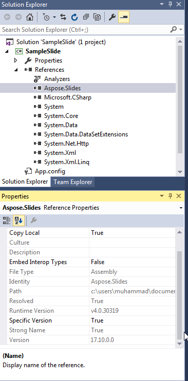

## **Gambaran Umum**

Artikel ini menjelaskan cara menginstal Aspose.Slides untuk .NET pada Windows, Linux, dan macOS. Fokusnya adalah instalasi berbasis NuGet dan menunjukkan cara menambahkan pustaka melalui NuGet Package Manager atau Package Manager Console pada Windows, ke proyek .NET pada Linux, dan ke proyek Visual Studio pada macOS. Artikel ini juga menjelaskan cara memperbarui paket dan menginstal build pra‑rilis bila diperlukan.

Sebelum menginstal, tinjau sistem operasi yang didukung, implementasi .NET, dan ketergantungan tambahan dalam [System Requirements](/slides/id/net/system-requirements/).

## **Windows**
NuGet menyediakan cara termudah untuk mengunduh dan menginstal API Aspose untuk .NET di PC.

### **Metode 1: Instal atau Perbarui Aspose.Slides dari NuGet Package Manager**

1. Buka Microsoft Visual Studio.  
2. Buat aplikasi konsol sederhana atau buka proyek yang sudah ada.  
3. Pilih **Tools** > **NuGet package manager**.  
4. Di tab **Browse**, cari *Aspose Slides* pada kolom teks.  
{}
5. Klik **Aspose.Slides.NET** lalu klik **Install**.  
   * Jika Anda ingin memperbarui Aspose.Slides—dengan asumsi paket sudah diinstal—klik **Update** sebagai gantinya.  

API yang dipilih akan diunduh dan direferensikan dalam proyek Anda.

### **Metode 2: Instal atau Perbarui Aspose.Slides Melalui Package Manager Console**

Berikut cara mereferensikan [Aspose.Slides API](https://www.nuget.org/packages/Aspose.Slides.NET/) lewat console paket manager:

1. Buka Microsoft Visual Studio.  
2. Buat aplikasi konsol sederhana atau buka proyek yang sudah ada.  
3. Pilih **Tools** > **Library Package Manager** > **Package Manager Console**.  

4. Jalankan perintah ini: `Install-Package Aspose.Slides.NET`  

Rilis penuh terbaru akan diinstal ke aplikasi Anda.  

* Sebagai alternatif, Anda dapat menambahkan akhiran `-prerelease` pada perintah untuk memastikan rilis terbaru (termasuk hotfix) juga diinstal.

Tip **Installing Aspose.Slides.NET** muncul di bagian bawah jendela.  

Setelah unduhan selesai, Anda akan melihat beberapa pesan konfirmasi.

Jika Anda belum familiar dengan [Aspose EULA](https://about.aspose.com/legal/eula), sebaiknya baca lisensi yang tercantum pada URL tersebut.  

Di aplikasi Anda, seharusnya terlihat bahwa Aspose.Slides telah berhasil ditambahkan dan direferensikan.  

Di Package Manager Console, Anda dapat menjalankan perintah `Update-Package Aspose.Slides.NET` untuk memeriksa pembaruan paket Aspose.Slides. Pembaruan (jika ada) akan diinstal secara otomatis. Anda juga dapat menggunakan akhiran `-prerelease` untuk memperbarui ke rilis terbaru.

#### **Pertimbangan Saat Berjalan di Lingkungan Server Bersama**
Kami sangat menyarankan agar semua komponen Aspose .NET dijalankan dengan set izin **Full Trust** karena komponen Aspose kadang‑kadang perlu mengakses pengaturan registry dan file yang berada di luar direktori virtual — misalnya saat komponen Aspose harus membaca font.

Selain itu, komponen Aspose.NET dibangun di atas kelas inti sistem .NET — dan beberapa kelas tersebut juga memerlukan izin **Full Trust** untuk operasi tertentu.

Penyedia Layanan Internet (ISP) yang menampung banyak aplikasi dari berbagai perusahaan biasanya menerapkan tingkat keamanan Medium Trust. Pada .NET 2.0, tingkat keamanan ini dapat menyebabkan batasan yang memengaruhi operasi Aspose.Slides:

- **RegistryPermission** tidak tersedia. Artinya Anda tidak dapat mengakses registry, yang diperlukan untuk mengenumerasi font yang terpasang saat merender dokumen.
- **FileIOPermission** dibatasi. Artinya Anda hanya dapat mengakses file dalam hierarki direktori virtual aplikasi Anda. Ini juga berpotensi menyebabkan font tidak dapat dibaca selama operasi ekspor.

Untuk alasan di atas, kami sangat menyarankan menjalankan Aspose.Slides dengan izin **Full Trust**. Jika Anda menggunakan **Medium trust**, Anda mungkin akan mengalami inkonsistensi — beberapa fitur pustaka (misalnya rendering) mungkin tidak berfungsi saat melakukan tugas tertentu.

## **Linux**

NuGet menyediakan cara termudah untuk mengunduh dan menginstal Aspose.Slides untuk .NET di Linux. Tambahkan paket [Aspose.Slides.NET](https://www.nuget.org/packages/Aspose.Slides.NET/) ke proyek .NET Anda.

## **macOS**

NuGet menyediakan cara termudah untuk mengunduh dan menginstal Aspose.Slides untuk .NET di komputer Mac.

### **Instal Aspose.Slides**

1. Buka Visual Studio.  
2. Buat aplikasi konsol sederhana atau buka proyek yang sudah ada.  
3. Pilih **Project** > **Manage NuGet Packages...**  
   
4. Ketik *Aspose.Slides* pada kolom teks.  
5. Klik **Aspose.Slides for .NET** lalu klik **Add Package**.  
6. Tambahkan cuplikan kode sederhana.  
   * Anda dapat menyalin kode pada [halaman ini](/slides/id/net/create-presentation/).  
7. Jalankan aplikasi.  
8. Buka *folder/bin/Debug/presentation_file_name* proyek Anda.

## **FAQ**

**Apakah ada versi gratis atau batasan percobaan?**

Ya, secara default Aspose.Slides berjalan dalam mode evaluasi, yang menambahkan watermark dan dapat memiliki batasan lain. Untuk menghapus pembatasan, Anda perlu menerapkan [lisensi](/slides/id/net/licensing/).