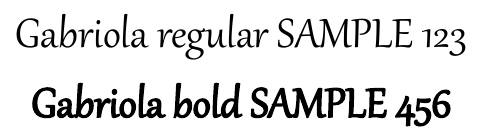

## **Ikhtisar**

Mengonversi presentasi PowerPoint dan OpenDocument (PPT, PPTX, ODP, dll.) ke format PDF dalam JavaScript menawarkan beberapa keuntungan, termasuk kompatibilitas di berbagai perangkat dan mempertahankan tata letak serta pemformatan presentasi Anda. Panduan ini menunjukkan cara mengonversi presentasi menjadi dokumen PDF, menggunakan berbagai opsi untuk mengontrol kualitas gambar, menyertakan slide tersembunyi, melindungi PDF dengan kata sandi, mendeteksi substitusi font, memilih slide tertentu untuk konversi, dan menerapkan standar kepatuhan pada dokumen keluaran.

## **Konversi PowerPoint ke PDF**

Menggunakan Aspose.Slides, Anda dapat mengonversi presentasi dalam format berikut ke PDF:

* **PPT**
* **PPTX**
* **ODP**

Untuk mengonversi sebuah presentasi ke PDF, berikan nama file sebagai argumen ke kelas [Presentation](https://reference.aspose.com/slides/nodejs-java/aspose.slides/presentation/) dan kemudian simpan presentasi sebagai PDF menggunakan metode [save](https://reference.aspose.com/slides/nodejs-java/aspose.slides/presentation/save/). Kelas [Presentation](https://reference.aspose.com/slides/nodejs-java/aspose.slides/presentation/) mengekspos metode [save](https://reference.aspose.com/slides/nodejs-java/aspose.slides/presentation/save/) yang biasanya digunakan untuk mengonversi sebuah presentasi ke PDF.

{}
Aspose.Slides for Node.js via Java memasukkan informasi API dan nomor versi ke dalam dokumen output. Misalnya, saat mengonversi sebuah presentasi ke PDF, Aspose.Slides mengisi bidang Application dengan "*Aspose.Slides*" dan bidang PDF Producer dengan nilai dalam format "*Aspose.Slides v XX.XX*". **Note** bahwa Anda tidak dapat menginstruksikan Aspose.Slides untuk mengubah atau menghapus informasi ini dari dokumen output.
{}

Aspose.Slides memungkinkan Anda mengonversi:

* Seluruh presentasi ke PDF
* Slide tertentu dari sebuah presentasi ke PDF

Aspose.Slides mengekspor presentasi ke PDF, memastikan PDF yang dihasilkan sangat mirip dengan presentasi asli. Elemen dan atribut dirender secara akurat dalam proses konversi, termasuk:

* Gambar
* Kotak teks dan bentuk
* Pemformatan teks
* Pemformatan paragraf
* Tautan hiperteks
* Header dan footer
* Bullet
* Tabel

## **Konversi PowerPoint ke PDF**

Proses konversi standar PowerPoint‑ke‑PDF menggunakan opsi default. Dalam hal ini, Aspose.Slides berusaha mengonversi presentasi yang diberikan ke PDF dengan pengaturan optimal pada tingkat kualitas maksimum.

Contoh berikut memuat sebuah presentasi dan menyimpan semua slide yang terlihat ke PDF menggunakan pengaturan ekspor default.

```js
var aspose = aspose || {};
aspose.slides = require("aspose.slides.via.java");

let presentation = new aspose.slides.Presentation("PowerPoint.ppt");
try {
    presentation.save("PPT-to-PDF.pdf", aspose.slides.SaveFormat.Pdf);
} finally {
    presentation.dispose();
}
```

{}
Aspose menawarkan konverter online gratis [**PowerPoint to PDF converter**](https://products.aspose.app/slides/conversion/ppt-to-pdf) yang memperlihatkan proses konversi presentasi ke PDF. Anda dapat menguji konverter ini untuk melihat implementasi langsung prosedur yang dijelaskan di sini.
{}

## **Konversi PowerPoint ke PDF dengan Opsi**

Aspose.Slides menyediakan opsi kustom—properti di bawah kelas [PdfOptions](https://reference.aspose.com/slides/nodejs-java/aspose.slides/pdfoptions/)—yang memungkinkan Anda menyesuaikan PDF yang dihasilkan, mengunci PDF dengan kata sandi, atau menentukan cara proses konversi dijalankan.

### **Konversi PowerPoint ke PDF dengan Opsi Kustom**

Dengan opsi konversi kustom, Anda dapat menentukan pengaturan kualitas yang diinginkan untuk gambar raster, menentukan cara penanganan metafile, menetapkan tingkat kompresi untuk teks, mengonfigurasi DPI untuk gambar, dan banyak lagi.

Contoh berikut mengekspor sebuah presentasi ke PDF 1.5 dengan kualitas JPEG 90, resolusi gambar 300 DPI, metafile disimpan sebagai PNG, dan kompresi teks Flate.

```js
var aspose = aspose || {};
aspose.slides = require("aspose.slides.via.java");
const java = require("java");

let pdfOptions = new aspose.slides.PdfOptions();
pdfOptions.setJpegQuality(java.newByte(90));
pdfOptions.setSufficientResolution(300);
pdfOptions.setSaveMetafilesAsPng(true);
pdfOptions.setTextCompression(aspose.slides.PdfTextCompression.Flate);
pdfOptions.setCompliance(aspose.slides.PdfCompliance.Pdf15);

let presentation = new aspose.slides.Presentation("PowerPoint.pptx");
try {
    presentation.save("PowerPoint-to-PDF.pdf", aspose.slides.SaveFormat.Pdf, pdfOptions);
} finally {
    presentation.dispose();
}
```

### **Pertahankan File OLE yang Disematkan sebagai Lampiran PDF**

Jika sebuah presentasi berisi buku kerja Excel yang disematkan, Anda mungkin ingin penerima PDF dapat mengakses data buku kerja tersebut serta melihat slide. Panggil [setIncludeOleData](https://reference.aspose.com/slides/nodejs-java/aspose.slides/pdfoptions/) dengan `true` untuk mempertahankan file OLE yang disematkan sebagai lampiran dalam PDF yang dihasilkan.

Nilai default adalah `false`: gambar pratinjau atau ikon objek OLE dirender pada halaman PDF, tetapi file yang disematkan tidak disertakan sebagai lampiran. Mengatur opsi ke `true` juga menyertakan data file. Pratinjau tetap menjadi representasi visual; lampiran memungkinkan penerima membuka atau menyimpan file yang disematkan secara terpisah. Objek OLE tidak menjadi lembar kerja Excel interaktif pada halaman PDF.

Contoh berikut memuat sebuah presentasi yang sudah berisi buku kerja Excel yang disematkan dan mengekspornya ke PDF dengan buku kerja terlampir.

```js
var aspose = aspose || {};
aspose.slides = require("aspose.slides.via.java");

let pdfOptions = new aspose.slides.PdfOptions();
pdfOptions.setIncludeOleData(true);

let presentation = new aspose.slides.Presentation("presentation.pptx");
try {
    presentation.save("presentation.pdf", aspose.slides.SaveFormat.Pdf, pdfOptions);
} finally {
    presentation.dispose();
}
```

Untuk memeriksa hasilnya:

1. Buka PDF yang diekspor dalam penampil yang mendukung lampiran file, seperti Adobe Acrobat Reader.
2. Buka panel **Attachments** penampil dan temukan buku kerja yang disematkan.
3. Simpan lampiran dan buka di Excel untuk memeriksa datanya, atau buka langsung jika penampil memperbolehkannya. Pratinjau pada halaman PDF terpisah dari lampiran.

{}
Standar PDF/A memberlakukan pembatasan pada lampiran: PDF/A‑1 melarang file yang disematkan, PDF/A‑2 hanya memperbolehkan lampiran PDF/A, dan PDF/A‑3 memperbolehkan tipe file lain, termasuk buku kerja Excel. Ini adalah persyaratan standar, bukan pembatasan khusus Aspose.Slides. Contoh ini menggunakan pengaturan kepatuhan PDF default dan tidak memperlihatkan ekspor PDF/A.
{}

### **Konversi PowerPoint ke PDF dengan Slide Tersembunyi**

Jika sebuah presentasi berisi slide tersembunyi, Anda dapat menggunakan metode [setShowHiddenSlides](https://reference.aspose.com/slides/nodejs-java/aspose.slides/pdfoptions/setshowhiddenslides/) dari kelas [PdfOptions](https://reference.aspose.com/slides/nodejs-java/aspose.slides/pdfoptions/) untuk menyertakan slide tersembunyi sebagai halaman dalam PDF yang dihasilkan.

Contoh berikut mengekspor sebuah presentasi ke PDF, termasuk semua slide tersembunyi.

```js
var aspose = aspose || {};
aspose.slides = require("aspose.slides.via.java");

let pdfOptions = new aspose.slides.PdfOptions();
pdfOptions.setShowHiddenSlides(true);

let presentation = new aspose.slides.Presentation("PowerPoint.pptx");
try {
    presentation.save("PowerPoint-to-PDF.pdf", aspose.slides.SaveFormat.Pdf, pdfOptions);
} finally {
    presentation.dispose();
}
```

### **Konversi PowerPoint ke PDF dengan Perlindungan Kata Sandi**

Contoh berikut mengekspor sebuah presentasi ke PDF yang memerlukan kata sandi `password` untuk dibuka. Izin akses memperbolehkan pencetakan, termasuk pencetakan berkualitas tinggi.

```js
var aspose = aspose || {};
aspose.slides = require("aspose.slides.via.java");

let pdfOptions = new aspose.slides.PdfOptions();
pdfOptions.setPassword("password");
pdfOptions.setAccessPermissions(aspose.slides.PdfAccessPermissions.PrintDocument | aspose.slides.PdfAccessPermissions.HighQualityPrint);

let presentation = new aspose.slides.Presentation("PowerPoint.pptx");
try {
    presentation.save("PPTX-to-PDF.pdf", aspose.slides.SaveFormat.Pdf, pdfOptions);
} finally {
    presentation.dispose();
}
```

### **Deteksi Substitusi Font**

Aspose.Slides menyediakan metode [setWarningCallback](https://reference.aspose.com/slides/nodejs-java/aspose.slides/saveoptions/) di bawah kelas [PdfOptions](https://reference.aspose.com/slides/nodejs-java/aspose.slides/pdfoptions/), memungkinkan Anda mendeteksi substitusi font selama proses konversi presentasi ke PDF.

Contoh berikut mengekspor sebuah presentasi ke PDF dan mencetak peringatan substitusi font ke konsol. Peringatan hanya dicetak ketika sebuah font yang tidak tersedia disubstitusi selama ekspor.

```js
var aspose = aspose || {};
aspose.slides = require("aspose.slides.via.java");
const java = require("java");

const FontSubstitutionHandler = java.newProxy("com.aspose.slides.IWarningCallback", {
    warning: function (warning) {
        if (warning.getWarningType() === aspose.slides.WarningType.DataLoss && warning.getDescription().startsWith("Font will be substituted")) {
            console.warn("Font substitution warning: " + warning.getDescription());
        }
        return aspose.slides.ReturnAction.Continue;
    }
});

let pdfOptions = new aspose.slides.PdfOptions();
pdfOptions.setWarningCallback(FontSubstitutionHandler);

let presentation = new aspose.slides.Presentation("sample.pptx");
try {
    presentation.save("output.pdf", aspose.slides.SaveFormat.Pdf, pdfOptions);
} finally {
    presentation.dispose();
}
```

{}
Untuk informasi lebih lanjut tentang substitusi font, lihat artikel [Font Substitution](/slides/id/nodejs-java/font-substitution/).
{} 

### **Tangani Font Tanpa Gaya Tebal Khusus**

Sebuah presentasi dapat menerapkan pemformatan tebal pada teks meskipun fontnya tidak memiliki gaya tebal khusus. Teks tersebut masih dapat tampak tebal melalui bold sintetis, yang secara artifisial menebalkan glif reguler. Ketika teks tersebut tampak terlalu berat atau berbeda dari tampilan yang diinginkan di PDF, coba panggil [PdfOptions.setRasterizeUnsupportedFontStyles](https://reference.aspose.com/slides/nodejs-java/aspose.slides/pdfoptions/) dengan `true`. Opsi ini merender teks yang terpengaruh sebagai bitmap selama ekspor PDF dan dapat meningkatkan tampilannya untuk font tertentu. Nilai defaultnya adalah `false`.

Presentasi contoh berisi dua kotak teks: satu dengan teks reguler dan satu dengan pemformatan tebal pada font yang sama, yang tidak memiliki gaya tebal khusus. Contoh berikut memuat presentasi, mengaktifkan rasterisasi gaya font yang tidak didukung, dan mengekspornya ke PDF:

```javascript
var aspose = aspose || {};
aspose.slides = require("aspose.slides.via.java");

let pdfOptions = new aspose.slides.PdfOptions();
pdfOptions.setRasterizeUnsupportedFontStyles(true);

let presentation = new aspose.slides.Presentation("unsupported-bold.pptx");
try {
    presentation.save("rasterized.pdf", aspose.slides.SaveFormat.Pdf, pdfOptions);
} finally {
    presentation.dispose();
}
```

Pratinjau berikut menunjukkan output dengan opsi dinonaktifkan dan diaktifkan. Pada contoh ini, teks tebal memiliki goresan lebih berat ketika opsi dinonaktifkan. Dengan opsi diaktifkan, goresannya lebih ringan; teks reguler tidak berubah. Bandingkan hasilnya sebelum memilih pengaturan untuk presentasi Anda.

| Opsi dinonaktifkan (`false`, default) | Opsi diaktifkan (`true`) |
|---|---|
|  |  |

Pada contoh ini, mengaktifkan opsi hanya mengubah teks tebal menjadi bitmap: tidak dapat dipilih, disalin, atau dicari sebagai teks tanpa OCR, dan tepinya tampak lebih halus pada zoom 800 %. Teks reguler tetap dapat dicari. Dengan opsi dinonaktifkan, kedua string tetap berupa teks.

Opsi ini merasterisasi teks yang diformat tebal ketika fontnya tidak memiliki gaya tebal khusus. [Font Substitution](/slides/id/nodejs-java/font-substitution/) justru memilih font lain ketika font asli tidak tersedia.

## **Konversi Slide Terpilih dari PowerPoint ke PDF**

Contoh berikut mengekspor slide 1 dan 3 dari sebuah presentasi ke PDF. Nomor slide dalam array ini menggunakan indeks berbasis satu, dan presentasi input harus memiliki setidaknya tiga slide.

```js
var aspose = aspose || {};
aspose.slides = require("aspose.slides.via.java");
const java = require("java");

let presentation = new aspose.slides.Presentation("PowerPoint.pptx");
try {
    let slides = java.newArray("int", [1, 3]);
    presentation.save("PPTX-to-PDF.pdf", slides, aspose.slides.SaveFormat.Pdf);
} finally {
    presentation.dispose();
}
```

## **Konversi PowerPoint ke PDF dengan Ukuran Slide Kustom**

Contoh berikut menyalin slide pertama dari sebuah presentasi ke presentasi baru dengan ukuran slide 612 × 792 poin (8,5 × 11 inci). Ia menskala konten slide agar pas dan mengekspor slide tunggal ke PDF.

```js
var aspose = aspose || {};
aspose.slides = require("aspose.slides.via.java");

const slideWidth = 612;
const slideHeight = 792;

let presentation = new aspose.slides.Presentation("SelectedSlides.pptx");
let resizedPresentation = new aspose.slides.Presentation();

try {
    resizedPresentation.getSlideSize().setSize(slideWidth, slideHeight, aspose.slides.SlideSizeScaleType.EnsureFit);
    let slide = presentation.getSlides().get_Item(0);
    resizedPresentation.getSlides().insertClone(0, slide);

    // Hapus slide kosong yang dibuat pada presentasi baru.
    resizedPresentation.getSlides().removeAt(1);

    resizedPresentation.save("PDF_with_custom_slide_size.pdf", aspose.slides.SaveFormat.Pdf);
} finally {
    resizedPresentation.dispose();
    presentation.dispose();
}
```

## **Konversi PowerPoint ke PDF dalam Tampilan Slide Catatan**

Contoh berikut mengekspor sebuah presentasi ke PDF, menempatkan catatan pembicara tiap slide di bawah slide. Gunakan presentasi yang berisi catatan pembicara untuk melihat hasilnya.

```js
var aspose = aspose || {};
aspose.slides = require("aspose.slides.via.java");

let notesOptions = new aspose.slides.NotesCommentsLayoutingOptions();
notesOptions.setNotesPosition(aspose.slides.NotesPositions.BottomFull);

let pdfOptions = new aspose.slides.PdfOptions();
pdfOptions.setSlidesLayoutOptions(notesOptions);

let presentation = new aspose.slides.Presentation("SelectedSlides.pptx");
try {
    presentation.save("PDF_with_notes.pdf", aspose.slides.SaveFormat.Pdf, pdfOptions);
} finally {
    presentation.dispose();
}
```

## **Standar Aksesibilitas dan Kepatuhan untuk PDF**

Aspose.Slides memungkinkan Anda menggunakan prosedur konversi yang mematuhi [Web Content Accessibility Guidelines (**WCAG**)](https://www.w3.org/TR/WCAG-TECHS/pdf.html). Anda dapat mengekspor dokumen PowerPoint ke PDF menggunakan salah satu standar kepatuhan berikut: **PDF/A1a**, **PDF/A1b**, dan **PDF/UA**.

Kode ini memperlihatkan proses konversi PowerPoint‑ke‑PDF yang menghasilkan beberapa PDF berdasarkan standar kepatuhan yang berbeda:

```js
var aspose = aspose || {};
aspose.slides = require("aspose.slides.via.java");

let presentation = new aspose.slides.Presentation("pres.pptx");
try {
    let pdfOptions = new aspose.slides.PdfOptions();

    pdfOptions.setCompliance(aspose.slides.PdfCompliance.PdfA1a);
    presentation.save("pres-a1a-compliance.pdf", aspose.slides.SaveFormat.Pdf, pdfOptions);

    pdfOptions.setCompliance(aspose.slides.PdfCompliance.PdfA1b);
    presentation.save("pres-a1b-compliance.pdf", aspose.slides.SaveFormat.Pdf, pdfOptions);

    pdfOptions.setCompliance(aspose.slides.PdfCompliance.PdfUa);
    presentation.save("pres-ua-compliance.pdf", aspose.slides.SaveFormat.Pdf, pdfOptions);
} finally {
    presentation.dispose();
}
```

{}
Aspose.Slides mendukung operasi konversi PDF, memungkinkan Anda mengonversi file PDF ke format file populer. Anda dapat melakukan konversi [PDF to HTML](https://products.aspose.com/slides/nodejs-java/conversion/pdf-to-html/), [PDF to JPG](https://products.aspose.com/slides/nodejs-java/conversion/pdf-to-jpg/), dan [PDF to PNG](https://products.aspose.com/slides/nodejs-java/conversion/pdf-to-png/). Operasi konversi PDF ke format khusus lainnya—[PDF to SVG](https://products.aspose.com/slides/nodejs-java/conversion/pdf-to-svg/), [PDF to TIFF](https://products.aspose.com/slides/nodejs-java/conversion/pdf-to-tiff/)—juga didukung.
{}

> **Note:** Saat mengekspor ke PDF/UA, Aspose.Slides memperlakukan grafik kompleks seperti SmartArt, diagram, dan formula sebagai satu gambar tunggal. Elemen jalur individual tidak dipertahankan sebagai konten terpisah dan dapat ditandai sebagai artefak; teks alternatif hanya disediakan untuk keseluruhan gambar.

## **FAQ**

**Bisakah saya mengonversi banyak file PowerPoint ke PDF secara massal?**

Ya, Aspose.Slides mendukung konversi batch banyak file PPT atau PPTX ke PDF. Anda dapat mengulangi file Anda dan menerapkan proses konversi secara programatik.

**Apakah memungkinkan untuk melindungi PDF yang dikonversi dengan kata sandi?**

Ya. Gunakan kelas [PdfOptions](https://reference.aspose.com/slides/nodejs-java/aspose.slides/pdfoptions/) untuk menetapkan kata sandi dan mendefinisikan izin akses selama proses konversi.

**Bagaimana cara menyertakan slide tersembunyi dalam PDF?**

Panggil [setShowHiddenSlides](https://reference.aspose.com/slides/nodejs-java/aspose.slides/pdfoptions/setshowhiddenslides/) dengan `true` pada kelas [PdfOptions](https://reference.aspose.com/slides/nodejs-java/aspose.slides/pdfoptions/) untuk menyertakan slide tersembunyi dalam PDF yang dihasilkan.

**Apakah Aspose.Slides dapat mempertahankan kualitas gambar yang tinggi dalam PDF?**

Ya, Anda dapat mengontrol kualitas gambar dengan menggunakan metode seperti [setJpegQuality](https://reference.aspose.com/slides/nodejs-java/aspose.slides/pdfoptions/setjpegquality/) dan [setSufficientResolution](https://reference.aspose.com/slides/nodejs-java/aspose.slides/pdfoptions/setsufficientresolution/) pada kelas [PdfOptions](https://reference.aspose.com/slides/nodejs-java/aspose.slides/pdfoptions/) untuk memastikan gambar berkualitas tinggi dalam PDF Anda.

**Apakah Aspose.Slides mendukung standar kepatuhan PDF/A?**

Ya, Aspose.Slides memungkinkan Anda mengekspor PDF yang mematuhi [berbagai standar](https://reference.aspose.com/slides/nodejs-java/aspose.slides/pdfcompliance/), termasuk PDF/A1a, PDF/A1b, dan PDF/UA, memastikan dokumen Anda memenuhi persyaratan aksesibilitas dan arsip.

## **Sumber Daya Tambahan**

- [Aspose.Slides for Node.js via Java Documentation](/slides/id/nodejs-java/)
- [Aspose.Slides for Node.js via Java API Reference](https://reference.aspose.com/slides/nodejs-java/)
- [Aspose Free Online Converters](https://products.aspose.app/slides/conversion)