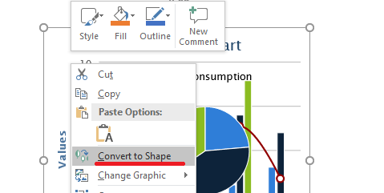

## **Pengenalan**

Gambar membuat presentasi lebih menarik dan hidup. Di Microsoft PowerPoint, Anda dapat menyisipkan gambar dari file, internet, atau lokasi lain ke dalam slide. Demikian pula, Aspose.Slides memungkinkan Anda menambahkan gambar ke slide dalam presentasi Anda melalui berbagai prosedur. 

{} 

Aspose menyediakan konverter gratis—[JPEG ke PowerPoint](https://products.aspose.app/slides/id/import/jpg-to-ppt) dan [PNG ke PowerPoint](https://products.aspose.app/slides/id/import/png-to-ppt)—yang memungkinkan orang membuat presentasi dengan cepat dari gambar. 

{} 

{}

Jika Anda ingin menambahkan gambar sebagai objek bingkai—terutama jika Anda berencana menggunakan opsi pemformatan standar untuk mengubah ukurannya, menambah efek, dan sebagainya—lihat [Bingkai Gambar](https://docs.aspose.com/slides/id/nodejs-java/picture-frame/).

{} 

Aspose.Slides mendukung operasi dengan gambar dalam format populer berikut: JPEG, PNG, GIF, dan lain-lain. 

## **Menambahkan Gambar yang Disimpan Secara Lokal ke Slide**

Anda dapat menambahkan satu atau beberapa gambar dari komputer Anda ke slide dalam presentasi. Kode contoh ini dalam JavaScript menunjukkan cara menambahkan gambar ke slide:

```javascript
var pres = new aspose.slides.Presentation();
try {
    var slide = pres.getSlides().get_Item(0);
    var picture;
    var image = aspose.slides.Images.fromFile("image.png");
    try {
        picture = pres.getImages().addImage(image);
    } finally {
        if (image != null) {
            image.dispose();
        }
    }
    slide.getShapes().addPictureFrame(aspose.slides.ShapeType.Rectangle, 10, 10, 100, 100, picture);
    pres.save("pres.pptx", aspose.slides.SaveFormat.Pptx);
} finally {
    if (pres != null) {
        pres.dispose();
    }
}
```

## **Menambahkan Gambar dari Stream ke Slide**

Jika gambar yang ingin Anda tambahkan ke slide tidak tersedia di komputer Anda, Anda dapat menambahkan gambar tersebut langsung dari web. 

Kode contoh ini menunjukkan cara menambahkan gambar dari web ke slide dalam JavaScript:

```javascript
var pres = new aspose.slides.Presentation();
try {
    // Mengakses slide pertama
    var sld = pres.getSlides().get_Item(0);
    // Memuat file excel ke stream
    var readStream = fs.readFileSync("book1.xlsx");
    var byteArray = Array.from(readStream);
    // Membuat objek data untuk penyematan
    var dataInfo = new aspose.slides.OleEmbeddedDataInfo(java.newArray("byte", byteArray), "xlsx");
    // Menambahkan bentuk Bingkai Objek Ole
    var oleObjectFrame = sld.getShapes().addOleObjectFrame(0, 0, pres.getSlideSize().getSize().getWidth(), pres.getSlideSize().getSize().getHeight(), dataInfo);
    // Menulis file PPTX ke disk
    pres.save("OleEmbed_out.pptx", aspose.slides.SaveFormat.Pptx);
} catch (e) {console.log(e);
} finally {
    if (pres != null) {
        pres.dispose();
    }
}
```

## **Menambahkan Gambar ke Slide Master**

Slide master adalah slide utama yang menyimpan dan mengontrol informasi (tema, tata letak, dll.) tentang semua slide di bawahnya. Jadi, ketika Anda menambahkan gambar ke slide master, gambar tersebut muncul di setiap slide di bawah slide master tersebut. 

Kode contoh JavaScript ini menunjukkan cara menambahkan gambar ke slide master:

```javascript
var pres = new aspose.slides.Presentation();
try {
    var slide = pres.getSlides().get_Item(0);
    var masterSlide = slide.getLayoutSlide().getMasterSlide();
    var picture;
    var image = aspose.slides.Images.fromFile("image.png");
    try {
        picture = pres.getImages().addImage(image);
    } finally {
        if (image != null) {
            image.dispose();
        }
    }
    masterSlide.getShapes().addPictureFrame(aspose.slides.ShapeType.Rectangle, 10, 10, 100, 100, picture);
    pres.save("pres.pptx", aspose.slides.SaveFormat.Pptx);
} finally {
    if (pres != null) {
        pres.dispose();
    }
}
```

## **Menambahkan Gambar sebagai Latar Belakang Slide**

Anda mungkin memutuskan menggunakan sebuah gambar sebagai latar belakang untuk slide tertentu atau beberapa slide. Dalam kasus tersebut, Anda harus melihat *[Mengatur Gambar sebagai Latar Belakang Slide](https://docs.aspose.com/slides/id/nodejs-java/presentation-background/#setting-images-as-background-for-slides)*.

## **Menambahkan SVG ke Presentasi**
Anda dapat menambahkan atau menyisipkan gambar apa pun ke dalam presentasi dengan menggunakan metode [addPictureFrame](https://reference.aspose.com/slides/id/nodejs-java/aspose.slides/ShapeCollection#addPictureFrame-int-float-float-float-float-aspose.slides.PPImage-) yang terdapat pada kelas [ShapeCollection](https://reference.aspose.com/slides/id/nodejs-java/aspose.slides/ShapeCollection). 

Untuk membuat objek gambar berbasis SVG, Anda dapat melakukannya dengan cara berikut:

1. Buat objek SvgImage untuk menyisipkannya ke ImageShapeCollection
2. Buat objek PPImage dari ISvgImage
3. Buat objek PictureFrame menggunakan kelas PPImage

Kode contoh ini menunjukkan cara menerapkan langkah-langkah di atas untuk menambahkan gambar SVG ke dalam presentasi:
```javascript
// Membuat instance kelas Presentation yang mewakili file PPTX
var pres = new aspose.slides.Presentation();
try {
    var svgContent = java.newInstanceSync("java.lang.String", java.newInstanceSync("java.io.FileInputStream", java.newInstanceSync("java.io.File", "image.svg")));
    var svgImage = new aspose.slides.SvgImage(svgContent);
    var ppImage = pres.getImages().addImage(svgImage);
    pres.getSlides().get_Item(0).getShapes().addPictureFrame(aspose.slides.ShapeType.Rectangle, 0, 0, ppImage.getWidth(), ppImage.getHeight(), ppImage);
    pres.save("output.pptx", aspose.slides.SaveFormat.Pptx);
} catch (e) {console.log(e);
} finally {
    if (pres != null) {
        pres.dispose();
    }
}
```

## **Mengonversi SVG menjadi Sekelompok Bentuk**
Konversi SVG menjadi sekumpulan bentuk oleh Aspose.Slides mirip dengan fungsi PowerPoint yang digunakan untuk bekerja dengan gambar SVG:



Fungsionalitas ini disediakan oleh salah satu overload dari metode [addGroupShape](https://reference.aspose.com/slides/id/nodejs-java/aspose.slides/ShapeCollection#addGroupShape-aspose.slides.ISvgImage-float-float-float-float-) pada kelas [ShapeCollection](https://reference.aspose.com/slides/id/nodejs-java/aspose.slides/ShapeCollection) yang menerima objek [SvgImage](https://reference.aspose.com/slides/id/nodejs-java/aspose.slides/SvgImage) sebagai argumen pertama.

Kode contoh ini menunjukkan cara menggunakan metode yang dijelaskan untuk mengonversi file SVG menjadi sekumpulan bentuk:

```javascript
// Buat presentasi baru
var presentation = new aspose.slides.Presentation();
try {
    // Baca konten file SVG
    var svgContent = java.newInstanceSync("java.io.FileInputStream", java.newInstanceSync("java.io.File", "image.svg"));
    // Buat objek SvgImage
    var svgImage = new aspose.slides.SvgImage(svgContent);
    // Dapatkan ukuran slide
    var slideSize = presentation.getSlideSize().getSize();
    // Konversi gambar SVG menjadi grup bentuk dengan menskalakan ke ukuran slide
    presentation.getSlides().get_Item(0).getShapes().addGroupShape(svgImage, 0.0, 0.0, slideSize.getWidth(), slideSize.getHeight());
    // Simpan presentasi dalam format PPTX
    presentation.save("output.pptx", aspose.slides.SaveFormat.Pptx);
} catch (e) {console.log(e);
} finally {
    if (presentation != null) {
        presentation.dispose();
    }
}
```

## **Menambahkan Gambar sebagai EMF di Slide**
Aspose.Slides untuk Node.js via Java memungkinkan Anda menghasilkan gambar EMF dari lembar Excel dan menambahkan gambar tersebut sebagai EMF di slide dengan Aspose.Cells. 

Kode contoh ini menunjukkan cara melakukan tugas yang dijelaskan:

```javascript
var book = java.newInstanceSync("aspose.cells.Workbook", "chart.xlsx");
var sheet = book.getWorksheets().get(0);
var options = java.newInstanceSync("aspose.cells.ImageOrPrintOptions");
options.setHorizontalResolution(200);
options.setVerticalResolution(200);
options.setImageType(java.getStaticFieldValue("ImageType", "EMF"));
// Save the workbook to stream
var sr = java.newInstanceSync("SheetRender", sheet, options);
var pres = new aspose.slides.Presentation();
try {
    pres.getSlides().removeAt(0);
    var EmfSheetName = "";
    for (var j = 0; j < sr.getPageCount(); j++) {
        EmfSheetName = ((("test" + sheet.getName()) + " Page") + (j + 1)) + ".out.emf";
        sr.toImage(j, EmfSheetName);
        var picture;
        var image = aspose.slides.Images.fromFile(EmfSheetName);
        try {
            picture = pres.getImages().addImage(image);
        } finally {
            if (image != null) {
                image.dispose();
            }
        }
        var slide = pres.getSlides().addEmptySlide(pres.getLayoutSlides().getByType(aspose.slides.SlideLayoutType.Blank));
        var m = slide.getShapes().addPictureFrame(aspose.slides.ShapeType.Rectangle, 0, 0, pres.getSlideSize().getSize().getWidth(), pres.getSlideSize().getSize().getHeight(), picture);
    }
    pres.save("output.pptx", aspose.slides.SaveFormat.Pptx);
} catch (e) {console.log(e);
} finally {
    if (pres != null) {
        pres.dispose();
    }
}
```

## **Mengganti Gambar dalam Koleksi Gambar**

Aspose.Slides memungkinkan Anda mengganti gambar yang disimpan dalam koleksi gambar presentasi (termasuk yang digunakan oleh bentuk slide). Bagian ini menunjukkan beberapa pendekatan untuk memperbarui gambar dalam koleksi. API menyediakan metode sederhana untuk mengganti gambar menggunakan data byte mentah, instance [IImage](https://reference.aspose.com/slides/id/nodejs-java/aspose.slides/iimage/) , atau gambar lain yang sudah ada dalam koleksi.

Ikuti langkah-langkah di bawah:

1. Muat file presentasi yang berisi gambar menggunakan kelas [Presentation](https://reference.aspose.com/slides/id/nodejs-java/aspose.slides/presentation/).
2. Muat gambar baru dari file ke dalam array byte.
3. Ganti gambar target dengan gambar baru menggunakan array byte.
4. Pada pendekatan kedua, muat gambar ke dalam objek [IImage](https://reference.aspose.com/slides/id/nodejs-java/aspose.slides/iimage/) dan gantikan gambar target dengan objek tersebut.
5. Pada pendekatan ketiga, gantikan gambar target dengan gambar yang sudah ada dalam koleksi gambar presentasi.
6. Tulis presentasi yang dimodifikasi sebagai file PPTX.

```js
// Membuat instance kelas Presentation yang mewakili file presentasi.
const presentation = new aspose.slides.Presentation("sample.pptx");
try {
    // Cara pertama.
    const imageData = java.newArray("byte", Array.from(fs.readFileSync("image0.jpeg")));
    let oldImage = presentation.getImages().get_Item(0);
    oldImage.replaceImage(imageData);
    
    // Cara kedua.
    const newImage = aspose.slides.Images.fromFile("image1.png");
    oldImage = presentation.getImages().get_Item(1);
    oldImage.replaceImage(newImage);
    newImage.dispose();
    
    // Cara ketiga.
    oldImage = presentation.getImages().get_Item(2);
    oldImage.replaceImage(presentation.getImages().get_Item(3));
    
    // Simpan presentasi ke file.
    presentation.save("output.pptx", aspose.slides.SaveFormat.Pptx);
} finally {
    presentation.dispose();
}
```

{}

Dengan menggunakan konverter Aspose FREE [Text to GIF](https://products.aspose.app/slides/id/text-to-gif), Anda dapat dengan mudah menganimasikan teks, membuat GIF dari teks, dll. 

{}

## **Tanya Jawab**

**Apakah resolusi gambar asli tetap utuh setelah penyisipan?**

Ya. Piksel sumber tetap dipertahankan, tetapi tampilan akhir bergantung pada bagaimana [picture](/slides/id/nodejs-java/picture-frame/) diskalakan pada slide dan kompresi apa pun yang diterapkan saat menyimpan.

**Apa cara terbaik untuk mengganti logo yang sama di puluhan slide sekaligus?**

Letakkan logo pada slide master atau tata letak dan ganti di koleksi gambar presentasi—pembaruan akan menyebar ke semua elemen yang menggunakan sumber daya tersebut.

**Apakah SVG yang disisipkan dapat dikonversi menjadi bentuk yang dapat diedit?**

Ya. Anda dapat mengonversi SVG menjadi sekelompok bentuk, setelah itu bagian individu menjadi dapat diedit dengan properti bentuk standar.

**Bagaimana cara mengatur gambar sebagai latar belakang untuk beberapa slide sekaligus?**

[Tetapkan gambar sebagai latar belakang](/slides/id/nodejs-java/presentation-background/) pada slide master atau tata letak yang relevan—semua slide yang menggunakan master/tata letak tersebut akan mewarisi latar belakang.

**Bagaimana cara mencegah presentasi menjadi sangat besar karena banyak gambar?**

Gunakan kembali satu sumber gambar daripada duplikat, pilih resolusi yang wajar, terapkan kompresi saat menyimpan, dan simpan grafik berulang pada master bila perlu.