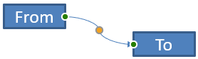
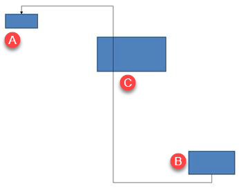

## **Pendahuluan**

Konektor PowerPoint adalah garis khusus yang menghubungkan atau menautkan dua bentuk dan tetap melekat pada bentuk meskipun dipindahkan atau diposisikan ulang pada slide tertentu.  

Konektor biasanya terhubung ke *titik sambungan* (titik hijau), yang secara default ada pada semua bentuk. Titik sambungan muncul ketika kursor mendekatinya.

*Titik penyesuaian* (titik oranye), yang hanya ada pada konektor tertentu, digunakan untuk memodifikasi posisi dan bentuk konektor.

## **Jenis‑jenis Konektor**

Di PowerPoint, Anda dapat menggunakan konektor lurus, siku (berpola), dan melengkung.  

Aspose.Slides menyediakan konektor berikut:

| Konektor | Gambar | Jumlah titik penyesuaian |
| ------------------------------ | ------------------------------------------------------------ | --------------------------- |
| `ShapeType.Line` |  | 0 |
| `ShapeType.StraightConnector1` |  | 0 |
| `ShapeType.BentConnector2` |  | 0 |
| `ShapeType.BentConnector3` |  | 1 |
| `ShapeType.BentConnector4` |  | 2 |
| `ShapeType.BentConnector5` |  | 3 |
| `ShapeType.CurvedConnector2` |  | 0 |
| `ShapeType.CurvedConnector3` |  | 1 |
| `ShapeType.CurvedConnector4` |  | 2 |
| `ShapeType.CurvedConnector5` |  | 3 |

## **Menghubungkan Bentuk dengan Konektor**

1. Buat instance kelas [Presentation](https://apireference.aspose.com/slides/id/nodejs-java/aspose.slides/Presentation).
1. Dapatkan referensi slide melalui indeksnya.
1. Tambahkan dua [AutoShape](https://reference.aspose.com/slides/id/nodejs-java/aspose.slides/AutoShape) ke slide dengan metode `addAutoShape` yang disediakan oleh objek `Shapes`.
1. Tambahkan konektor menggunakan metode `addConnector` yang disediakan oleh objek `Shapes` dengan mendefinisikan tipe konektor.
1. Hubungkan bentuk‑bentuk menggunakan konektor. 
1. Panggil metode `reroute` untuk menerapkan jalur koneksi terpendek.
1. Simpan presentasi. 

Kode JavaScript berikut menunjukkan cara menambahkan konektor (konektor bengkok) antara dua bentuk (sebuah elips dan persegi panjang):

```javascript
// Membuat instance kelas presentasi yang mewakili file PPTX
var pres = new aspose.slides.Presentation();
try {
    // Mengakses koleksi bentuk untuk slide tertentu
    var shapes = pres.getSlides().get_Item(0).getShapes();
    // Menambahkan autoshape Elips
    var ellipse = shapes.addAutoShape(aspose.slides.ShapeType.Ellipse, 0, 100, 100, 100);
    // Menambahkan autoshape Persegi Panjang
    var rectangle = shapes.addAutoShape(aspose.slides.ShapeType.Rectangle, 100, 300, 100, 100);
    // Menambahkan bentuk konektor ke koleksi bentuk slide
    var connector = shapes.addConnector(aspose.slides.ShapeType.BentConnector2, 0, 0, 10, 10);
    // Menghubungkan bentuk-bentuk menggunakan konektor
    connector.setStartShapeConnectedTo(ellipse);
    connector.setEndShapeConnectedTo(rectangle);
    // Memanggil reroute yang mengatur jalur terpendek otomatis antara bentuk
    connector.reroute();
    // Menyimpan presentasi
    pres.save("output.pptx", aspose.slides.SaveFormat.Pptx);
} finally {
    if (pres != null) {
        pres.dispose();
    }
}
```

{} 

Metode `Connector.reroute` mengatur ulang konektor dan memaksa ia mengambil jalur terpendek yang mungkin antara bentuk. Untuk mencapai tujuan tersebut, metode ini dapat mengubah titik `setStartShapeConnectionSiteIndex` dan `setEndShapeConnectionSiteIndex`. 

{} 

## **Menentukan Titik Sambungan**

Jika Anda ingin konektor menautkan dua bentuk menggunakan titik tertentu pada bentuk, Anda harus menentukan titik sambungan yang diinginkan dengan cara berikut:

1. Buat instance kelas [Presentation](https://reference.aspose.com/slides/id/nodejs-java/aspose.slides/Presentation).
1. Dapatkan referensi slide melalui indeksnya.
1. Tambahkan dua [AutoShape](https://reference.aspose.com/slides/id/nodejs-java/aspose.slides/AutoShape) ke slide dengan metode `addAutoShape` yang disediakan oleh objek `Shapes`.
1. Tambahkan konektor menggunakan metode `addConnector` yang disediakan oleh objek `Shapes` dengan mendefinisikan tipe konektor.
1. Hubungkan bentuk‑bentuk menggunakan konektor. 
1. Atur titik sambungan pilihan Anda pada bentuk. 
1. Simpan presentasi.

Kode JavaScript berikut mendemonstrasikan operasi di mana titik sambungan yang dipilih ditentukan:

```javascript
// Membuat instance kelas presentasi yang mewakili file PPTX
var pres = new aspose.slides.Presentation();
try {
    // Mengakses koleksi bentuk untuk slide tertentu
    var shapes = pres.getSlides().get_Item(0).getShapes();
    // Menambahkan autoshape Elips
    var ellipse = shapes.addAutoShape(aspose.slides.ShapeType.Ellipse, 0, 100, 100, 100);
    // Menambahkan autoshape Persegi Panjang
    var rectangle = shapes.addAutoShape(aspose.slides.ShapeType.Rectangle, 100, 300, 100, 100);
    // Menambahkan bentuk konektor ke koleksi bentuk slide
    var connector = shapes.addConnector(aspose.slides.ShapeType.BentConnector2, 0, 0, 10, 10);
    // Menghubungkan bentuk-bentuk menggunakan konektor
    connector.setStartShapeConnectedTo(ellipse);
    connector.setEndShapeConnectedTo(rectangle);
    // Mengatur indeks titik sambungan yang diinginkan pada bentuk Elips
    var wantedIndex = 6;
    // Memeriksa apakah indeks yang diinginkan lebih kecil dari jumlah maksimum situs indeks
    if (ellipse.getConnectionSiteCount() > wantedIndex) {
        // Mengatur titik sambungan yang diinginkan pada autoshape Elips
        connector.setStartShapeConnectionSiteIndex(wantedIndex);
    }
    // Menyimpan presentasi
    pres.save("output.pptx", aspose.slides.SaveFormat.Pptx);
} finally {
    if (pres != null) {
        pres.dispose();
    }
}
```

## **Menyesuaikan Titik Konektor**

Anda dapat menyesuaikan konektor yang sudah ada melalui titik penyesuaian nya. Hanya konektor dengan titik penyesuaian yang dapat diubah dengan cara ini. Lihat tabel pada **[Jenis konektor.](/slides/id/nodejs-java/connector/#types-of-connectors)**

### **Kasus Sederhana**

Pertimbangkan kasus di mana konektor antara dua bentuk (A dan B) melewati bentuk ketiga (C):



```javascript
var pres = new aspose.slides.Presentation();
try {
    var sld = pres.getSlides().get_Item(0);
    var shape = sld.getShapes().addAutoShape(aspose.slides.ShapeType.Rectangle, 300, 150, 150, 75);
    var shapeFrom = sld.getShapes().addAutoShape(aspose.slides.ShapeType.Rectangle, 500, 400, 100, 50);
    var shapeTo = sld.getShapes().addAutoShape(aspose.slides.ShapeType.Rectangle, 100, 100, 70, 30);
    var connector = sld.getShapes().addConnector(aspose.slides.ShapeType.BentConnector5, 20, 20, 400, 300);
    connector.getLineFormat().setEndArrowheadStyle(aspose.slides.LineArrowheadStyle.Triangle);
    connector.getLineFormat().getFillFormat().setFillType(java.newByte(aspose.slides.FillType.Solid));
    connector.getLineFormat().getFillFormat().getSolidFillColor().setColor(java.getStaticFieldValue("java.awt.Color", "BLACK"));
    connector.setStartShapeConnectedTo(shapeFrom);
    connector.setEndShapeConnectedTo(shapeTo);
    connector.setStartShapeConnectionSiteIndex(2);
} finally {
    if (pres != null) {
        pres.dispose();
    }
}
```

Untuk menghindari atau melewati bentuk ketiga, kita dapat menyesuaikan konektor dengan memindahkan garis vertikalnya ke kiri seperti berikut:


```javascript
var adj2 = connector.getAdjustments().get_Item(1);
adj2.setRawValue(adj2.getRawValue() + 10000);
```

### **Kasus Kompleks** 

Untuk melakukan penyesuaian yang lebih rumit, Anda harus memperhatikan hal‑hal berikut:

* Titik penyesuaian konektor sangat terkait dengan rumus yang menghitung dan menentukan posisinya. Jadi perubahan pada posisi titik dapat mengubah bentuk konektor.
* Titik penyesuaian konektor didefinisikan dalam urutan yang ketat dalam sebuah array. Titik‑titik tersebut diberi nomor dari titik awal konektor ke titik akhirnya.
* Nilai titik penyesuaian mencerminkan persentase lebar/tinggi bentuk konektor. 
  * Bentuk dibatasi oleh titik awal dan akhir konektor yang dikalikan 1000. 
  * Titik pertama, kedua, dan ketiga masing‑masing mendefinisikan persentase dari lebar, persentase dari tinggi, dan persentase dari lebar (lagi).
* Untuk perhitungan yang menentukan koordinat titik penyesuaian konektor, Anda harus mempertimbangkan rotasi konektor dan pantulannya. **Catatan** bahwa sudut rotasi untuk semua konektor yang ditampilkan pada **[Jenis konektor](/slides/id/nodejs-java/connector/#types-of-connectors)** adalah 0.

#### **Kasus 1**

Pertimbangkan kasus di mana dua objek bingkai teks ditautkan bersama melalui sebuah konektor:


```javascript
// Membuat instance kelas presentasi yang mewakili file PPTX
var pres = new aspose.slides.Presentation();
try {
    // Mendapatkan slide pertama dalam presentasi
    var sld = pres.getSlides().get_Item(0);
    // Menambahkan bentuk yang akan digabungkan melalui sebuah konektor
    var shapeFrom = sld.getShapes().addAutoShape(aspose.slides.ShapeType.Rectangle, 100, 100, 60, 25);
    shapeFrom.getTextFrame().setText("From");
    var shapeTo = sld.getShapes().addAutoShape(aspose.slides.ShapeType.Rectangle, 500, 100, 60, 25);
    shapeTo.getTextFrame().setText("To");
    // Menambahkan konektor
    var connector = sld.getShapes().addConnector(aspose.slides.ShapeType.BentConnector4, 20, 20, 400, 300);
    // Menentukan arah konektor
    connector.getLineFormat().setEndArrowheadStyle(aspose.slides.LineArrowheadStyle.Triangle);
    // Menentukan warna konektor
    connector.getLineFormat().getFillFormat().setFillType(java.newByte(aspose.slides.FillType.Solid));
    connector.getLineFormat().getFillFormat().getSolidFillColor().setColor(java.getStaticFieldValue("java.awt.Color", "RED"));
    // Menentukan ketebalan garis konektor
    connector.getLineFormat().setWidth(3);
    // Menghubungkan bentuk-bentuk dengan konektor
    connector.setStartShapeConnectedTo(shapeFrom);
    connector.setStartShapeConnectionSiteIndex(3);
    connector.setEndShapeConnectedTo(shapeTo);
    connector.setEndShapeConnectionSiteIndex(2);
    // Mendapatkan titik penyesuaian untuk konektor
    var adjValue_0 = connector.getAdjustments().get_Item(0);
    var adjValue_1 = connector.getAdjustments().get_Item(1);
} finally {
    if (pres != null) {
        pres.dispose();
    }
}
```

**Penyesuaian**

Kita dapat mengubah nilai titik penyesuaian konektor dengan meningkatkan persentase lebar dan tinggi yang bersangkutan masing‑masing sebesar 20 % dan 200 %:

```javascript
// Mengubah nilai titik penyesuaian
adjValue_0.setRawValue(adjValue_0.getRawValue() + 20000);
adjValue_1.setRawValue(adjValue_1.getRawValue() + 200000);
```

Hasilnya:


Untuk mendefinisikan model yang memungkinkan kita menentukan koordinat dan bentuk bagian‑bagian individual konektor, buatlah bentuk yang mewakili komponen horizontal konektor pada titik `connector.getAdjustments().get_Item(0)`:

```javascript
// Gambar komponen vertikal dari konektor
var x = connector.getX() + ((connector.getWidth() * adjValue_0.getRawValue()) / 100000);
var y = connector.getY();
var height = (connector.getHeight() * adjValue_1.getRawValue()) / 100000;
sld.getShapes().addAutoShape(aspose.slides.ShapeType.Rectangle, x, y, 0, height);
```

Hasilnya:


#### **Kasus 2**

Dalam **Kasus 1**, kami mendemonstrasikan operasi penyesuaian konektor sederhana menggunakan prinsip dasar. Dalam situasi normal, Anda harus memperhitungkan rotasi konektor serta tampilan nya (yang diatur oleh `connector.getRotation()`, `connector.getFrame().getFlipH()`, dan `connector.getFrame().getFlipV()`). Sekarang kami akan menunjukkan prosesnya.

Pertama, tambahkan objek bingkai teks baru (**To 1**) ke slide (untuk tujuan penyambungan) dan buat konektor (hijau) baru yang menghubungkannya dengan objek‑objek yang sudah ada.

```javascript
// Membuat objek binding baru
var shapeTo_1 = sld.getShapes().addAutoShape(aspose.slides.ShapeType.Rectangle, 100, 400, 60, 25);
shapeTo_1.getTextFrame().setText("To 1");
// Membuat konektor baru
connector = sld.getShapes().addConnector(aspose.slides.ShapeType.BentConnector4, 20, 20, 400, 300);
connector.getLineFormat().setEndArrowheadStyle(aspose.slides.LineArrowheadStyle.Triangle);
connector.getLineFormat().getFillFormat().setFillType(java.newByte(aspose.slides.FillType.Solid));
connector.getLineFormat().getFillFormat().getSolidFillColor().setColor(java.getStaticFieldValue("java.awt.Color", "CYAN"));
connector.getLineFormat().setWidth(3);
// Menghubungkan objek menggunakan konektor yang baru dibuat
connector.setStartShapeConnectedTo(shapeFrom);
connector.setStartShapeConnectionSiteIndex(2);
connector.setEndShapeConnectedTo(shapeTo_1);
connector.setEndShapeConnectionSiteIndex(3);
// Mendapatkan titik penyesuaian konektor
adjValue_0 = connector.getAdjustments().get_Item(0);
adjValue_1 = connector.getAdjustments().get_Item(1);
// Mengubah nilai titik penyesuaian
adjValue_0.setRawValue(adjValue_0.getRawValue() + 20000);
adjValue_1.setRawValue(adjValue_1.getRawValue() + 200000);
```

Hasilnya:


Kedua, buat bentuk yang akan mewakili komponen horizontal konektor yang melewati titik penyesuaian konektor baru `connector.getAdjustments().get_Item(0)`. Gunakan nilai‑nilai dari data konektor untuk `connector.getRotation()`, `connector.getFrame().getFlipH()`, dan `connector.getFrame().getFlipV()` serta terapkan rumus konversi koordinat populer untuk rotasi mengelilingi titik x₀:

X = (x — x0) * cos(alpha) — (y — y0) * sin(alpha) + x0;

Y = (x — x0) * sin(alpha) + (y — y0) * cos(alpha) + y0;

Dalam kasus kami, sudut rotasi objek adalah 90 derajat dan konektor ditampilkan secara vertikal, sehingga kode yang bersesuaian adalah:

```javascript
// Menyimpan koordinat konektor
x = connector.getX();
y = connector.getY();
// Mengoreksi koordinat konektor jika muncul
if (connector.getFrame().getFlipH() == aspose.slides.NullableBool.True) {
    x += connector.getWidth();
}
if (connector.getFrame().getFlipV() == aspose.slides.NullableBool.True) {
    y += connector.getHeight();
}
// Menggunakan nilai titik penyesuaian sebagai koordinat
x += (connector.getWidth() * adjValue_0.getRawValue()) / 100000;
// Mengonversi koordinat karena Sin(90) = 1 dan Cos(90) = 0
var xx = (connector.getFrame().getCenterX() - y) + connector.getFrame().getCenterY();
var yy = (x - connector.getFrame().getCenterX()) + connector.getFrame().getCenterY();
// Menentukan lebar komponen horizontal menggunakan nilai titik penyesuaian kedua
var width = (connector.getHeight() * adjValue_1.getRawValue()) / 100000;
var shape = sld.getShapes().addAutoShape(aspose.slides.ShapeType.Rectangle, xx, yy, width, 0);
shape.getLineFormat().getFillFormat().setFillType(java.newByte(aspose.slides.FillType.Solid));
shape.getLineFormat().getFillFormat().getSolidFillColor().setColor(java.getStaticFieldValue("java.awt.Color", "RED"));
```

Hasilnya:


Kami telah mendemonstrasikan perhitungan yang melibatkan penyesuaian sederhana dan titik penyesuaian yang rumit (titik penyesuaian dengan sudut rotasi). Dengan pengetahuan ini, Anda dapat mengembangkan model Anda sendiri (atau menulis kode) untuk mendapatkan objek `GraphicsPath` atau bahkan mengatur nilai titik penyesuaian konektor berdasarkan koordinat slide tertentu.

## **Menemukan Sudut Garis Konektor**

1. Buat instance kelas.
1. Dapatkan referensi slide melalui indeksnya.
1. Akses bentuk garis konektor.
1. Gunakan lebar, tinggi, tinggi bingkai bentuk, dan lebar bingkai bentuk untuk menghitung sudut.

Kode JavaScript berikut menunjukkan operasi di mana kami menghitung sudut untuk bentuk garis konektor:

```javascript
var pres = new aspose.slides.Presentation("ConnectorLineAngle.pptx");
try {
    var slide = pres.getSlides().get_Item(0);
    for (var i = 0; i < slide.getShapes().size(); i++) {
        var dir = 0.0;
        var shape = slide.getShapes().get_Item(i);
        if (java.instanceOf(shape, "com.aspose.slides.AutoShape")) {
            var ashp = shape;
            if (ashp.getShapeType() == aspose.slides.ShapeType.Line) {
                dir = getDirection(ashp.getWidth(), ashp.getHeight(), ashp.getFrame().getFlipH() > 0, ashp.getFrame().getFlipV() > 0);
            }
        } else if (java.instanceOf(shape, "com.aspose.slides.Connector")) {
            var ashp = shape;
            dir = getDirection(ashp.getWidth(), ashp.getHeight(), ashp.getFrame().getFlipH() > 0, ashp.getFrame().getFlipV() > 0);
        }
        console.log(dir);
    }
} finally {
    if (pres != null) {
        pres.dispose();
    }
}
```

```javascript
function getDirection(w, h, flipH, flipV) {
    let endLineX = w * (flipH ? -1 : 1);
    let endLineY = h * (flipV ? -1 : 1);
    
    let endYAxisX = 0;
    let endYAxisY = h;

    let angle = Math.atan2(endYAxisY, endYAxisX) - Math.atan2(endLineY, endLineX);

    if (angle < 0) {
        angle += 2 * Math.PI;
    }

    return angle * 180.0 / Math.PI;
}
```

## **FAQ**

**Bagaimana saya dapat mengetahui apakah sebuah konektor dapat "direkatkan" ke bentuk tertentu?**

Periksa apakah bentuk tersebut menyediakan [connection sites](https://reference.aspose.com/slides/id/nodejs-java/aspose.slides/shape/getconnectionsitecount/). Jika tidak ada atau jumlahnya nol, perekat tidak tersedia; dalam hal ini gunakan ujung bebas dan posisikan secara manual. Disarankan untuk memeriksa hitungan situs sebelum menempelkan.

**Apa yang terjadi pada konektor jika saya menghapus salah satu bentuk yang terhubung?**

Ujung‑ujungnya akan terlepas; konektor tetap berada di slide sebagai garis biasa dengan awal/akhir bebas. Anda dapat menghapusnya atau menugaskan kembali sambungan dan, bila perlu, [reroute](https://reference.aspose.com/slides/id/nodejs-java/aspose.slides/connector/reroute/).

**Apakah ikatan konektor tetap terjaga saat menyalin slide ke presentasi lain?**

Umumnya ya, asalkan bentuk‑bentuk target juga disalin. Jika slide dimasukkan ke file lain tanpa bentuk‑bentuk yang terhubung, ujung‑ujungnya menjadi bebas dan Anda harus menempelkannya kembali.