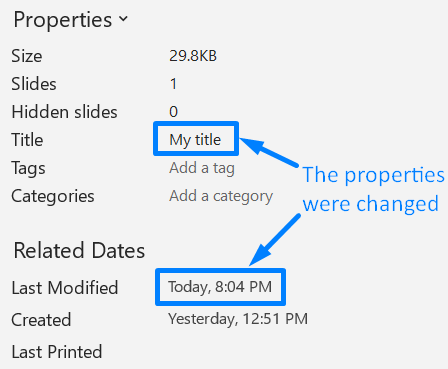

## **Ikhtisar**

Artikel ini menunjukkan cara memeriksa informasi presentasi di Aspose.Slides. Artikel ini menjelaskan cara menentukan format presentasi saat ini tanpa memuat seluruh file, membaca properti dokumennya, dan memperbarui properti tersebut bila diperlukan.

Contoh‑contoh didasarkan pada API [PresentationInfo](https://reference.aspose.com/slides/id/php-java/aspose.slides/presentationinfo/) dan [DocumentProperties](https://reference.aspose.com/slides/id/php-java/aspose.slides/documentproperties/) serta memperlihatkan operasi tipikal untuk bekerja dengan metadata presentasi.

## **Periksa Format Presentasi**

Sebelum mengerjakan sebuah presentasi, Anda mungkin ingin mengetahui format (PPT, PPTX, ODP, dan lain‑lain) yang sedang digunakan presentasi tersebut.

Anda dapat memeriksa format presentasi tanpa memuat presentasi. Lihat kode PHP ini:

```php
  $info = PresentationFactory->getInstance()->getPresentationInfo("pres.pptx");
  echo($info->getLoadFormat());// PPTX

  $info2 = PresentationFactory->getInstance()->getPresentationInfo("pres.ppt");
  echo($info2->getLoadFormat());// PPT

  $info3 = PresentationFactory->getInstance()->getPresentationInfo("pres.odp");
  echo($info3->getLoadFormat());// ODP


```

## **Dapatkan Properti Presentasi**

Kode PHP ini menunjukkan cara mendapatkan properti presentasi (informasi tentang presentasi):

```php
  $info = PresentationFactory->getInstance()->getPresentationInfo("pres.pptx");
  $props = $info->readDocumentProperties();
  echo($props->getCreatedTime());
  echo($props->getSubject());
  echo($props->getTitle());
  # ..
```

Anda mungkin ingin melihat [properti di bawah DocumentProperties](https://reference.aspose.com/slides/id/php-java/aspose.slides/documentproperties/#DocumentProperties--) kelas.

## **Perbarui Properti Presentasi**

Aspose.Slides menyediakan metode [PresentationInfo.updateDocumentProperties](https://reference.aspose.com/slides/id/php-java/aspose.slides/PresentationInfo#updateDocumentProperties-com.aspose.slides.IDocumentProperties-) yang memungkinkan Anda melakukan perubahan pada properti presentasi.

Misalkan kita memiliki presentasi PowerPoint dengan properti dokumen yang ditampilkan di bawah ini.


Contoh kode ini menunjukkan cara mengedit beberapa properti presentasi:

```php
$fileName = "sample.pptx";

$info = PresentationFactory::getInstance()->getPresentationInfo($fileName);

$properties = $info->readDocumentProperties();
$properties->setTitle("My title");
$properties->setLastSavedTime(new Java("java.util.Date"));

$info->updateDocumentProperties($properties);
$info->writeBindedPresentation($fileName);
```

Hasil perubahan properti dokumen ditampilkan di bawah ini.



## **Tautan Berguna**

Untuk mendapatkan informasi lebih lanjut tentang sebuah presentasi dan atribut keamanannya, Anda mungkin menemukan tautan‑tautan berikut berguna:

- [Password-Protect Presentations](/slides/id/php-java/password-protected-presentation/)
- [Write-Protect Presentations](/slides/id/php-java/write-protected-presentation/)

## **FAQ**

**Bagaimana saya dapat memeriksa apakah font tersemat dan font apa saja?**

Cari informasi [embedded-font information](https://reference.aspose.com/slides/id/php-java/aspose.slides/fontsmanager/getembeddedfonts/) pada level presentasi, kemudian bandingkan entri‑entri tersebut dengan set [fonts actually used across content](https://reference.aspose.com/slides/id/php-java/aspose.slides/fontsmanager/getfonts/) untuk mengidentifikasi font mana yang krusial untuk rendering.

**Bagaimana cara cepat mengetahui apakah file memiliki slide tersembunyi dan berapa banyak?**

Iterasi melalui [slide collection](https://reference.aspose.com/slides/id/php-java/aspose.slides/slidecollection/) dan periksa setiap [visibility flag](https://reference.aspose.com/slides/id/php-java/aspose.slides/slide/gethidden/) pada slide.

**Bisakah saya mendeteksi apakah ukuran dan orientasi slide khusus digunakan, dan apakah berbeda dari default?**

Ya. Bandingkan [slide size](https://reference.aspose.com/slides/id/php-java/aspose.slides/presentation/getslidesize/) dan orientasi saat ini dengan preset standar; ini membantu memperkirakan perilaku saat mencetak dan mengekspor.

**Apakah ada cara cepat untuk melihat apakah chart merujuk ke sumber data eksternal?**

Ya. Telusuri semua [charts](https://reference.aspose.com/slides/id/php-java/aspose.slides/chart/), periksa [data source](https://reference.aspose.com/slides/id/php-java/aspose.slides/chartdata/getdatasourcetype/), dan catat apakah data internal atau berbasis tautan, termasuk tautan yang rusak.

**Bagaimana saya dapat menilai slide “berat” yang mungkin memperlambat rendering atau ekspor PDF?**

Untuk setiap slide, hitung jumlah objek dan cari gambar besar, transparansi, bayangan, animasi, serta multimedia; berikan skor kompleksitas kasar untuk menandai potensi hotspot kinerja.