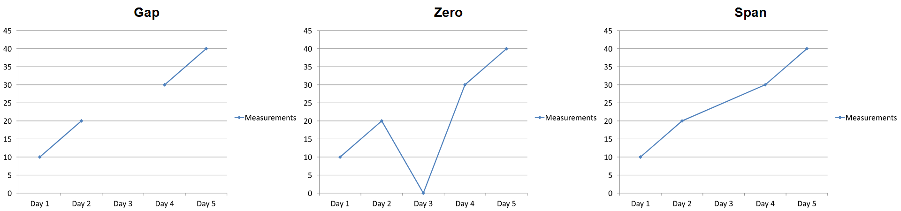

## **Gambaran Umum**

Sebuah diagram menyimpan data yang dipetakan dalam buku kerja data diagram. Sebuah [ChartSeries](https://reference.aspose.com/slides/id/php-java/aspose.slides/chartseries/) mewakili satu set nilai yang terkait, dan setiap [ChartDataPoint](https://reference.aspose.com/slides/id/php-java/aspose.slides/chartdatapoint/) dalam seri mengacu pada satu atau beberapa sel buku kerja. Objek [ChartCategory](https://reference.aspose.com/slides/id/php-java/aspose.slides/chartcategory/) menyediakan label atau nilai pengelompokan yang dibagikan oleh seri. Nama seri, kategori, dan nilai poin oleh karena itu terhubung ke objek [ChartDataCell](https://reference.aspose.com/slides/id/php-java/aspose.slides/chartdatacell/) bukan hanya disimpan sebagai teks tampilan.

Untuk diagram kategori tipikal, buku kerja default menggunakan baris 0 untuk nama seri, kolom 0 untuk nama kategori, dan sel‑sel sisanya untuk nilai seri. Indeks lembar kerja, baris, dan kolom yang diberikan ke [ChartDataWorkbook.getCell](https://reference.aspose.com/slides/id/php-java/aspose.slides/chartdataworkbook/#getCell) bersifat berbasis nol. Tata letak ini berguna ketika Anda membuat diagram dengan data default, tetapi jangan berasumsi bahwa setiap diagram yang ada menggunakannya. Untuk presentasi yang dimuat, periksa sel‑sel yang dirujuk oleh seri, kategori, dan titik data sebelum mengubah nilai buku kerja.

Pengaturan diagram memiliki tiga ruang lingkup berbeda:

- Pengaturan tingkat‑seri, seperti [ChartSeries.getFormat](https://reference.aspose.com/slides/id/php-java/aspose.slides/chartseries/#getFormat), menyediakan tampilan default untuk semua titik dalam satu seri.
- Pengaturan titik‑data, seperti [ChartDataPoint.getFormat](https://reference.aspose.com/slides/id/php-java/aspose.slides/chartdatapoint/#getFormat), menimpa tampilan seri untuk satu titik.
- Pengaturan grup berlaku untuk seri yang kompatibel yang berada dalam [ChartSeriesGroup](https://reference.aspose.com/slides/id/php-java/aspose.slides/chartseriesgroup/) yang sama. Akses grup melalui [ChartSeries.getParentSeriesGroup](https://reference.aspose.com/slides/id/php-java/aspose.slides/chartseries/#getParentSeriesGroup) ketika Anda perlu menetapkan opsi seperti overlap atau lebar celah.

Ketika tidak ada isian titik atau seri yang eksplisit ditetapkan, gaya dan tema diagram menentukan tampilan otomatis. Ketika format seri dan titik keduanya ada, format titik memiliki prioritas untuk titik tersebut.


## **Atur Overlap Seri Diagram**

[ChartSeries.getOverlap](https://reference.aspose.com/slides/id/php-java/aspose.slides/chartseries/#getOverlap) melaporkan seberapa banyak batang atau kolom saling tumpang tindih pada diagram 2D, dari –100 hingga 100 persen. Ini adalah proyeksi baca‑saja dari pengaturan pada grup seri induk. Gunakan [ChartSeriesGroup.setOverlap](https://reference.aspose.com/slides/id/php-java/aspose.slides/chartseriesgroup/#setOverlap) untuk memperbarui setiap seri yang kompatibel dalam grup tersebut. Opsi ini berlaku untuk tipe diagram yang menampilkan batang atau kolom berkelompok; tidak memengaruhi grup seri yang tidak terkait pada diagram gabungan.

Contoh berikut mengatur overlap untuk grup yang berisi seri pertama:

```php
$firstSlideIndex = 0;
$firstSeriesIndex = 0;
$overlapPercent = 30;

$presentation = new Presentation();
try {
    $slide = $presentation->getSlides()->get_Item($firstSlideIndex);

    // Diagram baru berisi contoh seri, kategori, dan nilai.
    $chart = $slide->getShapes()->addChart(ChartType::ClusteredColumn, 20, 20, 500, 200);

    $series = $chart->getChartData()->getSeries()->get_Item($firstSeriesIndex);
    $series->getParentSeriesGroup()->setOverlap($overlapPercent);

    $presentation->save("series_overlap.pptx", SaveFormat::Pptx);
} finally {
    if (!java_is_null($presentation)) {
        $presentation->dispose();
    }
}
```

Hasilnya:


## **Ubah Warna Isian Seri**

Gunakan [ChartSeries.getFormat](https://reference.aspose.com/slides/id/php-java/aspose.slides/chartseries/#getFormat) untuk menetapkan isian default bagi seluruh seri. Jika sebuah titik sudah memiliki isian eksplisit, pengaturan [ChartDataPoint.getFormat](https://reference.aspose.com/slides/id/php-java/aspose.slides/chartdatapoint/#getFormat) menimpa isian seri untuk titik tersebut.

Contoh berikut menerapkan isian biru solid pada seri pertama:

```php
$firstSlideIndex = 0;
$firstSeriesIndex = 0;
$blueColor = java("java.awt.Color")->BLUE;

$presentation = new Presentation();
try {
    $slide = $presentation->getSlides()->get_Item($firstSlideIndex);

    $chart = $slide->getShapes()->addChart(ChartType::ClusteredColumn, 20, 20, 500, 200);

    $series = $chart->getChartData()->getSeries()->get_Item($firstSeriesIndex);
    $series->getFormat()->getFill()->setFillType(FillType::Solid);
    $series->getFormat()->getFill()->getSolidFillColor()->setColor($blueColor);

    $presentation->save("series_color.pptx", SaveFormat::Pptx);
} finally {
    if (!java_is_null($presentation)) {
        $presentation->dispose();
    }
}
```

Hasilnya:


## **Ubah Nama Seri**

Nama seri disimpan dalam buku kerja data diagram dan biasanya ditampilkan dalam legenda. Pada buku kerja default yang dibuat untuk diagram kolom berkelompok, sel B1 berada pada baris 0, kolom 1 dan berisi nama seri pertama. Variabel bernama pada contoh berikut membuat struktur itu eksplisit:

```php
$firstSlideIndex = 0;
$worksheetIndex = 0;
$seriesNameRowIndex = 0;
$firstSeriesColumnIndex = 1;

$presentation = new Presentation();
try {
    $slide = $presentation->getSlides()->get_Item($firstSlideIndex);

    $chart = $slide->getShapes()->addChart(ChartType::ClusteredColumn, 20, 20, 500, 200);

    $workbook = $chart->getChartData()->getChartDataWorkbook();
    $seriesNameCell = $workbook->getCell($worksheetIndex, $seriesNameRowIndex, $firstSeriesColumnIndex);
    $seriesNameCell->setValue("Revenue");

    $presentation->save("series_name.pptx", SaveFormat::Pptx);
} finally {
    if (!java_is_null($presentation)) {
        $presentation->dispose();
    }
}
```

Anda juga dapat memperbarui sel yang sudah dirujuk oleh [ChartSeries.getName](https://reference.aspose.com/slides/id/php-java/aspose.slides/chartseries/#getName). Pendekatan ini menghindari asumsi baris dan kolom tertentu pada diagram yang ada:

```php
$firstSlideIndex = 0;
$firstSeriesIndex = 0;
$firstNameCellIndex = 0;

$presentation = new Presentation();
try {
    $slide = $presentation->getSlides()->get_Item($firstSlideIndex);

    $chart = $slide->getShapes()->addChart(ChartType::ClusteredColumn, 20, 20, 500, 200);

    $series = $chart->getChartData()->getSeries()->get_Item($firstSeriesIndex);
    $seriesNameCell = $series->getName()->getAsCells()->get_Item($firstNameCellIndex);
    $seriesNameCell->setValue("Revenue");

    $presentation->save("series_name.pptx", SaveFormat::Pptx);
} finally {
    if (!java_is_null($presentation)) {
        $presentation->dispose();
    }
}
```

Hasilnya:


## **Dapatkan Warna Isian Seri Otomatis**

[ChartSeries.getAutomaticSeriesColor](https://reference.aspose.com/slides/id/php-java/aspose.slides/chartseries/#getAutomaticSeriesColor) mengembalikan warna yang dihitung dari indeks seri dan gaya diagram. Ini adalah warna yang digunakan ketika isian seri tidak didefinisikan secara eksplisit. Memanggil metode ini hanya membaca warna yang dihitung; tidak menetapkan isian baru.

Contoh berikut mencetak warna otomatis setiap seri default:

```php
$firstSlideIndex = 0;

$presentation = new Presentation();
try {
    $slide = $presentation->getSlides()->get_Item($firstSlideIndex);

    $chart = $slide->getShapes()->addChart(ChartType::ClusteredColumn, 20, 20, 500, 200);

    $seriesCount = java_values($chart->getChartData()->getSeries()->size());
    for ($seriesIndex = 0; $seriesIndex < $seriesCount; $seriesIndex++) {
        $series = $chart->getChartData()->getSeries()->get_Item($seriesIndex);
        $automaticColor = $series->getAutomaticSeriesColor();
        $red = java_values($automaticColor->getRed());
        $green = java_values($automaticColor->getGreen());
        $blue = java_values($automaticColor->getBlue());
        echo "Series " . $seriesIndex . ": java.awt.Color[r=" . $red . ",g=" . $green . ",b=" . $blue . "]" . PHP_EOL;
    }
} finally {
    if (!java_is_null($presentation)) {
        $presentation->dispose();
    }
}
```

Contoh output untuk gaya diagram default:

```text
Series 0: java.awt.Color[r=79,g=129,b=189]
Series 1: java.awt.Color[r=192,g=80,b=77]
Series 2: java.awt.Color[r=155,g=187,b=89]
```

Warna yang tepat bergantung pada gaya dan tema diagram.

## **Atur Isian Terbalik untuk Seri Diagram**

Untuk seri batang, kolom, dan gelembung, [ChartSeries.setInvertIfNegative](https://reference.aspose.com/slides/id/php-java/aspose.slides/chartseries/#setInvertIfNegative) dapat menampilkan nilai negatif dengan isian yang berbeda. Tetapkan isian seri reguler menjadi solid, aktifkan inversi, dan tetapkan warna nilai negatif melalui [ChartSeries.getInvertedSolidFillColor](https://reference.aspose.com/slides/id/php-java/aspose.slides/chartseries/#getInvertedSolidFillColor). Angka negatif tetap tidak berubah dalam buku kerja; hanya warna tampilannya yang berubah.

Contoh berikut menggantikan data diagram default dengan satu seri. Baris lembar kerja 0 berisi nama seri, kolom 0 berisi nama kategori, dan kolom 1 berisi nilai:

```php
$firstSlideIndex = 0;
$worksheetIndex = 0;
$headerRowIndex = 0;
$categoryColumnIndex = 0;
$firstSeriesColumnIndex = 1;
$firstDataRowIndex = 1;

$categoryNames = ["Category 1", "Category 2", "Category 3"];
$seriesValues = [-20, 50, -30];
$redColor = java("java.awt.Color")->RED;

$presentation = new Presentation();
try {
    $slide = $presentation->getSlides()->get_Item($firstSlideIndex);

    $chart = $slide->getShapes()->addChart(ChartType::ClusteredColumn, 20, 20, 500, 200);
    $chartData = $chart->getChartData();
    $workbook = $chartData->getChartDataWorkbook();

    $chartData->getSeries()->clear();
    $chartData->getCategories()->clear();

    $seriesNameCell = $workbook->getCell($worksheetIndex, $headerRowIndex, $firstSeriesColumnIndex, "Series 1");
    $chartType = $chart->getType();
    $series = $chartData->getSeries()->add($seriesNameCell, $chartType);

    $categoryCount = count($categoryNames);
    for ($categoryIndex = 0; $categoryIndex < $categoryCount; $categoryIndex++) {
        $dataRowIndex = $firstDataRowIndex + $categoryIndex;
        $categoryName = $categoryNames[$categoryIndex];
        $seriesValue = $seriesValues[$categoryIndex];

        $categoryCell = $workbook->getCell($worksheetIndex, $dataRowIndex, $categoryColumnIndex, $categoryName);
        $chartData->getCategories()->add($categoryCell);

        $valueCell = $workbook->getCell($worksheetIndex, $dataRowIndex, $firstSeriesColumnIndex, $seriesValue);
        $series->getDataPoints()->addDataPointForBarSeries($valueCell);
    }

    $automaticSeriesColor = $series->getAutomaticSeriesColor();
    $series->getFormat()->getFill()->setFillType(FillType::Solid);
    $series->getFormat()->getFill()->getSolidFillColor()->setColor($automaticSeriesColor);
    $series->setInvertIfNegative(true);
    $series->getInvertedSolidFillColor()->setColor($redColor);

    $presentation->save("inverted_solid_fill_color.pptx", SaveFormat::Pptx);
} finally {
    if (!java_is_null($presentation)) {
        $presentation->dispose();
    }
}
```

Hasilnya:


Anda dapat mengaktifkan inversi untuk satu titik melalui [ChartDataPoint.setInvertIfNegative](https://reference.aspose.com/slides/id/php-java/aspose.slides/chartdatapoint/#setInvertIfNegative). Pada contoh berikut, inversi dinonaktifkan untuk seri dan diaktifkan hanya untuk titik yang dipilih. Titik tersebut juga diberikan nilai negatif agar efeknya terlihat:

```php
$firstSlideIndex = 0;
$firstSeriesIndex = 0;
$targetDataPointIndex = 2;
$negativeValue = -30;
$redColor = java("java.awt.Color")->RED;

$presentation = new Presentation();
try {
    $slide = $presentation->getSlides()->get_Item($firstSlideIndex);

    $chart = $slide->getShapes()->addChart(ChartType::ClusteredColumn, 20, 20, 500, 200);

    $series = $chart->getChartData()->getSeries()->get_Item($firstSeriesIndex);
    $automaticSeriesColor = $series->getAutomaticSeriesColor();
    $series->getFormat()->getFill()->setFillType(FillType::Solid);
    $series->getFormat()->getFill()->getSolidFillColor()->setColor($automaticSeriesColor);
    $series->getInvertedSolidFillColor()->setColor($redColor);
    $series->setInvertIfNegative(false);

    $dataPoint = $series->getDataPoints()->get_Item($targetDataPointIndex);
    $dataPoint->getValue()->getAsCell()->setValue($negativeValue);
    $dataPoint->setInvertIfNegative(true);

    $presentation->save("data_point_invert_color_if_negative.pptx", SaveFormat::Pptx);
} finally {
    if (!java_is_null($presentation)) {
        $presentation->dispose();
    }
}
```

## **Hapus Nilai Titik Data Spesifik**

Untuk membuat satu titik kosong tanpa menghapus titik‑titik lain, tetapkan sel buku kerja yang mendasarinya menjadi `null`. Pada diagram kolom, nilai yang dipetakan tersedia melalui [ChartDataPoint.getValue](https://reference.aspose.com/slides/id/php-java/aspose.slides/chartdatapoint/#getValue). Titik data tetap pada posisi kategori yang sama, tetapi diagram memperlakukan nilainya sebagai kosong sesuai dengan pengaturan nilai kosong diagram.

Contoh berikut menghapus hanya titik kedua pada seri pertama:

```php
$firstSlideIndex = 0;
$firstSeriesIndex = 0;
$targetDataPointIndex = 1;

$presentation = new Presentation();
try {
    $slide = $presentation->getSlides()->get_Item($firstSlideIndex);

    $chart = $slide->getShapes()->addChart(ChartType::ClusteredColumn, 20, 20, 500, 200);

    $series = $chart->getChartData()->getSeries()->get_Item($firstSeriesIndex);
    $dataPoint = $series->getDataPoints()->get_Item($targetDataPointIndex);
    $dataPoint->getValue()->getAsCell()->setValue(null);

    $presentation->save("clear_data_point_value.pptx", SaveFormat::Pptx);
} finally {
    if (!java_is_null($presentation)) {
        $presentation->dispose();
    }
}
```

Diagram sebar menggunakan sel X dan Y terpisah, dan diagram gelembung juga menggunakan sel ukuran. Hapus hanya sel yang mewakili nilai yang ingin Anda hilangkan. Jangan memanggil [ChartDataPointCollection.clear](https://reference.aspose.com/slides/id/php-java/aspose.slides/chartdatapointcollection/#clear) ketika Anda ingin mempertahankan titik‑titik lain, karena metode itu menghapus semua titik data dari koleksi.

## **Kendalikan Tampilan Sel Kosong**

Sel buku kerja kosong mewakili data yang hilang; sel yang berisi `0` mewakili nilai numerik yang diketahui. Panggil [ChartDataCell::setValue](https://reference.aspose.com/slides/id/php-java/aspose.slides/chartdatacell/#setValue) dengan `null` untuk membuat sel kosong. Nilai numerik nol tetap nol terlepas dari pengaturan sel kosong.

Gunakan [Chart::setDisplayBlanksAs](https://reference.aspose.com/slides/id/php-java/aspose.slides/chart/#setDisplayBlanksAs) untuk memilih cara diagram menampilkan sel kosong. Pengaturan ini berlaku untuk seluruh diagram. Ia mengubah cara ruang kosong dipetakan, tanpa mengisi sel buku kerja kosong dengan nol atau nilai interpolasi.

Contoh mandiri berikut membuat diagram garis dengan satu seri, mengosongkan nilai untuk Hari 3, dan menyimpan diagram yang sama dengan setiap mode. Tidak diperlukan berkas masukan. [ChartDataWorkbook](https://reference.aspose.com/slides/id/php-java/aspose.slides/chartdataworkbook/) menggunakan lembar kerja 0, kolom 0 untuk label kategori, dan kolom 1 untuk nilai; baris 0 memuat nama seri. Data akhir adalah `10, 20, empty, 30, 40`.

```php
use aspose\slides\ChartType;
use aspose\slides\DisplayBlanksAsType;
use aspose\slides\Presentation;
use aspose\slides\SaveFormat;

$presentation = new Presentation();
try {
    $slide = $presentation->getSlides()->get_Item(0);

    $chart = $slide->getShapes()->addChart(ChartType::LineWithMarkers, 40, 40, 640, 400);
    $chartData = $chart->getChartData();
    $workbook = $chartData->getChartDataWorkbook();

    $chartData->getSeries()->clear();
    $chartData->getCategories()->clear();

    $seriesNameCell = $workbook->getCell(0, 0, 1, "Measurements");
    $series = $chartData->getSeries()->add($seriesNameCell, $chart->getType());
    $values = [10, 20, 25, 30, 40];

    for ($i = 0; $i < count($values); $i++) {
        $categoryCell = $workbook->getCell(0, $i + 1, 0, "Day " . ($i + 1));
        $chartData->getCategories()->add($categoryCell);
        $valueCell = $workbook->getCell(0, $i + 1, 1, $values[$i]);
        $series->getDataPoints()->addDataPointForLineSeries($valueCell);
    }

    // Biarkan Hari 3 benar-benar kosong, sambil mempertahankan kategorinya dan titik datanya.
    $workbook->getCell(0, 3, 1)->setValue(null);

    $modes = [DisplayBlanksAsType::Gap, DisplayBlanksAsType::Zero, DisplayBlanksAsType::Span];
    $modeNames = ["Gap", "Zero", "Span"];
    for ($i = 0; $i < count($modes); $i++) {
        $chart->setDisplayBlanksAs($modes[$i]);
        $presentation->save("empty_cells_" . $modeNames[$i] . ".pptx", SaveFormat::Pptx);
    }
} finally {
    $presentation->dispose();
}
```

Setiap berkas keluaran menyimpan mode yang ditetapkan sebelum penyimpanan: `empty_cells_Gap.pptx`, `empty_cells_Zero.pptx`, dan `empty_cells_Span.pptx`. Untuk menyimpan hanya satu versi, tetapkan mode yang diinginkan dan simpan presentasi sekali saja alih‑alih mengulangi semua mode.

Perbandingan di bawah memperlihatkan data yang sama dalam ketiga berkas. Hari 3 kosong dalam buku kerja pada setiap kasus:



Efek yang terlihat tergantung pada tipe diagram. Diagram garis memudahkan perbandingan tiga mode. Diagram batang dan kolom tidak memiliki garis untuk menghubungkan kategori yang hilang, sehingga `Span` tidak dapat menghasilkan segmen penghubung seperti di atas; kolom yang hilang dan kolom berukuran nol juga dapat tampak serupa. Demikian pula, diagram sebar dengan hanya penanda tidak memiliki garis penghubung. Jangan mengharapkan tiga hasil berbeda untuk setiap tipe diagram; periksa output untuk tipe yang Anda gunakan.

## **Atur Lebar Celah Seri**

Lebar celah adalah ruang antara kumpulan batang atau kolom berdekatan, dinyatakan sebagai persentase lebar batang atau kolom. Seperti overlap, lebar celah termasuk dalam grup seri induk, bukan satu seri. Panggil [ChartSeriesGroup.setGapWidth](https://reference.aspose.com/slides/id/php-java/aspose.slides/chartseriesgroup/#setGapWidth) sekali untuk grup. Nilai yang lebih besar menghasilkan lebih banyak ruang antara kumpulan; nilai yang lebih kecil membuatnya lebih padat.

Contoh berikut mengubah lebar celah dan menyimpan hanya presentasi akhir:

```php
$firstSlideIndex = 0;
$firstSeriesIndex = 0;
$gapWidthPercent = 30;

$presentation = new Presentation();
try {
    $slide = $presentation->getSlides()->get_Item($firstSlideIndex);

    $chart = $slide->getShapes()->addChart(ChartType::StackedColumn, 20, 20, 500, 200);

    $series = $chart->getChartData()->getSeries()->get_Item($firstSeriesIndex);
    $series->getParentSeriesGroup()->setGapWidth($gapWidthPercent);

    $presentation->save("gap_width_30.pptx", SaveFormat::Pptx);
} finally {
    if (!java_is_null($presentation)) {
        $presentation->dispose();
    }
}
```

Hasilnya:


## **FAQ**

**Tipe diagram apa yang mendukung seri data?**

Semua tipe diagram yang diwakili oleh enumerasi [ChartType](https://reference.aspose.com/slides/id/php-java/aspose.slides/charttype/) menggunakan data diagram, tetapi seri mereka tidak semua memiliki struktur nilai atau pengaturan yang sama. Misalnya, diagram kategori menggunakan kategori dan nilai, diagram sebar menggunakan nilai X dan Y, dan diagram gelembung menambahkan ukuran gelembung. Gunakan metode pembuatan titik data yang sesuai dengan tipe seri. Opsi seperti overlap dan lebar celah hanya berlaku untuk grup batang atau kolom yang kompatibel.

**Apa itu grup seri diagram?**

[ChartSeriesGroup](https://reference.aspose.com/slides/id/php-java/aspose.slides/chartseriesgroup/) berisi seri yang kompatibel yang berbagi pengaturan plot tingkat‑grup. Diagram gabungan dapat berisi lebih dari satu grup, sehingga mengubah grup yang diakses melalui satu seri tidak selalu mengubah setiap seri dalam diagram.

**Apakah diagram yang baru dibuat berisi data default?**

Ya. Secara default, [ShapeCollection.addChart](https://reference.aspose.com/slides/id/php-java/aspose.slides/shapecollection/#addChart) membuat contoh seri, kategori, dan nilai. Anda dapat mengedit sel‑sel tersebut atau mengosongkan koleksi seri dan kategori sebelum menambahkan set data yang sepenuhnya kustom. Overload juga dapat membuat diagram tanpa data default.

**Bagaimana objek diagram terhubung ke sel buku kerja?**

Nama seri, label kategori, dan nilai titik data merujuk ke sel dalam [ChartDataWorkbook](https://reference.aspose.com/slides/id/php-java/aspose.slides/chartdataworkbook/). Mengubah sel yang dirujuk memperbarui elemen diagram yang bersangkutan. Saat Anda membangun data kustom, jaga agar baris kategori dan baris nilai seri tetap selaras sehingga setiap titik dipetakan di bawah kategori yang dimaksud.

**Bagaimana cara menghapus satu titik saja, bukan seluruh seri?**

Tetapkan sel nilai yang bersangkutan ke `null` untuk mempertahankan posisi kategori titik sebagai titik kosong. Gunakan [ChartDataPointCollection.clear](https://reference.aspose.com/slides/id/php-java/aspose.slides/chartdatapointcollection/#clear) hanya ketika Anda bermaksud menghapus semua titik dari seri tersebut. Jika Anda juga menghapus kategori, perbarui setiap seri agar nilai mereka tetap selaras dengan koleksi kategori.

**Bagaimana titik kosong ditampilkan?**

Hasilnya tergantung pada tipe diagram dan nilai yang dikonfigurasi melalui [Chart.setDisplayBlanksAs](https://reference.aspose.com/slides/id/php-java/aspose.slides/chart/#setDisplayBlanksAs). Diagram yang didukung dapat menampilkan ruang kosong sebagai celah, sebagai nilai nol, atau dengan menghubungkan titik‑titik tetangga. Pilih pengaturan yang cocok dengan makna data yang hilang dalam presentasi Anda. Lihat **Kendalikan Tampilan Sel Kosong** untuk contoh lengkap dan perbandingan visual.

**Bagaimana nilai negatif diformat?**

Untuk seri batang, kolom, dan gelembung yang didukung, panggil [ChartSeries.setInvertIfNegative](https://reference.aspose.com/slides/id/php-java/aspose.slides/chartseries/#setInvertIfNegative) dan tetapkan warna yang dikembalikan oleh [ChartSeries.getInvertedSolidFillColor](https://reference.aspose.com/slides/id/php-java/aspose.slides/chartseries/#getInvertedSolidFillColor). Anda dapat menimpa perilaku untuk titik individu dengan [ChartDataPoint.setInvertIfNegative](https://reference.aspose.com/slides/id/php-java/aspose.slides/chartdatapoint/#setInvertIfNegative). Metode‑metode ini memengaruhi pemformatan, bukan nilai numerik yang disimpan.

**Pengaturan mana yang menang ketika baik seri maupun titik diformat?**

Pemformatan titik data eksplisit memiliki prioritas untuk titik tersebut. Titik‑titik lain terus menggunakan format seri eksplisit atau, bila format seri tidak didefinisikan, gaya dan tema diagram otomatis. Pengaturan grup seperti overlap dan lebar celah mengontrol tata letak dan bukan penimpaan pemformatan tingkat titik.

**Apakah ada batas berapa banyak seri yang dapat dimiliki diagram?**

Aspose.Slides tidak memberlakukan batas tetap terpisah untuk jumlah seri. Pada praktiknya, batas file presentasi, memori yang tersedia, waktu rendering, dan keterbacaan diagram menentukan batas yang berguna.

**Apa yang harus diubah ketika kolom terlalu berdekatan atau terlalu berjauhan?**

Panggil [ChartSeriesGroup.setGapWidth](https://reference.aspose.com/slides/id/php-java/aspose.slides/chartseriesgroup/#setGapWidth) pada grup seri induk yang sesuai. Tingkatkan nilai untuk memperlebar ruang antara kumpulan, atau turunkan nilai untuk mendekatkan kumpulan.