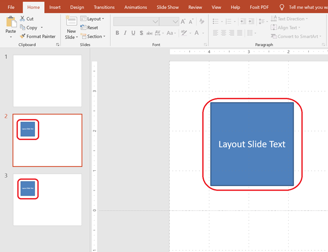

Artikel ini menunjukkan cara bekerja dengan **Layout Slides** di Aspose.Slides untuk PHP via Java. Sebuah layout slide mendefinisikan desain dan format yang diwarisi oleh slide biasa. Anda dapat menambahkan, mengakses, menggandakan, dan menghapus layout slide, serta membersihkan yang tidak terpakai untuk mengurangi ukuran presentasi.

## **Menambahkan Layout Slide**

Anda dapat membuat layout slide khusus untuk mendefinisikan format yang dapat digunakan kembali. Sebagai contoh, Anda dapat menambahkan kotak teks yang muncul di semua slide yang menggunakan layout ini.

```php
function addLayoutSlide() {
    $presentation = new Presentation();
    try {
        $masterSlide = $presentation->getMasters()->get_Item(0);

        // Buat slide tata letak dengan tipe tata letak kosong dan nama khusus.
        $layoutSlide = $presentation->getLayoutSlides()->add($masterSlide, SlideLayoutType::Blank, "Main layout");

        $presentation->save("layout_slide.pptx", SaveFormat::Pptx);
    } finally {
        $presentation->dispose();
    }
}
```

> 💡 **Tip 1:** Layout slide berfungsi sebagai templat untuk slide individual. Anda dapat mendefinisikan elemen umum sekali dan menggunakannya kembali di banyak slide.

> 💡 **Tip 2:** Saat Anda menambahkan bentuk atau teks ke layout slide, semua slide yang didasarkan pada layout tersebut akan menampilkan konten bersama ini secara otomatis.  
> Screenshot di bawah ini menunjukkan dua slide, masing‑masing mewarisi kotak teks dari layout slide yang sama.




## **Mengakses Layout Slide**

Layout slide dapat diakses berdasarkan indeks atau tipe layout (misalnya, `Blank`, `Title`, `SectionHeader`, dll.).

```php
function accessLayoutSlide() {
    $presentation = new Presentation("layout_slide.pptx");
    try {
        // Akses berdasarkan indeks.
        $firstLayoutSlide = $presentation->getLayoutSlides()->get_Item(0);

        // Akses berdasarkan tipe tata letak.
        $blankLayoutSlide = $presentation->getLayoutSlides()->getByType(SlideLayoutType::Blank);
    } finally {
        $presentation->dispose();
    }
}
```

## **Menghapus Layout Slide**

Anda dapat menghapus layout slide tertentu jika tidak lagi diperlukan.

```php
function removeLayoutSlide() {
    $presentation = new Presentation("layout_slide.pptx");
    try {
        // Dapatkan slide tata letak berdasarkan tipe dan hapus.
        $layoutSlide = $presentation->getLayoutSlides()->getByType(SlideLayoutType::Custom);
        $presentation->getLayoutSlides()->remove($layoutSlide);

        $presentation->save("layout_slide_removed.pptx", SaveFormat::Pptx);
    } finally {
        $presentation->dispose();
    }
}
```

## **Menghapus Layout Slide yang Tidak Digunakan**

Untuk mengurangi ukuran presentasi, Anda mungkin ingin menghapus layout slide yang tidak digunakan oleh slide biasa mana pun.

```php
function removeUnusedLayoutSlides() {
    $presentation = new Presentation("layout_slide.pptx");
    try {
        // Secara otomatis menghapus semua slide tata letak yang tidak direferensikan oleh slide mana pun.
        $presentation->getLayoutSlides()->removeUnused();

        $presentation->save("layout_slides_removed.pptx", SaveFormat::Pptx);
    } finally {
        $presentation->dispose();
    }
}
```

## **Menggandakan Layout Slide**

Anda dapat menduplikasi layout slide menggunakan metode `addClone`.

```php
function cloneLayoutSlides() {
    $presentation = new Presentation("layout_slide.pptx");
    try {
        // Dapatkan slide tata letak yang ada berdasarkan tipe.
        $blankLayoutSlide = $presentation->getLayoutSlides()->getByType(SlideLayoutType::Blank);

        // Gandakan slide tata letak ke akhir koleksi slide tata letak.
        $clonedLayoutSlide = $presentation->getLayoutSlides()->addClone($blankLayoutSlide);

        $presentation->save("layout_slide_cloned.pptx", SaveFormat::Pptx);
    } finally {
        $presentation->dispose();
    }
}
```

> ✅ **Ringkasan:** Layout slide adalah alat yang kuat untuk mengelola format konsisten di seluruh slide. Aspose.Slides memungkinkan kontrol penuh atas pembuatan, pengelolaan, dan optimalisasi layout slide.