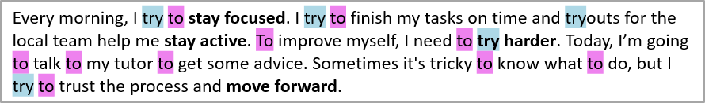

## **Gambaran Umum**

Aspose.Slides for Python via Java dapat mencari, menyorot, dan mengganti teks dalam satu frame teks atau di seluruh presentasi. Setiap operasi juga dapat memberitahu aplikasi tentang setiap kecocokan melalui callback hasil. Hal ini memungkinkan pembaruan presentasi dan secara bersamaan membangun jejak audit yang berisi teks yang cocok, konteksnya, posisi, frame teks, dan nomor slide.

Kemampuan ini berguna untuk peninjauan, penyensoran, pemeriksaan terminologi, pembersihan templat, dan alur kerja pelaporan otomatis.

Dalam contoh pertama di bawah ini, kami menggunakan file bernama "sample.pptx", yang berisi satu kotak teks pada slide pertama dengan teks berikut:


## **Pilih Lingkup Pencarian**

Gunakan metode pada [TextFrame](https://reference.aspose.com/slides/id/python-java/aspose.slides/textframe/) untuk membatasi operasi pada satu frame teks. Gunakan metode pada [Presentation](https://reference.aspose.com/slides/id/python-java/aspose.slides/presentation/) untuk memproses semua teks yang relevan dalam presentasi.

| Operasi | Satu frame teks | Seluruh presentasi |
|---|---|---|
| Sorot teks literal | [TextFrame.highlightText](https://reference.aspose.com/slides/id/python-java/aspose.slides/textframe/#highlightText) | [Presentation.highlightText](https://reference.aspose.com/slides/id/python-java/aspose.slides/presentation/#highlightText) |
| Sorot kecocokan ekspresi reguler | [TextFrame.highlightRegex](https://reference.aspose.com/slides/id/python-java/aspose.slides/textframe/#highlightRegex) | [Presentation.highlightRegex](https://reference.aspose.com/slides/id/python-java/aspose.slides/presentation/#highlightRegex) |
| Ganti teks literal | [TextFrame.replaceText](https://reference.aspose.com/slides/id/python-java/aspose.slides/textframe/#replaceText) | [Presentation.replaceText](https://reference.aspose.com/slides/id/python-java/aspose.slides/presentation/#replaceText) |
| Ganti kecocokan ekspresi reguler | [TextFrame.replaceRegex](https://reference.aspose.com/slides/id/python-java/aspose.slides/textframe/#replaceRegex) | [Presentation.replaceRegex](https://reference.aspose.com/slides/id/python-java/aspose.slides/presentation/#replaceRegex) |

## **Konfigurasikan Pencocokan Teks**

Untuk operasi teks literal, gunakan [TextSearchOptions](https://reference.aspose.com/slides/id/python-java/aspose.slides/textsearchoptions/) untuk mengontrol pencocokan:

- [setWholeWordsOnly](https://reference.aspose.com/slides/id/python-java/aspose.slides/textsearchoptions/#setWholeWordsOnly) membatasi kecocokan hanya pada kata lengkap.  
- [setCaseSensitive](https://reference.aspose.com/slides/id/python-java/aspose.slides/textsearchoptions/#setCaseSensitive) mengontrol apakah huruf harus cocok dengan kasus.  
- [setIncludeNotes](https://reference.aspose.com/slides/id/python-java/aspose.slides/textsearchoptions/#setIncludeNotes) menyertakan catatan slide dalam pencarian, penggantian, dan operasi penyorotan pada tingkat presentasi.  

Operasi ekspresi reguler menggunakan `Pattern` Java, sehingga aturan pencocokan seperti sensitivitas huruf dan batas kata ditentukan oleh ekspresi dan flag‑nya.

## **Identifikasi Pemilik Frame Teks**

Alur kerja pemrosesan teks umum sering menerima sebuah [TextFrame](https://reference.aspose.com/slides/id/python-java/aspose.slides/textframe/) saat mencari, mengganti, memvalidasi, atau mengekspor teks. Gunakan [TextFrame.getParentShape](https://reference.aspose.com/slides/id/python-java/aspose.slides/textframe/#getParentShape) dan [TextFrame.getParentCell](https://reference.aspose.com/slides/id/python-java/aspose.slides/textframe/#getParentCell) untuk menentukan objek presentasi mana yang memiliki frame teks tersebut.

Nilai yang diharapkan tergantung pada pemiliknya:

| Pemilik frame teks | `getParentShape` | `getParentCell` |
|---|---|---|
| Sebuah [AutoShape](https://reference.aspose.com/slides/id/python-java/aspose.slides/autoshape/) atau bentuk lain yang berisi teks | Bentuk pemilik [Shape](https://reference.aspose.com/slides/id/python-java/aspose.slides/shape/) | `None` |
| Sebuah sel tabel | `None` | Sel pemilik [Cell](https://reference.aspose.com/slides/id/python-java/aspose.slides/cell/) |

Kedua metode menyediakan navigasi read‑only. Memanggilnya tidak memindahkan frame teks atau mengubah pemiliknya. Kode generik sebaiknya memeriksa kedua nilai untuk `None` dan menangani kemungkinan bahwa tidak ada pemilik yang tersedia.

Contoh berikut menggunakan [SlideUtil.getAllTextFrames](https://reference.aspose.com/slides/id/python-java/aspose.slides/slideutil/#getAllTextFrames) untuk mengiterasi frame teks dalam sebuah presentasi. Untuk bentuk, ia melaporkan nama bentuk, tipe runtime Java, dan slide yang memuatnya. Untuk sel tabel, ia melaporkan koordinat kolom dan baris berbasis nol serta slide yang memuatnya.

```python
import jpype
import asposeslides

if not jpype.isJVMStarted():
    jpype.startJVM()

from asposeslides.api import Presentation, SaveFormat, Slide, NotesSlide, SlideUtil, TextSearchOptions

presentation = Presentation("presentation.pptx")
try:
    text_frames = SlideUtil.getAllTextFrames(presentation, False)
    for text_frame in text_frames:
        owner_shape = text_frame.getParentShape()
        owner_cell = text_frame.getParentCell()
        if owner_shape is not None:
            shape_name = str(owner_shape.getName()) or "(unnamed)"
            shape_type = owner_shape.getClass().getSimpleName()
            base_slide = owner_shape.getSlide()
        elif owner_cell is not None:
            base_slide = owner_cell.getSlide()
        else:
            print("The text frame owner is not available as a shape or table cell.")
            continue

        if isinstance(base_slide, Slide):
            slide_label = f"slide {base_slide.getSlideNumber()}"
        elif isinstance(base_slide, NotesSlide):
            slide_label = f"notes for slide {base_slide.getParentSlide().getSlideNumber()}"
        else:
            slide_label = str(base_slide.getClass().getSimpleName())

        if owner_shape is not None:
            print(f"Shape: {shape_name}; type: {shape_type}; {slide_label}")
        else:
            print(f"Table cell: column {owner_cell.getFirstColumnIndex()}, row {owner_cell.getFirstRowIndex()}; {slide_label}")
finally:
    presentation.dispose()
```

Untuk konten SmartArt, iterasi bentuk dalam [SmartArtNode.getShapes](https://reference.aspose.com/slides/id/python-java/aspose.slides/smartartnode/#getShapes) dan akses setiap [SmartArtShape.getTextFrame](https://reference.aspose.com/slides/id/python-java/aspose.slides/smartartshape/#getTextFrame). Frame teks dapat ditelusuri ke bentuk terkait melalui [TextFrame.getParentShape](https://reference.aspose.com/slides/id/python-java/aspose.slides/textframe/#getParentShape), sementara [TextFrame.getParentCell](https://reference.aspose.com/slides/id/python-java/aspose.slides/textframe/#getParentCell) mengembalikan `None`. Oleh karena itu, cabang bentuk dalam contoh juga menangani teks dari node SmartArt.

## **Kumpulkan Informasi Kecocokan dengan Callback**

Implementasikan `IFindResultCallback` melalui `jpype.JProxy` untuk menerima notifikasi untuk setiap kecocokan. Metode `foundResult`‑nya menyediakan frame teks terkait, teks sumber, teks yang cocok, dan posisi kecocokan.

Callback tidak menerima nomor slide secara langsung. Implementasi di bawah ini menurunkannya dari slide induk dan juga menangani teks yang ditemukan di catatan slide. Parameter opsional nomor slide memungkinkan model hasil yang sama merepresentasikan teks yang terkait dengan tipe slide lain.

```python
import jpype
import asposeslides

if not jpype.isJVMStarted():
    jpype.startJVM()

from asposeslides.api import Presentation, SaveFormat, Slide, NotesSlide, SlideUtil, TextSearchOptions

class TextMatch:
    def __init__(self, text_frame, source_text, found_text, text_position, slide_number):
        self.text_frame = text_frame
        self.source_text = source_text
        self.found_text = found_text
        self.text_position = text_position
        self.slide_number = slide_number


class TextSearchCallback:
    def __init__(self):
        self.results = []

    def foundResult(self, text_frame, source_text, found_text, text_position):
        parent_shape = text_frame.getParentShape()
        parent_cell = text_frame.getParentCell()
        if parent_shape is not None:
            parent_slide = parent_shape.getSlide()
        elif parent_cell is not None:
            parent_slide = parent_cell.getSlide()
        else:
            parent_slide = text_frame.getSlide()

        slide_number = None
        if isinstance(parent_slide, Slide):
            slide_number = parent_slide.getSlideNumber()
        elif isinstance(parent_slide, NotesSlide):
            slide_number = parent_slide.getParentSlide().getSlideNumber()

        result = TextMatch(text_frame, str(source_text), str(found_text), text_position, slide_number)
        self.results.append(result)
```

Untuk operasi penggantian, `found_text` berisi teks asli yang cocok, sehingga callback dapat mencatat tepat istilah apa yang diganti.

## **Sorot Teks**

Gunakan metode [TextFrame.highlightText](https://reference.aspose.com/slides/id/python-java/aspose.slides/textframe/#highlightText) untuk menyorot kecocokan teks literal dalam sebuah frame teks. Berikan [TextSearchOptions](https://reference.aspose.com/slides/id/python-java/aspose.slides/textsearchoptions/) untuk mengontrol pencarian dan sebuah callback untuk mengumpulkan detail kecocokan.

Contoh kode di bawah ini menyorot semua kemunculan karakter **"try"** dan kemudian hanya menyorot kata lengkap **"to"**. Kedua pencarian melaporkan kecocokannya ke callback yang sama.

```python
import jpype
import asposeslides

if not jpype.isJVMStarted():
    jpype.startJVM()

from asposeslides.api import Presentation, SaveFormat, Slide, NotesSlide, SlideUtil, TextSearchOptions

Color = jpype.JClass("java.awt.Color")
Pattern = jpype.JClass("java.util.regex.Pattern")

class TextMatch:
    def __init__(self, text_frame, source_text, found_text, text_position, slide_number):
        self.text_frame = text_frame
        self.source_text = source_text
        self.found_text = found_text
        self.text_position = text_position
        self.slide_number = slide_number


class TextSearchCallback:
    def __init__(self):
        self.results = []

    def foundResult(self, text_frame, source_text, found_text, text_position):
        parent_shape = text_frame.getParentShape()
        parent_cell = text_frame.getParentCell()
        if parent_shape is not None:
            parent_slide = parent_shape.getSlide()
        elif parent_cell is not None:
            parent_slide = parent_cell.getSlide()
        else:
            parent_slide = text_frame.getSlide()

        slide_number = None
        if isinstance(parent_slide, Slide):
            slide_number = parent_slide.getSlideNumber()
        elif isinstance(parent_slide, NotesSlide):
            slide_number = parent_slide.getParentSlide().getSlideNumber()

        result = TextMatch(text_frame, str(source_text), str(found_text), text_position, slide_number)
        self.results.append(result)


presentation = Presentation("sample.pptx")
try:
    slide = presentation.getSlides().get_Item(0)
    shape = slide.getShapes().get_Item(0)
    callback_handler = TextSearchCallback()
    callback = jpype.JProxy("com.aspose.slides.IFindResultCallback", inst=callback_handler)

    substring_search_options = TextSearchOptions()
    substring_search_options.setCaseSensitive(False)
    substring_highlight_color = Color(173, 216, 230)

    # Sorot setiap kemunculan "try" dalam frame teks.
    shape.getTextFrame().highlightText("try", substring_highlight_color, substring_search_options, callback)

    whole_word_search_options = TextSearchOptions()
    whole_word_search_options.setWholeWordsOnly(True)
    whole_word_search_options.setCaseSensitive(False)
    whole_word_highlight_color = Color(238, 130, 238)

    # Sorot hanya kata lengkap "to".
    shape.getTextFrame().highlightText("to", whole_word_highlight_color, whole_word_search_options, callback)

    for result in callback_handler.results:
        print(f"Found '{result.found_text}' at position {result.text_position} on slide {result.slide_number}.")

    presentation.save("highlighted_text.pptx", SaveFormat.Pptx)
finally:
    presentation.dispose()
```

Hasil:



## **Sorot Teks Dengan Ekspresi Reguler**

Metode [TextFrame.highlightRegex](https://reference.aspose.com/slides/id/python-java/aspose.slides/textframe/#highlightRegex) menyorot teks yang cocok dengan ekspresi reguler dalam sebuah frame teks.

Kode berikut menyorot semua kata yang berisi tujuh karakter atau lebih serta mengumpulkan setiap kecocokan:

```python
import jpype
import asposeslides

if not jpype.isJVMStarted():
    jpype.startJVM()

from asposeslides.api import Presentation, SaveFormat, Slide, NotesSlide, SlideUtil, TextSearchOptions

Color = jpype.JClass("java.awt.Color")
Pattern = jpype.JClass("java.util.regex.Pattern")

class TextMatch:
    def __init__(self, text_frame, source_text, found_text, text_position, slide_number):
        self.text_frame = text_frame
        self.source_text = source_text
        self.found_text = found_text
        self.text_position = text_position
        self.slide_number = slide_number


class TextSearchCallback:
    def __init__(self):
        self.results = []

    def foundResult(self, text_frame, source_text, found_text, text_position):
        parent_shape = text_frame.getParentShape()
        parent_cell = text_frame.getParentCell()
        if parent_shape is not None:
            parent_slide = parent_shape.getSlide()
        elif parent_cell is not None:
            parent_slide = parent_cell.getSlide()
        else:
            parent_slide = text_frame.getSlide()

        slide_number = None
        if isinstance(parent_slide, Slide):
            slide_number = parent_slide.getSlideNumber()
        elif isinstance(parent_slide, NotesSlide):
            slide_number = parent_slide.getParentSlide().getSlideNumber()

        result = TextMatch(text_frame, str(source_text), str(found_text), text_position, slide_number)
        self.results.append(result)


presentation = Presentation("sample.pptx")
try:
    slide = presentation.getSlides().get_Item(0)
    shape = slide.getShapes().get_Item(0)
    callback_handler = TextSearchCallback()
    callback = jpype.JProxy("com.aspose.slides.IFindResultCallback", inst=callback_handler)
    regex = Pattern.compile("\\b[^\\s]{7,}\\b")

    shape.getTextFrame().highlightRegex(regex, Color.YELLOW, callback)

    presentation.save("highlighted_text_using_regex.pptx", SaveFormat.Pptx)
finally:
    presentation.dispose()
```

Hasil:


## **Sorot Teks Di Seluruh Presentasi**

Gunakan [Presentation.highlightText](https://reference.aspose.com/slides/id/python-java/aspose.slides/presentation/#highlightText) dan [Presentation.highlightRegex](https://reference.aspose.com/slides/id/python-java/aspose.slides/presentation/#highlightRegex) untuk mencari semua frame teks yang relevan dalam sebuah presentasi. Contoh berikut menyorot istilah literal dan semua alamat email sambil mempertahankan koleksi hasil terpisah untuk dua pencarian tersebut.

```python
import jpype
import asposeslides

if not jpype.isJVMStarted():
    jpype.startJVM()

from asposeslides.api import Presentation, SaveFormat, Slide, NotesSlide, SlideUtil, TextSearchOptions

Color = jpype.JClass("java.awt.Color")
Pattern = jpype.JClass("java.util.regex.Pattern")

class TextMatch:
    def __init__(self, text_frame, source_text, found_text, text_position, slide_number):
        self.text_frame = text_frame
        self.source_text = source_text
        self.found_text = found_text
        self.text_position = text_position
        self.slide_number = slide_number


class TextSearchCallback:
    def __init__(self):
        self.results = []

    def foundResult(self, text_frame, source_text, found_text, text_position):
        parent_shape = text_frame.getParentShape()
        parent_cell = text_frame.getParentCell()
        if parent_shape is not None:
            parent_slide = parent_shape.getSlide()
        elif parent_cell is not None:
            parent_slide = parent_cell.getSlide()
        else:
            parent_slide = text_frame.getSlide()

        slide_number = None
        if isinstance(parent_slide, Slide):
            slide_number = parent_slide.getSlideNumber()
        elif isinstance(parent_slide, NotesSlide):
            slide_number = parent_slide.getParentSlide().getSlideNumber()

        result = TextMatch(text_frame, str(source_text), str(found_text), text_position, slide_number)
        self.results.append(result)


presentation = Presentation("presentation.pptx")
try:
    term_callback_handler = TextSearchCallback()
    term_callback = jpype.JProxy("com.aspose.slides.IFindResultCallback", inst=term_callback_handler)
    search_options = TextSearchOptions()
    search_options.setWholeWordsOnly(True)
    search_options.setCaseSensitive(False)

    presentation.highlightText("confidential", Color.ORANGE, search_options, term_callback)

    email_callback_handler = TextSearchCallback()
    email_callback = jpype.JProxy("com.aspose.slides.IFindResultCallback", inst=email_callback_handler)
    email_regex = Pattern.compile("\\b[A-Z0-9._%+-]+@[A-Z0-9.-]+\\.[A-Z]{2,}\\b", Pattern.CASE_INSENSITIVE)

    presentation.highlightRegex(email_regex, Color.YELLOW, email_callback)
    presentation.save("highlighted_presentation.pptx", SaveFormat.Pptx)
finally:
    presentation.dispose()
```

## **Ganti Teks di Frame Teks**

Gunakan [TextFrame.replaceText](https://reference.aspose.com/slides/id/python-java/aspose.slides/textframe/#replaceText) untuk teks literal dan [TextFrame.replaceRegex](https://reference.aspose.com/slides/id/python-java/aspose.slides/textframe/#replaceRegex) untuk penggantian berbasis pola. Metode‑metode ini memperbarui teks yang cocok dalam frame teks yang ada, sehingga format bagian di sekitarnya tetap dipertahankan alih‑alih membangun kembali frame teks dari string polos.

Contoh berikut menstandarkan varian ejaan lalu mengganti label versi. Callback yang sama mencatat istilah asli yang cocok pada kedua operasi.

```python
import jpype
import asposeslides

if not jpype.isJVMStarted():
    jpype.startJVM()

from asposeslides.api import Presentation, SaveFormat, Slide, NotesSlide, SlideUtil, TextSearchOptions

Color = jpype.JClass("java.awt.Color")
Pattern = jpype.JClass("java.util.regex.Pattern")

class TextMatch:
    def __init__(self, text_frame, source_text, found_text, text_position, slide_number):
        self.text_frame = text_frame
        self.source_text = source_text
        self.found_text = found_text
        self.text_position = text_position
        self.slide_number = slide_number


class TextSearchCallback:
    def __init__(self):
        self.results = []

    def foundResult(self, text_frame, source_text, found_text, text_position):
        parent_shape = text_frame.getParentShape()
        parent_cell = text_frame.getParentCell()
        if parent_shape is not None:
            parent_slide = parent_shape.getSlide()
        elif parent_cell is not None:
            parent_slide = parent_cell.getSlide()
        else:
            parent_slide = text_frame.getSlide()

        slide_number = None
        if isinstance(parent_slide, Slide):
            slide_number = parent_slide.getSlideNumber()
        elif isinstance(parent_slide, NotesSlide):
            slide_number = parent_slide.getParentSlide().getSlideNumber()

        result = TextMatch(text_frame, str(source_text), str(found_text), text_position, slide_number)
        self.results.append(result)


presentation = Presentation("presentation.pptx")
try:
    slide = presentation.getSlides().get_Item(0)
    shape = slide.getShapes().get_Item(0)
    callback_handler = TextSearchCallback()
    callback = jpype.JProxy("com.aspose.slides.IFindResultCallback", inst=callback_handler)
    search_options = TextSearchOptions()
    search_options.setWholeWordsOnly(True)
    search_options.setCaseSensitive(False)

    shape.getTextFrame().replaceText("colour", "color", search_options, callback)

    version_regex = Pattern.compile("\\bv\\d+(?:\\.\\d+)*\\b", Pattern.CASE_INSENSITIVE)
    shape.getTextFrame().replaceRegex(version_regex, "current version", callback)

    presentation.save("updated_text_frame.pptx", SaveFormat.Pptx)
finally:
    presentation.dispose()
```

Jika satu kecocokan melintasi bagian dengan format berbeda, tinjau output untuk memastikan format mana yang harus diterapkan pada teks pengganti.

## **Ganti Teks Di Seluruh Presentasi**

Gunakan [Presentation.replaceText](https://reference.aspose.com/slides/id/python-java/aspose.slides/presentation/#replaceText) dan [Presentation.replaceRegex](https://reference.aspose.com/slides/id/python-java/aspose.slides/presentation/#replaceRegex) untuk menerapkan operasi yang sama ke seluruh presentasi. Ini berguna untuk pembersihan templat, pembaruan terminologi, dan penyensoran.

```python
import jpype
import asposeslides

if not jpype.isJVMStarted():
    jpype.startJVM()

from asposeslides.api import Presentation, SaveFormat, Slide, NotesSlide, SlideUtil, TextSearchOptions

Color = jpype.JClass("java.awt.Color")
Pattern = jpype.JClass("java.util.regex.Pattern")

class TextMatch:
    def __init__(self, text_frame, source_text, found_text, text_position, slide_number):
        self.text_frame = text_frame
        self.source_text = source_text
        self.found_text = found_text
        self.text_position = text_position
        self.slide_number = slide_number


class TextSearchCallback:
    def __init__(self):
        self.results = []

    def foundResult(self, text_frame, source_text, found_text, text_position):
        parent_shape = text_frame.getParentShape()
        parent_cell = text_frame.getParentCell()
        if parent_shape is not None:
            parent_slide = parent_shape.getSlide()
        elif parent_cell is not None:
            parent_slide = parent_cell.getSlide()
        else:
            parent_slide = text_frame.getSlide()

        slide_number = None
        if isinstance(parent_slide, Slide):
            slide_number = parent_slide.getSlideNumber()
        elif isinstance(parent_slide, NotesSlide):
            slide_number = parent_slide.getParentSlide().getSlideNumber()

        result = TextMatch(text_frame, str(source_text), str(found_text), text_position, slide_number)
        self.results.append(result)


presentation = Presentation("presentation.pptx")
try:
    callback_handler = TextSearchCallback()
    callback = jpype.JProxy("com.aspose.slides.IFindResultCallback", inst=callback_handler)
    search_options = TextSearchOptions()
    search_options.setWholeWordsOnly(True)
    search_options.setCaseSensitive(True)

    presentation.replaceText("Contoso", "Example Corp", search_options, callback)

    account_number_regex = Pattern.compile("\\bACCT-\\d{6}\\b")
    presentation.replaceRegex(account_number_regex, "ACCT-REDACTED", callback)

    presentation.save("updated_presentation.pptx", SaveFormat.Pptx)
finally:
    presentation.dispose()
```

## **Kelompokkan Kecocokan untuk Pelaporan**

Karena setiap hasil menyimpan nomor slide dan frame teks, aplikasi dapat mengelompokkan kecocokan untuk audit, pelaporan, atau alur kerja peninjauan. Contoh berikut mengelompokkan hasil yang dikumpulkan pertama berdasarkan slide lalu berdasarkan frame teks.

```python
import jpype
import asposeslides

if not jpype.isJVMStarted():
    jpype.startJVM()

from asposeslides.api import Presentation, SaveFormat, Slide, NotesSlide, SlideUtil, TextSearchOptions

Color = jpype.JClass("java.awt.Color")
Pattern = jpype.JClass("java.util.regex.Pattern")

class TextMatch:
    def __init__(self, text_frame, source_text, found_text, text_position, slide_number):
        self.text_frame = text_frame
        self.source_text = source_text
        self.found_text = found_text
        self.text_position = text_position
        self.slide_number = slide_number


class TextSearchCallback:
    def __init__(self):
        self.results = []

    def foundResult(self, text_frame, source_text, found_text, text_position):
        parent_shape = text_frame.getParentShape()
        parent_cell = text_frame.getParentCell()
        if parent_shape is not None:
            parent_slide = parent_shape.getSlide()
        elif parent_cell is not None:
            parent_slide = parent_cell.getSlide()
        else:
            parent_slide = text_frame.getSlide()

        slide_number = None
        if isinstance(parent_slide, Slide):
            slide_number = parent_slide.getSlideNumber()
        elif isinstance(parent_slide, NotesSlide):
            slide_number = parent_slide.getParentSlide().getSlideNumber()

        result = TextMatch(text_frame, str(source_text), str(found_text), text_position, slide_number)
        self.results.append(result)


presentation = Presentation("presentation.pptx")
try:
    callback_handler = TextSearchCallback()
    callback = jpype.JProxy("com.aspose.slides.IFindResultCallback", inst=callback_handler)
    search_options = TextSearchOptions()
    search_options.setWholeWordsOnly(True)
    search_options.setCaseSensitive(True)

    presentation.replaceText("Contoso", "Example Corp", search_options, callback)

    account_number_regex = Pattern.compile("\\bACCT-\\d{6}\\b")
    presentation.replaceRegex(account_number_regex, "ACCT-REDACTED", callback)

    presentation.save("updated_presentation.pptx", SaveFormat.Pptx)
    matches_by_slide = {}
    for result in callback_handler.results:
        matches_by_text_frame = matches_by_slide.setdefault(result.slide_number, {})
        text_frame_matches = matches_by_text_frame.setdefault(result.text_frame, [])
        text_frame_matches.append(result)

    for slide_number, matches_by_text_frame in matches_by_slide.items():
        slide_label = "Other" if slide_number is None else str(slide_number)
        print(f"Slide: {slide_label}")
        for text_frame, results in matches_by_text_frame.items():
            print(f"  Text frame: {text_frame.getText()}")
            for result in results:
                print(f"    '{result.found_text}' at position {result.text_position}; context: '{result.source_text}'")
finally:
    presentation.dispose()
```

## **FAQ**

**Bagaimana saya dapat mencari hanya satu kotak teks alih‑alih seluruh presentasi?**

Dapatkan frame teks bentuk dan panggil [TextFrame.highlightText](https://reference.aspose.com/slides/id/python-java/aspose.slides/textframe/#highlightText), [TextFrame.highlightRegex](https://reference.aspose.com/slides/id/python-java/aspose.slides/textframe/#highlightRegex), [TextFrame.replaceText](https://reference.aspose.com/slides/id/python-java/aspose.slides/textframe/#replaceText), atau [TextFrame.replaceRegex](https://reference.aspose.com/slides/id/python-java/aspose.slides/textframe/#replaceRegex) pada frame teks tersebut. Metode tingkat presentasi memproses semua frame teks yang relevan.

**Bagaimana saya dapat mencocokkan kata lengkap dengan kapitalisasi yang tepat?**

Setel [TextSearchOptions.setWholeWordsOnly](https://reference.aspose.com/slides/id/python-java/aspose.slides/textsearchoptions/#setWholeWordsOnly) dan [TextSearchOptions.setCaseSensitive](https://reference.aspose.com/slides/id/python-java/aspose.slides/textsearchoptions/#setCaseSensitive) ke `True`, lalu berikan opsi tersebut ke metode penyorotan atau penggantian teks literal. Untuk ekspresi reguler, definisikan batas kata dan sensitivitas huruf dalam `Pattern` Java itu sendiri.

**Apakah pencarian dan penggantian dapat mencakup teks dalam catatan slide?**

Ya. Setel [TextSearchOptions.setIncludeNotes](https://reference.aspose.com/slides/id/python-java/aspose.slides/textsearchoptions/#setIncludeNotes) ke `True` saat menggunakan operasi teks literal tingkat presentasi. Implementasi callback yang ditunjukkan di atas memetakan kecocokan dalam slide catatan kembali ke nomor slide induknya.

**Bagaimana saya dapat membuat laporan tanpa memindai presentasi lagi?**

Berikan implementasi `IFindResultCallback` ke operasi penyorotan atau penggantian. Callback menerima setiap kecocokan saat operasi berjalan, sehingga aplikasi dapat menyimpan teks sumber, teks yang cocok, posisi, frame teks, dan nomor slide yang diturunkan untuk pengelompokan atau ekspor nanti.

**Apakah mengganti teks mempertahankan formatnya?**

[TextFrame.replaceText](https://reference.aspose.com/slides/id/python-java/aspose.slides/textframe/#replaceText) dan [TextFrame.replaceRegex](https://reference.aspose.com/slides/id/python-java/aspose.slides/textframe/#replaceRegex) memodifikasi teks yang cocok dalam frame teks yang ada dan mempertahankan format bagian di sekitarnya. Jika sebuah kecocokan melintasi bagian dengan format berbeda, periksa hasilnya untuk memastikan penggantian menggunakan gaya yang diinginkan.