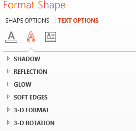

## **Ikhtisar**

Efek WordArt memungkinkan Anda menambahkan teks yang menarik secara visual dan bergaya ke presentasi PowerPoint Anda. Dengan Aspose.Slides, pengembang dapat secara programatis membuat, menyesuaikan, dan mengelola WordArt persis seperti di Microsoft PowerPoint—tanpa harus menginstal Office. Artikel ini memberikan ikhtisar tentang cara bekerja dengan WordArt, termasuk cara menerapkan transformasi teks, gaya isi, garis tepi, bayangan, dan opsi pemformatan lainnya untuk membuat konten presentasi Anda lebih ekspresif dan menarik. WordArt memungkinkan Anda memperlakukan teks sebagai objek grafis. Ia terdiri dari efek atau modifikasi khusus yang diterapkan pada teks agar lebih menarik atau mudah terlihat.

## **Buat Template WordArt Sederhana dan Terapkan ke Teks**

**Menggunakan Aspose.Slides**

Pertama, kami membuat teks sederhana menggunakan kode Python ini:

```python
import jpype
import asposeslides

if not jpype.isJVMStarted():
    jpype.startJVM()

from asposeslides.api import Presentation, ShapeType

presentation = Presentation()
try:
    slide = presentation.getSlides().get_Item(0)
    auto_shape = slide.getShapes().addAutoShape(ShapeType.Rectangle, 200, 200, 400, 200)
    text_frame = auto_shape.getTextFrame()

    portion = text_frame.getParagraphs().get_Item(0).getPortions().get_Item(0)
    portion.setText("Aspose.Slides")
finally:
    presentation.dispose()
```
Selanjutnya, tingkatkan ukuran font untuk membuat efek lebih terlihat:

```python
import jpype
import asposeslides

if not jpype.isJVMStarted():
    jpype.startJVM()

from asposeslides.api import FontData, Presentation, ShapeType

presentation = Presentation()
try:
    slide = presentation.getSlides().get_Item(0)
    auto_shape = slide.getShapes().addAutoShape(ShapeType.Rectangle, 200, 200, 400, 200)
    text_frame = auto_shape.getTextFrame()
    portion = text_frame.getParagraphs().get_Item(0).getPortions().get_Item(0)
    portion.setText("Aspose.Slides")

    font_data = FontData("Arial Black")
    portion_format = portion.getPortionFormat()
    portion_format.setLatinFont(font_data)
    portion_format.setFontHeight(36)
finally:
    presentation.dispose()
```

**Menggunakan Microsoft PowerPoint**

Buka menu efek WordArt di Microsoft PowerPoint:


Dari menu di kanan, Anda dapat memilih efek WordArt yang telah ditentukan sebelumnya. Dari menu di kiri, Anda dapat menentukan pengaturan untuk WordArt baru.

Berikut beberapa parameter atau opsi yang tersedia:


**Menggunakan Aspose.Slides**

Di sini, kami menerapkan pola isi [PatternStyle.SmallGrid](https://reference.aspose.com/slides/id/python-java/aspose.slides/patternstyle/#SmallGrid) ke teks dan menambahkan garis tepi teks berwarna hitam menggunakan kode berikut:

```python
import jpype
import asposeslides

if not jpype.isJVMStarted():
    jpype.startJVM()

from asposeslides.api import FillType, PatternStyle, Presentation, ShapeType
from java.awt import Color

presentation = Presentation()
try:
    slide = presentation.getSlides().get_Item(0)
    auto_shape = slide.getShapes().addAutoShape(ShapeType.Rectangle, 200, 200, 400, 200)
    text_frame = auto_shape.getTextFrame()
    portion = text_frame.getParagraphs().get_Item(0).getPortions().get_Item(0)
    portion.setText("Aspose.Slides")

    portion_format = portion.getPortionFormat()
    portion_format.getFillFormat().setFillType(FillType.Pattern)
    pattern_format = portion_format.getFillFormat().getPatternFormat()
    pattern_format.getForeColor().setColor(Color.ORANGE)
    pattern_format.getBackColor().setColor(Color.WHITE)
    pattern_format.setPatternStyle(PatternStyle.SmallGrid)

    line_format = portion_format.getLineFormat()
    line_format.getFillFormat().setFillType(FillType.Solid)
    line_format.getFillFormat().getSolidFillColor().setColor(Color.BLACK)
finally:
    presentation.dispose()
```

Teks yang dihasilkan:


## **Menerapkan Efek WordArt Lainnya**

**Menggunakan Microsoft PowerPoint**

Dari antarmuka program, Anda dapat menerapkan efek-efek ini ke teks, blok teks, bentuk, atau elemen serupa:



Sebagai contoh, efek Bayangan, Refleksi, dan Glowing dapat diterapkan pada teks; Format 3D dan Rotasi 3D dapat diterapkan pada blok teks; efek Soft Edges dapat diterapkan pada bentuk (efek tetap ada meskipun tidak ada efek Format 3D yang diatur).

### **Menerapkan Efek Bayangan**

Kode Python berikut menerapkan efek bayangan hanya pada teks:

```python
import jpype
import asposeslides

if not jpype.isJVMStarted():
    jpype.startJVM()

from asposeslides.api import ColorTransformOperation, Presentation, ShapeType
from java.awt import Color

presentation = Presentation()
try:
    slide = presentation.getSlides().get_Item(0)
    auto_shape = slide.getShapes().addAutoShape(ShapeType.Rectangle, 200, 200, 400, 200)
    text_frame = auto_shape.getTextFrame()
    portion = text_frame.getParagraphs().get_Item(0).getPortions().get_Item(0)
    portion.setText("Aspose.Slides")

    portion_format = portion.getPortionFormat()
    portion_format.getEffectFormat().enableOuterShadowEffect()
    outer_shadow = portion_format.getEffectFormat().getOuterShadowEffect()
    outer_shadow.getShadowColor().setColor(Color.BLACK)
    outer_shadow.setScaleHorizontal(100)
    outer_shadow.setScaleVertical(65)
    outer_shadow.setBlurRadius(4.73)
    outer_shadow.setDirection(230)
    outer_shadow.setDistance(2)
    outer_shadow.setSkewHorizontal(30)
    outer_shadow.setSkewVertical(0)
    outer_shadow.getShadowColor().getColorTransform().add(ColorTransformOperation.SetAlpha, 0.32)
finally:
    presentation.dispose()
```

API Aspose.Slides mendukung tiga tipe bayangan: [OuterShadow](https://reference.aspose.com/slides/id/python-java/aspose.slides/outershadow/), [InnerShadow](https://reference.aspose.com/slides/id/python-java/aspose.slides/innershadow/), dan [PresetShadow](https://reference.aspose.com/slides/id/python-java/aspose.slides/presetshadow/).

Dengan [PresetShadow](https://reference.aspose.com/slides/id/python-java/aspose.slides/presetshadow/), Anda dapat menerapkan bayangan ke teks menggunakan nilai preset.

**Menggunakan Microsoft PowerPoint**

Di PowerPoint, Anda dapat menggunakan satu tipe bayangan. Berikut contohnya:


**Menggunakan Aspose.Slides**

Aspose.Slides sebenarnya memungkinkan Anda menerapkan dua tipe bayangan sekaligus: [InnerShadow](https://reference.aspose.com/slides/id/python-java/aspose.slides/innershadow/) dan [PresetShadow](https://reference.aspose.com/slides/id/python-java/aspose.slides/presetshadow/).

**Catatan:**

- Saat [OuterShadow](https://reference.aspose.com/slides/id/python-java/aspose.slides/outershadow/) dan [PresetShadow](https://reference.aspose.com/slides/id/python-java/aspose.slides/presetshadow/) digunakan bersama, hanya efek [OuterShadow](https://reference.aspose.com/slides/id/python-java/aspose.slides/outershadow/) yang diterapkan.
- Jika [OuterShadow](https://reference.aspose.com/slides/id/python-java/aspose.slides/outershadow/) dan [InnerShadow](https://reference.aspose.com/slides/id/python-java/aspose.slides/innershadow/) digunakan secara bersamaan, efek yang dihasilkan atau diterapkan bergantung pada versi PowerPoint. Misalnya, di PowerPoint 2013, efeknya menjadi ganda. Namun di PowerPoint 2007, efek [OuterShadow](https://reference.aspose.com/slides/id/python-java/aspose.slides/outershadow/) yang diterapkan.

### **Menerapkan Refleksi pada Teks**

Kami menambahkan refleksi pada teks melalui contoh kode Python via Java berikut:

```python
import jpype
import asposeslides

if not jpype.isJVMStarted():
    jpype.startJVM()

from asposeslides.api import Presentation, RectangleAlignment, ShapeType

presentation = Presentation()
try:
    slide = presentation.getSlides().get_Item(0)
    auto_shape = slide.getShapes().addAutoShape(ShapeType.Rectangle, 200, 200, 400, 200)
    text_frame = auto_shape.getTextFrame()
    portion = text_frame.getParagraphs().get_Item(0).getPortions().get_Item(0)
    portion.setText("Aspose.Slides")

    portion_format = portion.getPortionFormat()
    portion_format.getEffectFormat().enableReflectionEffect()
    reflection = portion_format.getEffectFormat().getReflectionEffect()
    reflection.setBlurRadius(0.5)
    reflection.setDistance(4.72)
    reflection.setStartPosAlpha(0)
    reflection.setEndPosAlpha(60)
    reflection.setDirection(90)
    reflection.setScaleHorizontal(100)
    reflection.setScaleVertical(-100)
    reflection.setStartReflectionOpacity(60)
    reflection.setEndReflectionOpacity(0.9)
    reflection.setRectangleAlign(RectangleAlignment.BottomLeft)
finally:
    presentation.dispose()
```

### **Menerapkan Efek Glowing pada Teks**

Kami menerapkan efek glowing pada teks agar bersinar atau menonjol menggunakan kode berikut:

```python
import jpype
import asposeslides

if not jpype.isJVMStarted():
    jpype.startJVM()

from asposeslides.api import ColorTransformOperation, Presentation, ShapeType

presentation = Presentation()
try:
    slide = presentation.getSlides().get_Item(0)
    auto_shape = slide.getShapes().addAutoShape(ShapeType.Rectangle, 200, 200, 400, 200)
    text_frame = auto_shape.getTextFrame()
    portion = text_frame.getParagraphs().get_Item(0).getPortions().get_Item(0)
    portion.setText("Aspose.Slides")

    portion_format = portion.getPortionFormat()
    portion_format.getEffectFormat().enableGlowEffect()
    glow = portion_format.getEffectFormat().getGlowEffect()
    glow.getColor().setR(jpype.JByte(-1))
    glow.getColor().getColorTransform().add(ColorTransformOperation.SetAlpha, 0.54)
    glow.setRadius(7)
finally:
    presentation.dispose()
```

Hasil operasi:


{}

Anda dapat mengubah parameter untuk bayangan, refleksi, dan glowing. Properti efek diatur secara terpisah pada setiap bagian teks.

{}

### **Menggunakan Transformasi pada WordArt**

Gunakan [TextFrameFormat.setTransform](https://reference.aspose.com/slides/id/python-java/aspose.slides/textframeformat/#setTransform) untuk mentransformasi seluruh blok teks:

```python
import jpype
import asposeslides

if not jpype.isJVMStarted():
    jpype.startJVM()

from asposeslides.api import Presentation, ShapeType, TextShapeType

presentation = Presentation()
try:
    slide = presentation.getSlides().get_Item(0)
    auto_shape = slide.getShapes().addAutoShape(ShapeType.Rectangle, 200, 200, 400, 200)
    text_frame = auto_shape.getTextFrame()
    text_frame.setText("Aspose.Slides")

    text_frame.getTextFrameFormat().setTransform(TextShapeType.ArchUpPour)
finally:
    presentation.dispose()
```

Hasilnya:


{}

Baik Microsoft PowerPoint maupun Aspose.Slides for Python via Java menyediakan sejumlah tipe transformasi yang telah ditentukan.

{}

**Menggunakan PowerPoint**

Untuk mengakses tipe transformasi yang telah ditentukan, masuk ke: **Format** -> **TextEffect** -> **Transform**

**Menggunakan Aspose.Slides**

Untuk memilih tipe transformasi, gunakan enumerasi [TextShapeType](https://reference.aspose.com/slides/id/python-java/aspose.slides/textshapetype/).

### **Menerapkan Efek 3D pada Teks dan Bentuk**

Kami menerapkan efek 3D pada bentuk teks menggunakan contoh kode berikut:

```python
import jpype
import asposeslides

if not jpype.isJVMStarted():
    jpype.startJVM()

from asposeslides.api import BevelPresetType, CameraPresetType, LightRigPresetType, LightingDirection, MaterialPresetType, Presentation, ShapeType
from java.awt import Color

presentation = Presentation()
try:
    slide = presentation.getSlides().get_Item(0)
    auto_shape = slide.getShapes().addAutoShape(ShapeType.Rectangle, 200, 200, 400, 200)
    auto_shape.getTextFrame().setText("Aspose.Slides")

    three_d_format = auto_shape.getThreeDFormat()
    three_d_format.getBevelBottom().setBevelType(BevelPresetType.Circle)
    three_d_format.getBevelBottom().setHeight(10.5)
    three_d_format.getBevelBottom().setWidth(10.5)

    three_d_format.getBevelTop().setBevelType(BevelPresetType.Circle)
    three_d_format.getBevelTop().setHeight(12.5)
    three_d_format.getBevelTop().setWidth(11)

    three_d_format.getExtrusionColor().setColor(Color.ORANGE)
    three_d_format.setExtrusionHeight(6)

    three_d_format.getContourColor().setColor(Color.RED)
    three_d_format.setContourWidth(1.5)

    three_d_format.setDepth(3)

    three_d_format.setMaterial(MaterialPresetType.Plastic)

    three_d_format.getLightRig().setDirection(LightingDirection.Top)
    three_d_format.getLightRig().setLightType(LightRigPresetType.Balanced)
    three_d_format.getLightRig().setRotation(0, 0, 40)

    three_d_format.getCamera().setCameraType(CameraPresetType.PerspectiveContrastingRightFacing)
finally:
    presentation.dispose()
```

Teks dan bentuk yang dihasilkan:


Kami menerapkan efek 3D pada teks dengan kode Python berikut:

```python
import jpype
import asposeslides

if not jpype.isJVMStarted():
    jpype.startJVM()

from asposeslides.api import BevelPresetType, CameraPresetType, LightRigPresetType, LightingDirection, MaterialPresetType, Presentation, ShapeType
from java.awt import Color

presentation = Presentation()
try:
    slide = presentation.getSlides().get_Item(0)
    auto_shape = slide.getShapes().addAutoShape(ShapeType.Rectangle, 200, 200, 400, 200)
    text_frame = auto_shape.getTextFrame()
    text_frame.setText("Aspose.Slides")

    three_d_format = text_frame.getTextFrameFormat().getThreeDFormat()
    three_d_format.getBevelBottom().setBevelType(BevelPresetType.Circle)
    three_d_format.getBevelBottom().setHeight(3.5)
    three_d_format.getBevelBottom().setWidth(3.5)

    three_d_format.getBevelTop().setBevelType(BevelPresetType.Circle)
    three_d_format.getBevelTop().setHeight(4)
    three_d_format.getBevelTop().setWidth(4)

    three_d_format.getExtrusionColor().setColor(Color.ORANGE)
    three_d_format.setExtrusionHeight(6)

    three_d_format.getContourColor().setColor(Color.RED)
    three_d_format.setContourWidth(1.5)

    three_d_format.setDepth(3)

    three_d_format.setMaterial(MaterialPresetType.Plastic)

    three_d_format.getLightRig().setDirection(LightingDirection.Top)
    three_d_format.getLightRig().setLightType(LightRigPresetType.Balanced)
    three_d_format.getLightRig().setRotation(0, 0, 40)

    three_d_format.getCamera().setCameraType(CameraPresetType.PerspectiveContrastingRightFacing)
finally:
    presentation.dispose()
```

Hasil operasi:


{}

Penerapan efek 3D pada teks atau bentuknya serta interaksi antar efek didasarkan pada aturan tertentu.

Pertimbangkan sebuah adegan untuk teks dan bentuk yang memuat teks tersebut. Efek 3D mencakup representasi objek 3D dan adegan tempat objek tersebut ditempatkan.

- Ketika adegan diatur untuk baik bentuk maupun teks, adegan bentuk memiliki prioritas—adegan teks diabaikan.
- Ketika bentuk tidak memiliki adegan sendiri tetapi memiliki representasi 3D, adegan teks yang digunakan.
- Jika tidak—ketika bentuk pada awalnya tidak memiliki efek 3D—bentuk menjadi datar dan efek 3D hanya diterapkan pada teks.

Aturan-aturan ini terkait dengan metode [ThreeDFormat.getLightRig](https://reference.aspose.com/slides/id/python-java/aspose.slides/threedformat/#getLightRig) dan [ThreeDFormat.getCamera](https://reference.aspose.com/slides/id/python-java/aspose.slides/threedformat/#getCamera).

{}

## **Terapkan Efek Bayangan Luar pada Teks**

Aspose.Slides for Python via Java menyediakan kelas [OuterShadow](https://reference.aspose.com/slides/id/python-java/aspose.slides/outershadow/) dan [InnerShadow](https://reference.aspose.com/slides/id/python-java/aspose.slides/innershadow/) yang memungkinkan Anda menerapkan efek bayangan pada teks dalam sebuah [TextFrame](https://reference.aspose.com/slides/id/python-java/aspose.slides/textframe/). Ikuti langkah‑langkah berikut:

1. Buat instance kelas [Presentation](https://reference.aspose.com/slides/id/python-java/aspose.slides/presentation/).
2. Dapatkan referensi ke slide dengan menggunakan indeksnya.
3. Tambahkan bentuk persegi panjang ke slide.
4. Akses bingkai teks yang terkait dengan bentuk tersebut.
5. Nonaktifkan isi bentuk.
6. Aktifkan efek bayangan luar.
7. Atur radius blur bayangan.
8. Atur arah bayangan.
9. Atur jarak bayangan.
10. Selaraskan bayangan ke kiri‑atas.
11. Atur warna bayangan menjadi hitam.
12. Simpan presentasi sebagai berkas [PPTX](https://docs.fileformat.com/presentation/pptx/).

Contoh kode Python via Java—implementasi langkah‑langkah di atas—menunjukkan cara menerapkan efek bayangan luar pada teks:

```python
import jpype
import asposeslides

if not jpype.isJVMStarted():
    jpype.startJVM()

from asposeslides.api import FillType, Presentation, PresetColor, RectangleAlignment, SaveFormat, ShapeType

presentation = Presentation()
try:
    # Dapatkan referensi slide
    slide = presentation.getSlides().get_Item(0)

    # Tambahkan AutoShape tipe Persegi Panjang
    auto_shape = slide.getShapes().addAutoShape(ShapeType.Rectangle, 150, 75, 150, 50)

    # Tambahkan TextFrame ke Rectangle
    auto_shape.addTextFrame("Aspose TextBox")

    # Nonaktifkan isi bentuk jika ingin mendapatkan bayangan teks
    auto_shape.getFillFormat().setFillType(FillType.NoFill)

    # Tambahkan bayangan luar dan atur semua parameter yang diperlukan
    auto_shape.getEffectFormat().enableOuterShadowEffect()
    shadow = auto_shape.getEffectFormat().getOuterShadowEffect()
    shadow.setBlurRadius(4.0)
    shadow.setDirection(45)
    shadow.setDistance(3)
    shadow.setRectangleAlign(RectangleAlignment.TopLeft)
    shadow.getShadowColor().setPresetColor(PresetColor.Black)

    # Simpan presentasi ke disk
    presentation.save("pres_out.pptx", SaveFormat.Pptx)
finally:
    presentation.dispose()
```

## **Terapkan Efek Bayangan Dalam pada Bentuk**

Ikuti langkah‑langkah berikut:

1. Buat instance kelas [Presentation](https://reference.aspose.com/slides/id/python-java/aspose.slides/presentation/).
2. Dapatkan referensi slide.
3. Tambahkan bentuk persegi panjang.
4. Aktifkan efek bayangan dalam.
5. Atur semua parameter yang diperlukan.
6. Atur tipe warna bayangan untuk menggunakan warna tema.
7. Atur warna tema.
8. Simpan presentasi sebagai berkas [PPTX](https://docs.fileformat.com/presentation/pptx/).

Contoh kode (berdasarkan langkah‑langkah di atas) menunjukkan cara menerapkan efek bayangan dalam pada teks dalam sebuah bentuk di Python via Java:

```python
import jpype
import asposeslides

if not jpype.isJVMStarted():
    jpype.startJVM()

from asposeslides.api import ColorType, FillType, Presentation, SaveFormat, SchemeColor, ShapeType

presentation = Presentation()
try:
    # Dapatkan referensi slide
    slide = presentation.getSlides().get_Item(0)

    # Tambahkan AutoShape tipe Persegi Panjang
    auto_shape = slide.getShapes().addAutoShape(ShapeType.Rectangle, 150, 75, 400, 300)
    auto_shape.getFillFormat().setFillType(FillType.NoFill)

    # Tambahkan TextFrame ke Rectangle
    auto_shape.addTextFrame("Aspose TextBox")
    portion = auto_shape.getTextFrame().getParagraphs().get_Item(0).getPortions().get_Item(0)
    portion_format = portion.getPortionFormat()
    portion_format.setFontHeight(50)

    # Aktifkan InnerShadowEffect
    effect_format = portion_format.getEffectFormat()
    effect_format.enableInnerShadowEffect()

    # Atur semua parameter yang diperlukan
    inner_shadow = effect_format.getInnerShadowEffect()
    inner_shadow.setBlurRadius(8.0)
    inner_shadow.setDirection(90.0)
    inner_shadow.setDistance(6.0)
    inner_shadow.getShadowColor().setB(jpype.JByte(-67))

    # Atur ColorType sebagai Scheme
    inner_shadow.getShadowColor().setColorType(ColorType.Scheme)

    # Atur Warna Skema
    inner_shadow.getShadowColor().setSchemeColor(SchemeColor.Accent1)

    # Simpan Presentasi
    presentation.save("WordArt_out.pptx", SaveFormat.Pptx)
finally:
    presentation.dispose()
```

## **FAQ**

**Apakah saya dapat menggunakan efek WordArt dengan font atau skrip yang berbeda (misalnya Arab, Cina)?**

Ya, Aspose.Slides mendukung Unicode dan berfungsi dengan semua font serta skrip utama. Efek WordArt seperti bayangan, isi, dan garis tepi dapat diterapkan terlepas dari bahasa, meskipun ketersediaan font dan rendering mungkin bergantung pada font sistem.

**Apakah saya dapat menerapkan efek WordArt pada elemen master slide?**

Ya, Anda dapat menerapkan efek WordArt pada bentuk di slide master, termasuk placeholder judul, footer, atau teks latar belakang. Perubahan pada tata letak master akan tercermin pada semua slide yang terkait.

**Apakah efek WordArt memengaruhi ukuran berkas presentasi?**

Sedikit. Efek WordArt seperti bayangan, glowing, dan isi gradien dapat menambah sedikit ukuran berkas karena metadata pemformatan tambahan, namun perbedaannya biasanya dapat diabaikan.

**Apakah saya dapat melihat pratinjau hasil efek WordArt tanpa menyimpan presentasi?**

Ya, Anda dapat merender slide yang berisi WordArt menjadi gambar (misalnya PNG, JPEG) menggunakan [Shape.getImage](https://reference.aspose.com/slides/id/python-java/aspose.slides/shape/#getImage) atau [Slide.getImage](https://reference.aspose.com/slides/id/python-java/aspose.slides/slide/#getImage). Hal ini memungkinkan Anda meninjau hasil secara in‑memory atau di layar sebelum menyimpan atau mengekspor presentasi lengkap.