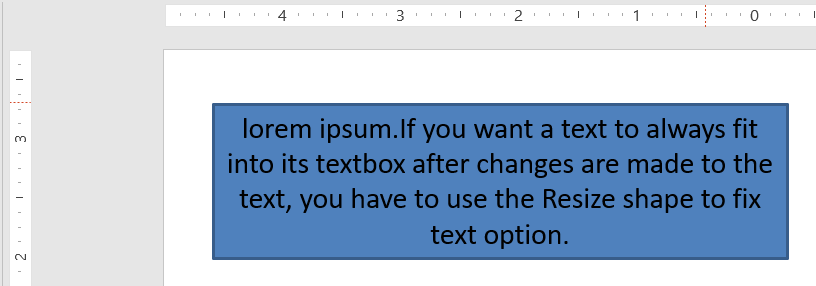
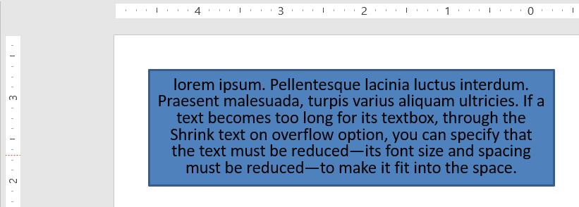

## **Pendahuluan**

Secara default, ketika Anda menambahkan kotak teks, Microsoft PowerPoint menggunakan pengaturan **Resize shape to fix text** untuk kotak teks—ia secara otomatis mengubah ukuran kotak teks agar teks selalu muat di dalamnya. 


* Ketika teks dalam kotak teks menjadi lebih panjang atau lebih besar, PowerPoint secara otomatis memperbesar kotak teks—meningkatkan tinggi—untuk memungkinkan menampung lebih banyak teks. 
* Ketika teks dalam kotak teks menjadi lebih pendek atau lebih kecil, PowerPoint secara otomatis mengurangi kotak teks—mengurangi tinggi—untuk menghilangkan ruang berlebih. 

Di PowerPoint, ada 4 parameter atau opsi penting yang mengontrol perilaku autofit untuk kotak teks: 

* **Do not Autofit**
* **Shrink text on overflow**
* **Resize shape to fit text**
* **Wrap text in shape.**


Aspose.Slides for Python via .NET menyediakan opsi serupa—beberapa properti di bawah kelas [TextFrameFormat](https://reference.aspose.com/slides/id/python-net/aspose.slides/textframeformat/)—yang memungkinkan Anda mengontrol perilaku autofit untuk kotak teks dalam presentasi. 

## **Ubah Bentuk agar Sesuai Teks**

Jika Anda ingin teks dalam kotak selalu muat dalam kotak tersebut setelah perubahan teks, Anda harus menggunakan opsi **Resize shape to fix text**. Untuk menentukan pengaturan ini, setel properti [autofit_type](https://reference.aspose.com/slides/id/python-net/aspose.slides/textframeformat/) dari kelas [TextFrameFormat](https://reference.aspose.com/slides/id/python-net/aspose.slides/textframeformat/) ke `SHAPE`.



Kode Python berikut menunjukkan cara menentukan bahwa teks harus selalu muat dalam kotaknya dalam presentasi PowerPoint:

```py
import aspose.slides as slides
import aspose.pydrawing as draw

with slides.Presentation() as presentation:
    slide = presentation.slides[0]
    auto_shape = slide.shapes.add_auto_shape(slides.ShapeType.RECTANGLE, 30, 30, 350, 100)

    portion = slides.Portion("lorem ipsum...")
    portion.portion_format.fill_format.solid_fill_color.color = draw.Color.black
    portion.portion_format.fill_format.fill_type = slides.FillType.SOLID
    auto_shape.text_frame.paragraphs[0].portions.add(portion)

    text_frame_format = auto_shape.text_frame.text_frame_format
    text_frame_format.autofit_type = slides.TextAutofitType.SHAPE

    presentation.save("output.pptx", slides.export.SaveFormat.PPTX)
```

Jika teks menjadi lebih panjang atau lebih besar, kotak teks akan secara otomatis diubah ukurannya (tinggi bertambah) agar semua teks muat di dalamnya. Jika teks menjadi lebih pendek, hal sebaliknya terjadi. 

## **Jangan Autofit**

Jika Anda ingin kotak teks atau bentuk mempertahankan dimensinya apa pun perubahan pada teks di dalamnya, Anda harus menggunakan opsi **Do not Autofit**. Untuk menentukan pengaturan ini, setel properti [autofit_type](https://reference.aspose.com/slides/id/python-net/aspose.slides/textframeformat/) dari kelas [TextFrameFormat](https://reference.aspose.com/slides/id/python-net/aspose.slides/textframeformat/) ke `NONE`. 


Kode Python berikut menunjukkan cara menentukan bahwa kotak teks harus selalu mempertahankan dimensinya dalam presentasi PowerPoint:

```py
import aspose.slides as slides
import aspose.pydrawing as draw

with slides.Presentation() as presentation:
    slide = presentation.slides[0]
    auto_shape = slide.shapes.add_auto_shape(slides.ShapeType.RECTANGLE, 30, 30, 350, 100)

    portion = slides.Portion("lorem ipsum...")
    portion.portion_format.fill_format.solid_fill_color.color = draw.Color.black
    portion.portion_format.fill_format.fill_type = slides.FillType.SOLID
    auto_shape.text_frame.paragraphs[0].portions.add(portion)

    text_frame_format = auto_shape.text_frame.text_frame_format
    text_frame_format.autofit_type = slides.TextAutofitType.NONE

    presentation.save("output.pptx", slides.export.SaveFormat.PPTX)
```

Ketika teks menjadi terlalu panjang untuk kotaknya, teks akan meluber keluar. 

## **Kecilkan Teks saat Melimpah**

Jika teks menjadi terlalu panjang untuk kotaknya, melalui opsi **Shrink text on overflow**, Anda dapat menentukan bahwa ukuran dan spasi teks harus diperkecil agar muat dalam kotaknya. Untuk menentukan pengaturan ini, setel properti [autofit_type](https://reference.aspose.com/slides/id/python-net/aspose.slides/textframeformat/) dari kelas [TextFrameFormat](https://reference.aspose.com/slides/id/python-net/aspose.slides/textframeformat/) ke `NORMAL`.



Kode Python berikut menunjukkan cara menentukan bahwa teks harus diperkecil saat melimpah dalam presentasi PowerPoint:

```py
import aspose.slides as slides
import aspose.pydrawing as draw

with slides.Presentation() as presentation:
    slide = presentation.slides[0]
    auto_shape = slide.shapes.add_auto_shape(slides.ShapeType.RECTANGLE, 30, 30, 350, 100)

    portion = slides.Portion("lorem ipsum...")
    portion.portion_format.fill_format.solid_fill_color.color = draw.Color.black
    portion.portion_format.fill_format.fill_type = slides.FillType.SOLID
    auto_shape.text_frame.paragraphs[0].portions.add(portion)

    text_frame_format = auto_shape.text_frame.text_frame_format
    text_frame_format.autofit_type = slides.TextAutofitType.NORMAL

    presentation.save("output.pptx", slides.export.SaveFormat.PPTX)
```

{}
Ketika opsi **Shrink text on overflow** digunakan, pengaturan ini hanya diterapkan ketika teks menjadi terlalu panjang untuk kotaknya. 
{}

## **Bungkus Teks**

Jika Anda ingin teks dalam bentuk dibungkus di dalam bentuk tersebut ketika teks melampaui batas bentuk (hanya lebar), Anda harus menggunakan parameter **Wrap text in shape**. Untuk menentukan pengaturan ini, Anda harus menyetel properti [wrap_text](https://reference.aspose.com/slides/id/python-net/aspose.slides/textframeformat/) dari kelas [TextFrameFormat](https://reference.aspose.com/slides/id/python-net/aspose.slides/textframeformat/) ke `NullableBool.TRUE`. 

Kode Python berikut menunjukkan cara menggunakan pengaturan Wrap Text dalam presentasi PowerPoint:

```py
import aspose.slides as slides
import aspose.pydrawing as draw

with slides.Presentation() as presentation:
    slide = presentation.slides[0]
    auto_shape = slide.shapes.add_auto_shape(slides.ShapeType.RECTANGLE, 30, 30, 350, 100)

    portion = slides.Portion("lorem ipsum...")
    portion.portion_format.fill_format.solid_fill_color.color = draw.Color.black
    portion.portion_format.fill_format.fill_type = slides.FillType.SOLID
    auto_shape.text_frame.paragraphs[0].portions.add(portion)

    text_frame_format = auto_shape.text_frame.text_frame_format
    text_frame_format.autofit_type = slides.TextAutofitType.NONE
    text_frame_format.wrap_text = slides.NullableBool.TRUE

    presentation.save("output.pptx", slides.export.SaveFormat.PPTX)
```

{} 
Jika Anda menyetel properti `wrap_text` ke `NullableBool.FALSE` untuk sebuah bentuk, ketika teks di dalam bentuk menjadi lebih panjang daripada lebar bentuk, teks akan meluas melampaui batas bentuk dalam satu baris tunggal. 
{}

## **FAQ**

**Apakah margin internal bingkai teks memengaruhi AutoFit?**

Ya. Padding (margin internal) mengurangi area yang dapat digunakan untuk teks, sehingga AutoFit akan aktif lebih awal—mengecilkan font atau mengubah ukuran bentuk lebih cepat. Periksa dan sesuaikan margin sebelum menyetel AutoFit.

**Bagaimana AutoFit berinteraksi dengan jeda baris manual dan lunak?**

Jeda paksa tetap berada di tempatnya, dan AutoFit menyesuaikan ukuran font serta spasi di sekitarnya. Menghapus jeda yang tidak diperlukan sering mengurangi kebutuhan AutoFit untuk mengecilkan teks secara agresif.

**Apakah mengubah font tema atau memicu substitusi font memengaruhi hasil AutoFit?**

Ya. Mengganti ke font dengan metrik glif berbeda mengubah lebar/tinggi teks, yang dapat mengubah ukuran font akhir dan pembungkusan baris. Setelah setiap perubahan atau substitusi font, periksa kembali slide.