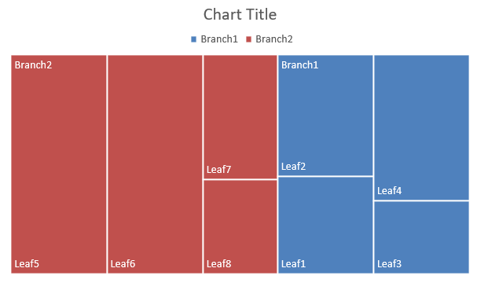

## **Ikhtisar**

Artikel ini memberikan panduan komprehensif tentang cara membuat dan menyesuaikan diagram menggunakan Aspose.Slides untuk Python via .NET. Anda akan belajar cara menambahkan diagram secara programatik ke slide, mengisi data, dan menerapkan berbagai opsi pemformatan untuk memenuhi kebutuhan desain spesifik Anda. Sepanjang artikel, contoh kode terperinci menggambarkan setiap langkah, mulai dari inisialisasi presentasi dan objek diagram hingga konfigurasi seri, sumbu, dan legenda. Dengan mengikuti panduan ini, Anda akan memperoleh pemahaman yang kuat tentang cara mengintegrasikan pembuatan diagram dinamis ke dalam aplikasi Anda, mempercepat proses pembuatan presentasi berbasis data.

## **Buat Diagram**

Diagram membantu orang dengan cepat memvisualisasikan data dan mendapatkan wawasan yang mungkin tidak langsung terlihat dari tabel atau spreadsheet.

**Mengapa Membuat Diagram?**

Dengan diagram, Anda dapat:

* menggabungkan, merangkum, atau menyederhanakan sejumlah besar data dalam satu slide presentasi;
* menampilkan pola dan tren dalam data;
* menafsirkan arah dan momentum data seiring waktu atau terhadap satuan pengukuran tertentu;
* mengidentifikasi outlier, penyimpangan, deviasi, kesalahan, dan data yang tidak masuk akal;
* mengkomunikasikan atau menyajikan data yang kompleks.

Di PowerPoint, Anda dapat membuat diagram melalui fungsi *Insert*, yang menyediakan templat untuk merancang banyak jenis diagram. Dengan Aspose.Slides, Anda dapat membuat diagram reguler (berdasarkan tipe diagram populer) maupun diagram khusus.

{} 
Gunakan enumerasi [ChartType](https://reference.aspose.com/slides/id/python-net/aspose.slides.charts/charttype/) di dalam namespace [Aspose.Slides.Charts](https://reference.aspose.com/slides/id/python-net/aspose.slides.charts/). Nilai‑nilai dalam enumerasi ini sesuai dengan tipe diagram yang berbeda. 
{} 

### **Buat Diagram Kolom Terkelompok**

Bagian ini menjelaskan cara membuat diagram kolom terkelompok menggunakan Aspose.Slides untuk Python via .NET. Anda akan belajar menginisialisasi presentasi, menambahkan diagram, dan menyesuaikan elemen‑elemen seperti judul, data, seri, kategori, dan gaya. Ikuti langkah‑langkah di bawah untuk melihat bagaimana diagram kolom terkelompok standar dihasilkan:

1. Buat instance kelas [Presentation](https://reference.aspose.com/slides/id/python-net/aspose.slides/presentation/).
1. Dapatkan referensi ke slide menggunakan indeksnya.
1. Tambahkan diagram dengan beberapa data dan tentukan tipe `ChartType.CLUSTERED_COLUMN`.
1. Tambahkan judul ke diagram.
1. Akses worksheet data diagram.
1. Hapus semua seri dan kategori default.
1. Tambahkan seri dan kategori baru.
1. Tambahkan data diagram baru untuk seri diagram.
1. Terapkan warna isi ke seri diagram.
1. Tambahkan label ke seri diagram.
1. Simpan presentasi yang telah dimodifikasi sebagai file PPTX.

Kode Python berikut menunjukkan cara membuat diagram kolom terkelompok:

```py
import aspose.slides.charts as charts
import aspose.slides as slides
import aspose.pydrawing as draw

    # Instansiasi kelas Presentation yang mewakili file PPTX.
    with slides.Presentation() as presentation:

        # Akses slide pertama.
        slide = presentation.slides[0]

        # Tambahkan diagram kolom terkelompok dengan data default-nya.
        chart = slide.shapes.add_chart(charts.ChartType.CLUSTERED_COLUMN, 20, 20, 500, 300)

        # Atur judul diagram.
        chart.chart_title.add_text_frame_for_overriding("Sample Title")
        chart.chart_title.text_frame_for_overriding.text_frame_format.center_text = slides.NullableBool.TRUE
        chart.chart_title.height = 20
        chart.has_title = True

        # Atur seri pertama agar menampilkan nilai.
        chart.chart_data.series[0].labels.default_data_label_format.show_value = True

        # Atur indeks lembar data diagram.
        worksheet_index = 0

        # Dapatkan workbook data diagram.
        workbook = chart.chart_data.chart_data_workbook

        # Hapus seri dan kategori default yang dihasilkan.
        chart.chart_data.series.clear()
        chart.chart_data.categories.clear()

        # Tambahkan seri baru.
        chart.chart_data.series.add(workbook.get_cell(worksheet_index, 0, 1, "Series 1"), chart.type)
        chart.chart_data.series.add(workbook.get_cell(worksheet_index, 0, 2, "Series 2"), chart.type)

        # Tambahkan kategori baru.
        chart.chart_data.categories.add(workbook.get_cell(worksheet_index, 1, 0, "Category 1"))
        chart.chart_data.categories.add(workbook.get_cell(worksheet_index, 2, 0, "Category 2"))
        chart.chart_data.categories.add(workbook.get_cell(worksheet_index, 3, 0, "Category 3"))

        # Dapatkan seri diagram pertama.
        series = chart.chart_data.series[0]

        # Isi data seri.
        series.data_points.add_data_point_for_bar_series(workbook.get_cell(worksheet_index, 1, 1, 20))
        series.data_points.add_data_point_for_bar_series(workbook.get_cell(worksheet_index, 2, 1, 50))
        series.data_points.add_data_point_for_bar_series(workbook.get_cell(worksheet_index, 3, 1, 30))

        # Atur warna isi untuk seri.
        series.format.fill.fill_type = slides.FillType.SOLID
        series.format.fill.solid_fill_color.color = draw.Color.red

        # Dapatkan seri diagram kedua.
        series = chart.chart_data.series[1]

        # Isi data seri.
        series.data_points.add_data_point_for_bar_series(workbook.get_cell(worksheet_index, 1, 2, 30))
        series.data_points.add_data_point_for_bar_series(workbook.get_cell(worksheet_index, 2, 2, 10))
        series.data_points.add_data_point_for_bar_series(workbook.get_cell(worksheet_index, 3, 2, 60))

        # Atur warna isi untuk seri.
        series.format.fill.fill_type = slides.FillType.SOLID
        series.format.fill.solid_fill_color.color = draw.Color.green

        # Atur label pertama agar menampilkan nama kategori.
        label = series.data_points[0].label
        label.data_label_format.show_category_name = True

        label = series.data_points[1].label
        label.data_label_format.show_series_name = True

        # Atur seri agar menampilkan nilai untuk label ketiga.
        label = series.data_points[2].label
        label.data_label_format.show_value = True
        label.data_label_format.show_series_name = True
        label.data_label_format.separator = "/"
                    
        # Simpan presentasi ke disk sebagai file PPTX.
        presentation.save("ClusteredColumnChart.pptx", slides.export.SaveFormat.PPTX)
```

Hasilnya:


### **Buat Diagram Sebar**

Diagram sebar (juga dikenal sebagai scatter plot atau grafik x‑y) sering digunakan untuk memeriksa pola atau menunjukkan korelasi antara dua variabel.

Gunakan diagram sebar ketika:

* Anda memiliki data numerik berpasangan.
* Anda memiliki dua variabel yang saling berhubungan.
* Anda ingin menentukan apakah dua variabel tersebut terkait.
* Anda memiliki variabel independen yang memiliki banyak nilai untuk variabel dependen.

Kode Python berikut menunjukkan cara membuat diagram sebar dengan seri penanda yang berbeda:

```py
import aspose.slides.charts as charts
import aspose.slides as slides
import aspose.pydrawing as draw

    # Instansiasi kelas Presentation.
    with slides.Presentation() as presentation:

        # Akses slide pertama.
        slide = presentation.slides[0]

        # Buat diagram sebar default.
        chart = slide.shapes.add_chart(charts.ChartType.SCATTER_WITH_SMOOTH_LINES, 20, 20, 500, 300)

        # Atur indeks lembar data diagram.
        worksheet_index = 0

        # Dapatkan workbook data diagram.
        workbook = chart.chart_data.chart_data_workbook

        # Hapus seri default.
        chart.chart_data.series.clear()

        # Tambahkan seri baru.
        chart.chart_data.series.add(workbook.get_cell(worksheet_index, 1, 1, "Series 1"), chart.type)
        chart.chart_data.series.add(workbook.get_cell(worksheet_index, 1, 3, "Series 2"), chart.type)

        # Dapatkan seri diagram pertama.
        series = chart.chart_data.series[0]

        # Tambahkan titik baru (1:3) ke seri.
        series.data_points.add_data_point_for_scatter_series(workbook.get_cell(worksheet_index, 2, 1, 1), workbook.get_cell(worksheet_index, 2, 2, 3))

        # Tambahkan titik baru (2:10).
        series.data_points.add_data_point_for_scatter_series(workbook.get_cell(worksheet_index, 3, 1, 2), workbook.get_cell(worksheet_index, 3, 2, 10))

        # Ubah tipe seri.
        series.type = charts.ChartType.SCATTER_WITH_STRAIGHT_LINES_AND_MARKERS

        # Ubah penanda seri diagram.
        series.marker.size = 10
        series.marker.symbol = charts.MarkerStyleType.STAR

        # Dapatkan seri diagram kedua.
        series = chart.chart_data.series[1]

        # Tambahkan titik baru (5:2) ke seri diagram.
        series.data_points.add_data_point_for_scatter_series(workbook.get_cell(worksheet_index, 2, 3, 5), workbook.get_cell(worksheet_index, 2, 4, 2))

        # Tambahkan titik baru (3:1).
        series.data_points.add_data_point_for_scatter_series(workbook.get_cell(worksheet_index, 3, 3, 3), workbook.get_cell(worksheet_index, 3, 4, 1))

        # Tambahkan titik baru (2:2).
        series.data_points.add_data_point_for_scatter_series(workbook.get_cell(worksheet_index, 4, 3, 2), workbook.get_cell(worksheet_index, 4, 4, 2))

        # Tambahkan titik baru (5:1).
        series.data_points.add_data_point_for_scatter_series(workbook.get_cell(worksheet_index, 5, 3, 5), workbook.get_cell(worksheet_index, 5, 4, 1))

        # Ubah penanda seri diagram.
        series.marker.size = 10
        series.marker.symbol = charts.MarkerStyleType.CIRCLE

        presentation.save("ScatterChart.pptx", slides.export.SaveFormat.PPTX)
```

Hasilnya:


### **Buat Diagram Lingkaran**

Diagram lingkaran paling cocok untuk menunjukkan hubungan bagian‑dengan‑keseluruhan dalam data, terutama ketika data berisi label kategori dengan nilai numerik. Namun, jika data Anda memiliki banyak bagian atau label, pertimbangkan menggunakan diagram batang sebagai gantinya.

1. Buat instance kelas [Presentation](https://reference.aspose.com/slides/id/python-net/aspose.slides/presentation/).
1. Dapatkan referensi ke slide menggunakan indeksnya.
1. Tambahkan diagram dengan data default dan tentukan tipe `ChartType.PIE`.
1. Akses workbook data diagram ([ChartDataWorkbook](https://reference.aspose.com/slides/id/python-net/aspose.slides.charts/chartdataworkbook/)).
1. Hapus seri dan kategori default.
1. Tambahkan seri dan kategori baru.
1. Tambahkan data diagram baru untuk seri diagram.
1. Tambahkan titik baru untuk diagram dan terapkan warna khusus pada sektor diagram lingkaran.
1. Atur label untuk seri.
1. Aktifkan garis pemimpin untuk label seri.
1. Atur sudut rotasi untuk diagram lingkaran.
1. Simpan presentasi yang telah dimodifikasi sebagai file PPTX.

Kode Python berikut menunjukkan cara membuat diagram lingkaran:

```py
import aspose.slides.charts as charts
import aspose.slides as slides
import aspose.pydrawing as draw

# Instansiasi kelas Presentation yang mewakili file PPTX.
with slides.Presentation() as presentation:

    # Akses slide pertama.
    slide = presentation.slides[0]

    # Tambahkan diagram dengan data default-nya.
    chart = slide.shapes.add_chart(charts.ChartType.PIE, 20, 20, 500, 300)

    # Atur judul diagram.
    chart.chart_title.add_text_frame_for_overriding("Sample Title")
    chart.chart_title.text_frame_for_overriding.text_frame_format.center_text = slides.NullableBool.TRUE
    chart.chart_title.height = 20
    chart.has_title = True

    # Atur seri pertama agar menampilkan nilai.
    chart.chart_data.series[0].labels.default_data_label_format.show_value = True

    # Atur indeks lembar data diagram.
    worksheet_index = 0

    # Dapatkan workbook data diagram.
    workbook = chart.chart_data.chart_data_workbook

    # Hapus seri dan kategori default yang dihasilkan.
    chart.chart_data.series.clear()
    chart.chart_data.categories.clear()

    # Tambahkan kategori baru.
    chart.chart_data.categories.add(workbook.get_cell(0, 1, 0, "First Qtr"))
    chart.chart_data.categories.add(workbook.get_cell(0, 2, 0, "2nd Qtr"))
    chart.chart_data.categories.add(workbook.get_cell(0, 3, 0, "3rd Qtr"))

    # Tambahkan seri baru.
    series = chart.chart_data.series.add(workbook.get_cell(0, 0, 1, "Series 1"), chart.type)

    # Isi data seri.
    series.data_points.add_data_point_for_pie_series(workbook.get_cell(worksheet_index, 1, 1, 20))
    series.data_points.add_data_point_for_pie_series(workbook.get_cell(worksheet_index, 2, 1, 50))
    series.data_points.add_data_point_for_pie_series(workbook.get_cell(worksheet_index, 3, 1, 30))

    # Atur warna sektor.
    chart.chart_data.series_groups[0].is_color_varied = True

    point = series.data_points[0]
    point.format.fill.fill_type = slides.FillType.SOLID
    point.format.fill.solid_fill_color.color = draw.Color.cyan

    # Atur batas sektor.
    point.format.line.fill_format.fill_type = slides.FillType.SOLID
    point.format.line.fill_format.solid_fill_color.color = draw.Color.gray
    point.format.line.width = 3.0
    point.format.line.style = slides.LineStyle.THIN_THICK
    point.format.line.dash_style = slides.LineDashStyle.DASH_DOT

    point1 = series.data_points[1]
    point1.format.fill.fill_type = slides.FillType.SOLID
    point1.format.fill.solid_fill_color.color = draw.Color.brown

    # Atur batas sektor.
    point1.format.line.fill_format.fill_type = slides.FillType.SOLID
    point1.format.line.fill_format.solid_fill_color.color = draw.Color.blue
    point1.format.line.width = 3.0
    point1.format.line.style = slides.LineStyle.SINGLE
    point1.format.line.dash_style = slides.LineDashStyle.LARGE_DASH_DOT

    point2 = series.data_points[2]
    point2.format.fill.fill_type = slides.FillType.SOLID
    point2.format.fill.solid_fill_color.color = draw.Color.coral

    # Atur batas sektor.
    point2.format.line.fill_format.fill_type = slides.FillType.SOLID
    point2.format.line.fill_format.solid_fill_color.color = draw.Color.red
    point2.format.line.width = 2.0
    point2.format.line.style = slides.LineStyle.THIN_THIN
    point2.format.line.dash_style = slides.LineDashStyle.LARGE_DASH_DOT_DOT

    # Buat label khusus untuk setiap kategori dalam seri baru.
    label1 = series.data_points[0].label

    label1.data_label_format.show_value = True

    label2 = series.data_points[1].label
    label2.data_label_format.show_value = True
    label2.data_label_format.show_legend_key = True
    label2.data_label_format.show_percentage = True

    label3 = series.data_points[2].label
    label3.data_label_format.show_series_name = True
    label3.data_label_format.show_percentage = True

    # Atur seri agar menampilkan garis pemimpin untuk diagram.
    series.labels.default_data_label_format.show_leader_lines = True

    # Atur sudut rotasi untuk sektor diagram lingkaran.
    chart.chart_data.series_groups[0].first_slice_angle = 180

    # Simpan presentasi ke disk sebagai file PPTX.
    presentation.save("PieChart.pptx", slides.export.SaveFormat.PPTX)
```

Hasilnya:


### **Buat Diagram Garis**

Diagram garis (juga dikenal sebagai grafik garis) paling cocok untuk situasi di mana Anda ingin menunjukkan perubahan nilai seiring waktu. Dengan diagram garis, Anda dapat membandingkan sejumlah besar data sekaligus, melacak perubahan dan tren seiring waktu, menyoroti anomali dalam seri data, dan lain‑lain.

1. Buat instance kelas [Presentation](https://reference.aspose.com/slides/id/python-net/aspose.slides/presentation/).
1. Dapatkan referensi ke slide menggunakan indeksnya.
1. Tambahkan diagram dengan data default dan tentukan tipe `ChartType.LINE`.
1. Akses workbook data diagram ([ChartDataWorkbook](https://reference.aspose.com/slides/id/python-net/aspose.slides.charts/chartdataworkbook/)).
1. Hapus seri dan kategori default.
1. Tambahkan seri dan kategori baru.
1. Tambahkan data diagram baru untuk seri diagram.
1. Simpan presentasi yang telah dimodifikasi sebagai file PPTX.

Kode Python berikut menunjukkan cara membuat diagram garis:

```python
import aspose.slides as slides

with slides.Presentation() as presentation:
    line_chart = presentation.slides[0].shapes.add_chart(slides.charts.ChartType.LINE, 20, 20, 500, 300)
    
    presentation.save("LineChart.pptx", slides.export.SaveFormat.PPTX)
```

Secara default, titik pada diagram garis dihubungkan oleh garis lurus kontinu. Jika Anda ingin titik‑titik tersebut dihubungkan oleh garis putus‑putus, Anda dapat menentukan tipe dash yang diinginkan sebagai berikut:

```python
line_chart = pres.slides[0].shapes.add_chart(slides.charts.ChartType.LINE, 10, 50, 600, 350)

for series in line_chart.chart_data.series:
    series.format.line.dash_style = slides.charts.LineDashStyle.DASH
```

Hasilnya:


### **Buat Diagram Peta Pohon**

Diagram peta pohon paling cocok untuk data penjualan ketika Anda ingin menunjukkan ukuran relatif kategori data dan dengan cepat menarik perhatian pada item yang memberikan kontribusi besar dalam tiap kategori.

1. Buat instance kelas [Presentation](https://reference.aspose.com/slides/id/python-net/aspose.slides/presentation/).
1. Dapatkan referensi ke slide menggunakan indeksnya.
1. Tambahkan diagram dengan data default dan tentukan tipe `ChartType.TREEMAP`.
1. Akses workbook data diagram ([ChartDataWorkbook](https://reference.aspose.com/slides/id/python-net/aspose.slides.charts/chartdataworkbook/)).
1. Hapus seri dan kategori default.
1. Tambahkan seri dan kategori baru.
1. Tambahkan data diagram baru untuk seri diagram.
1. Simpan presentasi yang telah dimodifikasi sebagai file PPTX.

Kode Python berikut menunjukkan cara membuat diagram peta pohon:

```py
import aspose.slides.charts as charts
import aspose.slides as slides
import aspose.pydrawing as draw

with slides.Presentation() as presentation:
    chart = presentation.slides[0].shapes.add_chart(charts.ChartType.TREEMAP, 20, 20, 500, 300)
    chart.chart_data.categories.clear()
    chart.chart_data.series.clear()

    workbook = chart.chart_data.chart_data_workbook
    workbook.clear(0)

    # Cabang 1
    leaf = chart.chart_data.categories.add(workbook.get_cell(0, "C1", "Leaf1"))
    leaf.grouping_levels.set_grouping_item(1, "Stem1")
    leaf.grouping_levels.set_grouping_item(2, "Branch1")

    chart.chart_data.categories.add(workbook.get_cell(0, "C2", "Leaf2"))

    leaf = chart.chart_data.categories.add(workbook.get_cell(0, "C3", "Leaf3"))
    leaf.grouping_levels.set_grouping_item(1, "Stem2")

    chart.chart_data.categories.add(workbook.get_cell(0, "C4", "Leaf4"))

    # Cabang 2
    leaf = chart.chart_data.categories.add(workbook.get_cell(0, "C5", "Leaf5"))
    leaf.grouping_levels.set_grouping_item(1, "Stem3")
    leaf.grouping_levels.set_grouping_item(2, "Branch2")

    chart.chart_data.categories.add(workbook.get_cell(0, "C6", "Leaf6"))

    leaf = chart.chart_data.categories.add(workbook.get_cell(0, "C7", "Leaf7"))
    leaf.grouping_levels.set_grouping_item(1, "Stem4")

    chart.chart_data.categories.add(workbook.get_cell(0, "C8", "Leaf8"))

    series = chart.chart_data.series.add(charts.ChartType.TREEMAP)
    series.labels.default_data_label_format.show_category_name = True
    series.data_points.add_data_point_for_treemap_series(workbook.get_cell(0, "D1", 4))
    series.data_points.add_data_point_for_treemap_series(workbook.get_cell(0, "D2", 5))
    series.data_points.add_data_point_for_treemap_series(workbook.get_cell(0, "D3", 3))
    series.data_points.add_data_point_for_treemap_series(workbook.get_cell(0, "D4", 6))
    series.data_points.add_data_point_for_treemap_series(workbook.get_cell(0, "D5", 9))
    series.data_points.add_data_point_for_treemap_series(workbook.get_cell(0, "D6", 9))
    series.data_points.add_data_point_for_treemap_series(workbook.get_cell(0, "D7", 4))
    series.data_points.add_data_point_for_treemap_series(workbook.get_cell(0, "D8", 3))

    series.parent_label_layout = charts.ParentLabelLayoutType.OVERLAPPING

    presentation.save("TreeMap.pptx", slides.export.SaveFormat.PPTX)
```

Hasilnya:



### **Buat Diagram Saham**

Diagram saham digunakan untuk menampilkan data keuangan seperti harga buka, tinggi, rendah, dan tutup, membantu menganalisis tren pasar dan volatilitas. Diagram ini memberikan wawasan penting tentang kinerja saham, membantu investor dan analis membuat keputusan yang tepat.

1. Buat instance kelas [Presentation](https://reference.aspose.com/slides/id/python-net/aspose.slides/presentation/).
1. Dapatkan referensi ke slide menggunakan indeksnya.
1. Tambahkan diagram dengan data default dan tentukan tipe `ChartType.OPEN_HIGH_LOW_CLOSE`.
1. Akses workbook data diagram ([ChartDataWorkbook](https://reference.aspose.com/slides/id/python-net/aspose.slides.charts/chartdataworkbook/)).
1. Hapus seri dan kategori default.
1. Tambahkan seri dan kategori baru.
1. Tambahkan data diagram baru untuk seri diagram.
1. Tentukan format HiLowLines.
1. Simpan presentasi yang telah dimodifikasi sebagai file PPTX.

Kode Python berikut menunjukkan cara membuat diagram saham:

```py
import aspose.slides.charts as charts
import aspose.slides as slides
import aspose.pydrawing as draw

with slides.Presentation() as presentation:
    chart = presentation.slides[0].shapes.add_chart(charts.ChartType.OPEN_HIGH_LOW_CLOSE, 20, 20, 500, 300, False)

    chart.chart_data.series.clear()
    chart.chart_data.categories.clear()

    workbook = chart.chart_data.chart_data_workbook

    chart.chart_data.categories.add(workbook.get_cell(0, 1, 0, "A"))
    chart.chart_data.categories.add(workbook.get_cell(0, 2, 0, "B"))
    chart.chart_data.categories.add(workbook.get_cell(0, 3, 0, "C"))

    chart.chart_data.series.add(workbook.get_cell(0, 0, 1, "Open"), chart.type)
    chart.chart_data.series.add(workbook.get_cell(0, 0, 2, "High"), chart.type)
    chart.chart_data.series.add(workbook.get_cell(0, 0, 3, "Low"), chart.type)
    chart.chart_data.series.add(workbook.get_cell(0, 0, 4, "Close"), chart.type)

    series = chart.chart_data.series[0]

    series.data_points.add_data_point_for_stock_series(workbook.get_cell(0, 1, 1, 72))
    series.data_points.add_data_point_for_stock_series(workbook.get_cell(0, 2, 1, 25))
    series.data_points.add_data_point_for_stock_series(workbook.get_cell(0, 3, 1, 38))

    series = chart.chart_data.series[1]
    series.data_points.add_data_point_for_stock_series(workbook.get_cell(0, 1, 2, 172))
    series.data_points.add_data_point_for_stock_series(workbook.get_cell(0, 2, 2, 57))
    series.data_points.add_data_point_for_stock_series(workbook.get_cell(0, 3, 2, 57))

    series = chart.chart_data.series[2]
    series.data_points.add_data_point_for_stock_series(workbook.get_cell(0, 1, 3, 12))
    series.data_points.add_data_point_for_stock_series(workbook.get_cell(0, 2, 3, 12))
    series.data_points.add_data_point_for_stock_series(workbook.get_cell(0, 3, 3, 13))

    series = chart.chart_data.series[3]
    series.data_points.add_data_point_for_stock_series(workbook.get_cell(0, 1, 4, 25))
    series.data_points.add_data_point_for_stock_series(workbook.get_cell(0, 2, 4, 38))
    series.data_points.add_data_point_for_stock_series(workbook.get_cell(0, 3, 4, 50))

    chart.chart_data.series_groups[0].up_down_bars.has_up_down_bars = True
    chart.chart_data.series_groups[0].hi_low_lines_format.line.fill_format.fill_type = slides.FillType.SOLID

    for ser in chart.chart_data.series:
        ser.format.line.fill_format.fill_type = slides.FillType.NO_FILL

    presentation.save("StockChart.pptx", slides.export.SaveFormat.PPTX)
```

Hasilnya:


### **Buat Diagram Kotak‑dan‑Kumis**

Diagram kotak‑dan‑kumis digunakan untuk menampilkan distribusi data dengan merangkum ukuran statistik utama, seperti median, kuartil, dan kemungkinan outlier. Diagram ini sangat berguna dalam analisis data eksploratif dan studi statistik untuk dengan cepat memahami variabilitas data dan mengidentifikasi anomali.

1. Buat instance kelas [Presentation](https://reference.aspose.com/slides/id/python-net/aspose.slides/presentation/).
1. Dapatkan referensi ke slide menggunakan indeksnya.
1. Tambahkan diagram dengan data default dan tentukan tipe `ChartType.BOX_AND_WHISKER`.
1. Akses workbook data diagram ([ChartDataWorkbook](https://reference.aspose.com/slides/id/python-net/aspose.slides.charts/chartdataworkbook/)).
1. Hapus seri dan kategori default.
1. Tambahkan seri dan kategori baru.
1. Tambahkan data diagram baru untuk seri diagram.
1. Simpan presentasi yang telah dimodifikasi sebagai file PPTX.

Kode Python berikut menunjukkan cara membuat diagram kotak‑dan‑kumis:

```py
import aspose.slides.charts as charts
import aspose.slides as slides
import aspose.pydrawing as draw

with slides.Presentation() as presentation:
    chart = presentation.slides[0].shapes.add_chart(charts.ChartType.BOX_AND_WHISKER, 20, 20, 500, 300)
    chart.chart_data.categories.clear()
    chart.chart_data.series.clear()

    workbook = chart.chart_data.chart_data_workbook
    workbook.clear(0)

    chart.chart_data.categories.add(workbook.get_cell(0, "A1", "Category 1"))
    chart.chart_data.categories.add(workbook.get_cell(0, "A2", "Category 1"))
    chart.chart_data.categories.add(workbook.get_cell(0, "A3", "Category 1"))
    chart.chart_data.categories.add(workbook.get_cell(0, "A4", "Category 1"))
    chart.chart_data.categories.add(workbook.get_cell(0, "A5", "Category 1"))
    chart.chart_data.categories.add(workbook.get_cell(0, "A6", "Category 1"))

    series = chart.chart_data.series.add(charts.ChartType.BOX_AND_WHISKER)

    series.quartile_method = charts.QuartileMethodType.EXCLUSIVE
    series.show_mean_line = True
    series.show_mean_markers = True
    series.show_inner_points = True
    series.show_outlier_points = True

    series.data_points.add_data_point_for_box_and_whisker_series(workbook.get_cell(0, "B1", 15))
    series.data_points.add_data_point_for_box_and_whisker_series(workbook.get_cell(0, "B2", 41))
    series.data_points.add_data_point_for_box_and_whisker_series(workbook.get_cell(0, "B3", 16))
    series.data_points.add_data_point_for_box_and_whisker_series(workbook.get_cell(0, "B4", 10))
    series.data_points.add_data_point_for_box_and_whisker_series(workbook.get_cell(0, "B5", 23))
    series.data_points.add_data_point_for_box_and_whisker_series(workbook.get_cell(0, "B6", 16))

    presentation.save("BoxAndWhiskerChart.pptx", slides.export.SaveFormat.PPTX)
```

### **Buat Diagram Corong**

Diagram corong digunakan untuk memvisualisasikan proses yang melibatkan tahapan berurutan, di mana volume data berkurang saat bergerak dari satu langkah ke langkah berikutnya. Diagram ini sangat membantu untuk menganalisis tingkat konversi, mengidentifikasi bottleneck, dan melacak efisiensi proses penjualan atau pemasaran.

1. Buat instance kelas [Presentation](https://reference.aspose.com/slides/id/python-net/aspose.slides/presentation/).
1. Dapatkan referensi ke slide menggunakan indeksnya.
1. Tambahkan diagram dengan data default dan tentukan tipe `ChartType.FUNNEL`.
1. Simpan presentasi yang telah dimodifikasi sebagai file PPTX.

Kode Python berikut menunjukkan cara membuat diagram corong:

```py
import aspose.slides.charts as charts
import aspose.slides as slides
import aspose.pydrawing as draw

with slides.Presentation() as presentation:
    chart = presentation.slides[0].shapes.add_chart(charts.ChartType.FUNNEL, 50, 50, 500, 400)
    chart.chart_data.categories.clear()
    chart.chart_data.series.clear()

    workbook = chart.chart_data.chart_data_workbook
    workbook.clear(0)

    chart.chart_data.categories.add(workbook.get_cell(0, "A1", "Category 1"))
    chart.chart_data.categories.add(workbook.get_cell(0, "A2", "Category 2"))
    chart.chart_data.categories.add(workbook.get_cell(0, "A3", "Category 3"))
    chart.chart_data.categories.add(workbook.get_cell(0, "A4", "Category 4"))
    chart.chart_data.categories.add(workbook.get_cell(0, "A5", "Category 5"))
    chart.chart_data.categories.add(workbook.get_cell(0, "A6", "Category 6"))

    series = chart.chart_data.series.add(charts.ChartType.FUNNEL)

    series.data_points.add_data_point_for_funnel_series(workbook.get_cell(0, "B1", 50))
    series.data_points.add_data_point_for_funnel_series(workbook.get_cell(0, "B2", 100))
    series.data_points.add_data_point_for_funnel_series(workbook.get_cell(0, "B3", 200))
    series.data_points.add_data_point_for_funnel_series(workbook.get_cell(0, "B4", 300))
    series.data_points.add_data_point_for_funnel_series(workbook.get_cell(0, "B5", 400))
    series.data_points.add_data_point_for_funnel_series(workbook.get_cell(0, "B6", 500))

    presentation.save("FunnelChart.pptx", slides.export.SaveFormat.PPTX)
```

Hasilnya:


### **Buat Diagram Sunburst**

Diagram sunburst digunakan untuk memvisualisasikan data hierarki, menampilkan tingkatan sebagai cincin konsentris. Diagram ini membantu menggambarkan hubungan bagian‑dengan‑keseluruhan dan ideal untuk merepresentasikan kategori bertingkat dan sub‑kategori dalam format yang jelas dan padat.

1. Buat instance kelas [Presentation](https://reference.aspose.com/slides/id/python-net/aspose.slides/presentation/).
1. Dapatkan referensi ke slide menggunakan indeksnya.
1. Tambahkan diagram dengan data default dan tentukan tipe `ChartType.SUNBURST`.
1. Simpan presentasi yang telah dimodifikasi sebagai file PPTX.

Kode Python berikut menunjukkan cara membuat diagram sunburst:

```py
import aspose.slides.charts as charts
import aspose.slides as slides
import aspose.pydrawing as draw

with slides.Presentation() as presentation:
    chart = presentation.slides[0].shapes.add_chart(charts.ChartType.SUNBURST, 20, 20, 500, 300)
    chart.chart_data.categories.clear()
    chart.chart_data.series.clear()

    workbook = chart.chart_data.chart_data_workbook
    workbook.clear(0)

    # Cabang 1
    leaf = chart.chart_data.categories.add(workbook.get_cell(0, "C1", "Leaf1"))
    leaf.grouping_levels.set_grouping_item(1, "Stem1")
    leaf.grouping_levels.set_grouping_item(2, "Branch1")

    chart.chart_data.categories.add(workbook.get_cell(0, "C2", "Leaf2"))

    leaf = chart.chart_data.categories.add(workbook.get_cell(0, "C3", "Leaf3"))
    leaf.grouping_levels.set_grouping_item(1, "Stem2")

    chart.chart_data.categories.add(workbook.get_cell(0, "C4", "Leaf4"))

    # Cabang 2
    leaf = chart.chart_data.categories.add(workbook.get_cell(0, "C5", "Leaf5"))
    leaf.grouping_levels.set_grouping_item(1, "Stem3")
    leaf.grouping_levels.set_grouping_item(2, "Branch2")

    chart.chart_data.categories.add(workbook.get_cell(0, "C6", "Leaf6"))

    leaf = chart.chart_data.categories.add(workbook.get_cell(0, "C7", "Leaf7"))
    leaf.grouping_levels.set_grouping_item(1, "Stem4")

    chart.chart_data.categories.add(workbook.get_cell(0, "C8", "Leaf8"))

    series = chart.chart_data.series.add(charts.ChartType.SUNBURST)
    series.labels.default_data_label_format.show_category_name = True
    series.data_points.add_data_point_for_sunburst_series(workbook.get_cell(0, "D1", 4))
    series.data_points.add_data_point_for_sunburst_series(workbook.get_cell(0, "D2", 5))
    series.data_points.add_data_point_for_sunburst_series(workbook.get_cell(0, "D3", 3))
    series.data_points.add_data_point_for_sunburst_series(workbook.get_cell(0, "D4", 6))
    series.data_points.add_data_point_for_sunburst_series(workbook.get_cell(0, "D5", 9))
    series.data_points.add_data_point_for_sunburst_series(workbook.get_cell(0, "D6", 9))
    series.data_points.add_data_point_for_sunburst_series(workbook.get_cell(0, "D7", 4))
    series.data_points.add_data_point_for_sunburst_series(workbook.get_cell(0, "D8", 3))

    presentation.save("SunburstChart.pptx", slides.export.SaveFormat.PPTX)
```

Hasilnya:


### **Buat Diagram Histogram**

Diagram histogram digunakan untuk merepresentasikan distribusi data numerik dengan mengelompokkan nilai ke dalam rentang atau bin. Diagram ini sangat berguna untuk mengidentifikasi pola data seperti frekuensi, skewness, dan penyebaran, serta mendeteksi outlier dalam dataset.

1. Buat instance kelas [Presentation](https://reference.aspose.com/slides/id/python-net/aspose.slides/presentation/).
1. Dapatkan referensi ke slide menggunakan indeksnya.
1. Tambahkan diagram dengan beberapa data dan tentukan tipe `ChartType.HISTOGRAM`.
1. Akses workbook data diagram ([ChartDataWorkbook](https://reference.aspose.com/slides/id/python-net/aspose.slides.charts/chartdataworkbook/)).
1. Hapus seri dan kategori default.
1. Tambahkan seri dan kategori baru.
1. Simpan presentasi yang telah dimodifikasi sebagai file PPTX.

Kode Python berikut menunjukkan cara membuat diagram histogram:

```py
import aspose.slides.charts as charts
import aspose.slides as slides
import aspose.pydrawing as draw

with slides.Presentation() as presentation:
    chart = presentation.slides[0].shapes.add_chart(charts.ChartType.HISTOGRAM, 20, 20, 500, 300)
    chart.chart_data.categories.clear()
    chart.chart_data.series.clear()

    workbook = chart.chart_data.chart_data_workbook
    workbook.clear(0)

    series = chart.chart_data.series.add(charts.ChartType.HISTOGRAM)
    series.data_points.add_data_point_for_histogram_series(workbook.get_cell(0, "A1", 15))
    series.data_points.add_data_point_for_histogram_series(workbook.get_cell(0, "A2", -41))
    series.data_points.add_data_point_for_histogram_series(workbook.get_cell(0, "A3", 16))
    series.data_points.add_data_point_for_histogram_series(workbook.get_cell(0, "A4", 10))
    series.data_points.add_data_point_for_histogram_series(workbook.get_cell(0, "A5", -23))
    series.data_points.add_data_point_for_histogram_series(workbook.get_cell(0, "A6", 16))

    chart.axes.horizontal_axis.aggregation_type = charts.AxisAggregationType.AUTOMATIC

    presentation.save("HistogramChart.pptx", slides.export.SaveFormat.PPTX)
```

Hasilnya:


### **Buat Diagram Radar**

Diagram radar digunakan untuk menampilkan data multivariat dalam format dua dimensi, memungkinkan perbandingan beberapa variabel secara bersamaan. Diagram ini sangat berguna untuk mengidentifikasi pola, kekuatan, dan kelemahan di antara beberapa metrik atau atribut kinerja.

1. Buat instance kelas [Presentation](https://reference.aspose.com/slides/id/python-net/aspose.slides/presentation/).
1. Dapatkan referensi ke slide menggunakan indeksnya.
1. Tambahkan diagram dengan beberapa data dan tentukan tipe `ChartType.RADAR`.
1. Simpan presentasi yang telah dimodifikasi sebagai file PPTX.

Kode Python berikut menunjukkan cara membuat diagram radar:

```python
import aspose.slides as slides

with slides.Presentation() as presentation:
    presentation.slides[0].shapes.add_chart(slides.charts.ChartType.RADAR, 20, 20, 500, 300)
    presentation.save("RadarСhart.pptx", slides.export.SaveFormat.PPTX)
```

Hasilnya:


### **Buat Diagram Multi Kategori**

Diagram multi kategori digunakan untuk menampilkan data yang melibatkan lebih dari satu pengelompokan kategori, memungkinkan Anda membandingkan nilai di beberapa dimensi sekaligus. Diagram ini sangat membantu ketika Anda perlu menganalisis tren dan hubungan dalam dataset yang kompleks dan berlapis.

1. Buat instance kelas [Presentation](https://reference.aspose.com/slides/id/python-net/aspose.slides/presentation/).
1. Dapatkan referensi ke slide menggunakan indeksnya.
1. Tambahkan diagram dengan data default dan tentukan tipe `ChartType.CLUSTERED_COLUMN`.
1. Akses workbook data diagram ([ChartDataWorkbook](https://reference.aspose.com/slides/id/python-net/aspose.slides.charts/chartdataworkbook/)).
1. Hapus seri dan kategori default.
1. Tambahkan seri dan kategori baru.
1. Tambahkan data diagram baru untuk seri diagram.
1. Simpan presentasi yang telah dimodifikasi sebagai file PPTX.

Kode Python berikut menunjukkan cara membuat diagram multi kategori:

```py
import aspose.slides.charts as charts
import aspose.slides as slides
import aspose.pydrawing as draw

with slides.Presentation() as presentation:
    slide = presentation.slides[0]

    chart = presentation.slides[0].shapes.add_chart(charts.ChartType.CLUSTERED_COLUMN, 20, 20, 500, 300)
    chart.chart_data.series.clear()
    chart.chart_data.categories.clear()

    workbook = chart.chart_data.chart_data_workbook
    workbook.clear(0)

    worksheet_index = 0

    category = chart.chart_data.categories.add(workbook.get_cell(0, "c2", "A"))
    category.grouping_levels.set_grouping_item(1, "Group1")
    category = chart.chart_data.categories.add(workbook.get_cell(0, "c3", "B"))

    category = chart.chart_data.categories.add(workbook.get_cell(0, "c4", "C"))
    category.grouping_levels.set_grouping_item(1, "Group2")
    category = chart.chart_data.categories.add(workbook.get_cell(0, "c5", "D"))

    category = chart.chart_data.categories.add(workbook.get_cell(0, "c6", "E"))
    category.grouping_levels.set_grouping_item(1, "Group3")
    category = chart.chart_data.categories.add(workbook.get_cell(0, "c7", "F"))

    category = chart.chart_data.categories.add(workbook.get_cell(0, "c8", "G"))
    category.grouping_levels.set_grouping_item(1, "Group4")
    category = chart.chart_data.categories.add(workbook.get_cell(0, "c9", "H"))

    # Tambahkan seri.
    series = chart.chart_data.series.add(workbook.get_cell(0, "D1", "Series 1"), charts.ChartType.CLUSTERED_COLUMN)

    series.data_points.add_data_point_for_bar_series(workbook.get_cell(worksheet_index, "D2", 10))
    series.data_points.add_data_point_for_bar_series(workbook.get_cell(worksheet_index, "D3", 20))
    series.data_points.add_data_point_for_bar_series(workbook.get_cell(worksheet_index, "D4", 30))
    series.data_points.add_data_point_for_bar_series(workbook.get_cell(worksheet_index, "D5", 40))
    series.data_points.add_data_point_for_bar_series(workbook.get_cell(worksheet_index, "D6", 50))
    series.data_points.add_data_point_for_bar_series(workbook.get_cell(worksheet_index, "D7", 60))
    series.data_points.add_data_point_for_bar_series(workbook.get_cell(worksheet_index, "D8", 70))
    series.data_points.add_data_point_for_bar_series(workbook.get_cell(worksheet_index, "D9", 80))

    # Simpan presentasi dengan diagram.
    presentation.save("MultiCategoryChart.pptx", slides.export.SaveFormat.PPTX)
```

Hasilnya:


### **Buat Diagram Peta**

Diagram peta digunakan untuk memvisualisasikan data geografis dengan memetakan informasi ke lokasi spesifik seperti negara, provinsi, atau kota. Diagram ini sangat berguna untuk menganalisis tren regional, data demografis, dan distribusi spasial secara jelas dan menarik secara visual.

Kode Python berikut menunjukkan cara membuat diagram peta:

```python
import aspose.slides as slides

with slides.Presentation() as presentation:
    chart = presentation.slides[0].shapes.add_chart(slides.charts.ChartType.MAP, 20, 20, 500, 300)
    presentation.save("mapChart.pptx", slides.export.SaveFormat.PPTX)
```

Hasilnya:


### **Buat Diagram Kombinasi**

Diagram kombinasi (atau combo chart) menggabungkan dua atau lebih tipe diagram dalam satu grafik. Diagram ini memungkinkan Anda menyoroti, membandingkan, atau memeriksa perbedaan antara dua atau lebih set data, membantu mengidentifikasi hubungan di antara mereka.


Kode Python berikut menunjukkan cara membuat diagram kombinasi yang ditampilkan di atas dalam presentasi PowerPoint:

```python
def create_combo_chart():
    with slides.Presentation() as presentation:
        chart = create_chart_with_first_series(presentation.slides[0])

        add_second_series_to_chart(chart)
        add_third_series_to_chart(chart)

        set_primary_axes_format(chart)
        set_secondary_axes_format(chart)

        presentation.save("combo-chart.pptx", slides.export.SaveFormat.PPTX)


def create_chart_with_first_series(slide):
    chart = slide.shapes.add_chart(charts.ChartType.CLUSTERED_COLUMN, 50, 50, 600, 400)

    # Atur judul diagram.
    chart.has_title = True
    chart.chart_title.add_text_frame_for_overriding("Chart Title")
    chart.chart_title.overlay = False
    title_paragraph = chart.chart_title.text_frame_for_overriding.paragraphs[0]
    title_format = title_paragraph.paragraph_format.default_portion_format

    title_format.font_bold = slides.NullableBool.FALSE
    title_format.font_height = 18

    # Atur legenda diagram.
    chart.legend.position = charts.LegendPositionType.BOTTOM
    chart.legend.text_format.portion_format.font_height = 12

    # Hapus seri dan kategori default yang dihasilkan.
    chart.chart_data.series.clear()
    chart.chart_data.categories.clear()

    worksheet_index = 0
    workbook = chart.chart_data.chart_data_workbook

    # Tambahkan kategori baru.
    chart.chart_data.categories.add(workbook.get_cell(worksheet_index, 1, 0, "Category 1"))
    chart.chart_data.categories.add(workbook.get_cell(worksheet_index, 2, 0, "Category 2"))
    chart.chart_data.categories.add(workbook.get_cell(worksheet_index, 3, 0, "Category 3"))
    chart.chart_data.categories.add(workbook.get_cell(worksheet_index, 4, 0, "Category 4"))

    # Tambahkan seri pertama.
    series_name_cell = workbook.get_cell(worksheet_index, 0, 1, "Series 1")
    series = chart.chart_data.series.add(series_name_cell, chart.type)

    series.parent_series_group.overlap = -25
    series.parent_series_group.gap_width = 220

    series.data_points.add_data_point_for_bar_series(workbook.get_cell(worksheet_index, 1, 1, 4.3))
    series.data_points.add_data_point_for_bar_series(workbook.get_cell(worksheet_index, 2, 1, 2.5))
    series.data_points.add_data_point_for_bar_series(workbook.get_cell(worksheet_index, 3, 1, 3.5))
    series.data_points.add_data_point_for_bar_series(workbook.get_cell(worksheet_index, 4, 1, 4.5))

    return chart


def add_second_series_to_chart(chart):
    workbook = chart.chart_data.chart_data_workbook
    worksheet_index = 0

    series_name_cell = workbook.get_cell(worksheet_index, 0, 2, "Series 2")
    series = chart.chart_data.series.add(series_name_cell, charts.ChartType.CLUSTERED_COLUMN)

    series.parent_series_group.overlap = -25
    series.parent_series_group.gap_width = 220

    series.data_points.add_data_point_for_bar_series(workbook.get_cell(worksheet_index, 1, 2, 2.4))
    series.data_points.add_data_point_for_bar_series(workbook.get_cell(worksheet_index, 2, 2, 4.4))
    series.data_points.add_data_point_for_bar_series(workbook.get_cell(worksheet_index, 3, 2, 1.8))
    series.data_points.add_data_point_for_bar_series(workbook.get_cell(worksheet_index, 4, 2, 2.8))


def add_third_series_to_chart(chart):
    workbook = chart.chart_data.chart_data_workbook
    worksheet_index = 0

    series_name_cell = workbook.get_cell(worksheet_index, 0, 3, "Series 3")
    series = chart.chart_data.series.add(series_name_cell, charts.ChartType.LINE)

    series.data_points.add_data_point_for_line_series(workbook.get_cell(worksheet_index, 1, 3, 2.0))
    series.data_points.add_data_point_for_line_series(workbook.get_cell(worksheet_index, 2, 3, 2.0))
    series.data_points.add_data_point_for_line_series(workbook.get_cell(worksheet_index, 3, 3, 3.0))
    series.data_points.add_data_point_for_line_series(workbook.get_cell(worksheet_index, 4, 3, 5.0))

    series.plot_on_second_axis = True


def set_primary_axes_format(chart):
    # Atur sumbu horizontal.
    horizontal_axis = chart.axes.horizontal_axis
    horizontal_axis.text_format.portion_format.font_height = 12.0
    horizontal_axis.format.line.fill_format.fill_type = slides.FillType.NO_FILL

    set_axis_title(horizontal_axis, "X Axis")

    # Atur sumbu vertikal.
    vertical_axis = chart.axes.vertical_axis
    vertical_axis.text_format.portion_format.font_height = 12.0
    vertical_axis.format.line.fill_format.fill_type = slides.FillType.NO_FILL

    set_axis_title(vertical_axis, "Y Axis 1")

    # Atur warna garis kisi utama vertikal.
    major_grid_lines_format = vertical_axis.major_grid_lines_format.line.fill_format
    major_grid_lines_format.fill_type = slides.FillType.SOLID
    major_grid_lines_format.solid_fill_color.color = draw.Color.from_argb(217, 217, 217)


def set_secondary_axes_format(chart):
    # Atur sumbu horizontal sekunder.
    secondary_horizontal_axis = chart.axes.secondary_horizontal_axis
    secondary_horizontal_axis.position = charts.AxisPositionType.BOTTOM
    secondary_horizontal_axis.cross_type = charts.CrossesType.MAXIMUM
    secondary_horizontal_axis.is_visible = False
    secondary_horizontal_axis.major_grid_lines_format.line.fill_format.fill_type = slides.FillType.NO_FILL
    secondary_horizontal_axis.minor_grid_lines_format.line.fill_format.fill_type = slides.FillType.NO_FILL

    # Atur sumbu vertikal sekunder.
    secondary_vertical_axis = chart.axes.secondary_vertical_axis
    secondary_vertical_axis.position = charts.AxisPositionType.RIGHT
    secondary_vertical_axis.text_format.portion_format.font_height = 12.0
    secondary_vertical_axis.format.line.fill_format.fill_type = slides.FillType.NO_FILL
    secondary_vertical_axis.major_grid_lines_format.line.fill_format.fill_type = slides.FillType.NO_FILL
    secondary_vertical_axis.minor_grid_lines_format.line.fill_format.fill_type = slides.FillType.NO_FILL

    set_axis_title(secondary_vertical_axis, "Y Axis 2")


def set_axis_title(axis, axis_title):
    axis.has_title = True
    axis.title.overlay = False
    title_portion_format = axis.title.add_text_frame_for_overriding(axis_title).paragraphs[0].paragraph_format.default_portion_format
    title_portion_format.font_bold = slides.NullableBool.FALSE
    title_portion_format.font_height = 12.0
```

## **Perbarui Diagram**

Aspose.Slides untuk Python via .NET memungkinkan Anda memperbarui diagram PowerPoint dengan memodifikasi data diagram, pemformatan, dan gaya. Fungsionalitas ini menyederhanakan proses menjaga presentasi tetap up‑to‑date dengan konten dinamis dan memastikan diagram secara akurat mencerminkan data serta standar visual terkini.

1. Buat instance kelas [Presentation](https://reference.aspose.com/slides/id/python-net/aspose.slides/presentation/) yang mewakili presentasi yang berisi diagram.
1. Dapatkan referensi ke slide menggunakan indeksnya.
1. Telusuri semua shape untuk menemukan diagram.
1. Akses worksheet data diagram.
1. Modifikasi seri data diagram dengan mengubah nilai‑nilai seri.
1. Tambahkan seri baru dan isi datanya.
1. Simpan presentasi yang telah dimodifikasi sebagai file PPTX.

Kode Python berikut menunjukkan cara memperbarui sebuah diagram:

```py
import aspose.slides.charts as charts
import aspose.slides as slides
import aspose.pydrawing as draw

chart_name = "My chart"

# Instansiasi kelas Presentation yang mewakili file PPTX.
with slides.Presentation("ExistingChart.pptx") as presentation:

    # Akses slide pertama.
    slide = presentation.slides[0]

    for shape in slide.shapes:
        if isinstance(shape, charts.Chart) and shape.name == chart_name:
            chart = shape

            # Atur indeks lembar data diagram.
            worksheet_index = 0

            # Dapatkan workbook data diagram.
            workbook = chart.chart_data.chart_data_workbook

            # Ubah nama kategori diagram.
            workbook.get_cell(worksheet_index, 1, 0, "Modified Category 1")
            workbook.get_cell(worksheet_index, 2, 0, "Modified Category 2")

            # Dapatkan seri diagram pertama.
            series = chart.chart_data.series[0]

            # Perbarui data seri.
            workbook.get_cell(worksheet_index, 0, 1, "New_Series1")  # Memodifikasi nama seri.
            series.data_points[0].value.data = 90
            series.data_points[1].value.data = 123
            series.data_points[2].value.data = 44

            # Dapatkan seri diagram kedua.
            series = chart.chart_data.series[1]

            # Perbarui data seri.
            workbook.get_cell(worksheet_index, 0, 2, "New_Series2")  # Memodifikasi nama seri.
            series.data_points[0].value.data = 23
            series.data_points[1].value.data = 67
            series.data_points[2].value.data = 99

            # Tambahkan seri baru.
            series = chart.chart_data.series.add(workbook.get_cell(worksheet_index, 0, 3, "Series 3"), chart.type)

            # Isi data seri.
            series.data_points.add_data_point_for_bar_series(workbook.get_cell(worksheet_index, 1, 3, 20))
            series.data_points.add_data_point_for_bar_series(workbook.get_cell(worksheet_index, 2, 3, 50))
            series.data_points.add_data_point_for_bar_series(workbook.get_cell(worksheet_index, 3, 3, 30))

            chart.type = charts.ChartType.CLUSTERED_CYLINDER

            # Simpan presentasi dengan diagram.
            presentation.save("ModifiedChart.pptx", slides.export.SaveFormat.PPTX)
```

## **Atur Rentang Data untuk Diagram**

Aspose.Slides untuk Python via .NET memberikan fleksibilitas untuk mendefinisikan rentang data spesifik dari worksheet sebagai sumber data diagram Anda. Ini berarti Anda dapat memetakan sebagian worksheet langsung ke diagram, memungkinkan kontrol atas sel‑sel mana yang berkontribusi pada seri dan kategori diagram. Dengan demikian, Anda dapat dengan mudah memperbarui dan menyinkronkan diagram dengan perubahan data terbaru di worksheet, memastikan presentasi PowerPoint Anda mencerminkan informasi yang akurat dan terkini.

1. Buat instance kelas [Presentation](https://reference.aspose.com/slides/id/python-net/aspose.slides/presentation/) yang mewakili presentasi yang berisi diagram.
1. Dapatkan referensi ke slide menggunakan indeksnya.
1. Telusuri semua shape untuk menemukan diagram.
1. Akses data diagram dan atur rentangnya.
1. Simpan presentasi yang telah dimodifikasi sebagai file PPTX.

Kode Python berikut menunjukkan cara mengatur rentang data untuk sebuah diagram:

```py
import aspose.slides.charts as charts
import aspose.slides as slides
import aspose.pydrawing as draw

chart_name = "My chart"

# Instansiasi kelas Presentation yang mewakili file PPTX.
with slides.Presentation("ExistingChart.pptx") as presentation:

    # Akses slide pertama.
    slide = presentation.slides[0]

    for shape in slide.shapes:
        if isinstance(shape, charts.Chart) and shape.name == chart_name:
            chart = shape
            chart.chart_data.set_range("Sheet1!A1:B4")

    presentation.save("DataRange.pptx", slides.export.SaveFormat.PPTX)
```

## **Gunakan Penanda Default dalam Diagram**

Saat Anda menggunakan penanda default dalam diagram, setiap seri diagram secara otomatis mendapat simbol penanda default yang berbeda.

Kode Python berikut menunjukkan cara mengatur penanda seri diagram secara otomatis:

```py
import aspose.slides.charts as charts
import aspose.slides as slides
import aspose.pydrawing as draw

with slides.Presentation() as presentation:
    slide = presentation.slides[0]
    chart = slide.shapes.add_chart(charts.ChartType.LINE_WITH_MARKERS, 10, 10, 400, 400)

    chart.chart_data.series.clear()
    chart.chart_data.categories.clear()

    workbook = chart.chart_data.chart_data_workbook

    series = chart.chart_data.series.add(workbook.get_cell(0, 0, 1, "Series 1"), chart.type)

    chart.chart_data.categories.add(workbook.get_cell(0, 1, 0, "C1"))
    series.data_points.add_data_point_for_line_series(workbook.get_cell(0, 1, 1, 24))

    chart.chart_data.categories.add(workbook.get_cell(0, 2, 0, "C2"))
    series.data_points.add_data_point_for_line_series(workbook.get_cell(0, 2, 1, 23))

    chart.chart_data.categories.add(workbook.get_cell(0, 3, 0, "C3"))
    series.data_points.add_data_point_for_line_series(workbook.get_cell(0, 3, 1, -10))

    chart.chart_data.categories.add(workbook.get_cell(0, 4, 0, "C4"))
    series.data_points.add_data_point_for_line_series(workbook.get_cell(0, 4, 1, None))

    series2 = chart.chart_data.series.add(workbook.get_cell(0, 0, 2, "Series 2"), chart.type)

    # Isi data seri.
    series2.data_points.add_data_point_for_line_series(workbook.get_cell(0, 1, 2, 30))
    series2.data_points.add_data_point_for_line_series(workbook.get_cell(0, 2, 2, 10))
    series2.data_points.add_data_point_for_line_series(workbook.get_cell(0, 3, 2, 60))
    series2.data_points.add_data_point_for_line_series(workbook.get_cell(0, 4, 2, 40))

    chart.has_legend = True
    chart.legend.overlay = False

    presentation.save("DefaultMarkersInChart.pptx", slides.export.SaveFormat.PPTX)
```

## **FAQ**

**Jenis diagram apa saja yang didukung oleh Aspose.Slides untuk Python via .NET?**

Aspose.Slides untuk Python via .NET mendukung berbagai jenis diagram, termasuk bar, line, pie, area, scatter, histogram, radar, dan banyak lagi. Fleksibilitas ini memungkinkan Anda memilih tipe diagram yang paling tepat untuk kebutuhan visualisasi data Anda.

**Bagaimana cara menambahkan diagram baru ke slide?**

Untuk menambahkan diagram, pertama buat instance kelas [Presentation](https://reference.aspose.com/slides/id/python-net/aspose.slides/presentation/), ambil slide yang diinginkan menggunakan indeksnya, lalu panggil metode untuk menambahkan diagram, dengan menentukan tipe diagram dan data awal. Proses ini mengintegrasikan diagram langsung ke dalam presentasi Anda.

**Bagaimana cara memperbarui data yang ditampilkan dalam diagram?**

Anda dapat memperbarui data diagram dengan mengakses workbook datanya ([ChartDataWorkbook](https://reference.aspose.com/slides/id/python-net/aspose.slides.charts/chartdataworkbook/)), menghapus seri dan kategori default, lalu menambahkan data khusus Anda. Ini memungkinkan Anda menyegarkan diagram secara programatik untuk mencerminkan data terbaru.

**Apakah mungkin menyesuaikan tampilan diagram?**

Ya, Aspose.Slides untuk Python via .NET menyediakan opsi kustomisasi yang luas. Anda dapat memodifikasi warna, font, label, legenda, dan elemen pemformatan lainnya untuk menyesuaikan tampilan diagram sesuai kebutuhan desain spesifik Anda.