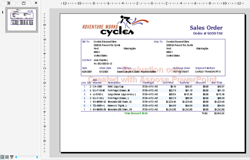

## **Dukungan Lisensi**
{} 

Anda dapat mengunduh versi evaluasi **Aspose.Slides for Reporting Services** dari [halaman Rilisnya](https://releases.aspose.com/slides/id/reportingservices/). Versi evaluasi menyediakan fungsionalitas yang sama dengan versi berlisensi produk. Paket evaluasi sama dengan paket yang dibeli. Versi evaluasi cukup menjadi berlisensi setelah Anda menambahkan beberapa baris kode ke dalamnya (untuk menerapkan lisensi).

Setelah Anda puas dengan evaluasi produk, Anda dapat [membeli lisensi](https://purchase.aspose.com/buy). Kami menyarankan Anda meninjau berbagai jenis langganan. Jika Anda memiliki pertanyaan, hubungi tim penjualan Aspose.

{} 

## **Lisensi di Aspose.Slides for Reporting Service**

* Sebuah versi evaluasi menjadi berlisensi setelah Anda membeli lisensi dan menambahkan beberapa baris kode ke dalamnya (untuk menerapkan lisensi).
* Lisensi adalah file XML teks biasa yang berisi detail seperti nama produk, jumlah pengembang yang memiliki lisensi, tanggal kedaluwarsa langganan, dan sebagainya. 
* File lisensi ditandatangani secara digital, sehingga Anda tidak boleh memodifikasi file tersebut. Bahkan penambahan baris kosong tambahan secara tidak sengaja pada isi file akan membuatnya tidak berlaku.
* Untuk menghindari keterbatasan yang terkait dengan versi evaluasi, Anda perlu mengatur lisensi sebelum menggunakan Aspose.Slides for Reporting Service. 

Unduh lisensi ke komputer Anda dan salin ke folder **C:\Program Files\Microsoft SQL Server\<Instance>\Reporting Services\ReportServer\bin**, yang merupakan tempat **Aspose.Slides.ReportingServices.dll** dipasang. 

Untuk memastikan lisensi terpasang dengan benar, ekspor laporan apa saja sebagai presentasi Microsoft PowerPoint. Jika dokumen tidak mengandung watermark, lisensi telah berhasil diaktifkan. 

Ketika file Aspose.Slides.ReportingServices.lic yang valid ada di folder *ReportServer\bin*, tidak ada watermark evaluasi. 

**Mode Evaluasi**

Aspose.Slides for Reporting Services menyisipkan watermark saat bekerja dalam mode evaluasi (tanpa lisensi)

{} 

Untuk menguji Aspose.Slides for Reporting Services tanpa batasan, Anda dapat meminta **Lisensi Sementara 30 Hari**. Lihat halaman [Cara Mendapatkan Lisensi Sementara](https://purchase.aspose.com/temporary-license) untuk informasi lebih lanjut.

{}