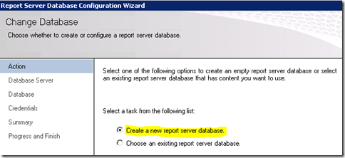
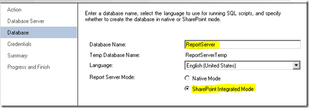

{} 
Tujuan pertama kami di RS Server adalah Reporting Services Configuration Manager. 
{} 
## **Akun Layanan**
Pastikan Anda memahami akun layanan yang Anda gunakan untuk Reporting Services. Jika kita mengalami masalah, itu mungkin terkait dengan akun layanan yang Anda gunakan. Standarnya adalah Network Service. Setiap kali saya menyebarkan build baru, saya selalu menggunakan Domain Account, karena di situlah saya cenderung mengalami masalah. Untuk konfigurasi ini di server saya, saya telah menggunakan Domain Account bernama **RSService**. 
## **URL Layanan Web**
Kita perlu mengkonfigurasi URL Layanan Web. Ini adalah direktori virtual **ReportServer** (vdir) yang menyimpan Web Services yang digunakan Reporting Services, dan yang akan berkomunikasi dengan SharePoint. Kecuali Anda ingin menyesuaikan properti vdir (misalnya SSL, port, header host, dll…), Anda cukup mengklik Apply di sini dan siap digunakan. 

**Gambar 3**: Menyiapkan URL Layanan Web 

Setelah selesai, Anda akan melihat gambar berikut. 

**Gambar 4**: Penyiapan URL Layanan Web berhasil 
## **Database**
Kita perlu membuat Database Katalog Reporting Services. Ini dapat ditempatkan pada mesin Database SQL 2008 atau SQL 2008 R2 mana pun. SQL11 juga dapat berfungsi, tetapi masih dalam BETA. Tindakan ini secara default akan membuat dua database, **ReportServer** dan **ReportServerTempDB**. Langkah penting lainnya adalah memastikan Anda memilih SharePoint Integrated sebagai tipe database. Setelah pilihan ini dibuat, tidak dapat diubah lagi. Silakan lihat Gambar 5, 6, dan 7 sebagai referensi. 

**Gambar 5**: Membuat Database Report Server 

**Gambar 6**: Menyiapkan Server Database dan Tipe Autentikasi 

**Gambar 7**: Menyiapkan Nama dan Mode Database 

Untuk kredensial, inilah cara Report Server berkomunikasi dengan SQL Server. Akun apa pun yang Anda pilih akan diberikan hak tertentu dalam database Katalog serta beberapa database sistem melalui RSExecRole. MSDB adalah salah satu database tersebut untuk penggunaan Subscription karena kami menggunakan SQL Agent. 

**Gambar 8**: Menyiapkan Kredensial Database Report Server 

Setelah selesai, tampilannya akan seperti gambar berikut. 

**Gambar 9**: Progres Menyelesaikan Penyiapan Database Report Server 
## **URL Report Manager**
Kita dapat melewatkan URL Report Manager, karena tidak digunakan saat berada dalam mode SharePoint Integrated. SharePoint adalah front‑end kami. Report Manager tidak berfungsi. 
## **Kunci Enkripsi**
Cadangkan Kunci Enkripsi Anda dan pastikan Anda tahu di mana menyimpannya. Jika Anda berada dalam situasi yang memerlukan migrasi Database atau pemulihannya, Anda akan memerlukan kunci tersebut. 

Itulah semua untuk Reporting Services Configuration Manager. Jika Anda membuka URL pada tab URL Layanan Web, itu akan menampilkan sesuatu yang mirip dengan gambar berikut. 

**Gambar 12**: Akses Report Server setelah instalasi 

Apa yang terjadi? SharePoint terpasang di WFE saya dan saya telah selesai menyiapkan Reporting Services. Pada contoh ini, Reporting Services dan SharePoint berada di mesin yang berbeda. Jika keduanya berada di mesin yang sama, Anda tidak akan melihat kesalahan ini. Secara teknis kita perlu menginstal SharePoint di RS Box. Itu berarti IIS juga akan diaktifkan.