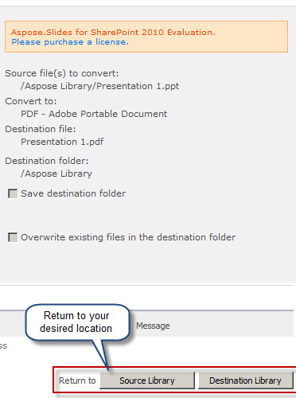

{}

Ketika Aspose.Slides for SharePoint dipasang di server SharePoint dan diaktifkan untuk koleksi situs, ia menambahkan item **Convert via Aspose.Slides** ke menu dokumen di perpustakaan dokumennya, seperti yang ditunjukkan di bawah ini. Pada SharePoint 2007, item tersebut bernama **Convert with Aspose.Slides**.

**Menginstal Aspose.Slides for SharePoint menambahkan item Convert via Aspose.Slides ke menu dokumen**

{}

## **Mengonversi Presentasi**

Untuk mengonversi presentasi Microsoft PowerPoint (PPT atau PPTX) dari perpustakaan dokumen SharePoint:

1. Pilih presentasi Microsoft PowerPoint di perpustakaan dokumen.
2. Buka menunya dan klik **Convert via Aspose.Slides**.

   **Menu file Presentation 2, menampilkan item Convert via Aspose.Slides**

   

3. Pilih format output di bawah **Convert to**. Jika perlu, ubah nama file output dan folder tujuan.
4. Klik **Convert** untuk mengonversi file.

   **Halaman konversi memungkinkan Anda memilih format output, nama file, dan tujuan**

   

5. Setelah konversi selesai, pesan keberhasilan akan ditampilkan.

   **Konversi berhasil**

   

6. Klik **Source Library** (untuk pergi ke folder sumber) atau **Destination Library** (untuk pergi ke folder tempat file disimpan).

   Dokumen yang dikonversi muncul di perpustakaan dokumen.

   **Dokumen yang dikonversi ditampilkan di perpustakaan tempat disimpan**

   

{}

Tangkapan layar diambil dengan versi sebelumnya, yang hanya menawarkan format PDF, TIFF, dan XPS. Halaman konversi saat ini menawarkan lebih banyak format output; lihat [Multiple Format Support](/slides/id/sharepoint/multiple-format-support/).

{}

Pada SharePoint 2010 dan yang lebih baru, Anda juga dapat memilih satu atau beberapa presentasi di perpustakaan dan mengklik **Convert Slides** pada tab pita **Aspose Tools**. Itu akan membuka halaman konversi yang sama.