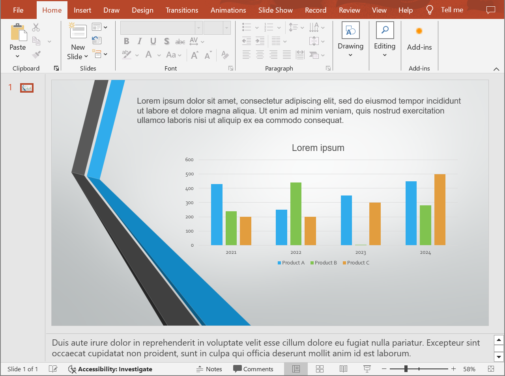

## **Introduzione**

Aspose.Slides for Android via Java offre una soluzione semplice per convertire presentazioni PowerPoint e OpenDocument (PPT, PPTX e ODP) con note nel formato TIFF. Questo formato è ampiamente utilizzato per l'archiviazione di immagini ad alta qualità, la stampa e l'archiviazione di documenti. Con Aspose.Slides è possibile non solo esportare intere presentazioni con note del relatore, ma anche generare miniature delle diapositive nella visualizzazione Note Slide. Il processo di conversione è semplice ed efficiente, utilizzando il metodo `save` della classe [Presentation](https://reference.aspose.com/slides/it/androidjava/com.aspose.slides/presentation/) per trasformare l'intera presentazione in una serie di immagini TIFF preservando le note e il layout.

## **Convertire una presentazione in TIFF con note**

La conversione di una presentazione PowerPoint o OpenDocument in TIFF con note usando Aspose.Slides for Android via Java comporta i seguenti passaggi:

1. Istanziare la classe [Presentation](https://reference.aspose.com/slides/it/androidjava/com.aspose.slides/presentation/): caricare un file PowerPoint o OpenDocument.  
2. Configurare le opzioni di layout di output: utilizzare la classe [NotesCommentsLayoutingOptions](https://reference.aspose.com/slides/it/androidjava/com.aspose.slides/notescommentslayoutingoptions/) per specificare come devono essere visualizzate note e commenti.  
3. Salvare la presentazione in TIFF: passare le opzioni configurate al metodo [save](https://reference.aspose.com/slides/it/androidjava/com.aspose.slides/presentation/#save-java.lang.String-int-com.aspose.slides.ISaveOptions-).

Diciamo di avere un file "speaker_notes.pptx" con la seguente diapositiva:



Il frammento di codice seguente dimostra come convertire la presentazione in un'immagine TIFF nella vista Note Slide utilizzando il metodo [setSlidesLayoutOptions](https://reference.aspose.com/slides/it/androidjava/com.aspose.slides/tiffoptions/#setSlidesLayoutOptions-com.aspose.slides.ISlidesLayoutOptions-).

```java
import com.aspose.slides.*;

// Istanzia la classe Presentation che rappresenta un file di presentazione.
Presentation presentation = new Presentation("speaker_notes.pptx");
try {
    NotesCommentsLayoutingOptions notesOptions = new NotesCommentsLayoutingOptions();
    notesOptions.setNotesPosition(NotesPositions.BottomFull); // Mostra le note sotto la diapositiva.

    // Configura le opzioni TIFF con il layout delle note.
    TiffOptions tiffOptions = new TiffOptions();
    tiffOptions.setDpiX(300);
    tiffOptions.setDpiY(300);
    tiffOptions.setSlidesLayoutOptions(notesOptions);

    // Salva la presentazione in TIFF con le note del relatore.
    presentation.save("TIFF_with_notes.tiff", SaveFormat.Tiff, tiffOptions);
} finally {
    presentation.dispose();
}
```

Il risultato:


{}
Scopri Aspose [Free PowerPoint to Poster Converter](https://products.aspose.app/slides/it/conversion/convert-ppt-to-poster-online).
{}

## **FAQ**

### Posso controllare la posizione dell'area delle note nel TIFF risultante?

Sì. Utilizzare le [notes layout settings](https://reference.aspose.com/slides/it/androidjava/com.aspose.slides/tiffoptions/#setSlidesLayoutOptions-com.aspose.slides.ISlidesLayoutOptions-) per scegliere tra opzioni come `None`, `BottomTruncated` o `BottomFull`, che rispettivamente nascondono le note, le adattano in una singola pagina o consentono loro di fluire su pagine aggiuntive.

### Come posso ridurre le dimensioni di un file TIFF con note senza perdita visibile di qualità?

Scegliere una [efficient compression](https://reference.aspose.com/slides/it/androidjava/com.aspose.slides/tiffoptions/#setCompressionType-int-) (ad es. `LZW` o `RLE`), impostare un DPI ragionevole e, se accettabile, utilizzare un [pixel format](https://reference.aspose.com/slides/it/androidjava/com.aspose.slides/tiffoptions/#setPixelFormat-int-) più basso (come 8 bpp o 1 bpp per il bianco e nero). Ridurre leggermente le [image dimensions](https://reference.aspose.com/slides/it/androidjava/com.aspose.slides/tiffoptions/#setImageSize-java.awt.Dimension-) può anche aiutare senza compromettere visibilmente la leggibilità.

### Il font nelle note influisce sul risultato se i font originali mancano nel sistema?

Sì. I font mancanti attivano la [substitution](/slides/it/androidjava/font-selection-sequence/), che può modificare le metriche del testo e l'aspetto. Per evitarlo, [supply the required fonts](/slides/it/androidjava/custom-font/) o impostare un [fallback font](/slides/it/androidjava/fallback-font/) predefinito in modo che vengano utilizzati i caratteri desiderati.