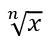

## **Panoramica**

PowerPoint memorizza le equazioni come Office Math Markup Language (OMML). Con Aspose.Slides per Android tramite Java, è possibile creare lo stesso tipo di contenuto matematico in modo programmatico: frazioni, radicali, funzioni, limiti, operatori N-ari, matrici, array e blocchi matematici formattati.

In PowerPoint, gli utenti normalmente aggiungono le equazioni da **Inserisci > Equazione**:


Il risultato è un testo matematico modificabile nella diapositiva:


Aspose.Slides costruisce quel testo matematico attraverso tre oggetti principali:

- Una forma matematica, creata con [addMathShape](https://reference.aspose.com/slides/it/androidjava/com.aspose.slides/ishapecollection/), è la forma che contiene l'equazione.
- [MathPortion](https://reference.aspose.com/slides/it/androidjava/com.aspose.slides/mathportion/) memorizza il contenuto matematico all'interno del frame di testo della forma.
- [MathParagraph](https://reference.aspose.com/slides/it/androidjava/com.aspose.slides/mathparagraph/) contiene uno o più oggetti [MathBlock](https://reference.aspose.com/slides/it/androidjava/com.aspose.slides/mathblock/).

La maggior parte degli esempi seguenti utilizza [MathematicalText](https://reference.aspose.com/slides/it/androidjava/com.aspose.slides/mathematicaltext/) e i metodi fluenti di [IMathElement](https://reference.aspose.com/slides/it/androidjava/com.aspose.slides/imathelement/) per mantenere il codice breve e leggibile.

Per scenari di esportazione MathML, vedere [Esporta equazioni matematiche dalle presentazioni su Android](/slides/it/androidjava/exporting-math-equations/).

## **Crea un'equazione**

Questo esempio crea una forma matematica e aggiunge il teorema di Pitagora:


```java
Presentation presentation = new Presentation();
try {
    ISlide slide = presentation.getSlides().get_Item(0);

    IAutoShape mathShape = slide.getShapes().addMathShape(20, 20, 700, 120);
    IMathParagraph mathParagraph = ((MathPortion) mathShape.getTextFrame().getParagraphs()
            .get_Item(0).getPortions().get_Item(0)).getMathParagraph();

    IMathBlock equation = new MathematicalText("c")
            .setSuperscript("2")
            .join("=")
            .join(new MathematicalText("a").setSuperscript("2"))
            .join("+")
            .join(new MathematicalText("b").setSuperscript("2"));

    mathParagraph.add(equation);

    presentation.save("pythagorean-theorem.pptx", SaveFormat.Pptx);
} finally {
    presentation.dispose();
}
```

{}

`addMathShape` crea una forma che contiene già un paragrafo matematico. Accedi al primo `MathPortion`, ottieni il suo `MathParagraph` e aggiungi blocchi matematici o elementi matematici.

{}

## **Aggiungi frazioni**

Usa `divide` per creare una frazione. È possibile scegliere uno stile di frazione con [MathFractionTypes](https://reference.aspose.com/slides/it/androidjava/com.aspose.slides/mathfractiontypes/).


```java
Presentation presentation = new Presentation();
try {
    ISlide slide = presentation.getSlides().get_Item(0);

    IAutoShape mathShape = slide.getShapes().addMathShape(20, 20, 700, 100);
    IMathParagraph mathParagraph = ((MathPortion) mathShape.getTextFrame().getParagraphs()
            .get_Item(0).getPortions().get_Item(0)).getMathParagraph();

    IMathFraction fraction = new MathematicalText("1")
            .divide("x", MathFractionTypes.Skewed);

    mathParagraph.add(new MathBlock(fraction));

    presentation.save("fraction.pptx", SaveFormat.Pptx);
} finally {
    presentation.dispose();
}
```

Per una frazione impilata, usa `MathFractionTypes.Bar`:

```java
IMathFraction stackedFraction = new MathematicalText("x + 1").divide("y - 1", MathFractionTypes.Bar);
```

## **Aggiungi radicali**

Usa `radical` per creare una radice quadrata, una radice cubica o un'altra radice. L'elemento corrente diventa la base, e l'argomento diventa il grado.



```java
Presentation presentation = new Presentation();
try {
    ISlide slide = presentation.getSlides().get_Item(0);

    IAutoShape mathShape = slide.getShapes().addMathShape(20, 20, 700, 100);
    IMathParagraph mathParagraph = ((MathPortion) mathShape.getTextFrame().getParagraphs()
            .get_Item(0).getPortions().get_Item(0)).getMathParagraph();

    IMathRadical radical = new MathematicalText("x")
            .radical("n");

    mathParagraph.add(new MathBlock(radical));

    presentation.save("radical.pptx", SaveFormat.Pptx);
} finally {
    presentation.dispose();
}
```

## **Aggiungi funzioni e limiti**

Usa `asArgumentOfFunction` o `function` per funzioni come `sin(x)`, `log(x)` o nomi di funzioni personalizzate. Per i limiti, inserisci `lim` in un [MathLimit](https://reference.aspose.com/slides/it/androidjava/com.aspose.slides/mathlimit/) o usa `setLowerLimit`.


```java
Presentation presentation = new Presentation();
try {
    ISlide slide = presentation.getSlides().get_Item(0);

    IAutoShape mathShape = slide.getShapes().addMathShape(20, 20, 700, 100);
    IMathParagraph mathParagraph = ((MathPortion) mathShape.getTextFrame().getParagraphs()
            .get_Item(0).getPortions().get_Item(0)).getMathParagraph();

    IMathFunction limit = new MathematicalText("lim")
            .setLowerLimit("x→∞")
            .function("x");

    mathParagraph.add(new MathBlock(limit));

    presentation.save("functions-and-limits.pptx", SaveFormat.Pptx);
} finally {
    presentation.dispose();
}
```

Per un nome di funzione personalizzato, rendi il nome della funzione l'elemento corrente:

```java
IMathFunction customFunction = new MathematicalText("f").function("x + 1");
```

## **Aggiungi operatori N-ari e integrali**

Usa `nary` per somme, unioni, intersezioni e altri operatori di grandi dimensioni. Usa `integral` per gli integrali. Entrambi i metodi consentono di impostare i limiti inferiori e superiori.


```java
Presentation presentation = new Presentation();
try {
    ISlide slide = presentation.getSlides().get_Item(0);

    IAutoShape mathShape = slide.getShapes().addMathShape(20, 20, 700, 120);
    IMathParagraph mathParagraph = ((MathPortion) mathShape.getTextFrame().getParagraphs()
            .get_Item(0).getPortions().get_Item(0)).getMathParagraph();

    IMathBlock summationBase = new MathematicalText("x")
            .setSuperscript("k")
            .join(new MathematicalText("a").setSuperscript("n-k"));

    IMathNaryOperator summation = summationBase.nary(MathNaryOperatorTypes.Summation, "k=0", "n");

    mathParagraph.add(new MathBlock(summation));

    presentation.save("nary-operators.pptx", SaveFormat.Pptx);
} finally {
    presentation.dispose();
}
```

Gli operatori N-ari sono per operatori di grandi dimensioni con limiti opzionali. Gli operatori semplici come `+`, `-` e `=` sono solitamente aggiunti come `MathematicalText` e concatenati nell'espressione.

Per un integrale, usa `integral`:

```java
IMathBlock integralBase = new MathematicalText("x").join(new MathematicalText("dx").toBox());
IMathNaryOperator integral = integralBase.integral(MathIntegralTypes.Simple, "0", "1");
```

## **Aggiungi matrici**

Usa [MathMatrix](https://reference.aspose.com/slides/it/androidjava/com.aspose.slides/mathmatrix/) per righe e colonne. Le matrici non includono parentesi per impostazione predefinita, quindi racchiudi la matrice quando hai bisogno di parentesi tonde, quadre o graffe.


```java
Presentation presentation = new Presentation();
try {
    ISlide slide = presentation.getSlides().get_Item(0);

    IAutoShape mathShape = slide.getShapes().addMathShape(20, 20, 700, 120);
    IMathParagraph mathParagraph = ((MathPortion) mathShape.getTextFrame().getParagraphs()
            .get_Item(0).getPortions().get_Item(0)).getMathParagraph();

    MathMatrix matrix = new MathMatrix(2, 3);
    matrix.set_Item(0, 0, new MathematicalText("1"));
    matrix.set_Item(0, 1, new MathematicalText("x"));
    matrix.set_Item(1, 0, new MathematicalText("x"));
    matrix.set_Item(1, 1, new MathematicalText("2"));
    matrix.set_Item(1, 2, new MathematicalText("y"));

    mathParagraph.add(new MathBlock(matrix));

    presentation.save("matrix.pptx", SaveFormat.Pptx);
} finally {
    presentation.dispose();
}
```

## **Aggiungi array di equazioni**

Usa `toMathArray` quando hai bisogno di equazioni allineate o di una pila verticale di espressioni.


```java
Presentation presentation = new Presentation();
try {
    ISlide slide = presentation.getSlides().get_Item(0);

    IAutoShape mathShape = slide.getShapes().addMathShape(20, 20, 700, 140);
    IMathParagraph mathParagraph = ((MathPortion) mathShape.getTextFrame().getParagraphs()
            .get_Item(0).getPortions().get_Item(0)).getMathParagraph();

    IMathArray equationArray = new MathematicalText("x")
            .join("y")
            .toMathArray();

    mathParagraph.add(new MathBlock(equationArray));

    presentation.save("equation-array.pptx", SaveFormat.Pptx);
} finally {
    presentation.dispose();
}
```

## **Aggiungi funzioni trigonometriche**

Usa `asArgumentOfFunction` quando l'argomento è l'elemento corrente e il nome della funzione è noto.


```java
Presentation presentation = new Presentation();
try {
    ISlide slide = presentation.getSlides().get_Item(0);

    IAutoShape mathShape = slide.getShapes().addMathShape(20, 20, 700, 100);
    IMathParagraph mathParagraph = ((MathPortion) mathShape.getTextFrame().getParagraphs()
            .get_Item(0).getPortions().get_Item(0)).getMathParagraph();

    IMathFunction cosine = new MathematicalText("2x")
            .asArgumentOfFunction(MathFunctionsOfOneArgument.Cos);

    mathParagraph.add(new MathBlock(cosine));

    presentation.save("trigonometric-function.pptx", SaveFormat.Pptx);
} finally {
    presentation.dispose();
}
```

## **Aggiungi pedici e apici**

Usa gli assistenti per pedici e apici per indici e potenze. Quando gli indici devono apparire a sinistra della base, usa `setSubSuperscriptOnTheLeft`.


```java
Presentation presentation = new Presentation();
try {
    ISlide slide = presentation.getSlides().get_Item(0);

    IAutoShape mathShape = slide.getShapes().addMathShape(20, 20, 700, 100);
    IMathParagraph mathParagraph = ((MathPortion) mathShape.getTextFrame().getParagraphs()
            .get_Item(0).getPortions().get_Item(0)).getMathParagraph();

    IMathLeftSubSuperscriptElement scripts = new MathematicalText("Y")
            .setSubSuperscriptOnTheLeft("1", "n");

    mathParagraph.add(new MathBlock(scripts));

    presentation.save("subscript-superscript.pptx", SaveFormat.Pptx);
} finally {
    presentation.dispose();
}
```

## **Aggiungi delimitatori**

Usa `enclose` per mettere un'espressione dentro delimitatori. Puoi anche impostare un carattere separatore per le espressioni delimitate che contengono più elementi.


```java
Presentation presentation = new Presentation();
try {
    ISlide slide = presentation.getSlides().get_Item(0);

    IAutoShape mathShape = slide.getShapes().addMathShape(20, 20, 700, 100);
    IMathParagraph mathParagraph = ((MathPortion) mathShape.getTextFrame().getParagraphs()
            .get_Item(0).getPortions().get_Item(0)).getMathParagraph();

    IMathDelimiter delimiter = new MathematicalText("x")
            .join("y")
            .join("z")
            .enclose('<', '>');
    delimiter.setSeparatorCharacter('|');

    mathParagraph.add(new MathBlock(delimiter));

    presentation.save("delimiters.pptx", SaveFormat.Pptx);
} finally {
    presentation.dispose();
}
```

## **Aggiungi un riquadro bordato**

Usa `toBorderBox` quando l'equazione stessa deve essere incorniciata.


```java
Presentation presentation = new Presentation();
try {
    ISlide slide = presentation.getSlides().get_Item(0);

    IAutoShape mathShape = slide.getShapes().addMathShape(20, 20, 700, 100);
    IMathParagraph mathParagraph = ((MathPortion) mathShape.getTextFrame().getParagraphs()
            .get_Item(0).getPortions().get_Item(0)).getMathParagraph();

    IMathBorderBox boxedEquation = new MathematicalText("a")
            .setSuperscript("2")
            .join("=")
            .join(new MathematicalText("b").setSuperscript("2"))
            .join("+")
            .join(new MathematicalText("c").setSuperscript("2"))
            .toBorderBox();

    mathParagraph.add(new MathBlock(boxedEquation));

    presentation.save("border-box.pptx", SaveFormat.Pptx);
} finally {
    presentation.dispose();
}
```

## **Raggruppa termini**

Usa `group` per posizionare un carattere di raggruppamento sopra o sotto un'espressione. Aggiungi un limite per etichettare i termini raggruppati.


```java
Presentation presentation = new Presentation();
try {
    ISlide slide = presentation.getSlides().get_Item(0);

    IAutoShape mathShape = slide.getShapes().addMathShape(20, 20, 700, 120);
    IMathParagraph mathParagraph = ((MathPortion) mathShape.getTextFrame().getParagraphs()
            .get_Item(0).getPortions().get_Item(0)).getMathParagraph();

    IMathLimit grouped = new MathematicalText("x + y")
            .group('\u23DF', MathTopBotPositions.Bottom, MathTopBotPositions.Top)
            .setLowerLimit("any text");

    mathParagraph.add(new MathBlock(grouped));

    presentation.save("grouped-terms.pptx", SaveFormat.Pptx);
} finally {
    presentation.dispose();
}
```

## **Formatta elementi matematici**

Usa gli assistenti di formattazione solo dove chiariscono la formula. Ad esempio, `overbar` posiziona una barra sopra un elemento matematico.


```java
Presentation presentation = new Presentation();
try {
    ISlide slide = presentation.getSlides().get_Item(0);

    IAutoShape mathShape = slide.getShapes().addMathShape(20, 20, 700, 100);
    IMathParagraph mathParagraph = ((MathPortion) mathShape.getTextFrame().getParagraphs()
            .get_Item(0).getPortions().get_Item(0)).getMathParagraph();

    IMathBar overbar = new MathematicalText("ABC").overbar();

    mathParagraph.add(new MathBlock(overbar));

    presentation.save("overbar.pptx", SaveFormat.Pptx);
} finally {
    presentation.dispose();
}
```

## **Riferimento rapido**

| Attività | API principale |
| --- | --- |
| Crea testo matematico | [MathematicalText](https://reference.aspose.com/slides/it/androidjava/com.aspose.slides/mathematicaltext/) |
| Combina elementi | [IMathElement.join](https://reference.aspose.com/slides/it/androidjava/com.aspose.slides/imathelement/) |
| Crea frazioni | [IMathElement.divide](https://reference.aspose.com/slides/it/androidjava/com.aspose.slides/imathelement/) |
| Aggiungi apice o pedice | [setSuperscript](https://reference.aspose.com/slides/it/androidjava/com.aspose.slides/imathelement/), [setSubscript](https://reference.aspose.com/slides/it/androidjava/com.aspose.slides/imathelement/) |
| Aggiungi funzioni | [function](https://reference.aspose.com/slides/it/androidjava/com.aspose.slides/imathelement/), [asArgumentOfFunction](https://reference.aspose.com/slides/it/androidjava/com.aspose.slides/imathelement/) |
| Aggiungi radicali | [IMathElement.radical](https://reference.aspose.com/slides/it/androidjava/com.aspose.slides/imathelement/) |
| Aggiungi limiti | [setLowerLimit](https://reference.aspose.com/slides/it/androidjava/com.aspose.slides/imathelement/), [setUpperLimit](https://reference.aspose.com/slides/it/androidjava/com.aspose.slides/imathelement/) |
| Aggiungi script a sinistra | [setSubSuperscriptOnTheLeft](https://reference.aspose.com/slides/it/androidjava/com.aspose.slides/imathelement/) |
| Aggiungi somme e integrali | [nary](https://reference.aspose.com/slides/it/androidjava/com.aspose.slides/imathelement/), [integral](https://reference.aspose.com/slides/it/androidjava/com.aspose.slides/imathelement/) |
| Aggiungi matrici | [MathMatrix](https://reference.aspose.com/slides/it/androidjava/com.aspose.slides/mathmatrix/) |
| Aggiungi array di equazioni | [toMathArray](https://reference.aspose.com/slides/it/androidjava/com.aspose.slides/imathelement/) |
| Aggiungi delimitatori | [enclose](https://reference.aspose.com/slides/it/androidjava/com.aspose.slides/imathelement/) |
| Aggiungi barre e bordi | [overbar](https://reference.aspose.com/slides/it/androidjava/com.aspose.slides/imathelement/), [toBorderBox](https://reference.aspose.com/slides/it/androidjava/com.aspose.slides/imathelement/) |
| Raggruppa termini | [group](https://reference.aspose.com/slides/it/androidjava/com.aspose.slides/imathelement/) |

## **FAQ**

**Posso modificare un'equazione PowerPoint esistente?**

Sì. Apri la presentazione, trova la forma che contiene un `MathPortion`, ottieni il suo `MathParagraph` e aggiorna i blocchi matematici in quel paragrafo.

**Le equazioni vengono salvate come matematica PowerPoint modificabile?**

Sì. Quando salvi in PPTX, Aspose.Slides scrive l'equazione come contenuto matematico di Office modificabile.

**Posso esportare le equazioni in LaTeX?**

Aspose.Slides esporta le equazioni matematiche in MathML. Se ti serve LaTeX, esporta prima in MathML e poi convertilo con uno strumento che supporti il dialetto LaTeX di destinazione.