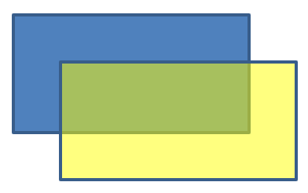

## **Introduzione**

In PowerPoint, è possibile aggiungere forme alle diapositive. Poiché le forme sono costituite da linee, è possibile formattarle modificando o applicando effetti ai loro contorni. Inoltre, è possibile formattare le forme specificando le impostazioni che controllano come vengono riempiti i loro interni.


Aspose.Slides per Android tramite Java fornisce interfacce e metodi che consentono di formattare le forme utilizzando le stesse opzioni disponibili in PowerPoint.

## **Formattare le linee**

Utilizzando Aspose.Slides, è possibile specificare uno stile di linea personalizzato per una forma. I passaggi seguenti illustrano la procedura:

1. Crea un'istanza della classe [Presentation](https://reference.aspose.com/slides/it/androidjava/com.aspose.slides/presentation/).
1. Ottieni un riferimento a una diapositiva per indice.
1. Aggiungi una [IAutoShape](https://reference.aspose.com/slides/it/androidjava/com.aspose.slides/iautoshape/) alla diapositiva.
1. Imposta lo [stile della linea](https://reference.aspose.com/slides/it/androidjava/com.aspose.slides/linestyle/) della forma.
1. Imposta lo spessore della linea.
1. Imposta lo [stile tratteggio](https://reference.aspose.com/slides/it/androidjava/com.aspose.slides/linedashstyle/) della linea.
1. Imposta il colore della linea per la forma.
1. Salva la presentazione modificata come file PPTX.

Il seguente codice dimostra come formattare un `AutoShape` rettangolare:

```java
// Istanzia la classe Presentation che rappresenta un file di presentazione.
Presentation presentation = new Presentation();
try {
    // Ottieni la prima diapositiva.
    ISlide slide = presentation.getSlides().get_Item(0);

    // Aggiungi una forma automatica di tipo Rettangolo.
    IAutoShape shape = slide.getShapes().addAutoShape(ShapeType.Rectangle, 50, 150, 150, 75);

    // Imposta il colore di riempimento per la forma rettangolo.
    shape.getFillFormat().setFillType(FillType.NoFill);

    // Applica la formattazione alle linee del rettangolo.
    shape.getLineFormat().setStyle(LineStyle.ThickThin);
    shape.getLineFormat().setWidth(7);
    shape.getLineFormat().setDashStyle(LineDashStyle.Dash);

    // Imposta il colore per la linea del rettangolo.
    shape.getLineFormat().getFillFormat().setFillType(FillType.Solid);
    shape.getLineFormat().getFillFormat().getSolidFillColor().setColor(Color.BLUE);

    // Salva il file PPTX su disco.
    presentation.save("formatted_lines.pptx", SaveFormat.Pptx);
} finally {
    presentation.dispose();
}
```

Il risultato:


## **Formattare gli stili di giunzione**

Ecco le tre opzioni di tipo di giunzione:

* Arrotondato
* Smussatura
* Bevel

In modo predefinito, quando PowerPoint unisce due linee ad un angolo (ad esempio all'angolo di una forma), utilizza l'impostazione **Round**. Tuttavia, se stai disegnando una forma con angoli acuti, potresti preferire l'opzione **Miter**.


Il seguente codice Java dimostra come tre rettangoli (come mostrato nell'immagine sopra) siano stati creati utilizzando le impostazioni di tipo di giunzione Miter, Bevel e Round:

```java
// Istanzia la classe Presentation che rappresenta un file di presentazione.
Presentation presentation = new Presentation();
try {
    // Ottieni la prima diapositiva.
    ISlide slide = presentation.getSlides().get_Item(0);

    // Aggiungi tre forme automatiche di tipo Rettangolo.
    IAutoShape shape1 = slide.getShapes().addAutoShape(ShapeType.Rectangle, 20, 20, 150, 75);
    IAutoShape shape2 = slide.getShapes().addAutoShape(ShapeType.Rectangle, 210, 20, 150, 75);
    IAutoShape shape3 = slide.getShapes().addAutoShape(ShapeType.Rectangle, 20, 135, 150, 75);

    // Imposta il colore di riempimento per ciascuna forma rettangolare.
    shape1.getFillFormat().setFillType(FillType.Solid);
    shape1.getFillFormat().getSolidFillColor().setColor(Color.BLACK);
    shape2.getFillFormat().setFillType(FillType.Solid);
    shape2.getFillFormat().getSolidFillColor().setColor(Color.BLACK);
    shape3.getFillFormat().setFillType(FillType.Solid);
    shape3.getFillFormat().getSolidFillColor().setColor(Color.BLACK);

    // Imposta lo spessore della linea.
    shape1.getLineFormat().setWidth(15);
    shape2.getLineFormat().setWidth(15);
    shape3.getLineFormat().setWidth(15);

    // Imposta il colore per la linea di ciascun rettangolo.
    shape1.getLineFormat().getFillFormat().setFillType(FillType.Solid);
    shape1.getLineFormat().getFillFormat().getSolidFillColor().setColor(Color.BLUE);
    shape2.getLineFormat().getFillFormat().setFillType(FillType.Solid);
    shape2.getLineFormat().getFillFormat().getSolidFillColor().setColor(Color.BLUE);
    shape3.getLineFormat().getFillFormat().setFillType(FillType.Solid);
    shape3.getLineFormat().getFillFormat().getSolidFillColor().setColor(Color.BLUE);

    // Imposta lo stile di giunzione.
    shape1.getLineFormat().setJoinStyle(LineJoinStyle.Miter);
    shape2.getLineFormat().setJoinStyle(LineJoinStyle.Bevel);
    shape3.getLineFormat().setJoinStyle(LineJoinStyle.Round);

    // Aggiungi testo a ciascun rettangolo.
    shape1.getTextFrame().setText("Miter Join Style");
    shape2.getTextFrame().setText("Bevel Join Style");
    shape3.getTextFrame().setText("Round Join Style");

    // Salva il file PPTX su disco.
    presentation.save("join_styles.pptx", SaveFormat.Pptx);
} finally {
    presentation.dispose();
}
```

## **Riempimento gradiente**

In PowerPoint, il Riempimento Gradiente è un'opzione di formattazione che consente di applicare una sfumatura continua di colori a una forma. Ad esempio, è possibile applicare due o più colori in modo che uno sfumi gradualmente nell'altro.

Ecco come applicare un riempimento gradiente a una forma utilizzando Aspose.Slides:

1. Crea un'istanza della classe [Presentation](https://reference.aspose.com/slides/it/androidjava/com.aspose.slides/presentation/).
1. Ottieni un riferimento a una diapositiva per indice.
1. Aggiungi una [IAutoShape](https://reference.aspose.com/slides/it/androidjava/com.aspose.slides/iautoshape/) alla diapositiva.
1. Imposta il [FillType](https://reference.aspose.com/slides/it/androidjava/com.aspose.slides/filltype/) della forma su `Gradient`.
1. Aggiungi i tuoi due colori preferiti con posizioni definite utilizzando i metodi `add` della raccolta di fermate gradiente esposta dall'interfaccia [IGradientFormat](https://reference.aspose.com/slides/it/androidjava/com.aspose.slides/igradientformat/).
1. Salva la presentazione modificata come file PPTX.

Il seguente codice Java dimostra come applicare un effetto di riempimento gradiente a un'ellisse:

```java
// Istanzia la classe Presentation che rappresenta un file di presentazione.
Presentation presentation = new Presentation();
try {
    // Ottieni la prima diapositiva.
    ISlide slide = presentation.getSlides().get_Item(0);

    // Aggiungi una forma automatica di tipo Ellisse.
    IAutoShape shape = slide.getShapes().addAutoShape(ShapeType.Ellipse, 50, 50, 150, 75);

    // Applica la formattazione gradiente all'ellisse.
    shape.getFillFormat().setFillType(FillType.Gradient);
    shape.getFillFormat().getGradientFormat().setGradientShape(GradientShape.Linear);

    // Imposta la direzione del gradiente.
    shape.getFillFormat().getGradientFormat().setGradientDirection(GradientDirection.FromCorner2);

    // Aggiungi due fermate del gradiente.
    shape.getFillFormat().getGradientFormat().getGradientStops().addPresetColor((float)1.0, PresetColor.Purple);
    shape.getFillFormat().getGradientFormat().getGradientStops().addPresetColor((float)0, PresetColor.Red);

    // Salva il file PPTX su disco.
    presentation.save("gradient_fill.pptx", SaveFormat.Pptx);
} finally {
    presentation.dispose();
}
```

Il risultato:


## **Riempimento a motivo**

In PowerPoint, il Riempimento Pattern è un'opzione di formattazione che consente di applicare un disegno a due colori—come punti, strisce, tratteggi incrociati o scacchi—a una forma. È possibile scegliere colori personalizzati per il primo piano e lo sfondo del motivo.

Aspose.Slides fornisce oltre 45 stili di motivo predefiniti che è possibile applicare alle forme per migliorare l'aspetto visivo delle presentazioni. Anche dopo aver selezionato un motivo predefinito, è possibile specificare i colori esatti da utilizzare.

Ecco come applicare un riempimento a motivo a una forma utilizzando Aspose.Slides:

1. Crea un'istanza della classe [Presentation](https://reference.aspose.com/slides/it/androidjava/com.aspose.slides/presentation/).
1. Ottieni un riferimento a una diapositiva per indice.
1. Aggiungi una [IAutoShape](https://reference.aspose.com/slides/it/androidjava/com.aspose.slides/iautoshape/) alla diapositiva.
1. Imposta il [FillType](https://reference.aspose.com/slides/it/androidjava/com.aspose.slides/filltype/) della forma su `Pattern`.
1. Scegli uno stile di pattern dalle opzioni predefinite.
1. Imposta il [Background Color](https://reference.aspose.com/slides/it/androidjava/com.aspose.slides/patternformat/#getBackColor--) del pattern.
1. Imposta il [Foreground Color](https://reference.aspose.com/slides/it/androidjava/com.aspose.slides/patternformat/#getForeColor--) del pattern.
1. Salva la presentazione modificata come file PPTX.

Il seguente codice Java dimostra come applicare un riempimento a motivo a un rettangolo:

```java
    // Istanzia la classe Presentation che rappresenta un file di presentazione.
    Presentation presentation = new Presentation();
    try {
        // Ottieni la prima diapositiva.
        ISlide slide = presentation.getSlides().get_Item(0);

        // Aggiungi una forma automatica di tipo Rettangolo.
        IAutoShape shape = slide.getShapes().addAutoShape(ShapeType.Rectangle, 50, 50, 150, 75);

        // Imposta il tipo di riempimento su Pattern.
        shape.getFillFormat().setFillType(FillType.Pattern);

        // Imposta lo stile del pattern.
        shape.getFillFormat().getPatternFormat().setPatternStyle(PatternStyle.Trellis);

        // Imposta i colori di sfondo e primo piano del pattern.
        shape.getFillFormat().getPatternFormat().getBackColor().setColor(Color.LIGHT_GRAY);
        shape.getFillFormat().getPatternFormat().getForeColor().setColor(Color.YELLOW);

        // Salva il file PPTX su disco.
        presentation.save("pattern_fill.pptx", SaveFormat.Pptx);
    } finally {
        presentation.dispose();
    }
```

Il risultato:


## **Riempimento immagine**

In PowerPoint, il Riempimento Immagine è un'opzione di formattazione che consente di inserire un'immagine all'interno di una forma—utilizzando effettivamente l'immagine come sfondo della forma.

Ecco come utilizzare Aspose.Slides per applicare un riempimento immagine a una forma:

1. Crea un'istanza della classe [Presentation](https://reference.aspose.com/slides/it/androidjava/com.aspose.slides/presentation/).
1. Ottieni un riferimento a una diapositiva per indice.
1. Aggiungi una [IAutoShape](https://reference.aspose.com/slides/it/androidjava/com.aspose.slides/iautoshape/) alla diapositiva.
1. Imposta il [FillType](https://reference.aspose.com/slides/it/androidjava/com.aspose.slides/filltype/) della forma su `Picture`.
1. Imposta la modalità di riempimento immagine su `Tile` (o un'altra modalità preferita).
1. Crea un oggetto [IPPImage](https://reference.aspose.com/slides/it/androidjava/com.aspose.slides/ippimage/) dall'immagine che desideri utilizzare.
1. Passa l'immagine al metodo `ISlidesPicture.setImage`.
1. Salva la presentazione modificata come file PPTX.

Supponiamo di avere un file "lotus.png" con l'immagine seguente:


Il seguente codice Java dimostra come riempire una forma con l'immagine:

```java
// Istanzia la classe Presentation che rappresenta un file di presentazione.
Presentation presentation = new Presentation();
try {
    // Ottieni la prima diapositiva.
    ISlide slide = presentation.getSlides().get_Item(0);

    // Aggiungi una forma automatica di tipo Rettangolo.
    IAutoShape shape = slide.getShapes().addAutoShape(ShapeType.Rectangle, 50, 50, 255, 130);
    
    // Imposta il tipo di riempimento su Picture.
    shape.getFillFormat().setFillType(FillType.Picture);

    // Imposta la modalità di riempimento immagine.
    shape.getFillFormat().getPictureFillFormat().setPictureFillMode(PictureFillMode.Tile);

    // Carica un'immagine e aggiungila alle risorse della presentazione.
    IImage image = Images.fromFile("lotus.png");
    IPPImage picture = presentation.getImages().addImage(image);
    image.dispose();

    // Imposta l'immagine.
    shape.getFillFormat().getPictureFillFormat().getPicture().setImage(picture);

    // Salva il file PPTX su disco.
    presentation.save("picture_fill.pptx", SaveFormat.Pptx);
} finally {
    presentation.dispose();
}
```

Il risultato:


### **Immagine a piastrellare come texture**

Se vuoi impostare un'immagine a piastrellare come texture e personalizzare il comportamento della piastrella, puoi utilizzare i seguenti metodi dell'interfaccia [IPictureFillFormat](https://reference.aspose.com/slides/it/androidjava/com.aspose.slides/ipicturefillformat/) e della classe [PictureFillFormat](https://reference.aspose.com/slides/it/androidjava/com.aspose.slides/picturefillformat/):

- [setPictureFillMode](https://reference.aspose.com/slides/it/androidjava/com.aspose.slides/ipicturefillformat/#setPictureFillMode-int-): imposta la modalità di riempimento immagine—`Tile` o `Stretch`.
- [setTileAlignment](https://reference.aspose.com/slides/it/androidjava/com.aspose.slides/ipicturefillformat/#setTileAlignment-byte-): specifica l'allineamento delle piastrelle all'interno della forma.
- [setTileFlip](https://reference.aspose.com/slides/it/androidjava/com.aspose.slides/ipicturefillformat/#setTileFlip-int-): controlla se la piastrella è capovolta orizzontalmente, verticalmente o in entrambi i sensi.
- [setTileOffsetX](https://reference.aspose.com/slides/it/androidjava/com.aspose.slides/ipicturefillformat/#setTileOffsetX-float-): imposta lo spostamento orizzontale della piastrella (in punti) dall'origine della forma.
- [setTileOffsetY](https://reference.aspose.com/slides/it/androidjava/com.aspose.slides/ipicturefillformat/#setTileOffsetY-float-): imposta lo spostamento verticale della piastrella (in punti) dall'origine della forma.
- [setTileScaleX](https://reference.aspose.com/slides/it/androidjava/com.aspose.slides/ipicturefillformat/#setTileScaleX-float-): definisce la scala orizzontale della piastrella in percentuale.
- [setTileScaleY](https://reference.aspose.com/slides/it/androidjava/com.aspose.slides/ipicturefillformat/#setTileScaleY-float-): definisce la scala verticale della piastrella in percentuale.

Il seguente esempio di codice mostra come aggiungere una forma rettangolare con riempimento immagine a piastrelle e configurare le opzioni della piastrella:

```java
// Istanzia la classe Presentation che rappresenta un file di presentazione.
Presentation presentation = new Presentation();
try {
    // Ottieni la prima diapositiva.
    ISlide firstSlide = presentation.getSlides().get_Item(0);

    // Aggiungi una forma automatica rettangolare.
    IAutoShape shape = firstSlide.getShapes().addAutoShape(ShapeType.Rectangle, 50, 50, 190, 95);

    // Imposta il tipo di riempimento della forma su Picture.
    shape.getFillFormat().setFillType(FillType.Picture);

    // Carica l'immagine e aggiungila alle risorse della presentazione.
    IImage sourceImage = Images.fromFile("lotus.png");
    IPPImage presentationImage = presentation.getImages().addImage(sourceImage);
    sourceImage.dispose();

    // Assegna l'immagine alla forma.
    IPictureFillFormat pictureFillFormat = shape.getFillFormat().getPictureFillFormat();
    pictureFillFormat.getPicture().setImage(presentationImage);

    // Configura la modalità di riempimento immagine e le proprietà di piastrellatura.
    pictureFillFormat.setPictureFillMode(PictureFillMode.Tile);
    pictureFillFormat.setTileOffsetX(-32);
    pictureFillFormat.setTileOffsetY(-32);
    pictureFillFormat.setTileScaleX(50);
    pictureFillFormat.setTileScaleY(50);
    pictureFillFormat.setTileAlignment(RectangleAlignment.BottomRight);
    pictureFillFormat.setTileFlip(TileFlip.FlipBoth);

    // Salva il file PPTX su disco.
    presentation.save("tile.pptx", SaveFormat.Pptx);
} finally {
    presentation.dispose();
}
```

Il risultato:


## **Riempimento colore solido**

In PowerPoint, il Riempimento a Colore Solido è un'opzione di formattazione che riempie una forma con un unico colore uniforme. Questo colore di sfondo semplice viene applicato senza sfumature, texture o motivi.

Per applicare un riempimento a colore solido a una forma utilizzando Aspose.Slides, segui questi passaggi:

1. Crea un'istanza della classe [Presentation](https://reference.aspose.com/slides/it/androidjava/com.aspose.slides/presentation/).
1. Ottieni un riferimento a una diapositiva per indice.
1. Aggiungi una [IAutoShape](https://reference.aspose.com/slides/it/androidjava/com.aspose.slides/iautoshape/) alla diapositiva.
1. Imposta il [FillType](https://reference.aspose.com/slides/it/androidjava/com.aspose.slides/filltype/) della forma su `Solid`.
1. Assegna il colore di riempimento desiderato alla forma.
1. Salva la presentazione modificata come file PPTX.

Il seguente codice Java dimostra come applicare un riempimento a colore solido a un rettangolo in una diapositiva PowerPoint:

```java
// Istanzia la classe Presentation che rappresenta un file di presentazione.
Presentation presentation = new Presentation();
try {
    // Ottieni la prima diapositiva.
    ISlide slide = presentation.getSlides().get_Item(0);

    // Aggiungi una forma automatica di tipo Rettangolo.
    IAutoShape shape = slide.getShapes().addAutoShape(ShapeType.Rectangle, 50, 50, 150, 75);

    // Imposta il tipo di riempimento su Solid.
    shape.getFillFormat().setFillType(FillType.Solid);

    // Imposta il colore di riempimento.
    shape.getFillFormat().getSolidFillColor().setColor(Color.YELLOW);

    // Salva il file PPTX su disco.
    presentation.save("solid_color_fill.pptx", SaveFormat.Pptx);
} finally {
    presentation.dispose();
}
```

Il risultato:


## **Imposta trasparenza**

In PowerPoint, quando applichi un riempimento a colore solido, gradiente, immagine o texture a delle forme, puoi anche impostare un livello di trasparenza per controllare l'opacità del riempimento. Un valore di trasparenza più alto rende la forma più trasparente, consentendo allo sfondo o agli oggetti sottostanti di essere parzialmente visibili.

Aspose.Slides consente di impostare il livello di trasparenza regolando il valore alfa nel colore utilizzato per il riempimento. Ecco come fare:

1. Crea un'istanza della classe [Presentation](https://reference.aspose.com/slides/it/androidjava/com.aspose.slides/presentation/).
1. Ottieni un riferimento a una diapositiva per indice.
1. Aggiungi una [IAutoShape](https://reference.aspose.com/slides/it/androidjava/com.aspose.slides/iautoshape/) alla diapositiva.
1. Imposta il [FillType](https://reference.aspose.com/slides/it/androidjava/com.aspose.slides/filltype/) su `Solid`.
1. Usa `Color` per definire un colore con trasparenza (il componente `alpha` controlla la trasparenza).
1. Salva la presentazione.

Il seguente codice Java dimostra come applicare un colore di riempimento trasparente a un rettangolo:

```java
// Istanzia la classe Presentation che rappresenta un file di presentazione.
Presentation presentation = new Presentation();
try {
    // Ottieni la prima diapositiva.
    ISlide slide = presentation.getSlides().get_Item(0);

    // Aggiungi una forma automatica rettangolare solida.
    IAutoShape solidShape = slide.getShapes().addAutoShape(ShapeType.Rectangle, 50, 50, 150, 75);

    // Aggiungi una forma automatica rettangolare trasparente sopra la forma solida.
    IAutoShape transparentShape = slide.getShapes().addAutoShape(ShapeType.Rectangle, 80, 80, 150, 75);
    transparentShape.getFillFormat().setFillType(FillType.Solid);
    transparentShape.getFillFormat().getSolidFillColor().setColor(new Color(255, 255, 0, 204));

    // Salva il file PPTX su disco.
    presentation.save("shape_transparency.pptx", SaveFormat.Pptx);
} finally {
    presentation.dispose();
}
```

Il risultato:



## **Ruotare le forme**

Aspose.Slides consente di ruotare le forme nelle presentazioni PowerPoint. Questo può risultare utile quando si posizionano elementi visivi con requisiti di allineamento o design specifici.

Per ruotare una forma su una diapositiva, segui questi passaggi:

1. Crea un'istanza della classe [Presentation](https://reference.aspose.com/slides/it/androidjava/com.aspose.slides/presentation/).
1. Ottieni un riferimento a una diapositiva per indice.
1. Aggiungi una [IAutoShape](https://reference.aspose.com/slides/it/androidjava/com.aspose.slides/iautoshape/) alla diapositiva.
1. Imposta la proprietà di rotazione della forma sull'angolo desiderato.
1. Salva la presentazione.

Il seguente codice Java dimostra come ruotare una forma di 5 gradi:

```java
// Istanzia la classe Presentation che rappresenta un file di presentazione.
Presentation presentation = new Presentation();
try {
    // Ottieni la prima diapositiva.
    ISlide slide = presentation.getSlides().get_Item(0);

    // Aggiungi una forma automatica di tipo Rettangolo.
    IAutoShape shape = slide.getShapes().addAutoShape(ShapeType.Rectangle, 50, 50, 150, 75);

    // Ruota la forma di 5 gradi.
    shape.setRotation(5);

    // Salva il file PPTX su disco.
    presentation.save("shape_rotation.pptx", SaveFormat.Pptx);
} finally {
    presentation.dispose();
}
```

Il risultato:


## **Aggiungere effetti di smusso 3D**

Aspose.Slides consente di applicare effetti di smusso 3D alle forme configurando le proprietà del [ThreeDFormat](https://reference.aspose.com/slides/it/androidjava/com.aspose.slides/threedformat/).

Per aggiungere effetti di smusso 3D a una forma, segui questi passaggi:

1. Instanzia la classe [Presentation](https://reference.aspose.com/slides/it/androidjava/com.aspose.slides/presentation/).
1. Ottieni un riferimento a una diapositiva per indice.
1. Aggiungi una [IAutoShape](https://reference.aspose.com/slides/it/androidjava/com.aspose.slides/iautoshape/) alla diapositiva.
1. Configura il [ThreeDFormat](https://reference.aspose.com/slides/it/androidjava/com.aspose.slides/threedformat/) della forma per definire le impostazioni di smusso.
1. Salva la presentazione.

Il seguente codice Java mostra come applicare effetti di smusso 3D a una forma:

```java
// Crea un'istanza della classe Presentation.
Presentation presentation = new Presentation();
try {
    ISlide slide = presentation.getSlides().get_Item(0);

    // Aggiungi una forma alla diapositiva.
    IAutoShape shape = slide.getShapes().addAutoShape(ShapeType.Ellipse, 50, 50, 100, 100);
    shape.getFillFormat().setFillType(FillType.Solid);
    shape.getFillFormat().getSolidFillColor().setColor(Color.GREEN);
    shape.getLineFormat().getFillFormat().setFillType(FillType.Solid);
    shape.getLineFormat().getFillFormat().getSolidFillColor().setColor(Color.ORANGE);
    shape.getLineFormat().setWidth(2.0);

    // Imposta le proprietà ThreeDFormat della forma.
    shape.getThreeDFormat().setDepth(4);
    shape.getThreeDFormat().getBevelTop().setBevelType(BevelPresetType.Circle);
    shape.getThreeDFormat().getBevelTop().setHeight(6);
    shape.getThreeDFormat().getBevelTop().setWidth(6);
    shape.getThreeDFormat().getCamera().setCameraType(CameraPresetType.OrthographicFront);
    shape.getThreeDFormat().getLightRig().setLightType(LightRigPresetType.ThreePt);
    shape.getThreeDFormat().getLightRig().setDirection(LightingDirection.Top);

    // Salva la presentazione come file PPTX.
    presentation.save("3D_bevel_effect.pptx", SaveFormat.Pptx);
} finally {
    presentation.dispose();
}
```

Il risultato:


## **Aggiungere effetti di rotazione 3D**

Aspose.Slides consente di applicare effetti di rotazione 3D alle forme configurando le proprietà del [ThreeDFormat](https://reference.aspose.com/slides/it/androidjava/com.aspose.slides/threedformat/).

Per applicare la rotazione 3D a una forma:

1. Crea un'istanza della classe [Presentation](https://reference.aspose.com/slides/it/androidjava/com.aspose.slides/presentation/).
1. Ottieni un riferimento a una diapositiva per indice.
1. Aggiungi una [IAutoShape](https://reference.aspose.com/slides/it/androidjava/com.aspose.slides/iautoshape/) alla diapositiva.
1. Usa i metodi [setCameraType](https://reference.aspose.com/slides/it/androidjava/com.aspose.slides/icamera/#setCameraType-int-) e [setLightType](https://reference.aspose.com/slides/it/androidjava/com.aspose.slides/ilightrig/#setLightType-int-) per definire la rotazione 3D.
1. Salva la presentazione.

Il seguente codice Java dimostra come applicare effetti di rotazione 3D a una forma:

```java
// Crea un'istanza della classe Presentation.
Presentation presentation = new Presentation();
try {
    ISlide slide = presentation.getSlides().get_Item(0);

    IAutoShape autoShape = slide.getShapes().addAutoShape(ShapeType.Rectangle, 50, 50, 150, 75);
    autoShape.getTextFrame().setText("Hello, Aspose!");

    autoShape.getThreeDFormat().setDepth(6);
    autoShape.getThreeDFormat().getCamera().setRotation(40, 35, 20);
    autoShape.getThreeDFormat().getCamera().setCameraType(CameraPresetType.IsometricLeftUp);
    autoShape.getThreeDFormat().getLightRig().setLightType(LightRigPresetType.Balanced);

    // Salva la presentazione come file PPTX.
    presentation.save("3D_rotation_effect.pptx", SaveFormat.Pptx);
} finally {
    presentation.dispose();
}
```

Il risultato:


## **Reimpostare la formattazione**

Il seguente codice Java mostra come reimpostare la formattazione di una diapositiva e riportare la posizione, le dimensioni e la formattazione di tutte le forme con segnaposto sul [LayoutSlide](https://reference.aspose.com/slides/it/androidjava/com.aspose.slides/layoutslide/) ai loro valori predefiniti:

```java
Presentation presentation = new Presentation("sample.pptx");
try {
    for (ISlide slide : presentation.getSlides()) {
        // Reimposta ogni forma sulla diapositiva che ha un segnaposto nel layout.
        slide.reset();
    }
    presentation.save("reset_formatting.pptx", SaveFormat.Pptx);
} finally {
    presentation.dispose();
}
```

## **FAQ**

**La formattazione delle forme influisce sulle dimensioni finali del file della presentazione?**

Solo in minima parte. Le immagini e i media incorporati occupano la maggior parte dello spazio del file, mentre i parametri delle forme come colori, effetti e sfumature sono memorizzati come metadati e non aggiungono praticamente alcuna dimensione extra.

**Come posso rilevare le forme su una diapositiva che condividono una formattazione identica così da poterle raggruppare?**

Confronta le proprietà chiave di formattazione di ciascuna forma—riempimento, linea e impostazioni degli effetti. Se tutti i valori corrispondenti coincidono, considera gli stili come identici e raggruppa logicamente quelle forme, semplificando così la gestione successiva degli stili.

**Posso salvare un insieme di stili di forma personalizzati in un file separato per riutilizzarlo in altre presentazioni?**

Sì. Conserva le forme di esempio con gli stili desiderati in un modello di presentazione o in un file modello .POTX. Quando crei una nuova presentazione, apri il modello, clona le forme con lo stile necessario e riapplica la loro formattazione dove richiesto.