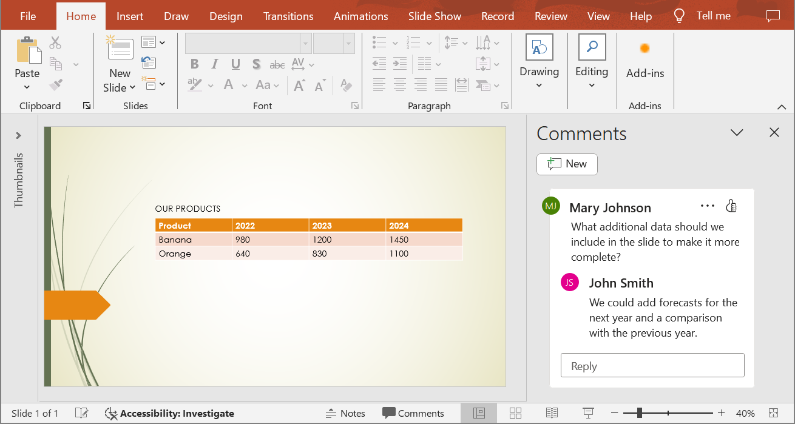

## **Introduzione**

La conversione di presentazioni PowerPoint e OpenDocument in immagini JPG aiuta a condividere le diapositive, ottimizzare le prestazioni e incorporare contenuti in siti web o applicazioni. Aspose.Slides per C++ consente di trasformare file PPTX, PPT e ODP in immagini JPEG di alta qualità. Questa guida spiega i diversi metodi di conversione.

Con queste funzionalità, è facile implementare il proprio visualizzatore di presentazioni e creare una miniatura per ogni diapositiva. Questo può essere utile se si desidera proteggere le diapositive da copie o dimostrare la presentazione in modalità sola lettura. Aspose.Slides consente di convertire l'intera presentazione o una diapositiva specifica in formati immagine.

## **Converti diapositive di presentazione in immagini JPG**

1. Crea un'istanza della classe [Presentation](https://reference.aspose.com/slides/it/cpp/aspose.slides/presentation/).
2. Ottieni l'oggetto diapositiva del tipo [ISlide](https://reference.aspose.com/slides/it/cpp/aspose.slides/islide/) dalla collezione di diapositive della presentazione.
3. Crea un'immagine della diapositiva usando il metodo [ISlide.GetImage](https://reference.aspose.com/slides/it/cpp/aspose.slides/islide/getimage/).
4. Chiama il metodo [IImage.Save](https://reference.aspose.com/slides/it/cpp/aspose.slides/iimage/save/) sull'oggetto immagine. Passa il nome del file di output e il formato immagine come argomenti.

{} 
**Nota:** La conversione da PPT, PPTX o ODP a JPG differisce dalla conversione in altri formati nell'API Aspose.Slides per C++. Per altri formati, di solito si utilizza il metodo [IPresentation.Save](https://reference.aspose.com/slides/it/cpp/aspose.slides/ipresentation/save/). Tuttavia, per la conversione in JPG, è necessario utilizzare il metodo [IImage.Save](https://reference.aspose.com/slides/it/cpp/aspose.slides/iimage/save/).
{} 

```cpp
#include <DOM/ISlide.h>
#include <DOM/ISlideCollection.h>
#include <DOM/Presentation.h>
#include <IImage.h>
#include <ImageFormat.h>
#include <system/enumerator_adapter.h>
#include <system/string.h>
using namespace Aspose::Slides;
using namespace System;

float scaleX = 1.0f;
float scaleY = scaleX;

auto presentation = MakeObject<Presentation>(u"PowerPoint-Presentation.ppt");

for (auto&& slide : presentation->get_Slides())
{
    // Crea un'immagine della diapositiva con la scala specificata.
    auto image = slide->GetImage(scaleX, scaleY);

    // Salva l'immagine su disco in formato JPEG.
    auto fileName = String::Format(u"Slide_{0}.jpg", slide->get_SlideNumber());
    image->Save(fileName, ImageFormat::Jpeg);

    image->Dispose();
}

presentation->Dispose();
```

## **Converti diapositive in JPG con dimensioni personalizzate**

Per modificare le dimensioni delle immagini JPG risultanti, è possibile impostare la dimensione dell'immagine passandola al metodo [ISlide.GetImage(Size)](https://reference.aspose.com/slides/it/cpp/aspose.slides/islide/getimage/#islidegetimagesystemdrawingsize-method). Questo consente di generare immagini con valori di larghezza e altezza specifici, garantendo che l'output soddisfi i requisiti di risoluzione e rapporto d'aspetto. Questa flessibilità è particolarmente utile quando si generano immagini per applicazioni web, report o documentazione, dove sono necessarie dimensioni precise dell'immagine.

```cpp
#include <DOM/ISlide.h>
#include <DOM/ISlideCollection.h>
#include <DOM/Presentation.h>
#include <IImage.h>
#include <ImageFormat.h>
#include <drawing/size.h>
#include <system/enumerator_adapter.h>
#include <system/smart_ptr.h>
using namespace Aspose::Slides;
using namespace System;

System::Drawing::Size imageSize(1200, 800);

auto presentation = MakeObject<Presentation>(u"PowerPoint-Presentation.pptx");

for (auto&& slide : presentation->get_Slides())
{
    // Crea un'immagine della diapositiva con la dimensione specificata.
    auto image = slide->GetImage(imageSize);

    // Salva l'immagine su disco in formato JPEG.
    auto fileName = System::String::Format(u"Slide_{0}.jpg", slide->get_SlideNumber());
    image->Save(fileName, ImageFormat::Jpeg);

    image->Dispose();
}

presentation->Dispose();
```

## **Renderizza commenti durante il salvataggio delle diapositive come immagini**

Aspose.Slides per C++ offre una funzionalità che consente di renderizzare i commenti sulle diapositive di una presentazione durante la conversione in immagini JPG. Questa funzionalità è particolarmente utile per preservare annotazioni, feedback o discussioni aggiunte dai collaboratori nelle presentazioni PowerPoint. Abilitando questa opzione, si garantisce che i commenti siano visibili nelle immagini generate, facilitando la revisione e la condivisione del feedback senza dover aprire il file della presentazione originale.

Supponiamo di avere un file di presentazione, "sample.pptx", con una diapositiva che contiene commenti:



Il seguente codice C++ converte la diapositiva in un'immagine JPG preservando i commenti:

```cpp
#include <DOM/ISlide.h>
#include <DOM/Presentation.h>
#include <Export/CommentsPositions.h>
#include <Export/NotesCommentsLayoutingOptions.h>
#include <Export/RenderingOptions.h>
#include <IImage.h>
#include <ImageFormat.h>
#include <drawing/color.h>
#include <system/smart_ptr.h>
using namespace Aspose::Slides;
using namespace Aspose::Slides::Export;
using namespace System;
using namespace System::Drawing;

float scaleX = 2.0f;
float scaleY = scaleX;

auto presentation = MakeObject<Presentation>(u"sample.pptx");
{
    auto commentOptions = MakeObject<NotesCommentsLayoutingOptions>();
    commentOptions->set_CommentsPosition(CommentsPositions::Right);
    commentOptions->set_CommentsAreaWidth(200);
    commentOptions->set_CommentsAreaColor(Color::get_DarkOrange());

    // Imposta le opzioni per i commenti della diapositiva.
    auto options = MakeObject<RenderingOptions>();
    options->set_SlidesLayoutOptions(commentOptions);

    // Converti la prima diapositiva in un'immagine.
    auto image = presentation->get_Slide(0)->GetImage(options, scaleX, scaleY);

    image->Save(u"Slide_1.jpg", ImageFormat::Jpeg);
    image->Dispose();
}

presentation->Dispose();
```

Il risultato:


## **Vedi anche**

Vedi altre opzioni per convertire PPT, PPTX o ODP in immagini, ad esempio:

- [Converti PowerPoint in GIF](/slides/it/cpp/convert-powerpoint-to-animated-gif/)
- [Converti PowerPoint in PNG](/slides/it/cpp/convert-powerpoint-to-png/)
- [Converti PowerPoint in TIFF](/slides/it/cpp/convert-powerpoint-to-tiff/)
- [Converti PowerPoint in SVG](/slides/it/cpp/render-a-slide-as-an-svg-image/)

{} 
Per vedere come Aspose.Slides converte PowerPoint in immagini JPG, prova questi convertitori online gratuiti: PowerPoint [PPTX in JPG](https://products.aspose.app/slides/it/conversion/pptx-to-jpg) e [PPT in JPG](https://products.aspose.app/slides/it/conversion/ppt-to-jpg). 
{}


{}

Aspose fornisce un'app web [GRATUITA Collage](https://products.aspose.app/slides/it/collage). Usando questo servizio online, è possibile unire immagini [JPG in JPG](https://products.aspose.app/slides/it/collage/jpg) o PNG in PNG, creare [griglie fotografiche](https://products.aspose.app/slides/it/collage/photo-grid) e così via. 

Utilizzando gli stessi principi descritti in questo articolo, è possibile convertire le immagini da un formato all'altro. Per ulteriori informazioni, vedere queste pagine: converti [immagine in JPG](https://products.aspose.com/slides/it/cpp/conversion/image-to-jpg/); converti [JPG in immagine](https://products.aspose.com/slides/it/cpp/conversion/jpg-to-image/); converti [JPG in PNG](https://products.aspose.com/slides/it/cpp/conversion/jpg-to-png/), converti [PNG in JPG](https://products.aspose.com/slides/it/cpp/conversion/png-to-jpg/); converti [PNG in SVG](https://products.aspose.com/slides/it/cpp/conversion/png-to-svg/), converti [SVG in PNG](https://products.aspose.com/slides/it/cpp/conversion/svg-to-png/).
{}

## **FAQ**

### Questo metodo supporta la conversione batch?

Sì, Aspose.Slides consente la conversione batch di più diapositive in JPG in un'unica operazione.

### La conversione supporta SmartArt, grafici e altri oggetti complessi?

Sì, Aspose.Slides renderizza tutti i contenuti, inclusi SmartArt, grafici, tabelle, forme e altro. Tuttavia, la precisione del rendering può variare leggermente rispetto a PowerPoint, soprattutto quando si utilizzano caratteri personalizzati o mancanti.

### Ci sono limiti al numero di diapositive che possono essere elaborate?

Aspose.Slides di per sé non impone limiti rigidi al numero di diapositive che si possono elaborare. Tuttavia, è possibile incontrare errori di memoria insufficiente quando si lavora con presentazioni di grandi dimensioni o immagini ad alta risoluzione.