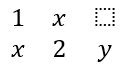

## **Panoramica**

PowerPoint memorizza le equazioni come Office Math Markup Language (OMML). Con Aspose.Slides for C++, è possibile creare lo stesso tipo di contenuto matematico in modo programmatico: frazioni, radicali, funzioni, limiti, operatori N-ario, matrici, array e blocchi matematici formattati.

In PowerPoint, gli utenti normalmente aggiungono le equazioni da **Insert > Equation**:


Il risultato è testo matematico modificabile sulla diapositiva:


Aspose.Slides costruisce quel testo matematico attraverso tre oggetti principali:

- Una forma matematica, creata con [AddMathShape](https://reference.aspose.com/slides/it/cpp/aspose.slides/shapecollection/), è la forma che contiene l'equazione.
- [MathPortion](https://reference.aspose.com/slides/it/cpp/aspose.slides.mathtext/mathportion/) memorizza il contenuto matematico all'interno del riquadro di testo della forma.
- [MathParagraph](https://reference.aspose.com/slides/it/cpp/aspose.slides.mathtext/mathparagraph/) contiene uno o più oggetti [MathBlock](https://reference.aspose.com/slides/it/cpp/aspose.slides.mathtext/mathblock/).

La maggior parte degli esempi seguenti utilizza [MathematicalText](https://reference.aspose.com/slides/it/cpp/aspose.slides.mathtext/mathematicaltext/) e i metodi fluenti di [IMathElement](https://reference.aspose.com/slides/it/cpp/aspose.slides.mathtext/imathelement/) per mantenere il codice breve e leggibile.

Per gli scenari di esportazione MathML, vedere [Export Math Equations from Presentations in C++](/slides/it/cpp/exporting-math-equations/).

## **Crea un'equazione**

Questo esempio crea una forma matematica e aggiunge il teorema di Pitagora:


```cpp
#include <DOM/IAutoShape.h>
#include <DOM/IParagraph.h>
#include <DOM/IShapeCollection.h>
#include <DOM/ISlide.h>
#include <DOM/ITextFrame.h>
#include <DOM/MathText/IMathBlock.h>
#include <DOM/MathText/IMathParagraph.h>
#include <DOM/MathText/IMathSuperscriptElement.h>
#include <DOM/MathText/MathPortion.h>
#include <DOM/MathText/MathematicalText.h>
#include <DOM/Presentation.h>
#include <Export/SaveFormat.h>
using namespace Aspose::Slides;
using namespace Aspose::Slides::Export;
using namespace Aspose::Slides::MathText;

auto presentation = System::MakeObject<Presentation>();
auto slide = presentation->get_Slide(0);

auto mathShape = slide->get_Shapes()->AddMathShape(20.0f, 20.0f, 700.0f, 120.0f);
auto mathPortion = System::ExplicitCast<MathPortion>(mathShape->get_TextFrame()->get_Paragraph(0)->get_Portion(0));
auto mathParagraph = mathPortion->get_MathParagraph();

auto equation = System::MakeObject<MathematicalText>(u"c")
        - >SetSuperscript(u"2")
        - >Join(u"=")
        - >Join(System::MakeObject<MathematicalText>(u"a")->SetSuperscript(u"2"))
        - >Join(u"+")
        - >Join(System::MakeObject<MathematicalText>(u"b")->SetSuperscript(u"2"));

mathParagraph->Add(equation);

presentation->Save(u"pythagorean-theorem.pptx", SaveFormat::Pptx);
presentation->Dispose();
```

{}
`AddMathShape` crea una forma che contiene già un paragrafo matematico. Accedi al primo `MathPortion`, ottieni il suo `MathParagraph` e aggiungi blocchi matematici o elementi matematici al suo interno.
{}

## **Aggiungi frazioni**

Usa `Divide` per creare una frazione. Puoi scegliere uno stile di frazione con [MathFractionTypes](https://reference.aspose.com/slides/it/cpp/aspose.slides.mathtext/mathfractiontypes/).


```cpp
#include <DOM/IAutoShape.h>
#include <DOM/IParagraph.h>
#include <DOM/IShapeCollection.h>
#include <DOM/ISlide.h>
#include <DOM/ITextFrame.h>
#include <DOM/MathText/IMathParagraph.h>
#include <DOM/MathText/MathBlock.h>
#include <DOM/MathText/MathFractionTypes.h>
#include <DOM/MathText/MathPortion.h>
#include <DOM/MathText/MathematicalText.h>
#include <DOM/Presentation.h>
#include <Export/SaveFormat.h>
using namespace Aspose::Slides;
using namespace Aspose::Slides::Export;
using namespace Aspose::Slides::MathText;

auto presentation = System::MakeObject<Presentation>();
auto slide = presentation->get_Slide(0);

auto mathShape = slide->get_Shapes()->AddMathShape(20.0f, 20.0f, 700.0f, 100.0f);
auto mathPortion = System::ExplicitCast<MathPortion>(mathShape->get_TextFrame()->get_Paragraph(0)->get_Portion(0));
auto mathParagraph = mathPortion->get_MathParagraph();

auto fraction = System::MakeObject<MathematicalText>(u"1")
        - >Divide(u"x", MathFractionTypes::Skewed);

mathParagraph->Add(System::MakeObject<MathBlock>(fraction));

presentation->Save(u"fraction.pptx", SaveFormat::Pptx);
presentation->Dispose();
```

Per una frazione impilata, usa `MathFractionTypes::Bar`:

```cpp
#include <DOM/MathText/MathFractionTypes.h>
#include <DOM/MathText/MathematicalText.h>
using namespace Aspose::Slides::MathText;

auto stackedFraction = System::MakeObject<MathematicalText>(u"x + 1")->Divide(u"y - 1", MathFractionTypes::Bar);
```

## **Aggiungi radicali**

Usa `Radical` per creare una radice quadrata, radice cubica o altra radice. L'elemento corrente diventa la base, e l'argomento diventa l'esponente.


```cpp
#include <DOM/IAutoShape.h>
#include <DOM/IParagraph.h>
#include <DOM/IShapeCollection.h>
#include <DOM/ISlide.h>
#include <DOM/ITextFrame.h>
#include <DOM/MathText/IMathParagraph.h>
#include <DOM/MathText/MathBlock.h>
#include <DOM/MathText/MathPortion.h>
#include <DOM/MathText/MathematicalText.h>
#include <DOM/Presentation.h>
#include <Export/SaveFormat.h>
using namespace Aspose::Slides;
using namespace Aspose::Slides::Export;
using namespace Aspose::Slides::MathText;

auto presentation = System::MakeObject<Presentation>();
auto slide = presentation->get_Slide(0);

auto mathShape = slide->get_Shapes()->AddMathShape(20.0f, 20.0f, 700.0f, 100.0f);
auto mathPortion = System::ExplicitCast<MathPortion>(mathShape->get_TextFrame()->get_Paragraph(0)->get_Portion(0));
auto mathParagraph = mathPortion->get_MathParagraph();

auto radical = System::MakeObject<MathematicalText>(u"x")
        - >Radical(u"n");

mathParagraph->Add(System::MakeObject<MathBlock>(radical));

presentation->Save(u"radical.pptx", SaveFormat::Pptx);
presentation->Dispose();
```

## **Aggiungi funzioni e limiti**

Usa `AsArgumentOfFunction` o `Function` per funzioni come `sin(x)`, `log(x)` o nomi di funzione personalizzati. Per i limiti, inserisci `lim` in un [MathLimit](https://reference.aspose.com/slides/it/cpp/aspose.slides.mathtext/mathlimit/) o usa `SetLowerLimit`.


```cpp
#include <DOM/IAutoShape.h>
#include <DOM/IParagraph.h>
#include <DOM/IShapeCollection.h>
#include <DOM/ISlide.h>
#include <DOM/ITextFrame.h>
#include <DOM/MathText/IMathLimit.h>
#include <DOM/MathText/IMathParagraph.h>
#include <DOM/MathText/MathBlock.h>
#include <DOM/MathText/MathPortion.h>
#include <DOM/MathText/MathematicalText.h>
#include <DOM/Presentation.h>
#include <Export/SaveFormat.h>
using namespace Aspose::Slides;
using namespace Aspose::Slides::Export;
using namespace Aspose::Slides::MathText;

auto presentation = System::MakeObject<Presentation>();
auto slide = presentation->get_Slide(0);

auto mathShape = slide->get_Shapes()->AddMathShape(20.0f, 20.0f, 700.0f, 100.0f);
auto mathPortion = System::ExplicitCast<MathPortion>(mathShape->get_TextFrame()->get_Paragraph(0)->get_Portion(0));
auto mathParagraph = mathPortion->get_MathParagraph();

auto limit = System::MakeObject<MathematicalText>(u"lim")
        - >SetLowerLimit(u"x→∞")
        - >Function(u"x");

mathParagraph->Add(System::MakeObject<MathBlock>(limit));

presentation->Save(u"functions-and-limits.pptx", SaveFormat::Pptx);
presentation->Dispose();
```

Per un nome di funzione personalizzato, rendi il nome della funzione l'elemento corrente:

```cpp
#include <DOM/MathText/MathematicalText.h>
using namespace Aspose::Slides::MathText;

auto customFunction = System::MakeObject<MathematicalText>(u"f")->Function(u"x + 1");
```

## **Aggiungi operatori N-ario e integrali**

Usa `Nary` per somme, unioni, intersezioni e altri operatori di grandi dimensioni. Usa `Integral` per gli integrali. Entrambi i metodi consentono di impostare limiti inferiori e superiori.


```cpp
#include <DOM/IAutoShape.h>
#include <DOM/IParagraph.h>
#include <DOM/IShapeCollection.h>
#include <DOM/ISlide.h>
#include <DOM/ITextFrame.h>
#include <DOM/MathText/IMathParagraph.h>
#include <DOM/MathText/IMathSuperscriptElement.h>
#include <DOM/MathText/MathBlock.h>
#include <DOM/MathText/MathNaryOperatorTypes.h>
#include <DOM/MathText/MathPortion.h>
#include <DOM/MathText/MathematicalText.h>
#include <DOM/Presentation.h>
#include <Export/SaveFormat.h>
using namespace Aspose::Slides;
using namespace Aspose::Slides::Export;
using namespace Aspose::Slides::MathText;

auto presentation = System::MakeObject<Presentation>();
auto slide = presentation->get_Slide(0);

auto mathShape = slide->get_Shapes()->AddMathShape(20.0f, 20.0f, 700.0f, 120.0f);
auto mathPortion = System::ExplicitCast<MathPortion>(mathShape->get_TextFrame()->get_Paragraph(0)->get_Portion(0));
auto mathParagraph = mathPortion->get_MathParagraph();

auto summationBase = System::MakeObject<MathematicalText>(u"x")
        - >SetSuperscript(u"k")
        - >Join(System::MakeObject<MathematicalText>(u"a")->SetSuperscript(u"n-k"));

auto summation = summationBase->Nary(MathNaryOperatorTypes::Summation, u"k=0", u"n");

mathParagraph->Add(System::MakeObject<MathBlock>(summation));

presentation->Save(u"nary-operators.pptx", SaveFormat::Pptx);
presentation->Dispose();
```

Gli operatori N-ario sono per operatori di grandi dimensioni con limiti opzionali. Gli operatori semplici come `+`, `-` e `=` sono solitamente aggiunti come `MathematicalText` e uniti all'espressione.

Per un integrale, usa `Integral`:

```cpp
#include <DOM/MathText/IMathBlock.h>
#include <DOM/MathText/IMathBox.h>
#include <DOM/MathText/IMathElement.h>
#include <DOM/MathText/MathIntegralTypes.h>
#include <DOM/MathText/MathematicalText.h>
using namespace Aspose::Slides::MathText;

auto integralBase = System::MakeObject<MathematicalText>(u"x")->Join(System::MakeObject<MathematicalText>(u"dx")->ToBox());
auto integral = integralBase->Integral(MathIntegralTypes::Simple, u"0", u"1");
```

## **Aggiungi matrici**

Usa [MathMatrix](https://reference.aspose.com/slides/it/cpp/aspose.slides.mathtext/mathmatrix/) per righe e colonne. Le matrici non includono parentesi quadre per impostazione predefinita, quindi racchiudi la matrice quando hai bisogno di parentesi tonde, quadre o graffe.



```cpp
#include <DOM/IAutoShape.h>
#include <DOM/IParagraph.h>
#include <DOM/IShapeCollection.h>
#include <DOM/ISlide.h>
#include <DOM/ITextFrame.h>
#include <DOM/MathText/IMathBlock.h>
#include <DOM/MathText/IMathElement.h>
#include <DOM/MathText/IMathParagraph.h>
#include <DOM/MathText/MathBlock.h>
#include <DOM/MathText/MathMatrix.h>
#include <DOM/MathText/MathPortion.h>
#include <DOM/MathText/MathematicalText.h>
#include <DOM/Presentation.h>
#include <Export/SaveFormat.h>
using namespace Aspose::Slides;
using namespace Aspose::Slides::Export;
using namespace Aspose::Slides::MathText;

auto presentation = System::MakeObject<Presentation>();
auto slide = presentation->get_Slide(0);

auto mathShape = slide->get_Shapes()->AddMathShape(20.0f, 20.0f, 700.0f, 120.0f);
auto mathPortion = System::ExplicitCast<MathPortion>(mathShape->get_TextFrame()->get_Paragraph(0)->get_Portion(0));
auto mathParagraph = mathPortion->get_MathParagraph();

auto matrix = System::MakeObject<MathMatrix>(2, 3);
matrix->idx_set(0, 0, System::MakeObject<MathematicalText>(u"1"));
matrix->idx_set(0, 1, System::MakeObject<MathematicalText>(u"x"));
matrix->idx_set(1, 0, System::MakeObject<MathematicalText>(u"x"));
matrix->idx_set(1, 1, System::MakeObject<MathematicalText>(u"2"));
matrix->idx_set(1, 2, System::MakeObject<MathematicalText>(u"y"));

mathParagraph->Add(System::MakeObject<MathBlock>(matrix));

presentation->Save(u"matrix.pptx", SaveFormat::Pptx);
presentation->Dispose();
```

## **Aggiungi array di equazioni**

Usa `ToMathArray` quando hai bisogno di equazioni allineate o di una pila verticale di espressioni.


```cpp
#include <DOM/IAutoShape.h>
#include <DOM/IParagraph.h>
#include <DOM/IShapeCollection.h>
#include <DOM/ISlide.h>
#include <DOM/ITextFrame.h>
#include <DOM/MathText/IMathParagraph.h>
#include <DOM/MathText/MathBlock.h>
#include <DOM/MathText/MathPortion.h>
#include <DOM/MathText/MathematicalText.h>
#include <DOM/Presentation.h>
#include <Export/SaveFormat.h>
using namespace Aspose::Slides;
using namespace Aspose::Slides::Export;
using namespace Aspose::Slides::MathText;

auto presentation = System::MakeObject<Presentation>();
auto slide = presentation->get_Slide(0);

auto mathShape = slide->get_Shapes()->AddMathShape(20.0f, 20.0f, 700.0f, 140.0f);
auto mathPortion = System::ExplicitCast<MathPortion>(mathShape->get_TextFrame()->get_Paragraph(0)->get_Portion(0));
auto mathParagraph = mathPortion->get_MathParagraph();

auto equationArray = System::MakeObject<MathematicalText>(u"x")
        - >Join(u"y")
        - >ToMathArray();

mathParagraph->Add(System::MakeObject<MathBlock>(equationArray));

presentation->Save(u"equation-array.pptx", SaveFormat::Pptx);
presentation->Dispose();
```

## **Aggiungi funzioni trigonometriche**

Usa `AsArgumentOfFunction` quando l'argomento è l'elemento corrente e il nome della funzione è noto.


```cpp
#include <DOM/IAutoShape.h>
#include <DOM/IParagraph.h>
#include <DOM/IShapeCollection.h>
#include <DOM/ISlide.h>
#include <DOM/ITextFrame.h>
#include <DOM/MathText/IMathParagraph.h>
#include <DOM/MathText/MathBlock.h>
#include <DOM/MathText/MathFunctionsOfOneArgument.h>
#include <DOM/MathText/MathPortion.h>
#include <DOM/MathText/MathematicalText.h>
#include <DOM/Presentation.h>
#include <Export/SaveFormat.h>
using namespace Aspose::Slides;
using namespace Aspose::Slides::Export;
using namespace Aspose::Slides::MathText;

auto presentation = System::MakeObject<Presentation>();
auto slide = presentation->get_Slide(0);

auto mathShape = slide->get_Shapes()->AddMathShape(20.0f, 20.0f, 700.0f, 100.0f);
auto mathPortion = System::ExplicitCast<MathPortion>(mathShape->get_TextFrame()->get_Paragraph(0)->get_Portion(0));
auto mathParagraph = mathPortion->get_MathParagraph();

auto cosine = System::MakeObject<MathematicalText>(u"2x")
        - >AsArgumentOfFunction(MathFunctionsOfOneArgument::Cos);

mathParagraph->Add(System::MakeObject<MathBlock>(cosine));

presentation->Save(u"trigonometric-function.pptx", SaveFormat::Pptx);
presentation->Dispose();
```

## **Aggiungi pedici e apici**

Usa gli assistenti per pedice e apice per indici e potenze. Quando gli indici devono apparire sul lato sinistro della base, usa `SetSubSuperscriptOnTheLeft`.


```cpp
#include <DOM/IAutoShape.h>
#include <DOM/IParagraph.h>
#include <DOM/IShapeCollection.h>
#include <DOM/ISlide.h>
#include <DOM/ITextFrame.h>
#include <DOM/MathText/IMathParagraph.h>
#include <DOM/MathText/MathBlock.h>
#include <DOM/MathText/MathPortion.h>
#include <DOM/MathText/MathematicalText.h>
#include <DOM/Presentation.h>
#include <Export/SaveFormat.h>
using namespace Aspose::Slides;
using namespace Aspose::Slides::Export;
using namespace Aspose::Slides::MathText;

auto presentation = System::MakeObject<Presentation>();
auto slide = presentation->get_Slide(0);

auto mathShape = slide->get_Shapes()->AddMathShape(20.0f, 20.0f, 700.0f, 100.0f);
auto mathPortion = System::ExplicitCast<MathPortion>(mathShape->get_TextFrame()->get_Paragraph(0)->get_Portion(0));
auto mathParagraph = mathPortion->get_MathParagraph();

auto scripts = System::MakeObject<MathematicalText>(u"Y")
        - >SetSubSuperscriptOnTheLeft(u"1", u"n");

mathParagraph->Add(System::MakeObject<MathBlock>(scripts));

presentation->Save(u"subscript-superscript.pptx", SaveFormat::Pptx);
presentation->Dispose();
```

## **Aggiungi delimitatori**

Usa `Enclose` per inserire un'espressione all'interno di delimitatori. È inoltre possibile impostare un carattere separatore per espressioni delimitate che contengono più elementi.


```cpp
#include <DOM/IAutoShape.h>
#include <DOM/IParagraph.h>
#include <DOM/IShapeCollection.h>
#include <DOM/ISlide.h>
#include <DOM/ITextFrame.h>
#include <DOM/MathText/IMathParagraph.h>
#include <DOM/MathText/MathBlock.h>
#include <DOM/MathText/MathPortion.h>
#include <DOM/MathText/MathematicalText.h>
#include <DOM/Presentation.h>
#include <Export/SaveFormat.h>
using namespace Aspose::Slides;
using namespace Aspose::Slides::Export;
using namespace Aspose::Slides::MathText;

auto presentation = System::MakeObject<Presentation>();
auto slide = presentation->get_Slide(0);

auto mathShape = slide->get_Shapes()->AddMathShape(20.0f, 20.0f, 700.0f, 100.0f);
auto mathPortion = System::ExplicitCast<MathPortion>(mathShape->get_TextFrame()->get_Paragraph(0)->get_Portion(0));
auto mathParagraph = mathPortion->get_MathParagraph();

auto delimiter = System::MakeObject<MathematicalText>(u"x")
        - >Join(u"y")
        - >Join(u"z")
        - >Enclose(u'<', u'>', u'|');

mathParagraph->Add(System::MakeObject<MathBlock>(delimiter));

presentation->Save(u"delimiters.pptx", SaveFormat::Pptx);
presentation->Dispose();
```

## **Aggiungi una cornice**

Usa `ToBorderBox` quando l'equazione stessa deve essere incorniciata.


```cpp
#include <DOM/IAutoShape.h>
#include <DOM/IParagraph.h>
#include <DOM/IShapeCollection.h>
#include <DOM/ISlide.h>
#include <DOM/ITextFrame.h>
#include <DOM/MathText/IMathParagraph.h>
#include <DOM/MathText/IMathSuperscriptElement.h>
#include <DOM/MathText/MathBlock.h>
#include <DOM/MathText/MathPortion.h>
#include <DOM/MathText/MathematicalText.h>
#include <DOM/Presentation.h>
#include <Export/SaveFormat.h>
using namespace Aspose::Slides;
using namespace Aspose::Slides::Export;
using namespace Aspose::Slides::MathText;

auto presentation = System::MakeObject<Presentation>();
auto slide = presentation->get_Slide(0);

auto mathShape = slide->get_Shapes()->AddMathShape(20.0f, 20.0f, 700.0f, 100.0f);
auto mathPortion = System::ExplicitCast<MathPortion>(mathShape->get_TextFrame()->get_Paragraph(0)->get_Portion(0));
auto mathParagraph = mathPortion->get_MathParagraph();

auto boxedEquation = System::MakeObject<MathematicalText>(u"a")
        - >SetSuperscript(u"2")
        - >Join(u"=")
        - >Join(System::MakeObject<MathematicalText>(u"b")->SetSuperscript(u"2"))
        - >Join(u"+")
        - >Join(System::MakeObject<MathematicalText>(u"c")->SetSuperscript(u"2"))
        - >ToBorderBox();

mathParagraph->Add(System::MakeObject<MathBlock>(boxedEquation));

presentation->Save(u"border-box.pptx", SaveFormat::Pptx);
presentation->Dispose();
```

## **Raggruppa termini**

Usa `Group` per posizionare un carattere di raggruppamento sopra o sotto un'espressione. Aggiungi un limite per etichettare i termini raggruppati.


```cpp
#include <DOM/IAutoShape.h>
#include <DOM/IParagraph.h>
#include <DOM/IShapeCollection.h>
#include <DOM/ISlide.h>
#include <DOM/ITextFrame.h>
#include <DOM/MathText/IMathGroupingCharacter.h>
#include <DOM/MathText/IMathParagraph.h>
#include <DOM/MathText/MathBlock.h>
#include <DOM/MathText/MathPortion.h>
#include <DOM/MathText/MathTopBotPositions.h>
#include <DOM/MathText/MathematicalText.h>
#include <DOM/Presentation.h>
#include <Export/SaveFormat.h>
using namespace Aspose::Slides;
using namespace Aspose::Slides::Export;
using namespace Aspose::Slides::MathText;

auto presentation = System::MakeObject<Presentation>();
auto slide = presentation->get_Slide(0);

auto mathShape = slide->get_Shapes()->AddMathShape(20.0f, 20.0f, 700.0f, 120.0f);
auto mathPortion = System::ExplicitCast<MathPortion>(mathShape->get_TextFrame()->get_Paragraph(0)->get_Portion(0));
auto mathParagraph = mathPortion->get_MathParagraph();

auto grouped = System::MakeObject<MathematicalText>(u"x + y")
        - >Group(u'\u23DF', MathTopBotPositions::Bottom, MathTopBotPositions::Top)
        - >SetLowerLimit(u"any text");

mathParagraph->Add(System::MakeObject<MathBlock>(grouped));

presentation->Save(u"grouped-terms.pptx", SaveFormat::Pptx);
presentation->Dispose();
```

## **Formato degli elementi matematici**

Usa gli assistenti di formattazione solo dove chiariscono la formula. Ad esempio, `Overbar` posiziona una barra sopra un elemento matematico.


```cpp
#include <DOM/IAutoShape.h>
#include <DOM/IParagraph.h>
#include <DOM/IShapeCollection.h>
#include <DOM/ISlide.h>
#include <DOM/ITextFrame.h>
#include <DOM/MathText/IMathParagraph.h>
#include <DOM/MathText/MathBlock.h>
#include <DOM/MathText/MathPortion.h>
#include <DOM/MathText/MathematicalText.h>
#include <DOM/Presentation.h>
#include <Export/SaveFormat.h>
using namespace Aspose::Slides;
using namespace Aspose::Slides::Export;
using namespace Aspose::Slides::MathText;

auto presentation = System::MakeObject<Presentation>();
auto slide = presentation->get_Slide(0);

auto mathShape = slide->get_Shapes()->AddMathShape(20.0f, 20.0f, 700.0f, 100.0f);
auto mathPortion = System::ExplicitCast<MathPortion>(mathShape->get_TextFrame()->get_Paragraph(0)->get_Portion(0));
auto mathParagraph = mathPortion->get_MathParagraph();

auto overbar = System::MakeObject<MathematicalText>(u"ABC")->Overbar();

mathParagraph->Add(System::MakeObject<MathBlock>(overbar));

presentation->Save(u"overbar.pptx", SaveFormat::Pptx);
presentation->Dispose();
```

## **Riferimento rapido**

| Attività | API principale |
| --- | --- |
| Crea testo matematico | [MathematicalText](https://reference.aspose.com/slides/it/cpp/aspose.slides.mathtext/mathematicaltext/) |
| Combina elementi | [IMathElement.Join](https://reference.aspose.com/slides/it/cpp/aspose.slides.mathtext/imathelement/join/) |
| Crea frazioni | [IMathElement.Divide](https://reference.aspose.com/slides/it/cpp/aspose.slides.mathtext/imathelement/divide/) |
| Aggiungi apice o pedice | [SetSuperscript](https://reference.aspose.com/slides/it/cpp/aspose.slides.mathtext/imathelement/setsuperscript/), [SetSubscript](https://reference.aspose.com/slides/it/cpp/aspose.slides.mathtext/imathelement/setsubscript/) |
| Aggiungi funzioni | [Function](https://reference.aspose.com/slides/it/cpp/aspose.slides.mathtext/imathelement/function/), [AsArgumentOfFunction](https://reference.aspose.com/slides/it/cpp/aspose.slides.mathtext/imathelement/asargumentoffunction/) |
| Aggiungi radicali | [IMathElement.Radical](https://reference.aspose.com/slides/it/cpp/aspose.slides.mathtext/imathelement/radical/) |
| Aggiungi limiti | [SetLowerLimit](https://reference.aspose.com/slides/it/cpp/aspose.slides.mathtext/imathelement/setlowerlimit/), [SetUpperLimit](https://reference.aspose.com/slides/it/cpp/aspose.slides.mathtext/imathelement/setupperlimit/) |
| Aggiungi script a sinistra | [SetSubSuperscriptOnTheLeft](https://reference.aspose.com/slides/it/cpp/aspose.slides.mathtext/imathelement/setsubsuperscriptontheleft/) |
| Aggiungi somme e integrali | [Nary](https://reference.aspose.com/slides/it/cpp/aspose.slides.mathtext/imathelement/nary/), [Integral](https://reference.aspose.com/slides/it/cpp/aspose.slides.mathtext/imathelement/integral/) |
| Aggiungi matrici | [MathMatrix](https://reference.aspose.com/slides/it/cpp/aspose.slides.mathtext/mathmatrix/) |
| Aggiungi array di equazioni | [ToMathArray](https://reference.aspose.com/slides/it/cpp/aspose.slides.mathtext/imathelement/tomatharray/) |
| Aggiungi delimitatori | [Enclose](https://reference.aspose.com/slides/it/cpp/aspose.slides.mathtext/imathelement/enclose/) |
| Aggiungi barre e cornici | [Overbar](https://reference.aspose.com/slides/it/cpp/aspose.slides.mathtext/imathelement/overbar/), [ToBorderBox](https://reference.aspose.com/slides/it/cpp/aspose.slides.mathtext/imathelement/toborderbox/) |
| Raggruppa termini | [Group](https://reference.aspose.com/slides/it/cpp/aspose.slides.mathtext/imathelement/group/) |

## **FAQ**

**Posso modificare un'equazione PowerPoint esistente?**

Sì. Apri la presentazione, trova la forma che contiene un `MathPortion`, ottieni il suo `MathParagraph` e aggiorna i blocchi matematici in quel paragrafo.

**Le equazioni vengono salvate come matematica PowerPoint modificabile?**

Sì. Quando salvi in PPTX, Aspose.Slides scrive l'equazione come contenuto math di Office modificabile.

**Posso esportare le equazioni in LaTeX?**

Sì. Ottieni il [IMathParagraph](https://reference.aspose.com/slides/it/cpp/aspose.slides.mathtext/imathparagraph/) dell'equazione dal suo [IMathPortion](https://reference.aspose.com/slides/it/cpp/aspose.slides.mathtext/imathportion/), e chiama [IMathParagraph::ToLatex](https://reference.aspose.com/slides/it/cpp/aspose.slides.mathtext/imathparagraph/tolatex/) per esportarlo direttamente. Per un esempio completo, vedere [Export Math Equations from Presentations in C++](/slides/it/cpp/exporting-math-equations/#export-math-equations-to-latex).