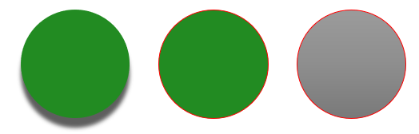

## **Introduzione**

Un tema di presentazione definisce un insieme coordinato di colori, caratteri, stili di sfondo, riempimenti, linee ed effetti. Gli oggetti sensibili al tema fanno riferimento a queste definizioni condivise invece di memorizzare ogni proprietà visiva come valore fisso, così una modifica del tema può aggiornare molti oggetti contemporaneamente.

In Aspose.Slides, il tema a livello di presentazione è disponibile tramite [Presentation::get_MasterTheme()](https://reference.aspose.com/slides/it/cpp/aspose.slides/presentation/get_mastertheme/). Una presentazione può anche contenere sovrascritture del tema a livelli inferiori. Un master può sovrascrivere il tema della presentazione tramite [MasterThemeManager::get_OverrideTheme()](https://reference.aspose.com/slides/it/cpp/aspose.slides.theme/masterthememanager/get_overridetheme/), mentre un layout o una singola diapositiva può utilizzare [IOverrideThemeManager::get_OverrideTheme()](https://reference.aspose.com/slides/it/cpp/aspose.slides.theme/ioverridethememanager/get_overridetheme/). In pratica, il tema effettivo per una diapositiva viene risolto attraverso questa catena di ereditarietà: tema della presentazione, sovrascrittura del master, sovrascrittura del layout e sovrascrittura della diapositiva.


Le sezioni seguenti mostrano i flussi di lavoro più comuni sul tema: ispezionare un tema, modificare colori e caratteri, copiare o applicare un tema, aggiornare gli stili di sfondo ed effetti, e leggere i valori effettivi dopo che ereditarietà e sovrascritture sono state risolte.

## **Ispezionare un Tema**

L’oggetto [MasterTheme](https://reference.aspose.com/slides/it/cpp/aspose.slides.theme/mastertheme/) espone i metodi [get_ColorScheme()](https://reference.aspose.com/slides/it/cpp/aspose.slides.theme/mastertheme/get_colorscheme/), [get_FontScheme()](https://reference.aspose.com/slides/it/cpp/aspose.slides.theme/mastertheme/get_fontscheme/) e [get_FormatScheme()](https://reference.aspose.com/slides/it/cpp/aspose.slides.theme/mastertheme/get_formatscheme/). Ispezionare queste collezioni prima di modificarle è particolarmente utile quando una presentazione proviene da una fonte esterna, poiché il numero e il contenuto delle voci di stile possono variare.

L’esempio seguente legge le proprietà principali del tema e riporta quante trovi di sfondo, riempimento, linea ed effetti sono memorizzate nel tema:

```cpp
#include <DOM/IColorFormat.h>
#include <DOM/IFonts.h>
#include <DOM/Presentation.h>
#include <DOM/Theme/IColorScheme.h>
#include <DOM/Theme/IEffectStyleCollection.h>
#include <DOM/Theme/IFillFormatCollection.h>
#include <DOM/Theme/IFontScheme.h>
#include <DOM/Theme/IFormatScheme.h>
#include <DOM/Theme/ILineFormatCollection.h>
#include <DOM/Theme/IMasterTheme.h>
#include <system/console.h>

using namespace Aspose::Slides;
using namespace System;

auto presentation = MakeObject<Presentation>(u"input.pptx");
auto theme = presentation->get_MasterTheme();
auto formatScheme = theme->get_FormatScheme();

Console::WriteLine(u"Theme name: {0}", theme->get_Name());
Console::WriteLine(u"Accent 1: {0}", theme->get_ColorScheme()->get_Accent1()->get_Color());
Console::WriteLine(u"Major Latin font: {0}", theme->get_FontScheme()->get_Major()->get_LatinFont()->get_FontName());
Console::WriteLine(u"Minor Latin font: {0}", theme->get_FontScheme()->get_Minor()->get_LatinFont()->get_FontName());
Console::WriteLine(u"Background fill styles: {0}", formatScheme->get_BackgroundFillStyles()->get_Count());
Console::WriteLine(u"Fill styles: {0}", formatScheme->get_FillStyles()->get_Count());
Console::WriteLine(u"Line styles: {0}", formatScheme->get_LineStyles()->get_Count());
Console::WriteLine(u"Effect styles: {0}", formatScheme->get_EffectStyles()->get_Count());
```

Se un file utilizza più master, non dare per scontato che ogni diapositiva abbia lo stesso tema effettivo. Ispeziona il master associato alla diapositiva e utilizza il flusso di lavoro sul tema effettivo mostrato più avanti in questo articolo quando potrebbero essere presenti sovrascritture a livello di layout o diapositiva.

## **Modificare i Colori del Tema**

I riempimenti, le linee e il testo sensibili al tema possono fare riferimento a un colore logico dell’enumerazione [SchemeColor](https://reference.aspose.com/slides/it/cpp/aspose.slides/schemecolor/). Quando cambi la voce corrispondente nella [IColorScheme](https://reference.aspose.com/slides/it/cpp/aspose.slides.theme/icolorscheme/) del tema, tutti gli oggetti che ancora fanno riferimento a quel colore del tema vengono risolti con il nuovo valore. Gli oggetti che usano un colore RGB diretto non vengono modificati da un aggiornamento del colore del tema.

L’esempio end‑to‑end seguente crea una forma che utilizza `Accent4`, cambia il colore `Accent4` del tema in rosso, salva la presentazione, la riapre e stampa il colore di riempimento effettivo:

```cpp
#include <DOM/FillType.h>
#include <DOM/IAutoShape.h>
#include <DOM/IColorFormat.h>
#include <DOM/IFillFormat.h>
#include <DOM/IFillFormatEffectiveData.h>
#include <DOM/IShapeCollection.h>
#include <DOM/ISlide.h>
#include <DOM/Presentation.h>
#include <DOM/SchemeColor.h>
#include <DOM/ShapeType.h>
#include <DOM/Theme/IColorScheme.h>
#include <DOM/Theme/IMasterTheme.h>
#include <Export/SaveFormat.h>
#include <drawing/color.h>
#include <system/console.h>

using namespace Aspose::Slides;
using namespace Aspose::Slides::Export;
using namespace System;
using namespace System::Drawing;

auto presentation = MakeObject<Presentation>();
auto slide = presentation->get_Slide(0);
auto shape = slide->get_Shapes()->AddAutoShape(ShapeType::Rectangle, 10.0f, 10.0f, 100.0f, 100.0f);
shape->get_FillFormat()->set_FillType(FillType::Solid);
shape->get_FillFormat()->get_SolidFillColor()->set_SchemeColor(SchemeColor::Accent4);
presentation->get_MasterTheme()->get_ColorScheme()->get_Accent4()->set_Color(Color::get_Red());
presentation->Save(u"theme-color.pptx", SaveFormat::Pptx);

auto savedPresentation = MakeObject<Presentation>(u"theme-color.pptx");
auto savedSlide = savedPresentation->get_Slide(0);
auto savedShape = savedSlide->get_Shape(0);
auto effectiveFill = savedShape->get_FillFormat()->GetEffective();
Console::WriteLine(u"Effective fill color: {0}", effectiveFill->get_SolidFillColor());
```

Poiché il rettangolo rimane collegato a `Accent4`, il suo colore visibile diventa rosso dopo la modifica del tema. Se sostituisci il colore dello schema con un colore diretto sulla forma, le modifiche successive a `Accent4` non influenzeranno più quel riempimento.

### **Utilizzare i Colori della Tavolozza Aggiuntiva**

PowerPoint deriva varianti più chiare e più scure da un colore del tema applicando trasformazioni di colore. Aspose.Slides espone queste trasformazioni tramite [ColorTransformOperation](https://reference.aspose.com/slides/it/cpp/aspose.slides/colortransformoperation/).


**1** - Colori principali del tema.  
**2** - Varianti più chiare e più scure prodotte dai colori principali del tema.

L’esempio seguente crea sei rettangoli basati su `Accent4`, applica trasformazioni di luminanza a cinque di essi e salva il risultato:

```cpp
#include <DOM/ColorTransformOperation.h>
#include <DOM/FillType.h>
#include <DOM/IAutoShape.h>
#include <DOM/IColorFormat.h>
#include <DOM/IColorOperationCollection.h>
#include <DOM/IFillFormat.h>
#include <DOM/IShapeCollection.h>
#include <DOM/ISlide.h>
#include <DOM/Presentation.h>
#include <DOM/SchemeColor.h>
#include <DOM/ShapeType.h>
#include <Export/SaveFormat.h>

using namespace Aspose::Slides;
using namespace Aspose::Slides::Export;
using namespace System;

auto presentation = MakeObject<Presentation>();
auto shapes = presentation->get_Slide(0)->get_Shapes();

auto shape1 = shapes->AddAutoShape(ShapeType::Rectangle, 10.0f, 10.0f, 50.0f, 50.0f);
auto fillFormat1 = shape1->get_FillFormat();
fillFormat1->set_FillType(FillType::Solid);
fillFormat1->get_SolidFillColor()->set_SchemeColor(SchemeColor::Accent4);

auto shape2 = shapes->AddAutoShape(ShapeType::Rectangle, 10.0f, 70.0f, 50.0f, 50.0f);
auto fillFormat2 = shape2->get_FillFormat();
auto solidFillColor2 = fillFormat2->get_SolidFillColor();
fillFormat2->set_FillType(FillType::Solid);
solidFillColor2->set_SchemeColor(SchemeColor::Accent4);
solidFillColor2->get_ColorTransform()->Add(ColorTransformOperation::MultiplyLuminance, 0.2f);
solidFillColor2->get_ColorTransform()->Add(ColorTransformOperation::AddLuminance, 0.8f);

auto shape3 = shapes->AddAutoShape(ShapeType::Rectangle, 10.0f, 130.0f, 50.0f, 50.0f);
auto fillFormat3 = shape3->get_FillFormat();
auto solidFillColor3 = fillFormat3->get_SolidFillColor();
fillFormat3->set_FillType(FillType::Solid);
solidFillColor3->set_SchemeColor(SchemeColor::Accent4);
solidFillColor3->get_ColorTransform()->Add(ColorTransformOperation::MultiplyLuminance, 0.4f);
solidFillColor3->get_ColorTransform()->Add(ColorTransformOperation::AddLuminance, 0.6f);

auto shape4 = shapes->AddAutoShape(ShapeType::Rectangle, 10.0f, 190.0f, 50.0f, 50.0f);
auto fillFormat4 = shape4->get_FillFormat();
auto solidFillColor4 = fillFormat4->get_SolidFillColor();
fillFormat4->set_FillType(FillType::Solid);
solidFillColor4->set_SchemeColor(SchemeColor::Accent4);
solidFillColor4->get_ColorTransform()->Add(ColorTransformOperation::MultiplyLuminance, 0.6f);
solidFillColor4->get_ColorTransform()->Add(ColorTransformOperation::AddLuminance, 0.4f);

auto shape5 = shapes->AddAutoShape(ShapeType::Rectangle, 10.0f, 250.0f, 50.0f, 50.0f);
auto fillFormat5 = shape5->get_FillFormat();
auto solidFillColor5 = fillFormat5->get_SolidFillColor();
fillFormat5->set_FillType(FillType::Solid);
solidFillColor5->set_SchemeColor(SchemeColor::Accent4);
solidFillColor5->get_ColorTransform()->Add(ColorTransformOperation::MultiplyLuminance, 0.75f);

auto shape6 = shapes->AddAutoShape(ShapeType::Rectangle, 10.0f, 310.0f, 50.0f, 50.0f);
auto fillFormat6 = shape6->get_FillFormat();
auto solidFillColor6 = fillFormat6->get_SolidFillColor();
fillFormat6->set_FillType(FillType::Solid);
solidFillColor6->set_SchemeColor(SchemeColor::Accent4);
solidFillColor6->get_ColorTransform()->Add(ColorTransformOperation::MultiplyLuminance, 0.5f);

presentation->Save(u"theme-color-palette.pptx", SaveFormat::Pptx);
```

Queste varianti rimangono basate sul colore del tema. Se `Accent4` cambia in seguito, i colori trasformati vengono ricalcolati dal nuovo valore di `Accent4`.

### **Mappare i Valori di `SchemeColor` negli Slot di `IColorScheme`**

L’enumerazione [SchemeColor](https://reference.aspose.com/slides/it/cpp/aspose.slides/schemecolor/) utilizza `Text1`, `Background1`, `Text2` e `Background2`, mentre [IColorScheme](https://reference.aspose.com/slides/it/cpp/aspose.slides.theme/icolorscheme/) espone gli stessi slot del tema come `Dark1`, `Light1`, `Dark2` e `Light2`. La mappatura è fissa:

* `Text1` = `Dark1`
* `Background1` = `Light1`
* `Text2` = `Dark2`
* `Background2` = `Light2`

Questi sono nomi alternativi per gli stessi slot del tema; non sono valori convertiti dinamicamente da una forma all’altra.

## **Modificare i Caratteri del Tema**

Uno schema di caratteri del tema contiene un set di caratteri principali per le intestazioni e un set secondario per il corpo del testo. I metodi [FontScheme::get_Major()](https://reference.aspose.com/slides/it/cpp/aspose.slides.theme/fontscheme/get_major/) e [FontScheme::get_Minor()](https://reference.aspose.com/slides/it/cpp/aspose.slides.theme/fontscheme/get_minor/) espongono questi set.

Gli identificatori di caratteri del tema compatibili con PowerPoint possono essere usati nella formattazione del testo:

* `+mn-lt` - Carattere corpo Latin (Minor Latin Font)
* `+mj-lt` - Carattere intestazione Latin (Major Latin Font)
* `+mn-ea` - Carattere corpo East Asian (Minor East Asian Font)
* `+mj-ea` - Carattere intestazione East Asian (Major East Asian Font)

L’esempio seguente crea un’intestazione che utilizza il carattere Latin principale del tema e una riga di corpo che utilizza il carattere Latin secondario del tema. Poi modifica i caratteri del tema e salva il risultato:

```cpp
#include <DOM/Fonts/FontData.h>
#include <DOM/IAutoShape.h>
#include <DOM/IFonts.h>
#include <DOM/IParagraph.h>
#include <DOM/IParagraphCollection.h>
#include <DOM/IPortion.h>
#include <DOM/IPortionCollection.h>
#include <DOM/IPortionFormat.h>
#include <DOM/IShapeCollection.h>
#include <DOM/ISlide.h>
#include <DOM/ITextFrame.h>
#include <DOM/Presentation.h>
#include <DOM/ShapeType.h>
#include <DOM/Theme/IFontScheme.h>
#include <DOM/Theme/IMasterTheme.h>
#include <Export/SaveFormat.h>

using namespace Aspose::Slides;
using namespace Aspose::Slides::Export;
using namespace System;

auto presentation = MakeObject<Presentation>();
auto slide = presentation->get_Slide(0);

auto heading = slide->get_Shapes()->AddAutoShape(ShapeType::Rectangle, 40.0f, 40.0f, 500.0f, 60.0f);
heading->get_TextFrame()->set_Text(u"Theme heading");
heading->get_TextFrame()->get_Paragraph(0)->get_Portion(0)->get_PortionFormat()->set_LatinFont(MakeObject<FontData>(u"+mj-lt"));

auto body = slide->get_Shapes()->AddAutoShape(ShapeType::Rectangle, 40.0f, 120.0f, 500.0f, 60.0f);
body->get_TextFrame()->set_Text(u"Theme body text");
body->get_TextFrame()->get_Paragraph(0)->get_Portion(0)->get_PortionFormat()->set_LatinFont(MakeObject<FontData>(u"+mn-lt"));

presentation->get_MasterTheme()->get_FontScheme()->get_Major()->set_LatinFont(MakeObject<FontData>(u"Aptos Display"));
presentation->get_MasterTheme()->get_FontScheme()->get_Minor()->set_LatinFont(MakeObject<FontData>(u"Arial"));
presentation->Save(u"theme-fonts.pptx", SaveFormat::Pptx);
```

L’intestazione segue il carattere principale e il testo del corpo segue il carattere secondario. Il testo che ha un nome di carattere esplicito invece di un identificatore del tema non cambierà automaticamente quando lo schema dei caratteri del tema viene modificato.

Le raccolte di caratteri principali e secondari possono contenere anche mappature di caratteri per singoli sistemi di scrittura, come cirillico, arabo, giapponese, georgiano e thaana. Per ispezionare, aggiungere, sostituire o rimuovere queste mappature, vedere [Caratteri del Tema Specifici per Script](/slides/it/cpp/script-specific-font-mappings/).

{}
Per ulteriori informazioni sui caratteri delle presentazioni, vedere [Caratteri PowerPoint](/slides/it/cpp/powerpoint-fonts/).
{}

## **Copiare o Applicare un Tema**

I flussi di lavoro seguenti risolvono diversi problemi legati al tema.

### **Applicare un Tema Esterno alle Diapositive Dipendenti da un Master**

Usa [IMasterSlide::ApplyExternalThemeToDependingSlides](https://reference.aspose.com/slides/it/cpp/aspose.slides/imasterslide/applyexternalthemetodependingslides/) quando hai un file tema di PowerPoint (`.thmx`) e vuoi riprogettare ogni diapositiva che dipende da un determinato master. Seleziona il master dalla collezione [Presentation::get_Masters](https://reference.aspose.com/slides/it/cpp/aspose.slides/presentation/get_masters/), che implementa [IMasterSlideCollection](https://reference.aspose.com/slides/it/cpp/aspose.slides/imasterslidecollection/), e passa il percorso del file tema al metodo.

Il metodo esegue le seguenti operazioni:

1. Crea una nuova diapositiva master basata sul master selezionato.
1. Applica il tema esterno al nuovo master.
1. Assegna il nuovo master a tutte le diapositive che in precedenza dipendevano dal master selezionato.
1. Restituisce il nuovo [IMasterSlide](https://reference.aspose.com/slides/it/cpp/aspose.slides/imasterslide/).

L’esempio seguente applica un tema esterno alle diapositive che dipendono dal primo master e salva la presentazione:

```cpp
#include <DOM/IMasterSlide.h>
#include <DOM/Presentation.h>
#include <Export/SaveFormat.h>
#include <iostream>

using namespace Aspose::Slides;
using namespace Aspose::Slides::Export;
using namespace System;

auto presentation = MakeObject<Presentation>(u"presentation.pptx");
auto selectedMaster = presentation->get_Master(0);
auto themedMaster = selectedMaster->ApplyExternalThemeToDependingSlides(u"corporate-theme.thmx");

Console::WriteLine(u"Created master: {0}", themedMaster->get_Name());
presentation->Save(u"presentation-with-external-theme.pptx", SaveFormat::Pptx);
```

Un tema non valido, corrotto o non supportato può causare [PptxException](https://reference.aspose.com/slides/it/cpp/aspose.slides/pptxexception/) o una delle sue sottoclassi legate al formato. Convalida i percorsi forniti dagli utenti, gestisci gli errori di accesso al file system e salva la presentazione solo dopo che il tema è stato applicato correttamente.

Solo le diapositive che dipendevano dal master selezionato vengono riassegnate. Le diapositive associate ad altri master mantengono i loro master e temi esistenti. I colori, i caratteri, i riempimenti, le linee, gli sfondi e gli effetti sensibili al tema vengono risolti rispetto al tema esterno. I colori, i caratteri, i riempimenti e altre formattazioni assegnate direttamente possono rimanere invariati. Le sovrascritture a livello di layout e di diapositiva possono anche avere la precedenza sui valori ereditati dal nuovo master.

Il tema può fare riferimento a caratteri non disponibili nell’ambiente di runtime. Per una resa ed esportazione coerenti, installa i caratteri richiesti, fornisci font tramite [font personalizzati](/slides/it/cpp/custom-font/), o configura la [sostituzione dei font](/slides/it/cpp/font-substitution/).

Questo è un flusso di lavoro diretto a livello di master: il metodo accetta un percorso file a un file `.thmx` e non richiede la creazione manuale di sovrascritture del tema a livello di diapositiva o layout.

### **Applicare Temi Esterni Differenti in una Presentazione a Multi‑Master**

Quando il master pertinente non è noto in anticipo, ottienilo da una diapositiva rappresentativa tramite [ISlide::get_LayoutSlide](https://reference.aspose.com/slides/it/cpp/aspose.slides/islide/get_layoutslide/) e [ILayoutSlide::get_MasterSlide](https://reference.aspose.com/slides/it/cpp/aspose.slides/ilayoutslide/get_masterslide/). Conserva i riferimenti ai master originali prima di applicare qualsiasi tema, poiché ogni chiamata crea un altro master nella presentazione.

L’esempio seguente utilizza diapositive di due sezioni per individuare i loro master e applica un tema esterno diverso a ciascun gruppo:

```cpp
#include <DOM/ILayoutSlide.h>
#include <DOM/IMasterSlide.h>
#include <DOM/Presentation.h>
#include <Export/SaveFormat.h>
#include <iostream>

using namespace Aspose::Slides;
using namespace Aspose::Slides::Export;
using namespace System;

auto presentation = MakeObject<Presentation>(u"multi-master-presentation.pptx");

if (presentation->get_Slides()->get_Count() < 5)
{
    std::cout << "The presentation does not contain the expected representative slides." << std::endl;
}
else
{
    auto firstGroupMaster = presentation->get_Slide(0)->get_LayoutSlide()->get_MasterSlide();
    auto secondGroupMaster = presentation->get_Slide(4)->get_LayoutSlide()->get_MasterSlide();

    if (firstGroupMaster->get_SlideId() == secondGroupMaster->get_SlideId())
    {
        std::cout << "The representative slides use the same master." << std::endl;
    }
    else
    {
        auto firstThemedMaster = firstGroupMaster->ApplyExternalThemeToDependingSlides(u"blue-theme.thmx");
        auto secondThemedMaster = secondGroupMaster->ApplyExternalThemeToDependingSlides(u"green-theme.thmx");

        Console::WriteLine(u"First themed master: {0}", firstThemedMaster->get_Name());
        Console::WriteLine(u"Second themed master: {0}", secondThemedMaster->get_Name());
        presentation->Save(u"multi-master-with-external-themes.pptx", SaveFormat::Pptx);
    }
}
```

La prima chiamata influisce solo sulle diapositive che dipendevano da `firstGroupMaster`, e la seconda chiamata influisce solo sulle diapositive che dipendevano da `secondGroupMaster`. Le diapositive appartenenti a qualsiasi altro master non vengono riprogettate.

### **Conservare il Tema di Origine durante lo Spostamento delle Diapositive**

Se desideri spostare una diapositiva in un’altra presentazione e mantenere il design originale, clona il master di origine nella presentazione di destinazione con [IMasterSlideCollection::AddClone()](https://reference.aspose.com/slides/it/cpp/aspose.slides/imasterslidecollection/addclone/), quindi clona la diapositiva con [ISlideCollection::AddClone()](https://reference.aspose.com/slides/it/cpp/aspose.slides/islidecollection/addclone/) e il master clonato. Questo trasporta il master, i suoi layout e il tema associato insieme.

```cpp
#include <DOM/ILayoutSlide.h>
#include <DOM/IMasterSlide.h>
#include <DOM/IMasterSlideCollection.h>
#include <DOM/ISlide.h>
#include <DOM/ISlideCollection.h>
#include <DOM/Presentation.h>
#include <Export/SaveFormat.h>

using namespace Aspose::Slides;
using namespace Aspose::Slides::Export;
using namespace System;

auto source = MakeObject<Presentation>(u"source-theme.pptx");
auto target = MakeObject<Presentation>(u"target.pptx");
auto sourceSlide = source->get_Slide(0);
auto sourceMaster = sourceSlide->get_LayoutSlide()->get_MasterSlide();
auto clonedMaster = target->get_Masters()->AddClone(sourceMaster);
target->get_Slides()->AddClone(sourceSlide, clonedMaster, true);
target->Save(u"theme-preserved.pptx", SaveFormat::Pptx);
```

Questo è il flusso di lavoro consigliato quando la diapositiva di origine deve apparire identica nella destinazione. Clonare semplicemente il contenuto su un master di destinazione non correlato può modificare i colori, i caratteri, gli sfondi e gli effetti determinati dal tema.

### **Applicare Valori del Tema a una Diapositiva Esistente**

Se la diapositiva di destinazione deve rimanere sul suo master e layout corrente, inizializza una sovrascrittura a livello di diapositiva dal tema di origine. I metodi [OverrideTheme::InitColorSchemeFrom()](https://reference.aspose.com/slides/it/cpp/aspose.slides.theme/overridetheme/initcolorschemefrom/), [OverrideTheme::InitFontSchemeFrom()](https://reference.aspose.com/slides/it/cpp/aspose.slides.theme/overridetheme/initfontschemefrom/) e [OverrideTheme::InitFormatSchemeFrom()](https://reference.aspose.com/slides/it/cpp/aspose.slides.theme/overridetheme/initformatschemefrom/) copiano i tre componenti principali del tema nella sovrascrittura.

```cpp
#include <DOM/ISlide.h>
#include <DOM/Presentation.h>
#include <DOM/Theme/IOverrideTheme.h>
#include <DOM/Theme/IOverrideThemeManager.h>
#include <DOM/Theme/IMasterTheme.h>
#include <Export/SaveFormat.h>

using namespace Aspose::Slides;
using namespace Aspose::Slides::Export;
using namespace System;

auto source = MakeObject<Presentation>(u"source-theme.pptx");
auto target = MakeObject<Presentation>(u"target.pptx");
auto targetSlide = target->get_Slide(0);
auto overrideTheme = targetSlide->get_ThemeManager()->get_OverrideTheme();
overrideTheme->InitColorSchemeFrom(source->get_MasterTheme()->get_ColorScheme());
overrideTheme->InitFontSchemeFrom(source->get_MasterTheme()->get_FontScheme());
overrideTheme->InitFormatSchemeFrom(source->get_MasterTheme()->get_FormatScheme());
target->Save(u"theme-applied-to-slide.pptx", SaveFormat::Pptx);
```

Questo modifica il tema usato da quella diapositiva senza alterare il tema ereditato dalle altre diapositive. Per rimuovere la sovrascrittura locale e tornare ai valori ereditati, chiama [OverrideTheme::Clear()](https://reference.aspose.com/slides/it/cpp/aspose.slides.theme/overridetheme/clear/).

### **Applicare una Sovrascrittura del Tema a un Layout**

Una sovrascrittura a livello di layout si applica alle diapositive che usano quel layout, a meno che una diapositiva specifica non abbia una propria sovrascrittura. Gli stessi metodi di inizializzazione possono essere usati tramite l’[IOverrideThemeManager](https://reference.aspose.com/slides/it/cpp/aspose.slides.theme/ioverridethememanager/) del layout:

```cpp
#include <DOM/ILayoutSlide.h>
#include <DOM/ISlide.h>
#include <DOM/Presentation.h>
#include <DOM/Theme/IOverrideTheme.h>
#include <DOM/Theme/IOverrideThemeManager.h>
#include <DOM/Theme/IMasterTheme.h>
#include <Export/SaveFormat.h>

using namespace Aspose::Slides;
using namespace Aspose::Slides::Export;
using namespace System;

auto source = MakeObject<Presentation>(u"source-theme.pptx");
auto target = MakeObject<Presentation>(u"target.pptx");
auto targetSlide = target->get_Slide(0);
auto targetLayout = targetSlide->get_LayoutSlide();
auto overrideTheme = targetLayout->get_ThemeManager()->get_OverrideTheme();
overrideTheme->InitColorSchemeFrom(source->get_MasterTheme()->get_ColorScheme());
overrideTheme->InitFontSchemeFrom(source->get_MasterTheme()->get_FontScheme());
overrideTheme->InitFormatSchemeFrom(source->get_MasterTheme()->get_FormatScheme());
target->Save(u"theme-applied-to-layout.pptx", SaveFormat::Pptx);
```

Usa un tema a livello di master o di presentazione quando molti layout e diapositive devono condividere lo stesso design di base, una sovrascrittura di layout quando una famiglia di layout necessita di uno styling diverso, e una sovrascrittura di diapositiva solo per eccezioni reali. Un eccesso di sovrascritture a livello di diapositiva rende più difficile prevedere le modifiche globali del tema in futuro.

## **Aggiornare gli Stili di Sfondo del Tema**

Gli sfondi del tema sono memorizzati in [FormatScheme::get_BackgroundFillStyles()](https://reference.aspose.com/slides/it/cpp/aspose.slides.theme/formatscheme/get_backgroundfillstyles/). PowerPoint può presentare più scelte di sfondo nella sua interfaccia rispetto al numero di definizioni di riempimento effettivamente memorizzate in questa collezione, perché l’interfaccia può combinare riempimenti del tema con i colori del tema e altri riferimenti di stile.


Prima di usare uno stile di sfondo, ispeziona la collezione memorizzata e il valore corrente di [Background::get_StyleIndex()](https://reference.aspose.com/slides/it/cpp/aspose.slides/background/get_styleindex/). `StyleIndex` usa `0` per nessun riempimento tematico; i valori positivi sono riferimenti a stili di sfondo del tema. Questo è diverso dall’indicizzare direttamente una collezione C++ con `idx_get(0)`, dove `0` indica il primo elemento memorizzato. Non supporre che ogni presentazione contenga lo stesso numero di stili di riempimento dello sfondo.

L’esempio seguente riporta il conteggio degli sfondi disponibili, assegna un riferimento di sfondo tematico al primo master e salva la presentazione:

```cpp
#include <DOM/BackgroundType.h>
#include <DOM/IBackground.h>
#include <DOM/IMasterSlide.h>
#include <DOM/Presentation.h>
#include <DOM/Theme/IFillFormatCollection.h>
#include <DOM/Theme/IFormatScheme.h>
#include <DOM/Theme/IMasterTheme.h>
#include <Export/SaveFormat.h>
#include <system/console.h>

using namespace Aspose::Slides;
using namespace Aspose::Slides::Export;
using namespace System;

auto presentation = MakeObject<Presentation>(u"input.pptx");
auto backgroundStyles = presentation->get_MasterTheme()->get_FormatScheme()->get_BackgroundFillStyles();
Console::WriteLine(u"Background fill styles: {0}", backgroundStyles->get_Count());

if (backgroundStyles->get_Count() > 0)
{
    auto masterSlide = presentation->get_Master(0);
    masterSlide->get_Background()->set_Type(BackgroundType::Themed);
    masterSlide->get_Background()->set_StyleIndex(1);
    presentation->Save(u"theme-background.pptx", SaveFormat::Pptx);
}
```

Il risultato visibile dipende dalla voce di tema a cui il master fa riferimento e da eventuali sovrascritture di sfondo a livello di layout o diapositiva. Se una diapositiva usa il proprio sfondo, modificare solo lo sfondo del master potrebbe non incidere su quella diapositiva. Usa [Background::GetEffective()](https://reference.aspose.com/slides/it/cpp/aspose.slides/background/geteffective/) quando devi conoscere lo sfondo finale dopo l’applicazione dell’eredità.

{}
Non trattare `StyleIndex` come un indice di collezione a base zero. Evita anche di codificare un numero di stile da un file e di presumere che abbia lo stesso aspetto in un altro file; le definizioni di stile del tema sono specifiche della presentazione.
{}

{}
Per la formattazione diretta dello sfondo e l’eredità dello sfondo, vedere [Sfondo della Presentazione](/slides/it/cpp/presentation-background/).
{}

## **Aggiornare gli Effetti del Tema**

Uno schema di formato del tema contiene collezioni separate di [FormatScheme::get_FillStyles()](https://reference.aspose.com/slides/it/cpp/aspose.slides.theme/formatscheme/get_fillstyles/), [FormatScheme::get_LineStyles()](https://reference.aspose.com/slides/it/cpp/aspose.slides.theme/formatscheme/get_linestyles/) e [FormatScheme::get_EffectStyles()](https://reference.aspose.com/slides/it/cpp/aspose.slides.theme/formatscheme/get_effectstyles/). I tipici temi Office contengono spesso tre voci di stile principali che corrispondono visivamente a formattazioni sottile, moderata e intensa, ma il codice dovrebbe ispezionare ogni collezione invece di presumere un conteggio fisso.


Quando accedi a queste collezioni in C++, l’indice della collezione è a base zero: `idx_get(0)` è il primo stile memorizzato e `idx_get(2)` è il terzo. Gli indici di riferimento di stile di una forma sono un concetto separato, esposto tramite [IShapeStyle](https://reference.aspose.com/slides/it/cpp/aspose.slides/ishapestyle/). Modificare uno stile del tema influisce sulle forme che fanno riferimento a quello stile; le forme con formattazione diretta possono rimanere inalterate.

L’esempio seguente verifica l’esistenza delle voci di stile richieste, modifica il primo stile di linea, modifica il terzo stile di riempimento, abilita un’ombra esterna nel terzo stile di effetto e salva il risultato:

```cpp
#include <DOM/Effects/IOuterShadow.h>
#include <DOM/FillType.h>
#include <DOM/IColorFormat.h>
#include <DOM/IEffectFormat.h>
#include <DOM/IFillFormat.h>
#include <DOM/ILineFormat.h>
#include <DOM/Presentation.h>
#include <DOM/Theme/IEffectStyle.h>
#include <DOM/Theme/IEffectStyleCollection.h>
#include <DOM/Theme/IFillFormatCollection.h>
#include <DOM/Theme/IFormatScheme.h>
#include <DOM/Theme/ILineFormatCollection.h>
#include <DOM/Theme/IMasterTheme.h>
#include <Export/SaveFormat.h>
#include <drawing/color.h>
#include <system/console.h>

using namespace Aspose::Slides;
using namespace Aspose::Slides::Export;
using namespace System;
using namespace System::Drawing;

auto presentation = MakeObject<Presentation>(u"Subtle_Moderate_Intense.pptx");
auto formatScheme = presentation->get_MasterTheme()->get_FormatScheme();
auto lineStyles = formatScheme->get_LineStyles();
auto fillStyles = formatScheme->get_FillStyles();
auto effectStyles = formatScheme->get_EffectStyles();

if (lineStyles->get_Count() < 1 || fillStyles->get_Count() < 3 || effectStyles->get_Count() < 3)
{
    Console::WriteLine(u"The theme does not contain the style entries required by this example.");
}
else
{
    auto lineStyle = lineStyles->idx_get(0);
    lineStyle->get_FillFormat()->set_FillType(FillType::Solid);
    lineStyle->get_FillFormat()->get_SolidFillColor()->set_Color(Color::get_Red());

    auto fillStyle = fillStyles->idx_get(2);
    fillStyle->set_FillType(FillType::Solid);
    fillStyle->get_SolidFillColor()->set_Color(Color::get_ForestGreen());

    auto effectFormat = effectStyles->idx_get(2)->get_EffectFormat();
    effectFormat->EnableOuterShadowEffect();
    effectFormat->get_OuterShadowEffect()->set_Distance(10.0f);

    presentation->Save(u"theme-effects.pptx", SaveFormat::Pptx);
}
```

Per le forme che fanno riferimento a questi slot, il primo stile di linea del tema diventa rosso, il terzo stile di riempimento del tema diventa verde foresta solido, e il terzo stile di effetto ottiene un’ombra esterna con una distanza di 10 punti. Il risultato visivo effettivo dipende comunque da quali slot di stile ogni forma fa riferimento e se la formattazione diretta sovrascrive il tema.



## **Leggere i Valori Effettivi del Tema**

Gli oggetti tema grezzi ti dicono cosa è definito a un determinato livello. I valori effettivi ti dicono cosa una diapositiva o una forma usa realmente dopo che ereditarietà e sovrascritture locali sono state risolte. Per una diapositiva, chiama [IThemeable::CreateThemeEffective()](https://reference.aspose.com/slides/it/cpp/aspose.slides.theme/ithemeable/createthemeeffective/). Per uno sfondo, usa [Background::GetEffective()](https://reference.aspose.com/slides/it/cpp/aspose.slides/background/geteffective/), e per un riempimento, usa [FillFormat::GetEffective()](https://reference.aspose.com/slides/it/cpp/aspose.slides/fillformat/geteffective/).

L’esempio seguente legge il tema effettivo, lo sfondo e il riempimento della prima forma da una diapositiva:

```cpp
#include <DOM/FillType.h>
#include <DOM/IBackground.h>
#include <DOM/IBackgroundEffectiveData.h>
#include <DOM/IFillFormat.h>
#include <DOM/IFillFormatEffectiveData.h>
#include <DOM/IFontsEffectiveData.h>
#include <DOM/IShape.h>
#include <DOM/IShapeCollection.h>
#include <DOM/ISlide.h>
#include <DOM/Presentation.h>
#include <DOM/Theme/IFontSchemeEffectiveData.h>
#include <DOM/Theme/IThemeEffectiveData.h>
#include <system/console.h>

using namespace Aspose::Slides;
using namespace System;

auto presentation = MakeObject<Presentation>(u"input.pptx");
auto slide = presentation->get_Slide(0);
auto effectiveTheme = slide->CreateThemeEffective();
auto effectiveBackground = slide->get_Background()->GetEffective();

Console::WriteLine(u"Effective major Latin font: {0}", effectiveTheme->get_FontScheme()->get_Major()->get_LatinFont()->get_FontName());
Console::WriteLine(u"Effective minor Latin font: {0}", effectiveTheme->get_FontScheme()->get_Minor()->get_LatinFont()->get_FontName());
Console::WriteLine(u"Effective background fill type: {0}", effectiveBackground->get_FillFormat()->get_FillType());

if (slide->get_Shapes()->get_Count() > 0)
{
    auto effectiveFill = slide->get_Shape(0)->get_FillFormat()->GetEffective();
    Console::WriteLine(u"First shape effective fill type: {0}", effectiveFill->get_FillType());
    if (effectiveFill->get_FillType() == FillType::Solid)
    {
        Console::WriteLine(u"First shape effective fill color: {0}", effectiveFill->get_SolidFillColor());
    }
}
```

Usa i dati effettivi per diagnostica di rendering, validazione e confronti. Se ispezioni solo [Presentation::get_MasterTheme()](https://reference.aspose.com/slides/it/cpp/aspose.slides/presentation/get_mastertheme/), potresti perdere un master, layout, diapositiva o sovrascrittura di forma che cambia l’aspetto finale.

## **FAQ**

**L’applicazione di un tema esterno influisce su tutte le diapositive della presentazione?**

No. [IMasterSlide::ApplyExternalThemeToDependingSlides](https://reference.aspose.com/slides/it/cpp/aspose.slides/imasterslide/applyexternalthemetodependingslides/) riassegna solo le diapositive che dipendono dal master selezionato. Le diapositive che usano altri master mantengono i loro temi esistenti.

**Posso applicare un tema a una singola diapositiva senza cambiare il master?**

Sì. Usa il [IOverrideThemeManager](https://reference.aspose.com/slides/it/cpp/aspose.slides.theme/ioverridethememanager/) della diapositiva e inizializza il suo tema di sovrascrittura. La modifica rimane locale a quella diapositiva; le altre diapositive continuano a ereditare i loro temi attuali.

**Qual è il modo più sicuro per trasferire un tema da una presentazione all’altra?**

Quando sposti una diapositiva mantenendo l’aspetto originale, clona il master di origine nella destinazione e clona la diapositiva con quel master usando [IMasterSlideCollection::AddClone()](https://reference.aspose.com/slides/it/cpp/aspose.slides/imasterslidecollection/addclone/) e [ISlideCollection::AddClone()](https://reference.aspose.com/slides/it/cpp/aspose.slides/islidecollection/addclone/). Questo conserva insieme master, layout e tema.

**Come posso vedere i valori effettivi dopo l’eredità e le sovrascritture?**

Usa [IThemeable::CreateThemeEffective()](https://reference.aspose.com/slides/it/cpp/aspose.slides.theme/ithemeable/createthemeeffective/) per una diapositiva o per il tema di layout e i metodi corrispondenti di dati effettivi per oggetti di formato come [Background::GetEffective()](https://reference.aspose.com/slides/it/cpp/aspose.slides/background/geteffective/) e [FillFormat::GetEffective()](https://reference.aspose.com/slides/it/cpp/aspose.slides/fillformat/geteffective/). Queste API restituiscono i valori risolti dopo l’applicazione dell’eredità e delle sovrascritture.