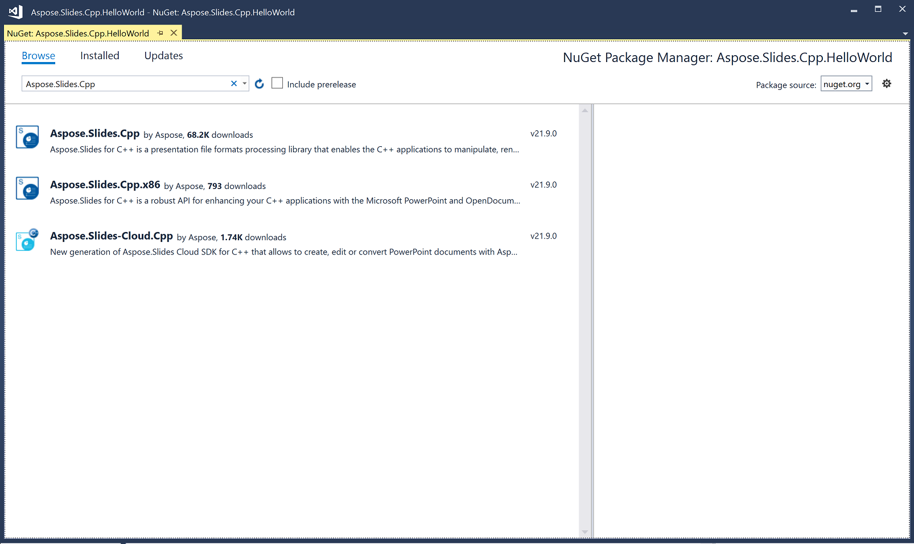
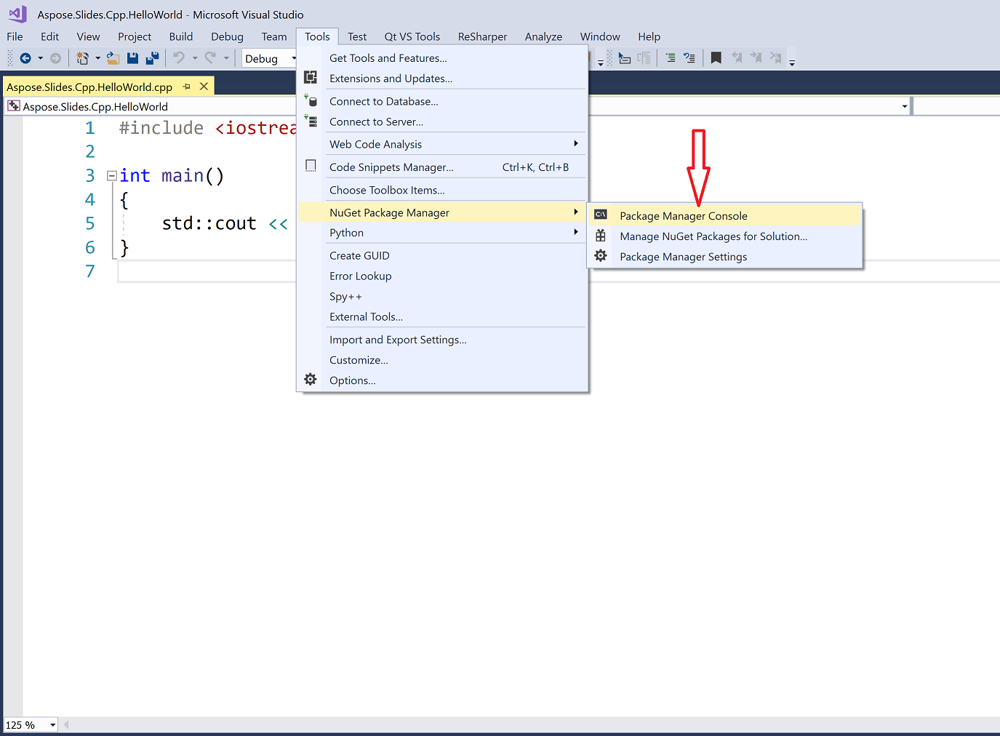

## **Overview**

Questo articolo spiega come installare Aspose.Slides su Windows. Si concentra sull'installazione basata su NuGet e mostra come aggiungere la libreria a un progetto Visual Studio sia tramite il Gestore pacchetti NuGet sia tramite la Console Gestore pacchetti in Windows. Descrive inoltre come aggiornare il pacchetto e installare build prerelease quando necessario.

## **Windows**
NuGet offre il percorso più semplice per scaricare e installare le API Aspose per C++ sui PC. 

### **Option One: Install or Update Aspose.Slides for C++ from the NuGet Package Manager**

1. Apri Microsoft Visual Studio. 
2. Crea una semplice applicazione console. Oppure puoi aprire il tuo progetto preferito. 
3. Vai su **Tools** > **NuGet package manager**.
4. Nella sezione **Browse**, digita *Aspose.Slides.Cpp* nel campo di testo. 

3. Fai clic sulla versione di **Aspose.Slides.Cpp** di cui hai bisogno e poi fai clic su **Install**. 
   * Se desideri aggiornare Aspose.Slides—che significa che è già installato—fai clic su **Update** invece. 

L'API selezionata viene scaricata e referenziata nel tuo progetto.

### **Option 2: Install or Update Aspose.Slides Through the Package Manager Console**

Per fare riferimento all[Aspose.Slides API](https://www.nuget.org/packages/Aspose.Slides.Cpp/) utilizzando la console del gestore pacchetti, esegui quanto segue:

1. Apri la tua soluzione/progetto in Visual Studio.

1. Vai su **Tools** > **NuGet Package Manager** > **Package Manager Console**. 

   Si apre la Console del gestore pacchetti. 

4. Digita questo comando: `Install-Package Aspose.Slides.Cpp` 
> Se vuoi installare la versione x86, usa il pacchetto Aspose.Slides.Cpp.x86: `Install-Package Aspose.Slides.Cpp.x86`

5. Premi il tasto Invio.

   L'ultima versione completa viene installata nella tua applicazione. 

   * In alternativa, puoi aggiungere il suffisso `-prerelease` al comando per indicare che deve essere installata anche l'ultima versione (incluse le correzioni hotfix). 

Una volta completato il download, dovresti vedere alcuni messaggi di conferma.  

Se non sei familiare con l[Aspose EULA](https://about.aspose.com/legal/eula), potresti voler leggere la licenza indicata nell'URL. 

Nella Console del gestore pacchetti, puoi eseguire il comando `Update-Package Aspose.Slides.Cpp` per verificare gli aggiornamenti al pacchetto Aspose.Slides. Gli aggiornamenti (se trovati) vengono installati automaticamente. Puoi anche usare il suffisso `-prerelease` per aggiornare l'ultima versione.

### **Using Include and lib Folders**
1. [Download](https://downloads.aspose.com/slides/it/cpp) la versione più recente di Aspose.Slides per C++.
1. Decomprimi la cartella nell'ambiente di produzione.
1. Per utilizzare Aspose.Slides per C++, aggiungi i folder Include e lib al tuo progetto

## **FAQ**

**Is there a free version or trial limitation?**

Sì, per impostazione predefinita, Aspose.Slides funziona in modalità di valutazione, che aggiunge filigrane e può presentare altre limitazioni. Per rimuovere le restrizioni, è necessario applicare una [license](/slides/it/cpp/licensing/) valida.