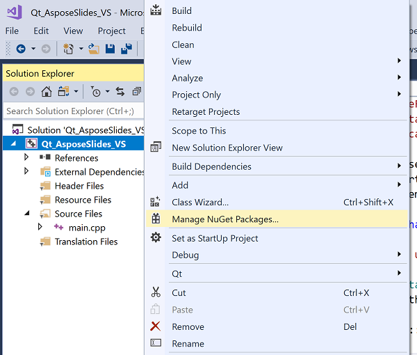

## **Introduzione**

Qt è un framework di sviluppo applicazioni cross‑platform basato su C++ ampiamente utilizzato per sviluppare una varietà di applicazioni desktop, mobile e per sistemi embedded. Aspose.Slides per C++ può essere integrato in Qt per creare e manipolare documenti PowerPoint nelle tue applicazioni Qt.

## **Utilizzare Aspose.Slides per C++ in Qt Creator**

Per utilizzare Aspose.Slides per C++ nella tua applicazione Qt scarica l'ultima versione dell'API dalla sezione [downloads](https://downloads.aspose.com/slides/it/cpp). Una volta scaricata l'API, puoi integrare la libreria C++ in Qt Creator o Visual Studio.

Per integrare e utilizzare la libreria Aspose.Slides per C++ all'interno di un'Applicazione Console Qt sviluppata in Qt Creator, segui i passaggi indicati di seguito:

- Apri Qt Creator e crea una nuova *Qt Console Application*.

- Seleziona l'opzione QMake dal menu a discesa *Build System*.

- Seleziona il kit appropriato e completa la procedura guidata.

- Copia la cartella aspose-slides-cpp-21.02 dal pacchetto estratto di Aspose.Slides per C++ nella radice del progetto.

- Per aggiungere i percorsi alle cartelle lib e include, fai clic con il tasto destro sul progetto nel pannello sinistro e seleziona *Add Library*.

- Seleziona l'opzione External Library e sfoglia i percorsi per includere le cartelle lib una per una.

- Una volta completato, il file di progetto .pro conterrà le seguenti voci:

- Compila l'applicazione e l'integrazione è completata.  

{}

Nota: consulta il [progetto demo completo](https://github.com/aspose-slides/Aspose.Slides-for-C/tree/master/QtDemos/QtCreator/Qt_AsposeSlides_QMake) per ulteriori informazioni.

{}

## **Utilizzare Aspose.Slides per C++ nelle Applicazioni Qt con Visual Studio**

Per sviluppare un'applicazione Qt usando Visual Studio, è necessario installare [Qt Visual Studio Tools](https://marketplace.visualstudio.com/items?itemName=TheQtCompany.QtVisualStudioTools-19123). Una volta completata l'installazione, scarica l'ultima versione dell'API dalla sezione [downloads](https://downloads.aspose.com/slides/it/cpp) e segui i passaggi indicati di seguito:

- Apri Microsoft Visual Studio e crea una nuova *Qt Console Application*.

- Seleziona il kit appropriato e completa la procedura guidata.

- Per integrare e utilizzare la libreria Aspose.Slides per C++, fai clic con il tasto destro sul progetto e seleziona *Manage NuGet Packages...*.

- Cerca e installa il pacchetto *Aspose.Slides.Cpp* richiesto.

- Compila il progetto e l'integrazione è completata.  

{}

Nota: consulta il [progetto demo completo](https://github.com/aspose-slides/Aspose.Slides-for-C/tree/master/QtDemos/Visual%20Studio/Qt_AsposeSlides_VS) per ulteriori informazioni.

{}