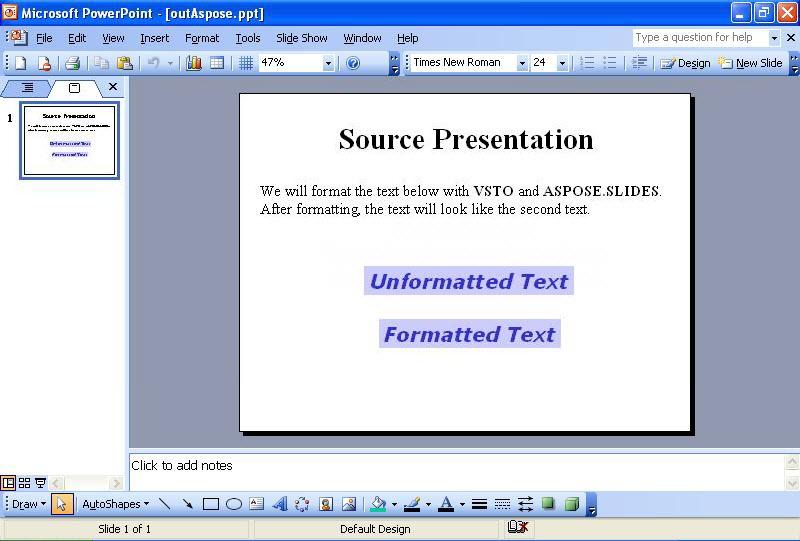

{} 

A volte, è necessario formattare il testo nelle diapositive programmaticamente. Questo articolo mostra come leggere una presentazione di esempio con del testo nella prima diapositiva utilizzando sia [VSTO](/slides/it/java/format-text-using-vsto-and-aspose-slides-for-java/) e [Aspose.Slides for Java](/slides/it/java/format-text-using-vsto-and-aspose-slides-for-java/). Il codice formatta il testo nella terza casella di testo della diapositiva in modo che assomigli al testo nell'ultima casella di testo.

{} 
## **Formattazione del testo**
Sia i metodi VSTO che Aspose.Slides eseguono i seguenti passaggi:

1. Apri la presentazione di origine.
1. Accedi alla prima diapositiva.
1. Accedi alla terza casella di testo.
1. Modifica la formattazione del testo nella terza casella di testo.
1. Salva la presentazione su disco.

Gli screenshot seguenti mostrano la diapositiva di esempio prima e dopo l'esecuzione del codice VSTO e Aspose.Slides per Java.

**La presentazione di input** 

### **Esempio di codice VSTO**
Il codice seguente mostra come riformattare il testo su una diapositiva utilizzando VSTO.

**Il testo riformattato con VSTO** 



### **Esempio di Aspose.Slides per Java**
Per formattare il testo con Aspose.Slides, aggiungi il font prima di formattare il testo.

**La presentazione di output creata con Aspose.Slides** 

