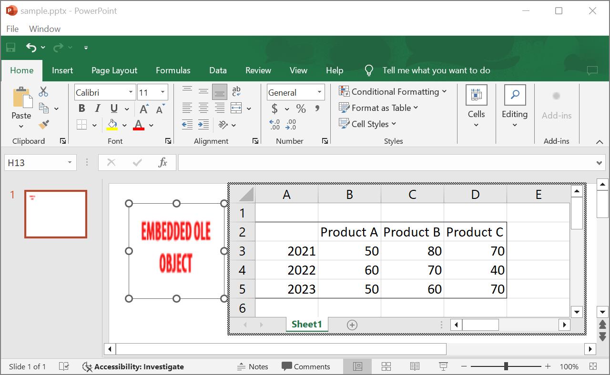

## **Introduzione**

Utilizzando Aspose.Slides per .NET, quando aggiungi [OleObjectFrame](https://reference.aspose.com/slides/it/net/aspose.slides/oleobjectframe/) a una diapositiva, sul risultato viene mostrato il messaggio "EMBEDDED OLE OBJECT". Questo messaggio è intenzionale e NON è un bug.

Per ulteriori informazioni sul lavoro con gli oggetti OLE, vedi [Manage OLE](/slides/it/net/manage-ole/).

## **Spiegazione e Soluzione**

Aspose.Slides visualizza il messaggio "EMBEDDED OLE OBJECT" per avvisarti che l'oggetto OLE è stato modificato e l'immagine di anteprima deve essere aggiornata.

Ad esempio, se aggiungi un grafico Microsoft Excel come [OleObjectFrame](https://reference.aspose.com/slides/it/net/aspose.slides/oleobjectframe/) a una diapositiva (per ulteriori dettagli, vedi l'articolo "Manage OLE") e poi apri la presentazione in Microsoft PowerPoint, vedrai questa immagine sulla diapositiva:


Se vuoi verificare e confermare che il tuo oggetto OLE è stato aggiunto alla diapositiva, devi fare doppio clic sul messaggio "EMBEDDED OLE OBJECT", oppure puoi fare clic con il tasto destro su di esso e scegliere l'opzione **Object > Edit**.


PowerPoint apre quindi l'oggetto OLE incorporato.



La diapositiva potrebbe conservare il messaggio "EMBEDDED OLE OBJECT". Una volta che fai clic sull'oggetto OLE, l'anteprima della diapositiva viene aggiornata e il messaggio "EMBEDDED OLE OBJECT" viene sostituito dall'immagine reale dell'oggetto OLE.


Ora, potresti voler salvare la tua presentazione per assicurarti che l'immagine dell'oggetto OLE venga aggiornata correttamente. In questo modo, dopo aver salvato la presentazione, quando la riapri, NON vedrai più il messaggio "EMBEDDED OLE OBJECT".

## **Altre Soluzioni**

### **Soluzione 1: Sostituire il messaggio "Embedded OLE Object" con un'immagine**

Se non desideri rimuovere il messaggio "EMBEDDED OLE OBJECT" aprendo la presentazione in PowerPoint e poi salvandola, puoi sostituire il messaggio con l'immagine di anteprima preferita. Queste righe di codice dimostrano il processo:

```cs
using Aspose.Slides;
using Aspose.Slides.Export;

using var presentation = new Presentation("embeddedOLE.pptx");

var slide = presentation.Slides[0];
var oleFrame = (IOleObjectFrame)slide.Shapes[0];

// Aggiungi un'immagine alle risorse della presentazione.
using var imageStream = File.OpenRead("myImage.png");
var oleImage = presentation.Images.AddImage(imageStream);

// Imposta l'immagine per l'anteprima dell'oggetto OLE.
oleFrame.SubstitutePictureFormat.Picture.Image = oleImage;
oleFrame.IsObjectIcon = false;

presentation.Save("embeddedOLE-newImage.pptx", SaveFormat.Pptx);
```

La diapositiva contenente `OleObjectFrame` quindi cambia in questo:


### **Soluzione 2: Creare un Add-On per PowerPoint**

Puoi anche creare un componente aggiuntivo per Microsoft PowerPoint che aggiorna tutti gli oggetti OLE quando apri le presentazioni nel programma.