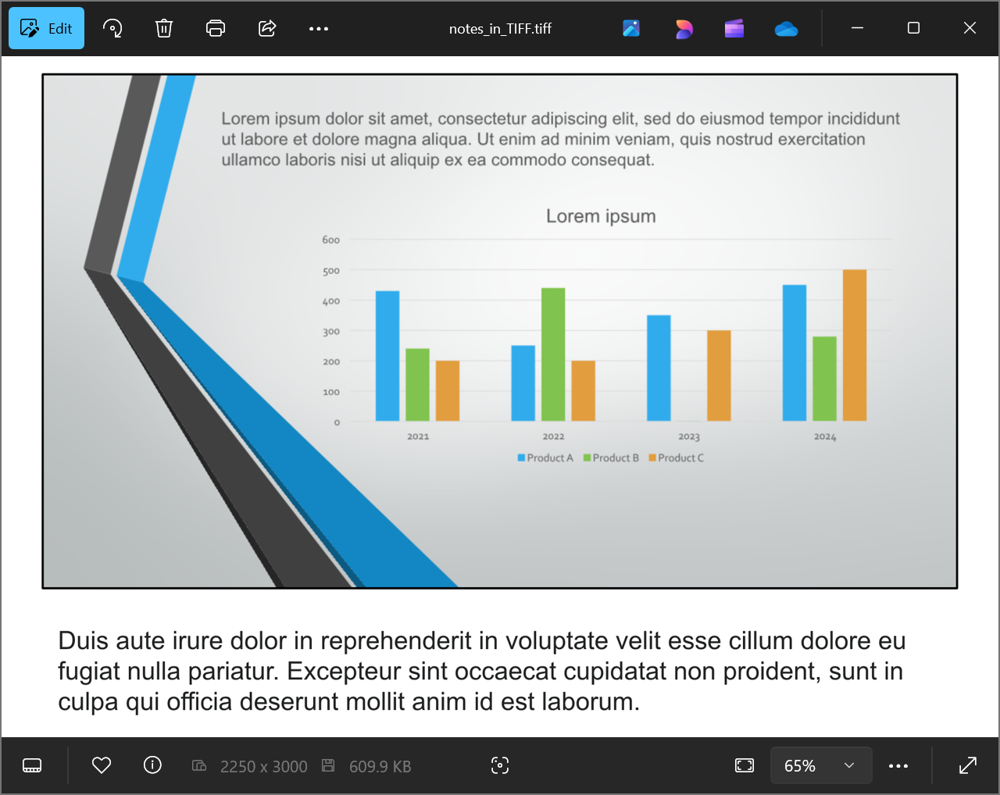

## **Introduzione**

Aspose.Slides per .NET offre una soluzione semplice per convertire presentazioni PowerPoint e OpenDocument (PPT, PPTX e ODP) con note nel formato TIFF. Questo formato è ampiamente utilizzato per l'archiviazione di immagini ad alta qualità, la stampa e l'archiviazione di documenti. Con Aspose.Slides, è possibile non solo esportare intere presentazioni con note del relatore, ma anche generare anteprime delle diapositive nella visualizzazione Note Slide. Il processo di conversione è semplice ed efficiente, utilizza il metodo `Save` della classe [Presentation](https://reference.aspose.com/slides/it/net/aspose.slides/presentation/) per trasformare l'intera presentazione in una serie di immagini TIFF preservando note e layout.

## **Convertire una presentazione in TIFF con note**

Salvare una presentazione PowerPoint o OpenDocument in TIFF con note usando Aspose.Slides per .NET prevede i seguenti passaggi:

1. Istanziate la classe [Presentation](https://reference.aspose.com/slides/it/net/aspose.slides/presentation/): caricate un file PowerPoint o OpenDocument.  
1. Configurate le opzioni di layout di output: usate la classe [NotesCommentsLayoutingOptions](https://reference.aspose.com/slides/it/net/aspose.slides.export/notescommentslayoutingoptions/) per specificare come devono essere visualizzate note e commenti.  
1. Salvate la presentazione in TIFF: passate le opzioni configurate al metodo [Save](https://reference.aspose.com/slides/it/net/aspose.slides/presentation/methods/save/index).

Supponiamo di avere un file "speaker_notes.pptx" con la seguente diapositiva:


Il frammento di codice qui sotto dimostra come convertire la presentazione in un'immagine TIFF nella vista Note Slide usando la proprietà [SlidesLayoutOptions](https://reference.aspose.com/slides/it/net/aspose.slides.export/tiffoptions/slideslayoutoptions/).

```c#
// Istanzia la classe Presentation che rappresenta un file di presentazione.
using (Presentation presentation = new Presentation("speaker_notes.pptx"))
{
    // Configura le opzioni TIFF con layout delle note.
    TiffOptions tiffOptions = new TiffOptions
    {
        DpiX = 300,
        DpiY = 300,

        SlidesLayoutOptions = new NotesCommentsLayoutingOptions
        {
            NotesPosition = NotesPositions.BottomFull // Visualizza le note sotto la diapositiva.
        }
    };

    // Salva la presentazione in TIFF con le note del relatore.
    presentation.Save("TIFF_with_notes.tiff", SaveFormat.Tiff, tiffOptions);
}
```

Il risultato:



{}

Scoprite l'[Convertitore gratuito di PowerPoint in poster di Aspose](https://products.aspose.app/slides/it/conversion/convert-ppt-to-poster-online).

{}

## **FAQ**

**Posso controllare la posizione dell'area delle note nel TIFF risultante?**

Sì. Usate le [impostazioni del layout delle note](https://reference.aspose.com/slides/it/net/aspose.slides.export/tiffoptions/slideslayoutoptions/) per scegliere tra opzioni come `None`, `BottomTruncated` o `BottomFull`, che rispettivamente nascondono le note, le adattano a una singola pagina o consentono loro di continuare su pagine aggiuntive.

**Come posso ridurre la dimensione di un file TIFF con note senza perdita visibile di qualità?**

Scegliete una [compressione efficiente](https://reference.aspose.com/slides/it/net/aspose.slides.export/tiffoptions/compressiontype/) (ad es. `LZW` o `RLE`), impostate un DPI ragionevole e, se accettabile, usate un formato pixel più basso [pixel format](https://reference.aspose.com/slides/it/net/aspose.slides.export/tiffoptions/pixelformat/) (come 8 bpp o 1 bpp per il bianco e nero). Ridurre leggermente le [dimensioni dell'immagine](https://reference.aspose.com/slides/it/net/aspose.slides.export/tiffoptions/imagesize/) può aiutare senza compromettere notevolmente la leggibilità.

**Il carattere nelle note influisce sul risultato se i caratteri originali mancano nel sistema?**

Sì. I caratteri mancanti attivano la [sostituzione](/slides/it/net/font-selection-sequence/), che può modificare metriche e aspetto del testo. Per evitare ciò, [fornite i caratteri richiesti](/slides/it/net/custom-font/) o impostate un [carattere di fallback](/slides/it/net/fallback-font/) predefinito in modo che vengano usati i tipi di carattere desiderati.