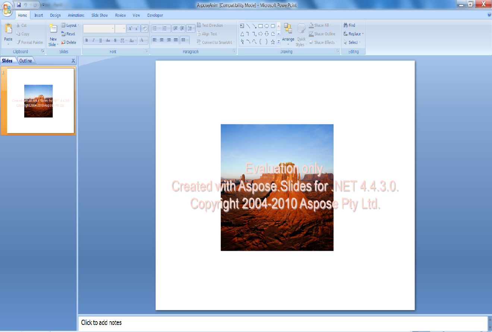

{} 

Le cornici per immagini vengono applicate a forme o immagini in Microsoft PowerPoint per incorniciare le immagini in una presentazione. Questo articolo mostra come creare una cornice per immagine e applicare un'animazione in modo programmatico, utilizzando prima [VSTO 2008](/slides/it/net/adding-picture-frame-with-animation/) e poi [Aspose.Slides for .NET](/slides/it/net/adding-picture-frame-with-animation/). Prima, ti mostriamo come applicare una cornice e un'animazione usando VSTO 2008. Poi ti mostriamo come eseguire gli stessi passaggi usando Aspose.Slides for .NET.

{} 
## **Aggiungere cornici per immagini con animazione**
Gli esempi di codice seguenti creano una presentazione con una diapositiva, aggiungono un'immagine con una cornice per immagine e le applicano un'animazione.
### **Esempio VSTO 2008**
Utilizzando VSTO 2008, esegui i seguenti passaggi:

1. Crea una presentazione.
1. Aggiungi una diapositiva vuota.
1. Aggiungi una forma immagine alla diapositiva.
1. Applica l'animazione all'immagine.
1. Scrivi la presentazione su disco.

**La presentazione di output, creata con VSTO** 


```c#
//Creazione di una presentazione vuota
PowerPoint.Presentation pres = Globals.ThisAddIn.Application.Presentations.Add(Microsoft.Office.Core.MsoTriState.msoFalse);

//Aggiungere una diapositiva vuota
PowerPoint.Slide sld = pres.Slides.Add(1, PowerPoint.PpSlideLayout.ppLayoutBlank);

//Aggiungere cornice per immagine
PowerPoint.Shape PicFrame = sld.Shapes.AddPicture(@"D:\Aspose Data\Desert.jpg",
Microsoft.Office.Core.MsoTriState.msoTriStateMixed,
Microsoft.Office.Core.MsoTriState.msoTriStateMixed, 150, 100, 400, 300);

//Applicare animazione sulla cornice dell'immagine
PicFrame.AnimationSettings.EntryEffect = Microsoft.Office.Interop.PowerPoint.PpEntryEffect.ppEffectBoxIn;

//Salvataggio della presentazione
pres.SaveAs("d:\\ VSTOAnim.ppt", PowerPoint.PpSaveAsFileType.ppSaveAsPresentation,
Microsoft.Office.Core.MsoTriState.msoFalse);
```


### **Esempio Aspose.Slides per .NET**
Utilizzando Aspose.Slides per .NET, esegui i seguenti passaggi:

1. Crea una presentazione.
1. Accedi alla prima diapositiva.
1. Aggiungi un'immagine a una raccolta di immagini.
1. Aggiungi una forma immagine alla diapositiva.
1. Applica l'animazione all'immagine.
1. Scrivi la presentazione su disco.

**La presentazione di output, creata con Aspose.Slides** 




```c#
// Crea una presentazione vuota
using (Presentation pres = new Presentation())
{
    // Accedi alla prima diapositiva
    ISlide slide = pres.Slides[0];

    // Aggiungi un'immagine alla collezione di immagini della presentazione
    IImage image = Images.FromFile("aspose.jpg");
    IPPImage ppImage = pres.Images.AddImage(image);
    image.Dispose();

    // Aggiungi una cornice immagine la cui altezza e larghezza corrispondono a quelle dell'immagine
    IPictureFrame pictureFrame = slide.Shapes.AddPictureFrame(ShapeType.Rectangle, 50, 150, ppImage.Width, ppImage.Height, ppImage);

    // Ottieni la sequenza principale di animazione della diapositiva
    ISequence sequence = pres.Slides[0].Timeline.MainSequence;

    // Aggiungi l'effetto di animazione Fly from Left alla cornice immagine
    IEffect effect = sequence.AddEffect(pictureFrame, EffectType.Fly, EffectSubtype.Left, EffectTriggerType.OnClick);

    // Salva la presentazione
    pres.Save("AsposeAnim.ppt", SaveFormat.Ppt);
}
```