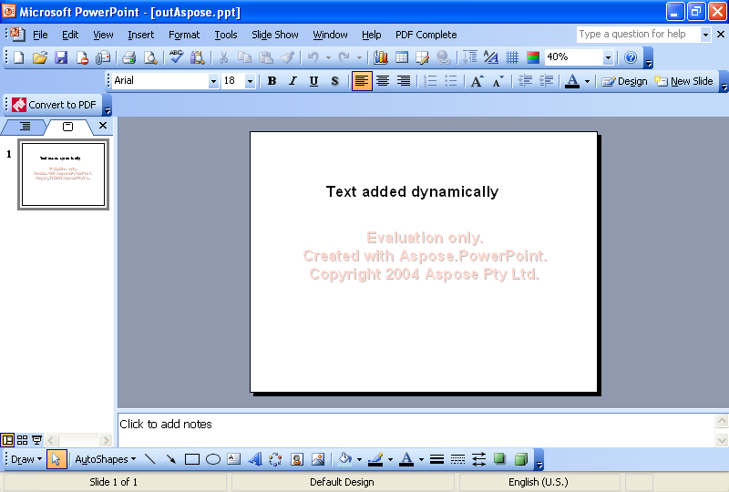

{} 

Un'operazione comune che gli sviluppatori devono svolgere è aggiungere testo alle diapositive in modo dinamico. Questo articolo mostra esempi di codice per aggiungere testo dinamicamente usando [VSTO](/slides/it/net/adding-text-dynamically-using-vsto-and-aspose-slides-for-net/) e [Aspose.Slides for .NET](/slides/it/net/adding-text-dynamically-using-vsto-and-aspose-slides-for-net/).

{} 
## **Aggiungere testo dinamicamente**
Entrambi i metodi seguono questi passaggi:

1. Creare una presentazione.
1. Aggiungere una diapositiva vuota.
1. Aggiungere una casella di testo.
1. Impostare del testo.
1. Scrivere la presentazione.
## **Esempio di codice VSTO**
Gli snippet di codice seguenti producono una presentazione con una diapositiva semplice e una stringa di testo.

**La presentazione creata in VSTO** 


```c#
//Nota: PowerPoint è uno spazio dei nomi che è stato definito sopra in questo modo
//using PowerPoint = Microsoft.Office.Interop.PowerPoint;

//Crea una presentazione
PowerPoint.Presentation pres = Globals.ThisAddIn.Application
	.Presentations.Add(Microsoft.Office.Core.MsoTriState.msoFalse);

//Get the blank slide layout
PowerPoint.CustomLayout layout = pres.SlideMaster.
	CustomLayouts[7];

//Add a blank slide
PowerPoint.Slide sld = pres.Slides.AddSlide(1, layout);

//Add a text
PowerPoint.Shape shp = sld.Shapes.AddTextbox(Microsoft.Office.Core.MsoTextOrientation.msoTextOrientationHorizontal, 150, 100, 400, 100);

//Set a text
PowerPoint.TextRange txtRange = shp.TextFrame.TextRange;
txtRange.Text = "Text added dynamically";
txtRange.Font.Name = "Arial";
txtRange.Font.Bold = Microsoft.Office.Core.MsoTriState.msoTrue;
txtRange.Font.Size = 32;

//Write the output to disk
pres.SaveAs("c:\\outVSTO.ppt",
	PowerPoint.PpSaveAsFileType.ppSaveAsPresentation,
	Microsoft.Office.Core.MsoTriState.msoFalse);
```


## **Esempio Aspose.Slides per .NET**
Gli snippet di codice seguenti usano Aspose.Slides per creare una presentazione con una diapositiva semplice e una stringa di testo.

**La presentazione creata usando Aspose.Slides per .NET** 



```c#
using Aspose.Slides;
using Aspose.Slides.Export;

//Crea una presentazione
Presentation pres = new Presentation();

//La diapositiva vuota viene aggiunta per impostazione predefinita, quando si crea
//la presentazione dal costruttore predefinito
//Quindi, non è necessario aggiungere alcuna diapositiva vuota
ISlide sld = pres.Slides[1];

//Aggiungi una casella di testo
//Per aggiungerla, prima aggiungeremo un rettangolo
IShape shp = sld.Shapes.AddAutoShape(ShapeType.Rectangle, 1200, 800, 3200, 370);

//Nascondi la sua linea
shp.LineFormat.Style = LineStyle.NotDefined;

//Quindi aggiungi un frame di testo al suo interno
ITextFrame tf = ((IAutoShape)shp).TextFrame;

//Imposta un testo
tf.Text = "Text added dynamically";
IPortion port = tf.Paragraphs[0].Portions[0];

port.PortionFormat.FontBold = NullableBool.True;
port.PortionFormat.FontHeight = 32;

//Scrivi l'output su disco
pres.Save("outAspose.ppt", SaveFormat.Ppt);
```