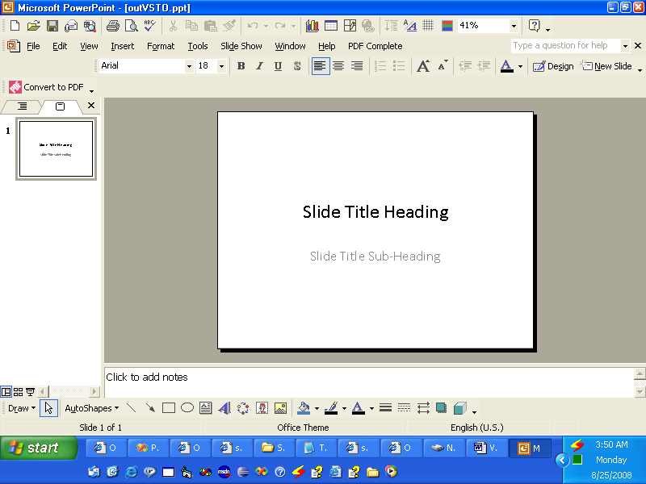

{} 

VSTO è stato sviluppato per consentire ai programmatori di creare applicazioni che potessero essere eseguite all'interno di Microsoft Office. VSTO è basato su COM ma è avvolto in un oggetto .NET in modo da poter essere utilizzato nelle applicazioni .NET. VSTO richiede il supporto del framework .NET così come il runtime basato su CLR di Microsoft Office. Sebbene possa essere usato per creare componenti aggiuntivi per Microsoft Office, è quasi impossibile usarlo come componente lato server. Presenta inoltre seri problemi di distribuzione.

Aspose.Slides per .NET è un componente che può essere utilizzato per manipolare presentazioni Microsoft PowerPoint, proprio come VSTO, ma offre diversi vantaggi:

- Aspose.Slides contiene solo codice gestito e non richiede l'installazione del runtime di Microsoft Office.
- Può essere usato come componente lato client o come componente lato server.
- La distribuzione è semplice poiché Aspose.Slides è contenuto in un singolo DLL.

{} 
## **Creare una presentazione**
Di seguito sono riportati due esempi di codice che illustrano come VSTO e Aspose.Slides per .NET possono essere usati per raggiungere lo stesso obiettivo. Il primo esempio è [VSTO](/slides/it/net/create-a-new-presentation/); [il secondo esempio](/slides/it/net/create-a-new-presentation/) utilizza Aspose.Slides.
### **Esempio VSTO**
**L'output VSTO** 




```c#
//Nota: PowerPoint è uno spazio dei nomi definito sopra in questo modo
//using PowerPoint = Microsoft.Office.Interop.PowerPoint;

//Crea una presentazione
PowerPoint.Presentation pres = Globals.ThisAddIn.Application
	.Presentations.Add(Microsoft.Office.Core.MsoTriState.msoFalse);

//Ottieni il layout della diapositiva titolo
PowerPoint.CustomLayout layout = pres.SlideMaster.
	CustomLayouts[PowerPoint.PpSlideLayout.ppLayoutTitle];

//Aggiungi una diapositiva titolo.
PowerPoint.Slide slide = pres.Slides.AddSlide(1, layout);

//Imposta il testo del titolo
slide.Shapes.Title.TextFrame.TextRange.Text = "Slide Title Heading";

//Imposta il testo del sottotitolo
slide.Shapes[2].TextFrame.TextRange.Text = "Slide Title Sub-Heading";

//Scrivi l'output su disco
pres.SaveAs("c:\\outVSTO.ppt",
	PowerPoint.PpSaveAsFileType.ppSaveAsPresentation,
	Microsoft.Office.Core.MsoTriState.msoFalse);
```


### **Esempio Aspose.Slides per .NET**
**L'output da Aspose.Slides** 


```c#
//Crea una presentazione
Presentation pres = new Presentation();

//Aggiungi la diapositiva titolo
ISlide slide = pres.Slides.AddEmptySlide(pres.LayoutSlides[0]);


//Imposta il testo del titolo
((IAutoShape)slide.Shapes[0]).TextFrame.Text = "Slide Title Heading";

//Imposta il testo del sottotitolo
((IAutoShape)slide.Shapes[1]).TextFrame.Text = "Slide Title Sub-Heading";

//Scrivi l'output su disco
pres.Save("c:\\data\\outAsposeSlides.pptx", SaveFormat.Ppt);
```