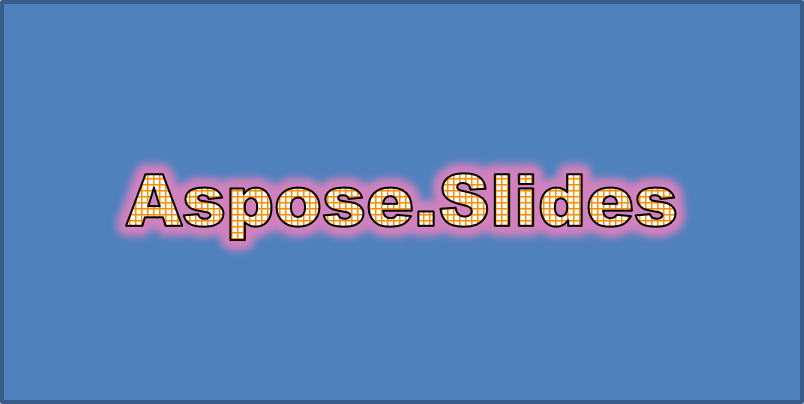
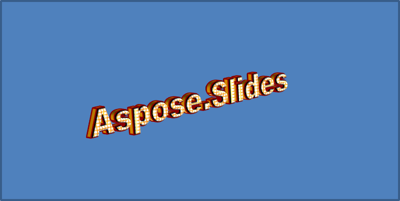

## **Panoramica**

Gli effetti WordArt consentono di aggiungere testo stilizzato e visivamente accattivante alle presentazioni PowerPoint. Con Aspose.Slides per .NET, gli sviluppatori possono creare, personalizzare e gestire WordArt in modo programmatico proprio come in Microsoft PowerPoint, senza la necessità di avere Office installato. Questo articolo fornisce una panoramica sul lavoro con WordArt in .NET, includendo come applicare trasformazioni di testo, stili di riempimento, contorni, ombre e altre opzioni di formattazione per rendere il contenuto della presentazione più espressivo e coinvolgente. WordArt permette di trattare il testo come un oggetto grafico. Consiste in effetti o modifiche speciali applicate al testo per renderlo più attraente o evidente.

## **Creare un modello WordArt semplice e applicarlo al testo**

In questa sezione esploreremo come creare un modello WordArt semplice e applicarlo al testo usando Aspose.Slides per .NET. WordArt offre un modo rapido per migliorare l’aspetto del testo con effetti visivi e stili sorprendenti. Conoscendo i passaggi base per creare e usare WordArt, è possibile adattare facilmente queste tecniche a qualsiasi progetto, rendendo le presentazioni più vivaci e memorabili.

Per prima cosa creiamo un testo semplice con il seguente codice C#:

```cs
using (Presentation presentation = new Presentation())
{
    ISlide slide = presentation.Slides[0];

    IAutoShape autoShape = slide.Shapes.AddAutoShape(ShapeType.Rectangle, 20, 20, 400, 200);
    ITextFrame textFrame = autoShape.TextFrame;

    IPortion portion = textFrame.Paragraphs[0].Portions[0];
    portion.Text = "Aspose.Slides";
}
```

Ora impostiamo l’altezza del carattere del testo a un valore più grande per rendere l’effetto più evidente con il seguente codice:

```cs
    portion.PortionFormat.LatinFont = new FontData("Arial Black");
    portion.PortionFormat.FontHeight = 36;
```

Qui applichiamo il riempimento a motivo SmallGrid al testo e aggiungiamo un contorno nero di larghezza 1 con il seguente codice:

```cs
    portion.PortionFormat.FillFormat.FillType = FillType.Pattern;
    portion.PortionFormat.FillFormat.PatternFormat.ForeColor.Color = Color.DarkOrange;
    portion.PortionFormat.FillFormat.PatternFormat.BackColor.Color = Color.White;
    portion.PortionFormat.FillFormat.PatternFormat.PatternStyle = PatternStyle.SmallGrid;
                
    portion.PortionFormat.LineFormat.FillFormat.FillType = FillType.Solid;
    portion.PortionFormat.LineFormat.FillFormat.SolidFillColor.Color = Color.Black;
```

Il testo risultante:


## **Applicare altri effetti WordArt**

Oltre alle trasformazioni di base, Aspose.Slides per .NET consente di applicare una varietà di effetti WordArt avanzati per migliorare l’aspetto del testo. Questi includono contorni, riempimenti, ombre, riflessi e effetti di bagliore. Combinando queste funzionalità, è possibile creare stili di testo accattivanti che spiccano nelle presentazioni. Questa sezione dimostra come applicare questi effetti in modo programmatico usando esempi di codice semplici e chiari.

### **Applicare effetti di ombra esterna**

Gli effetti di ombra esterna aiutano il testo a risaltare aggiungendo un’ombra dietro il contorno, creando una sensazione di profondità e separazione dallo sfondo. Aspose.Slides per .NET permette di applicare e personalizzare facilmente le ombre esterne sul testo WordArt. In questa sezione imparerai a impostare il colore dell’ombra, la direzione, la distanza, il raggio di sfocatura e altro per ottenere l’impatto visivo desiderato.

Il frammento di codice C# seguente applica un effetto ombra al testo creato sopra.

```cs
    portion.PortionFormat.EffectFormat.EnableOuterShadowEffect();
    portion.PortionFormat.EffectFormat.OuterShadowEffect.ShadowColor.Color = Color.Black;
    portion.PortionFormat.EffectFormat.OuterShadowEffect.ScaleHorizontal = 100;
    portion.PortionFormat.EffectFormat.OuterShadowEffect.ScaleVertical = 100;
    portion.PortionFormat.EffectFormat.OuterShadowEffect.BlurRadius = 4;
    portion.PortionFormat.EffectFormat.OuterShadowEffect.Direction = 230;
    portion.PortionFormat.EffectFormat.OuterShadowEffect.Distance = 30;
    portion.PortionFormat.EffectFormat.OuterShadowEffect.SkewHorizontal = 20;
    portion.PortionFormat.EffectFormat.OuterShadowEffect.SkewVertical = 0;
    portion.PortionFormat.EffectFormat.OuterShadowEffect.ShadowColor.ColorTransform.Add(ColorTransformOperation.SetAlpha, 0.32f);
```

Il testo risultante:


{} 
- Quando OuterShadow e PresetShadow sono usati insieme, viene applicato solo l’effetto OuterShadow.
- Se OuterShadow e InnerShadow vengono usati simultaneamente, l’effetto risultante dipende dalla versione di PowerPoint. Ad esempio, in PowerPoint 2013 l’effetto è raddoppio, mentre in PowerPoint 2007 viene applicato solo l’effetto OuterShadow.
{}

### **Applicare effetti di riflesso**

In questa sezione esploreremo come applicare effetti di riflesso alle diapositive usando Aspose.Slides per .NET. Gli effetti di riflesso possono essere un modo efficace per conferire al testo o alle forme un aspetto elegante e moderno, aiutando gli elementi chiave a risaltare e aggiungendo profondità alla presentazione. Comprendendo il processo di applicazione e personalizzazione di questi effetti, potrai adattarli facilmente alle esigenze di design e al branding.

Aggiungi un effetto di riflesso al testo con questo esempio di codice C#:

```cs
    portion.PortionFormat.EffectFormat.EnableReflectionEffect();
    portion.PortionFormat.EffectFormat.ReflectionEffect.BlurRadius = 0.5; 
    portion.PortionFormat.EffectFormat.ReflectionEffect.Distance = 4.72; 
    portion.PortionFormat.EffectFormat.ReflectionEffect.StartPosAlpha = 0f; 
    portion.PortionFormat.EffectFormat.ReflectionEffect.EndPosAlpha = 60f; 
    portion.PortionFormat.EffectFormat.ReflectionEffect.Direction = 90; 
    portion.PortionFormat.EffectFormat.ReflectionEffect.ScaleHorizontal = 100; 
    portion.PortionFormat.EffectFormat.ReflectionEffect.ScaleVertical = -100;
    portion.PortionFormat.EffectFormat.ReflectionEffect.StartReflectionOpacity = 60f;
    portion.PortionFormat.EffectFormat.ReflectionEffect.EndReflectionOpacity = 0.9f;
    portion.PortionFormat.EffectFormat.ReflectionEffect.RectangleAlign = RectangleAlignment.BottomLeft;   
```

Il testo risultante:


### **Applicare effetti di bagliore**

In questa sezione esploreremo come applicare un effetto di bagliore al testo usando Aspose.Slides per .NET. Il bagliore può far risaltare il testo con un contorno luminoso, migliorando l’appeal visivo delle diapositive. Regolando impostazioni come colore e intensità, è possibile personalizzare il bagliore per adattarlo al design e al branding, assicurando che i punti chiave della presentazione catturino l’attenzione del pubblico.

Applica un effetto di bagliore al testo per farlo brillare o risaltare con il seguente codice:

```cs
    portion.PortionFormat.EffectFormat.EnableGlowEffect();
    portion.PortionFormat.EffectFormat.GlowEffect.Color.R = 255;
    portion.PortionFormat.EffectFormat.GlowEffect.Color.ColorTransform.Add(ColorTransformOperation.SetAlpha, 0.54f);
    portion.PortionFormat.EffectFormat.GlowEffect.Radius = 7;
```

Il testo risultante:



### **Applicare trasformazioni WordArt**

In questa sezione esploreremo come utilizzare le trasformazioni in WordArt con Aspose.Slides per .NET. Le trasformazioni consentono di piegare, allungare o deformare il testo, creando effetti unici e visivamente sorprendenti. Padroneggiando queste tecniche, potrai modellare forme e stili di testo per adattarli al tuo brand o alla tua visione creativa, garantendo una presentazione coinvolgente e professionale.

Usa la proprietà `Transform` (che si applica all’intero blocco di testo) con il seguente codice:

```cs
    textFrame.TextFrameFormat.Transform = TextShapeType.ArchUpPour;
```

Il testo risultante:


{} 
Aspose.Slides per .NET fornisce un set di [tipi di trasformazione](https://reference.aspose.com/slides/it/net/aspose.slides/textshapetype/) predefiniti.
{} 

### **Applicare effetti 3D a forme e testo**

Creare elementi visivi realistici e accattivanti può migliorare notevolmente l’impatto delle presentazioni. In questa sezione esploreremo come applicare effetti tridimensionali (3D) a forme usando Aspose.Slides per .NET. Manipolando parametri come profondità, angolo e illuminazione, è possibile produrre trasformazioni 3D impressionanti che catturano immediatamente l’attenzione del pubblico. Che tu voglia evidenziare delicatamente o creare illusioni drammatiche, queste funzionalità offrono modi flessibili per elevare il design e trasmettere idee in modo più avvincente.

Usa il seguente codice di esempio per impostare un effetto 3D sulla forma:

```cs
    autoShape.ThreeDFormat.BevelBottom.BevelType = BevelPresetType.Circle;
    autoShape.ThreeDFormat.BevelBottom.Height = 10.5;
    autoShape.ThreeDFormat.BevelBottom.Width = 10.5;

    autoShape.ThreeDFormat.BevelTop.BevelType = BevelPresetType.Circle;
    autoShape.ThreeDFormat.BevelTop.Height = 12.5;
    autoShape.ThreeDFormat.BevelTop.Width = 11;

    autoShape.ThreeDFormat.ExtrusionColor.Color = Color.Orange;
    autoShape.ThreeDFormat.ExtrusionHeight = 6;

    autoShape.ThreeDFormat.ContourColor.Color = Color.DarkRed;
    autoShape.ThreeDFormat.ContourWidth = 1.5;

    autoShape.ThreeDFormat.Depth = 3;

    autoShape.ThreeDFormat.Material = MaterialPresetType.Plastic;

    autoShape.ThreeDFormat.LightRig.Direction = LightingDirection.Top;
    autoShape.ThreeDFormat.LightRig.LightType = LightRigPresetType.Balanced;
    autoShape.ThreeDFormat.LightRig.SetRotation(0, 0, 40);

    autoShape.ThreeDFormat.Camera.CameraType = CameraPresetType.PerspectiveContrastingRightFacing;
```

La forma risultante:


Usa il seguente codice di esempio per impostare un effetto 3D sul testo:

```cs
    textFrame.TextFrameFormat.ThreeDFormat.BevelBottom.BevelType = BevelPresetType.Circle;
    textFrame.TextFrameFormat.ThreeDFormat.BevelBottom.Height = 3.5;
    textFrame.TextFrameFormat.ThreeDFormat.BevelBottom.Width = 3.5;

    textFrame.TextFrameFormat.ThreeDFormat.BevelTop.BevelType = BevelPresetType.Circle;
    textFrame.TextFrameFormat.ThreeDFormat.BevelTop.Height = 4;
    textFrame.TextFrameFormat.ThreeDFormat.BevelTop.Width = 4;

    textFrame.TextFrameFormat.ThreeDFormat.ExtrusionColor.Color = Color.Orange;
    textFrame.TextFrameFormat.ThreeDFormat.ExtrusionHeight= 6;

    textFrame.TextFrameFormat.ThreeDFormat.ContourColor.Color = Color.DarkRed;
    textFrame.TextFrameFormat.ThreeDFormat.ContourWidth = 1.5;

    textFrame.TextFrameFormat.ThreeDFormat.Depth= 3;

    textFrame.TextFrameFormat.ThreeDFormat.Material = MaterialPresetType.Plastic;

    textFrame.TextFrameFormat.ThreeDFormat.LightRig.Direction = LightingDirection.Top;
    textFrame.TextFrameFormat.ThreeDFormat.LightRig.LightType = LightRigPresetType.Balanced;
    textFrame.TextFrameFormat.ThreeDFormat.LightRig.SetRotation(0, 0, 40);

    textFrame.TextFrameFormat.ThreeDFormat.Camera.CameraType = CameraPresetType.PerspectiveContrastingRightFacing;
```

Il testo risultante:



{} 
L’applicazione di effetti 3D al testo o alle loro forme — e l’interazione tra questi effetti — è regolata da regole specifiche. Considera una scena che coinvolge sia un testo sia la forma che contiene quel testo. Un effetto 3D comprende la rappresentazione 3D dell’oggetto e la scena su cui è posizionato.

- Se una scena è impostata sia per la forma sia per il testo, la scena della forma ha priorità e quella del testo viene ignorata.
- Se la forma non ha una propria scena ma possiede una rappresentazione 3D, viene usata la scena del testo.
- Se la forma non ha alcun effetto 3D, è trattata come piatta e l’effetto 3D viene applicato solo al testo.

Questi comportamenti riguardano le proprietà [ThreeDFormat.LightRig](https://reference.aspose.com/slides/it/net/aspose.slides/threedformat/lightrig/) e [ThreeDFormat.Camera](https://reference.aspose.com/slides/it/net/aspose.slides/threedformat/camera/).
{} 

## **FAQ**

**Posso usare gli effetti WordArt con caratteri o script diversi (ad esempio arabo, cinese)?**

Sì, Aspose.Slides per .NET supporta Unicode e funziona con tutti i principali caratteri e script. Gli effetti WordArt come ombra, riempimento e contorno possono essere applicati indipendentemente dalla lingua, sebbene la disponibilità dei caratteri e il rendering possano dipendere dai font di sistema.

**Posso applicare gli effetti WordArt agli elementi del master delle diapositive?**

Sì, è possibile applicare gli effetti WordArt a forme nei master slide, inclusi segnaposto titolo, piè di pagina o testo di sfondo. Le modifiche apportate al layout master verranno propagate a tutte le diapositive associate.

**Gli effetti WordArt influiscono sulla dimensione del file della presentazione?**

Leggermente. Effetti come ombre, bagliori e riempimenti a gradiente possono aumentare marginalmente la dimensione del file a causa dei metadati di formattazione aggiunti, ma la differenza è solitamente trascurabile.

**Posso visualizzare l’anteprima degli effetti WordArt senza salvare la presentazione?**

Sì, è possibile renderizzare le diapositive contenenti WordArt in immagini (ad esempio PNG, JPEG) usando il metodo `GetImage` dalle interfacce [IShape](https://reference.aspose.com/slides/it/net/aspose.slides/ishape/) o [ISlide](https://reference.aspose.com/slides/it/net/aspose.slides/islide/). Questo consente di vedere l’anteprima in memoria o sullo schermo prima di salvare o esportare l’intera presentazione.