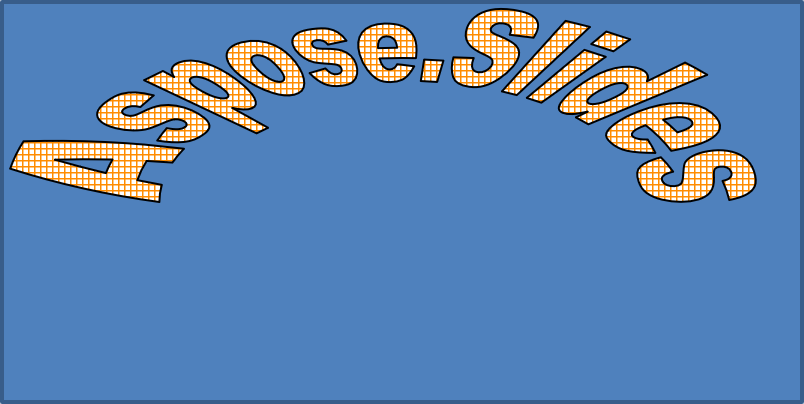

## **Panoramica**

Le effetti WordArt consentono di aggiungere testo stilizzato e visivamente accattivante alle tue presentazioni PowerPoint. Con Aspose.Slides per .NET, gli sviluppatori possono creare, personalizzare e gestire programmaticamente WordArt proprio come in Microsoft PowerPoint, senza la necessità di installare Office. Questo articolo fornisce una panoramica del lavoro con WordArt in .NET, includendo come applicare trasformazioni di testo, stili di riempimento, contorni, ombre e altre opzioni di formattazione per rendere il contenuto della presentazione più espressivo e coinvolgente. WordArt consente di trattare il testo come un oggetto grafico. È costituito da effetti o modifiche speciali applicate al testo per renderlo più attraente o evidente.

## **Crea un Modello WordArt Semplice e Applicalolo al Testo**

In questa sezione, esploreremo come creare un modello WordArt semplice e applicarlo al testo usando Aspose.Slides per .NET. WordArt offre un modo semplice per migliorare l'aspetto del testo con effetti visivi sorprendenti e stili. Imparando i passaggi fondamentali per creare e utilizzare WordArt, potrai adattare facilmente queste tecniche a qualsiasi progetto, rendendo le tue presentazioni più vivaci e memorabili.

Per prima cosa, creiamo del testo semplice usando il seguente codice C#:
```cs
using Aspose.Slides;

using (Presentation presentation = new Presentation())
{
    ISlide slide = presentation.Slides[0];

    IAutoShape autoShape = slide.Shapes.AddAutoShape(ShapeType.Rectangle, 20, 20, 400, 200);
    ITextFrame textFrame = autoShape.TextFrame;

    IPortion portion = textFrame.Paragraphs[0].Portions[0];
    portion.Text = "Aspose.Slides";
}
```

Ora, impostiamo l'altezza del carattere del testo a un valore più grande per rendere l'effetto più evidente usando il seguente codice:
```cs
using Aspose.Slides;

using (Presentation presentation = new Presentation())
{
    IAutoShape autoShape = presentation.Slides[0].Shapes.AddAutoShape(ShapeType.Rectangle, 20, 20, 400, 200);
    IPortion portion = autoShape.TextFrame.Paragraphs[0].Portions[0];
    portion.Text = "Aspose.Slides";

    portion.PortionFormat.LatinFont = new FontData("Arial Black");
    portion.PortionFormat.FontHeight = 36;
}
```

Qui, applichiamo il riempimento a trama SmallGrid al testo e aggiungiamo un bordo di testo nero con spessore 1 usando il seguente codice:
```cs
using System.Drawing;
using Aspose.Slides;

using (Presentation presentation = new Presentation())
{
    IAutoShape autoShape = presentation.Slides[0].Shapes.AddAutoShape(ShapeType.Rectangle, 20, 20, 400, 200);
    IPortion portion = autoShape.TextFrame.Paragraphs[0].Portions[0];
    portion.Text = "Aspose.Slides";
    portion.PortionFormat.LatinFont = new FontData("Arial Black");
    portion.PortionFormat.FontHeight = 36;

    portion.PortionFormat.FillFormat.FillType = FillType.Pattern;
    portion.PortionFormat.FillFormat.PatternFormat.ForeColor.Color = Color.DarkOrange;
    portion.PortionFormat.FillFormat.PatternFormat.BackColor.Color = Color.White;
    portion.PortionFormat.FillFormat.PatternFormat.PatternStyle = PatternStyle.SmallGrid;

    portion.PortionFormat.LineFormat.FillFormat.FillType = FillType.Solid;
    portion.PortionFormat.LineFormat.FillFormat.SolidFillColor.Color = Color.Black;
}
```

Il testo risultante:


## **Applica Altri Effetti WordArt**

Oltre alle trasformazioni di base, Aspose.Slides per .NET consente di applicare una varietà di effetti WordArt avanzati per migliorare l'aspetto del tuo testo. Questi includono contorni, riempimenti, ombre, riflessi e bagliori. Combinando queste funzionalità, puoi creare stili di testo accattivanti che spiccano nelle tue presentazioni. Questa sezione dimostra come applicare questi effetti programmaticamente usando esempi di codice semplici e puliti.

### **Applica Effetti Ombra Esterna**

Gli effetti di ombra esterna aiutano il testo a risaltare aggiungendo un'ombra dietro il suo contorno, creando una sensazione di profondità e separazione dallo sfondo. Aspose.Slides per .NET consente di applicare e personalizzare facilmente le ombre esterne sul testo WordArt. In questa sezione imparerai a impostare il colore dell'ombra, la direzione, la distanza, il raggio di sfocatura e altro per ottenere l'impatto visivo desiderato.

La seguente porzione di codice C# applica un effetto ombra al testo creato sopra.
```cs
using System.Drawing;
using Aspose.Slides;

using (Presentation presentation = new Presentation())
{
    IAutoShape autoShape = presentation.Slides[0].Shapes.AddAutoShape(ShapeType.Rectangle, 20, 20, 400, 200);
    IPortion portion = autoShape.TextFrame.Paragraphs[0].Portions[0];
    portion.Text = "Aspose.Slides";
    portion.PortionFormat.LatinFont = new FontData("Arial Black");
    portion.PortionFormat.FontHeight = 36;

    portion.PortionFormat.EffectFormat.EnableOuterShadowEffect();
    portion.PortionFormat.EffectFormat.OuterShadowEffect.ShadowColor.Color = Color.Black;
    portion.PortionFormat.EffectFormat.OuterShadowEffect.ScaleHorizontal = 100;
    portion.PortionFormat.EffectFormat.OuterShadowEffect.ScaleVertical = 100;
    portion.PortionFormat.EffectFormat.OuterShadowEffect.BlurRadius = 4;
    portion.PortionFormat.EffectFormat.OuterShadowEffect.Direction = 230;
    portion.PortionFormat.EffectFormat.OuterShadowEffect.Distance = 30;
    portion.PortionFormat.EffectFormat.OuterShadowEffect.SkewHorizontal = 20;
    portion.PortionFormat.EffectFormat.OuterShadowEffect.SkewVertical = 0;
    portion.PortionFormat.EffectFormat.OuterShadowEffect.ShadowColor.ColorTransform.Add(ColorTransformOperation.SetAlpha, 0.32f);
}
```

Il testo risultante:


{} 

- Quando OuterShadow e PresetShadow vengono usati insieme, viene applicato solo l'effetto OuterShadow.
- Se OuterShadow e InnerShadow vengono usati simultaneamente, l'effetto risultante dipende dalla versione di PowerPoint. Ad esempio, in PowerPoint 2013 l'effetto è raddoppiato, mentre in PowerPoint 2007 viene applicato solo l'effetto OuterShadow.

{}

### **Applica Effetti Riflesso**

In questa sezione, esploreremo come applicare effetti di riflesso nelle tue diapositive usando Aspose.Slides per .NET. Gli effetti di riflesso possono essere un modo efficace per dare al tuo testo o alle tue forme un aspetto elegante e moderno, aiutando gli elementi chiave a distinguersi e aggiungendo profondità alla presentazione. Comprendendo il processo di applicazione e personalizzazione di questi effetti, potrai adattarli facilmente alle esigenze di design e ai requisiti di branding.

Aggiungi un effetto di riflesso al testo usando questo esempio di codice C#:
```cs
using Aspose.Slides;

using (Presentation presentation = new Presentation())
{
    IAutoShape autoShape = presentation.Slides[0].Shapes.AddAutoShape(ShapeType.Rectangle, 20, 20, 400, 200);
    IPortion portion = autoShape.TextFrame.Paragraphs[0].Portions[0];
    portion.Text = "Aspose.Slides";
    portion.PortionFormat.LatinFont = new FontData("Arial Black");
    portion.PortionFormat.FontHeight = 36;

    portion.PortionFormat.EffectFormat.EnableReflectionEffect();
    portion.PortionFormat.EffectFormat.ReflectionEffect.BlurRadius = 0.5;
    portion.PortionFormat.EffectFormat.ReflectionEffect.Distance = 4.72;
    portion.PortionFormat.EffectFormat.ReflectionEffect.StartPosAlpha = 0f;
    portion.PortionFormat.EffectFormat.ReflectionEffect.EndPosAlpha = 60f;
    portion.PortionFormat.EffectFormat.ReflectionEffect.Direction = 90;
    portion.PortionFormat.EffectFormat.ReflectionEffect.ScaleHorizontal = 100;
    portion.PortionFormat.EffectFormat.ReflectionEffect.ScaleVertical = -100;
    portion.PortionFormat.EffectFormat.ReflectionEffect.StartReflectionOpacity = 60f;
    portion.PortionFormat.EffectFormat.ReflectionEffect.EndReflectionOpacity = 0.9f;
    portion.PortionFormat.EffectFormat.ReflectionEffect.RectangleAlign = RectangleAlignment.BottomLeft;
}
```

Il testo risultante:


### **Applica Effetti Bagliore**

In questa sezione, esploreremo come applicare un effetto bagliore al testo usando Aspose.Slides per .NET. L'effetto bagliore può far risaltare il tuo testo con un contorno luminoso, migliorando l'appeal visivo delle diapositive. Regolando impostazioni come colore e intensità, potrai personalizzare facilmente il bagliore per adattarlo al tuo design e alle esigenze di branding, assicurando che i punti chiave della tua presentazione catturino l'attenzione del pubblico.

Applica un effetto bagliore al testo per farlo brillare o risaltare usando il seguente codice:
```cs
using Aspose.Slides;

using (Presentation presentation = new Presentation())
{
    IAutoShape autoShape = presentation.Slides[0].Shapes.AddAutoShape(ShapeType.Rectangle, 20, 20, 400, 200);
    IPortion portion = autoShape.TextFrame.Paragraphs[0].Portions[0];
    portion.Text = "Aspose.Slides";
    portion.PortionFormat.LatinFont = new FontData("Arial Black");
    portion.PortionFormat.FontHeight = 36;

    portion.PortionFormat.EffectFormat.EnableGlowEffect();
    portion.PortionFormat.EffectFormat.GlowEffect.Color.R = 255;
    portion.PortionFormat.EffectFormat.GlowEffect.Color.ColorTransform.Add(ColorTransformOperation.SetAlpha, 0.54f);
    portion.PortionFormat.EffectFormat.GlowEffect.Radius = 7;
}
```

Il testo risultante:


### **Applica Trasformazioni WordArt**

In questa sezione, esploreremo come utilizzare le trasformazioni in WordArt con Aspose.Slides per .NET. Le trasformazioni consentono di piegare, allungare o deformare il testo, creando effetti unici e visivamente sorprendenti. Padroneggiando queste tecniche, potrai adattare facilmente forme e stili del testo al tuo branding o alla tua visione creativa, garantendo una presentazione convincente e raffinata.

Usa la proprietà `Transform` (che si applica all'intero blocco di testo) usando il seguente codice:
```cs
using Aspose.Slides;

using (Presentation presentation = new Presentation())
{
    IAutoShape autoShape = presentation.Slides[0].Shapes.AddAutoShape(ShapeType.Rectangle, 20, 20, 400, 200);
    ITextFrame textFrame = autoShape.TextFrame;
    textFrame.Text = "Aspose.Slides";

    textFrame.TextFrameFormat.Transform = TextShapeType.ArchUpPour;
}
```

Il testo risultante:


{} 

Aspose.Slides per .NET fornisce un insieme di [tipi di trasformazione](https://reference.aspose.com/slides/it/net/aspose.slides/textshapetype/).

{} 

### **Applica Effetti 3D a Forme e Testo**

Creare visuali realistici e accattivanti può migliorare notevolmente l'impatto delle tue presentazioni. In questa sezione, esploreremo come applicare effetti tridimensionali (3D) alle forme usando Aspose.Slides per .NET. Manipolando parametri come profondità, angolo e illuminazione, puoi produrre trasformazioni 3D impressionanti che catturano immediatamente l'attenzione del pubblico. Che tu voglia evidenziare sottili dettagli o creare illusioni drammatiche, queste funzionalità offrono modi flessibili per elevare il tuo design e trasmettere le idee in modo più avvincente.

Usa il seguente codice di esempio per impostare un effetto 3D sulla forma:
```cs
using System.Drawing;
using Aspose.Slides;

using (Presentation presentation = new Presentation())
{
    IAutoShape autoShape = presentation.Slides[0].Shapes.AddAutoShape(ShapeType.Rectangle, 20, 20, 400, 200);
    autoShape.TextFrame.Text = "Aspose.Slides";

    autoShape.ThreeDFormat.BevelBottom.BevelType = BevelPresetType.Circle;
    autoShape.ThreeDFormat.BevelBottom.Height = 10.5;
    autoShape.ThreeDFormat.BevelBottom.Width = 10.5;

    autoShape.ThreeDFormat.BevelTop.BevelType = BevelPresetType.Circle;
    autoShape.ThreeDFormat.BevelTop.Height = 12.5;
    autoShape.ThreeDFormat.BevelTop.Width = 11;

    autoShape.ThreeDFormat.ExtrusionColor.Color = Color.Orange;
    autoShape.ThreeDFormat.ExtrusionHeight = 6;

    autoShape.ThreeDFormat.ContourColor.Color = Color.DarkRed;
    autoShape.ThreeDFormat.ContourWidth = 1.5;

    autoShape.ThreeDFormat.Depth = 3;

    autoShape.ThreeDFormat.Material = MaterialPresetType.Plastic;

    autoShape.ThreeDFormat.LightRig.Direction = LightingDirection.Top;
    autoShape.ThreeDFormat.LightRig.LightType = LightRigPresetType.Balanced;
    autoShape.ThreeDFormat.LightRig.SetRotation(0, 0, 40);

    autoShape.ThreeDFormat.Camera.CameraType = CameraPresetType.PerspectiveContrastingRightFacing;
}
```

La forma risultante:


Usa il seguente codice di esempio per impostare un effetto 3D sul testo:
```cs
using System.Drawing;
using Aspose.Slides;

using (Presentation presentation = new Presentation())
{
    IAutoShape autoShape = presentation.Slides[0].Shapes.AddAutoShape(ShapeType.Rectangle, 20, 20, 400, 200);
    ITextFrame textFrame = autoShape.TextFrame;
    textFrame.Text = "Aspose.Slides";

    textFrame.TextFrameFormat.ThreeDFormat.BevelBottom.BevelType = BevelPresetType.Circle;
    textFrame.TextFrameFormat.ThreeDFormat.BevelBottom.Height = 3.5;
    textFrame.TextFrameFormat.ThreeDFormat.BevelBottom.Width = 3.5;

    textFrame.TextFrameFormat.ThreeDFormat.BevelTop.BevelType = BevelPresetType.Circle;
    textFrame.TextFrameFormat.ThreeDFormat.BevelTop.Height = 4;
    textFrame.TextFrameFormat.ThreeDFormat.BevelTop.Width = 4;

    textFrame.TextFrameFormat.ThreeDFormat.ExtrusionColor.Color = Color.Orange;
    textFrame.TextFrameFormat.ThreeDFormat.ExtrusionHeight = 6;

    textFrame.TextFrameFormat.ThreeDFormat.ContourColor.Color = Color.DarkRed;
    textFrame.TextFrameFormat.ThreeDFormat.ContourWidth = 1.5;

    textFrame.TextFrameFormat.ThreeDFormat.Depth = 3;

    textFrame.TextFrameFormat.ThreeDFormat.Material = MaterialPresetType.Plastic;

    textFrame.TextFrameFormat.ThreeDFormat.LightRig.Direction = LightingDirection.Top;
    textFrame.TextFrameFormat.ThreeDFormat.LightRig.LightType = LightRigPresetType.Balanced;
    textFrame.TextFrameFormat.ThreeDFormat.LightRig.SetRotation(0, 0, 40);

    textFrame.TextFrameFormat.ThreeDFormat.Camera.CameraType = CameraPresetType.PerspectiveContrastingRightFacing;
}
```

Il testo risultante:


{} 

L'applicazione di effetti 3D al testo o alle loro forme — e l'interazione tra questi effetti — è regolata da regole specifiche. Considera una scena che coinvolge sia un testo sia la forma che contiene quel testo. Un effetto 3D include la rappresentazione 3D dell'oggetto e la scena su cui è posizionato.

- Se una scena è impostata sia per la forma sia per il testo, la scena della forma ha la priorità e quella del testo viene ignorata.
- Se la forma non ha una scena propria ma ha una rappresentazione 3D, viene usata la scena del testo.
- Se la forma non ha alcun effetto 3D, viene trattata come piatta e l'effetto 3D viene applicato solo al testo.

Questi comportamenti sono legati alle proprietà [ThreeDFormat.LightRig](https://reference.aspose.com/slides/it/net/aspose.slides/threedformat/lightrig/) e [ThreeDFormat.Camera](https://reference.aspose.com/slides/it/net/aspose.slides/threedformat/camera/).

{} 

## **FAQ**

### Posso utilizzare gli effetti WordArt con diversi caratteri o script (ad esempio, arabo, cinese)?

Sì, Aspose.Slides per .NET supporta Unicode e funziona con tutti i principali caratteri e script. Gli effetti WordArt come ombra, riempimento e contorno possono essere applicati indipendentemente dalla lingua, sebbene la disponibilità dei caratteri e il rendering possano dipendere dai caratteri di sistema.

### Posso applicare gli effetti WordArt agli elementi del master delle diapositive?

Sì, è possibile applicare gli effetti WordArt alle forme nelle diapositive master, inclusi i segnaposto del titolo, i piè di pagina o il testo di sfondo. Le modifiche apportate al layout master verranno riflesse in tutte le diapositive associate.

### Gli effetti WordArt influenzano le dimensioni del file della presentazione?

Lievemente. Gli effetti WordArt come ombre, bagliori e riempimenti a gradiente possono aumentare leggermente le dimensioni del file a causa dei metadati di formattazione aggiunti, ma la differenza è generalmente trascurabile.

### Posso visualizzare in anteprima il risultato degli effetti WordArt senza salvare la presentazione?

Sì, è possibile renderizzare le diapositive contenenti WordArt in immagini (ad esempio, PNG, JPEG) utilizzando il metodo `GetImage` dalle interfacce [IShape](https://reference.aspose.com/slides/it/net/aspose.slides/ishape/) o [ISlide](https://reference.aspose.com/slides/it/net/aspose.slides/islide/). Questo consente di visualizzare in anteprima il risultato in memoria o sullo schermo prima di salvare o esportare l'intera presentazione.