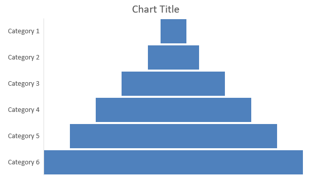

## **Panoramica**

Questo articolo fornisce una guida completa su come creare e personalizzare grafici utilizzando Aspose.Slides per .NET. Imparerai a inserire programmaticamente un grafico in una diapositiva, a popolarlo con i dati e ad applicare varie opzioni di formattazione per soddisfare i requisiti di progettazione specifici. Nell'arco dell'articolo, esempi di codice dettagliati illustrano ogni passaggio, dall'inizializzazione della presentazione e dell'oggetto grafico alla configurazione di serie, assi e legende. Seguendo questa guida, otterrai una solida comprensione di come integrare la generazione dinamica di grafici nelle tue applicazioni .NET, semplificando il processo di creazione di presentazioni basate sui dati.

## **Creare un Grafico**

I grafici aiutano le persone a visualizzare rapidamente i dati e a ottenere informazioni che potrebbero non essere immediatamente evidenti da una tabella o un foglio di calcolo.

**Perché Creare Grafici?**

Utilizzando i grafici, puoi:

* aggregare, condensare o riassumere grandi quantità di dati in una singola diapositiva di una presentazione;
* evidenziare schemi e tendenze nei dati;
* dedurre la direzione e lo slancio dei dati nel tempo o rispetto a un'unità di misura specifica;
* individuare outlier, anomalie, deviazioni, errori e dati non sensati;
* comunicare o presentare dati complessi.

In PowerPoint, è possibile creare grafici tramite la funzione *Insert*, che fornisce modelli per progettare molti tipi di grafico. Con Aspose.Slides, puoi creare sia grafici standard (basati su tipi di grafico popolari) sia grafici personalizzati.

{} 
Usa l'enumerazione [ChartType](https://reference.aspose.com/slides/it/net/aspose.slides.charts/charttype/) nello spazio dei nomi [Aspose.Slides.Charts](https://reference.aspose.com/slides/it/net/aspose.slides.charts/). I valori di questa enumerazione corrispondono a diversi tipi di grafico.
{} 

### **Creare Grafici a Colonne Raggruppate**

Questa sezione spiega come creare grafici a colonne raggruppate usando Aspose.Slides per .NET. Imparerai a inizializzare una presentazione, aggiungere un grafico e personalizzare i suoi elementi come titolo, dati, serie, categorie e stile. Segui i passaggi seguenti per vedere come viene generato un grafico a colonne raggruppate standard:

1. Crea un'istanza della classe [Presentation](https://reference.aspose.com/slides/it/net/aspose.slides/presentation).
1. Ottieni un riferimento a una diapositiva usando il suo indice.
1. Aggiungi un grafico con alcuni dati e specifica il tipo `ChartType.ClusteredColumn`.
1. Aggiungi un titolo al grafico.
1. Accedi al foglio di lavoro dei dati del grafico.
1. Cancella tutte le serie e le categorie predefinite.
1. Aggiungi nuove serie e nuove categorie.
1. Aggiungi nuovi dati al grafico per le serie.
1. Applica un colore di riempimento alle serie del grafico.
1. Aggiungi etichette alle serie del grafico.
1. Salva la presentazione modificata come file PPTX.

Questo codice C# dimostra come creare un grafico a colonne raggruppate:

```c#
// Istanzia la classe Presentation.
using (Presentation presentation = new Presentation())
{
    // Accedi alla prima diapositiva.
    ISlide slide = presentation.Slides[0];

    // Aggiungi un grafico a colonne raggruppate con i dati predefiniti.
    IChart chart = slide.Shapes.AddChart(ChartType.ClusteredColumn, 20, 20, 500, 300);

    // Imposta il titolo del grafico.
    chart.ChartTitle.AddTextFrameForOverriding("Sample Title");
    chart.ChartTitle.TextFrameForOverriding.TextFrameFormat.CenterText = NullableBool.True;
    chart.ChartTitle.Height = 20;
    chart.HasTitle = true;

    // Imposta la prima serie per mostrare i valori.
    chart.ChartData.Series[0].Labels.DefaultDataLabelFormat.ShowValue = true;

    // Imposta l'indice del foglio dati del grafico.
    int worksheetIndex = 0;

    // Ottieni il workbook dei dati del grafico.
    IChartDataWorkbook workbook = chart.ChartData.ChartDataWorkbook;

    // Elimina le serie e le categorie generate di default.
    chart.ChartData.Series.Clear();
    chart.ChartData.Categories.Clear();

    // Aggiungi nuove serie.
    chart.ChartData.Series.Add(workbook.GetCell(worksheetIndex, 0, 1, "Series 1"), chart.Type);
    chart.ChartData.Series.Add(workbook.GetCell(worksheetIndex, 0, 2, "Series 2"), chart.Type);

    // Aggiungi nuove categorie.
    chart.ChartData.Categories.Add(workbook.GetCell(worksheetIndex, 1, 0, "Category 1"));
    chart.ChartData.Categories.Add(workbook.GetCell(worksheetIndex, 2, 0, "Category 2"));
    chart.ChartData.Categories.Add(workbook.GetCell(worksheetIndex, 3, 0, "Category 3"));

    // Ottieni la prima serie del grafico.
    IChartSeries series = chart.ChartData.Series[0];

    // Popola i dati della serie.
    series.DataPoints.AddDataPointForBarSeries(workbook.GetCell(worksheetIndex, 1, 1, 20));
    series.DataPoints.AddDataPointForBarSeries(workbook.GetCell(worksheetIndex, 2, 1, 50));
    series.DataPoints.AddDataPointForBarSeries(workbook.GetCell(worksheetIndex, 3, 1, 30));

    // Imposta il colore di riempimento per la serie.
    series.Format.Fill.FillType = FillType.Solid;
    series.Format.Fill.SolidFillColor.Color = Color.Red;

    // Ottieni la seconda serie del grafico.
    series = chart.ChartData.Series[1];

    // Popola i dati della serie.
    series.DataPoints.AddDataPointForBarSeries(workbook.GetCell(worksheetIndex, 1, 2, 30));
    series.DataPoints.AddDataPointForBarSeries(workbook.GetCell(worksheetIndex, 2, 2, 10));
    series.DataPoints.AddDataPointForBarSeries(workbook.GetCell(worksheetIndex, 3, 2, 60));

    // Imposta il colore di riempimento per la serie.
    series.Format.Fill.FillType = FillType.Solid;
    series.Format.Fill.SolidFillColor.Color = Color.Green;

    // Imposta la prima etichetta per mostrare il nome della categoria.
    IDataLabel label = series.DataPoints[0].Label;
    label.DataLabelFormat.ShowCategoryName = true;

    label = series.DataPoints[1].Label;
    label.DataLabelFormat.ShowSeriesName = true;

    // Imposta la serie per mostrare il valore per la terza etichetta.
    label = series.DataPoints[2].Label;
    label.DataLabelFormat.ShowValue = true;
    label.DataLabelFormat.ShowSeriesName = true;
    label.DataLabelFormat.Separator = "/";

    // Salva la presentazione su disco come file PPTX.
    presentation.Save("AsposeChart_out.pptx", SaveFormat.Pptx);
}
```

Il risultato:


### **Creare Grafici a Dispersione**

I grafici a dispersione (noti anche come scatter plot o grafici x‑y) sono spesso usati per verificare schemi o dimostrare correlazioni tra due variabili.

Usa un grafico a dispersione quando:

* Hai dati numerici accoppiati.
* Hai due variabili che si associano bene tra loro.
* Vuoi determinare se le due variabili sono correlate.
* Hai una variabile indipendente che possiede più valori per una variabile dipendente.

Questo codice C# mostra come creare un grafico a dispersione con una serie di marcatori diversa:

```c#
// Istanzia la classe Presentation.
using (Presentation presentation = new Presentation())
{
    // Accedi alla prima diapositiva.
    ISlide slide = presentation.Slides[0];

    // Crea il grafico a dispersione predefinito.
    IChart chart = slide.Shapes.AddChart(ChartType.ScatterWithSmoothLines, 20, 20, 500, 300);

    // Imposta l'indice del foglio dati del grafico.
    int worksheetIndex = 0;

    // Ottieni il workbook dei dati del grafico.
    IChartDataWorkbook workbook = chart.ChartData.ChartDataWorkbook;

    // Elimina la serie predefinita.
    chart.ChartData.Series.Clear();

    // Aggiungi nuove serie.
    chart.ChartData.Series.Add(workbook.GetCell(worksheetIndex, 1, 1, "Series 1"), chart.Type);
    chart.ChartData.Series.Add(workbook.GetCell(worksheetIndex, 1, 3, "Series 2"), chart.Type);

    // Ottieni la prima serie del grafico.
    IChartSeries series = chart.ChartData.Series[0];

    // Aggiungi un nuovo punto (1:3) alla serie.
    series.DataPoints.AddDataPointForScatterSeries(workbook.GetCell(worksheetIndex, 2, 1, 1), workbook.GetCell(worksheetIndex, 2, 2, 3));

    // Aggiungi un nuovo punto (2:10).
    series.DataPoints.AddDataPointForScatterSeries(workbook.GetCell(worksheetIndex, 3, 1, 2), workbook.GetCell(worksheetIndex, 3, 2, 10));

    // Cambia il tipo di serie.
    series.Type = ChartType.ScatterWithStraightLinesAndMarkers;

    // Cambia il marcatore della serie del grafico.
    series.Marker.Size = 10;
    series.Marker.Symbol = MarkerStyleType.Star;

    // Ottieni la seconda serie del grafico.
    series = chart.ChartData.Series[1];

    // Aggiungi un nuovo punto (5:2) alla serie del grafico.
    series.DataPoints.AddDataPointForScatterSeries(workbook.GetCell(worksheetIndex, 2, 3, 5), workbook.GetCell(worksheetIndex, 2, 4, 2));

    // Aggiungi un nuovo punto (3:1).
    series.DataPoints.AddDataPointForScatterSeries(workbook.GetCell(worksheetIndex, 3, 3, 3), workbook.GetCell(worksheetIndex, 3, 4, 1));

    // Aggiungi un nuovo punto (2:2).
    series.DataPoints.AddDataPointForScatterSeries(workbook.GetCell(worksheetIndex, 4, 3, 2), workbook.GetCell(worksheetIndex, 4, 4, 2));

    // Aggiungi un nuovo punto (5:1).
    series.DataPoints.AddDataPointForScatterSeries(workbook.GetCell(worksheetIndex, 5, 3, 5), workbook.GetCell(worksheetIndex, 5, 4, 1));

    // Cambia il marcatore della serie del grafico.
    series.Marker.Size = 10;
    series.Marker.Symbol = MarkerStyleType.Circle;

    // Salva la presentazione su disco come file PPTX.
    presentation.Save("AsposeChart_out.pptx", SaveFormat.Pptx);
}
```

Il risultato:


### **Creare Grafici a Torta**

I grafici a torta sono ideali per mostrare la relazione parte‑intero nei dati, soprattutto quando i dati contengono etichette categoriche con valori numerici. Tuttavia, se i tuoi dati contengono molte parti o etichette, potresti considerare l'uso di un grafico a barre.

1. Crea un'istanza della classe [Presentation](https://reference.aspose.com/slides/it/net/aspose.slides/presentation).
1. Ottieni un riferimento a una diapositiva usando il suo indice.
1. Aggiungi un grafico con dati predefiniti e specifica il tipo `ChartType.Pie`.
1. Accedi al workbook dei dati del grafico ([IChartDataWorkbook](https://reference.aspose.com/slides/it/net/aspose.slides.charts/ichartdataworkbook/)).
1. Cancella le serie e le categorie predefinite.
1. Aggiungi nuove serie e nuove categorie.
1. Aggiungi nuovi dati al grafico per le serie.
1. Aggiungi nuovi punti al grafico e applica colori personalizzati ai settori della torta.
1. Imposta le etichette per le serie.
1. Abilita le linee guida per le etichette delle serie.
1. Imposta l'angolo di rotazione per il grafico a torta.
1. Salva la presentazione modificata come file PPTX.

Questo codice C# mostra come creare un grafico a torta:

```c#
    // Istanzia la classe Presentation.
    using (Presentation presentation = new Presentation())
    {
        // Accedi alla prima diapositiva.
        ISlide slide = presentation.Slides[0];

        // Aggiungi un grafico con i suoi dati predefiniti.
        IChart chart = slide.Shapes.AddChart(ChartType.Pie, 20, 20, 500, 300);

        // Imposta il titolo del grafico.
        chart.ChartTitle.AddTextFrameForOverriding("Sample Title");
        chart.ChartTitle.TextFrameForOverriding.TextFrameFormat.CenterText = NullableBool.True;
        chart.ChartTitle.Height = 20;
        chart.HasTitle = true;

        // Imposta la prima serie per mostrare i valori.
        chart.ChartData.Series[0].Labels.DefaultDataLabelFormat.ShowValue = true;

        // Imposta l'indice del foglio dati del grafico.
        int worksheetIndex = 0;

        // Ottieni il workbook dei dati del grafico.
        IChartDataWorkbook workbook = chart.ChartData.ChartDataWorkbook;

        // Elimina le serie e le categorie generate di default.
        chart.ChartData.Series.Clear();
        chart.ChartData.Categories.Clear();

        // Aggiungi nuove categorie.
        chart.ChartData.Categories.Add(workbook.GetCell(0, 1, 0, "1st Qtr"));
        chart.ChartData.Categories.Add(workbook.GetCell(0, 2, 0, "2nd Qtr"));
        chart.ChartData.Categories.Add(workbook.GetCell(0, 3, 0, "3rd Qtr"));

        // Aggiungi nuove serie.
        IChartSeries series = chart.ChartData.Series.Add(workbook.GetCell(0, 0, 1, "Series 1"), chart.Type);

        // Popola i dati della serie.
        series.DataPoints.AddDataPointForPieSeries(workbook.GetCell(worksheetIndex, 1, 1, 20));
        series.DataPoints.AddDataPointForPieSeries(workbook.GetCell(worksheetIndex, 2, 1, 50));
        series.DataPoints.AddDataPointForPieSeries(workbook.GetCell(worksheetIndex, 3, 1, 30));

        // Imposta il colore del settore.
        chart.ChartData.SeriesGroups[0].IsColorVaried = true;

        IChartDataPoint point = series.DataPoints[0];
        point.Format.Fill.FillType = FillType.Solid;
        point.Format.Fill.SolidFillColor.Color = Color.Cyan;

        // Imposta il bordo del settore.
        point.Format.Line.FillFormat.FillType = FillType.Solid;
        point.Format.Line.FillFormat.SolidFillColor.Color = Color.Gray;
        point.Format.Line.Width = 3.0;
        point.Format.Line.Style = LineStyle.ThinThick;
        point.Format.Line.DashStyle = LineDashStyle.LargeDash;

        IChartDataPoint point1 = series.DataPoints[1];
        point1.Format.Fill.FillType = FillType.Solid;
        point1.Format.Fill.SolidFillColor.Color = Color.Brown;

        // Imposta il bordo del settore.
        point1.Format.Line.FillFormat.FillType = FillType.Solid;
        point1.Format.Line.FillFormat.SolidFillColor.Color = Color.Blue;
        point1.Format.Line.Width = 3.0;
        point1.Format.Line.Style = LineStyle.Single;
        point1.Format.Line.DashStyle = LineDashStyle.LargeDashDot;

        IChartDataPoint point2 = series.DataPoints[2];
        point2.Format.Fill.FillType = FillType.Solid;
        point2.Format.Fill.SolidFillColor.Color = Color.Coral;

        // Imposta il bordo del settore.
        point2.Format.Line.FillFormat.FillType = FillType.Solid;
        point2.Format.Line.FillFormat.SolidFillColor.Color = Color.Red;
        point2.Format.Line.Width = 2.0;
        point2.Format.Line.Style = LineStyle.ThinThin;
        point2.Format.Line.DashStyle = LineDashStyle.LargeDashDotDot;

        // Crea etichette personalizzate per ogni categoria nella nuova serie.
        IDataLabel label1 = series.DataPoints[0].Label;

        label1.DataLabelFormat.ShowValue = true;

        IDataLabel label2 = series.DataPoints[1].Label;
        label2.DataLabelFormat.ShowValue = true;
        label2.DataLabelFormat.ShowLegendKey = true;
        label2.DataLabelFormat.ShowPercentage = true;

        IDataLabel label3 = series.DataPoints[2].Label;
        label3.DataLabelFormat.ShowSeriesName = true;
        label3.DataLabelFormat.ShowPercentage = true;

        // Imposta la serie per mostrare le linee guida nel grafico.
        series.Labels.DefaultDataLabelFormat.ShowLeaderLines = true;

        // Imposta l'angolo di rotazione per i settori del grafico a torta.
        chart.ChartData.SeriesGroups[0].FirstSliceAngle = 180;

        // Salva la presentazione su disco come file PPTX.
        presentation.Save("PieChart_out.pptx", SaveFormat.Pptx);
    }
```

Il risultato:


### **Creare Grafici a Linee**

I grafici a linee (noti anche come line graph) sono ideali quando vuoi mostrare variazioni di valore nel tempo. Con un grafico a linee, puoi confrontare una grande quantità di dati contemporaneamente, monitorare cambiamenti e tendenze nel tempo, evidenziare anomalie nelle serie di dati e altro ancora.

1. Crea un'istanza della classe [Presentation](https://reference.aspose.com/slides/it/net/aspose.slides/presentation).
1. Ottieni un riferimento a una diapositiva usando il suo indice.
1. Aggiungi un grafico con dati predefiniti e specifica il tipo `ChartType.Line`.
1. Accedi al workbook dei dati del grafico ([IChartDataWorkbook](https://reference.aspose.com/slides/it/net/aspose.slides.charts/ichartdataworkbook/)).
1. Cancella le serie e le categorie predefinite.
1. Aggiungi nuove serie e nuove categorie.
1. Aggiungi nuovi dati al grafico per le serie.
1. Salva la presentazione modificata come file PPTX.

Questo codice C# mostra come creare un grafico a linee:

```c#
using (Presentation presentation = new Presentation())
{
    IChart lineChart = presentation.Slides[0].Shapes.AddChart(ChartType.Line, 20, 20, 500, 300);

    presentation.Save("lineChart.pptx", SaveFormat.Pptx);
}
```

Per impostazione predefinita, i punti di un grafico a linee sono collegati da linee continue dritte. Se desideri che i punti siano collegati da linee tratteggiate, puoi specificare il tipo di tratto desiderato come segue:

```c#
foreach (IChartSeries series in lineChart.ChartData.Series)
{
    series.Format.Line.DashStyle = LineDashStyle.Dash;
}
```

Il risultato:


### **Creare Grafici a Mappa a Albero**

I grafici a mappa a albero sono ideali per i dati di vendita quando vuoi mostrare la dimensione relativa delle categorie di dati e attirare rapidamente l'attenzione sugli elementi che contribuiscono maggiormente all'interno di ciascuna categoria.

1. Crea un'istanza della classe [Presentation](https://reference.aspose.com/slides/it/net/aspose.slides/presentation).
1. Ottieni un riferimento a una diapositiva usando il suo indice.
1. Aggiungi un grafico con dati predefiniti e specifica il tipo `ChartType.Treemap`.
1. Accedi al workbook dei dati del grafico ([IChartDataWorkbook](https://reference.aspose.com/slides/it/net/aspose.slides.charts/ichartdataworkbook/)).
1. Cancella le serie e le categorie predefinite.
1. Aggiungi nuove serie e nuove categorie.
1. Aggiungi nuovi dati al grafico per le serie.
1. Salva la presentazione modificata come file PPTX.

Questo codice C# mostra come creare un grafico a mappa a albero:

```c#
using (Presentation presentation = new Presentation())
{
    IChart chart = presentation.Slides[0].Shapes.AddChart(ChartType.Treemap, 20, 20, 500, 300);
    chart.ChartData.Categories.Clear();
    chart.ChartData.Series.Clear();

    IChartDataWorkbook workbook = chart.ChartData.ChartDataWorkbook;
    workbook.Clear(0);

    // Ramo 1
    IChartCategory leaf = chart.ChartData.Categories.Add(workbook.GetCell(0, "C1", "Leaf1"));
    leaf.GroupingLevels.SetGroupingItem(1, "Stem1");
    leaf.GroupingLevels.SetGroupingItem(2, "Branch1");

    chart.ChartData.Categories.Add(workbook.GetCell(0, "C2", "Leaf2"));

    leaf = chart.ChartData.Categories.Add(workbook.GetCell(0, "C3", "Leaf3"));
    leaf.GroupingLevels.SetGroupingItem(1, "Stem2");

    chart.ChartData.Categories.Add(workbook.GetCell(0, "C4", "Leaf4"));

    // Ramo 2
    leaf = chart.ChartData.Categories.Add(workbook.GetCell(0, "C5", "Leaf5"));
    leaf.GroupingLevels.SetGroupingItem(1, "Stem3");
    leaf.GroupingLevels.SetGroupingItem(2, "Branch2");

    chart.ChartData.Categories.Add(workbook.GetCell(0, "C6", "Leaf6"));

    leaf = chart.ChartData.Categories.Add(workbook.GetCell(0, "C7", "Leaf7"));
    leaf.GroupingLevels.SetGroupingItem(1, "Stem4");

    chart.ChartData.Categories.Add(workbook.GetCell(0, "C8", "Leaf8"));

    IChartSeries series = chart.ChartData.Series.Add(ChartType.Treemap);
    series.Labels.DefaultDataLabelFormat.ShowCategoryName = true;
    series.DataPoints.AddDataPointForTreemapSeries(workbook.GetCell(0, "D1", 4));
    series.DataPoints.AddDataPointForTreemapSeries(workbook.GetCell(0, "D2", 5));
    series.DataPoints.AddDataPointForTreemapSeries(workbook.GetCell(0, "D3", 3));
    series.DataPoints.AddDataPointForTreemapSeries(workbook.GetCell(0, "D4", 6));
    series.DataPoints.AddDataPointForTreemapSeries(workbook.GetCell(0, "D5", 9));
    series.DataPoints.AddDataPointForTreemapSeries(workbook.GetCell(0, "D6", 9));
    series.DataPoints.AddDataPointForTreemapSeries(workbook.GetCell(0, "D7", 4));
    series.DataPoints.AddDataPointForTreemapSeries(workbook.GetCell(0, "D8", 3));

    series.ParentLabelLayout = ParentLabelLayoutType.Overlapping;

    presentation.Save("Treemap.pptx", SaveFormat.Pptx);
}
```

Il risultato:


### **Creare Grafici Finanziari**

I grafici finanziari vengono utilizzati per visualizzare dati finanziari come prezzi di apertura, massimo, minimo e chiusura, aiutando ad analizzare tendenze di mercato e volatilità. Forniscono informazioni essenziali sulle prestazioni azionarie, supportando investitori e analisti nel prendere decisioni informate.

1. Crea un'istanza della classe [Presentation](https://reference.aspose.com/slides/it/net/aspose.slides/presentation).
1. Ottieni un riferimento a una diapositiva usando il suo indice.
1. Aggiungi un grafico con dati predefiniti e specifica il tipo `ChartType.OpenHighLowClose`.
1. Accedi al workbook dei dati del grafico ([IChartDataWorkbook](https://reference.aspose.com/slides/it/net/aspose.slides.charts/ichartdataworkbook/)).
1. Cancella le serie e le categorie predefinite.
1. Aggiungi nuove serie e nuove categorie.
1. Aggiungi nuovi dati al grafico per le serie.
1. Specifica il formato HiLowLines.
1. Salva la presentazione modificata come file PPTX.

Questo codice C# mostra come creare un grafico finanziario:

```c#
using (Presentation presentation = new Presentation())
{
    IChart chart = presentation.Slides[0].Shapes.AddChart(ChartType.OpenHighLowClose, 20, 20, 500, 300, false);

    IChartDataWorkbook workbook = chart.ChartData.ChartDataWorkbook;

    chart.ChartData.Categories.Add(workbook.GetCell(0, 1, 0, "A"));
    chart.ChartData.Categories.Add(workbook.GetCell(0, 2, 0, "B"));
    chart.ChartData.Categories.Add(workbook.GetCell(0, 3, 0, "C"));

    chart.ChartData.Series.Add(workbook.GetCell(0, 0, 1, "Open"), chart.Type);
    chart.ChartData.Series.Add(workbook.GetCell(0, 0, 2, "High"), chart.Type);
    chart.ChartData.Series.Add(workbook.GetCell(0, 0, 3, "Low"), chart.Type);
    chart.ChartData.Series.Add(workbook.GetCell(0, 0, 4, "Close"), chart.Type);

    IChartSeries series = chart.ChartData.Series[0];
    series.DataPoints.AddDataPointForStockSeries(workbook.GetCell(0, 1, 1, 72));
    series.DataPoints.AddDataPointForStockSeries(workbook.GetCell(0, 2, 1, 25));
    series.DataPoints.AddDataPointForStockSeries(workbook.GetCell(0, 3, 1, 38));

    series = chart.ChartData.Series[1];
    series.DataPoints.AddDataPointForStockSeries(workbook.GetCell(0, 1, 2, 172));
    series.DataPoints.AddDataPointForStockSeries(workbook.GetCell(0, 2, 2, 57));
    series.DataPoints.AddDataPointForStockSeries(workbook.GetCell(0, 3, 2, 57));

    series = chart.ChartData.Series[2];
    series.DataPoints.AddDataPointForStockSeries(workbook.GetCell(0, 1, 3, 12));
    series.DataPoints.AddDataPointForStockSeries(workbook.GetCell(0, 2, 3, 12));
    series.DataPoints.AddDataPointForStockSeries(workbook.GetCell(0, 3, 3, 13));

    series = chart.ChartData.Series[3];
    series.DataPoints.AddDataPointForStockSeries(workbook.GetCell(0, 1, 4, 25));
    series.DataPoints.AddDataPointForStockSeries(workbook.GetCell(0, 2, 4, 38));
    series.DataPoints.AddDataPointForStockSeries(workbook.GetCell(0, 3, 4, 50));

    chart.ChartData.SeriesGroups[0].UpDownBars.HasUpDownBars = true;
    chart.ChartData.SeriesGroups[0].HiLowLinesFormat.Line.FillFormat.FillType = FillType.Solid;

    foreach (IChartSeries ser in chart.ChartData.Series)
    {
        ser.Format.Line.FillFormat.FillType = FillType.NoFill;
    }

    chart.Axes.VerticalAxis.MinorGridLinesFormat.Line.FillFormat.FillType = FillType.NoFill;

    presentation.Save("Stock-chart.pptx", SaveFormat.Pptx);
}
```

Il risultato:


### **Creare Grafici a Scatola e Busti**

I grafici a scatola e baffi (Box and Whisker) mostrano la distribuzione dei dati sintetizzando misure statistiche chiave, come mediana, quartili e possibili outlier. Sono particolarmente utili nell'analisi esplorativa dei dati e negli studi statistici per comprendere rapidamente la variabilità e identificare anomalie.

1. Crea un'istanza della classe [Presentation](https://reference.aspose.com/slides/it/net/aspose.slides/presentation).
1. Ottieni un riferimento a una diapositiva usando il suo indice.
1. Aggiungi un grafico con dati predefiniti e specifica il tipo `ChartType.BoxAndWhisker`.
1. Accedi al workbook dei dati del grafico ([IChartDataWorkbook](https://reference.aspose.com/slides/it/net/aspose.slides.charts/ichartdataworkbook/)).
1. Cancella le serie e le categorie predefinite.
1. Aggiungi nuove serie e nuove categorie.
1. Aggiungi nuovi dati al grafico per le serie.
1. Salva la presentazione modificata come file PPTX.

Questo codice C# mostra come creare un grafico a scatola e baffi:

```c#
using (Presentation presentation = new Presentation())
{
    IChart chart = presentation.Slides[0].Shapes.AddChart(ChartType.BoxAndWhisker, 20, 20, 500, 300);
    chart.ChartData.Categories.Clear();
    chart.ChartData.Series.Clear();

    IChartDataWorkbook workbook = chart.ChartData.ChartDataWorkbook;
    workbook.Clear(0);

    chart.ChartData.Categories.Add(workbook.GetCell(0, "A1", "Category 1"));
    chart.ChartData.Categories.Add(workbook.GetCell(0, "A2", "Category 2"));
    chart.ChartData.Categories.Add(workbook.GetCell(0, "A3", "Category 3"));
    chart.ChartData.Categories.Add(workbook.GetCell(0, "A4", "Category 4"));
    chart.ChartData.Categories.Add(workbook.GetCell(0, "A5", "Category 5"));
    chart.ChartData.Categories.Add(workbook.GetCell(0, "A6", "Category 6"));

    IChartSeries series = chart.ChartData.Series.Add(ChartType.BoxAndWhisker);

    series.QuartileMethod = QuartileMethodType.Exclusive;
    series.ShowMeanLine = true;
    series.ShowMeanMarkers = true;
    series.ShowInnerPoints = true;
    series.ShowOutlierPoints = true;

    series.DataPoints.AddDataPointForBoxAndWhiskerSeries(workbook.GetCell(0, "B1", 15));
    series.DataPoints.AddDataPointForBoxAndWhiskerSeries(workbook.GetCell(0, "B2", 41));
    series.DataPoints.AddDataPointForBoxAndWhiskerSeries(workbook.GetCell(0, "B3", 16));
    series.DataPoints.AddDataPointForBoxAndWhiskerSeries(workbook.GetCell(0, "B4", 10));
    series.DataPoints.AddDataPointForBoxAndWhiskerSeries(workbook.GetCell(0, "B5", 23));
    series.DataPoints.AddDataPointForBoxAndWhiskerSeries(workbook.GetCell(0, "B6", 16));

    presentation.Save("BoxAndWhisker.pptx", SaveFormat.Pptx);
}
```

### **Creare Grafici a Imbuto**

I grafici a imbuto visualizzano processi con fasi sequenziali, dove il volume di dati diminuisce man mano che si avanza da un passaggio al successivo. Sono particolarmente utili per analizzare tassi di conversione, individuare colli di bottiglia e monitorare l'efficienza di processi di vendita o marketing.

1. Crea un'istanza della classe [Presentation](https://reference.aspose.com/slides/it/net/aspose.slides/presentation).
1. Ottieni un riferimento a una diapositiva usando il suo indice.
1. Aggiungi un grafico con dati predefiniti e specifica il tipo `ChartType.Funnel`.
1. Salva la presentazione modificata come file PPTX.

Questo codice C# mostra come creare un grafico a imbuto:

```c#
using (Presentation presentation = new Presentation("test.pptx"))
{
    IChart chart = presentation.Slides[0].Shapes.AddChart(ChartType.Funnel, 50, 50, 500, 400);
    chart.ChartData.Categories.Clear();
    chart.ChartData.Series.Clear();

    IChartDataWorkbook workbook = chart.ChartData.ChartDataWorkbook;
    workbook.Clear(0);

    chart.ChartData.Categories.Add(workbook.GetCell(0, "A1", "Category 1"));
    chart.ChartData.Categories.Add(workbook.GetCell(0, "A2", "Category 2"));
    chart.ChartData.Categories.Add(workbook.GetCell(0, "A3", "Category 3"));
    chart.ChartData.Categories.Add(workbook.GetCell(0, "A4", "Category 4"));
    chart.ChartData.Categories.Add(workbook.GetCell(0, "A5", "Category 5"));
    chart.ChartData.Categories.Add(workbook.GetCell(0, "A6", "Category 6"));

    IChartSeries series = chart.ChartData.Series.Add(ChartType.Funnel);

    series.DataPoints.AddDataPointForFunnelSeries(workbook.GetCell(0, "B1", 50));
    series.DataPoints.AddDataPointForFunnelSeries(workbook.GetCell(0, "B2", 100));
    series.DataPoints.AddDataPointForFunnelSeries(workbook.GetCell(0, "B3", 200));
    series.DataPoints.AddDataPointForFunnelSeries(workbook.GetCell(0, "B4", 300));
    series.DataPoints.AddDataPointForFunnelSeries(workbook.GetCell(0, "B5", 400));
    series.DataPoints.AddDataPointForFunnelSeries(workbook.GetCell(0, "B6", 500));

    presentation.Save("Funnel.pptx", SaveFormat.Pptx);
}
```

Il risultato:



### **Creare Grafici Sunburst**

I grafici Sunburst visualizzano dati gerarchici mostrando i livelli come anelli concentrici. Aiutano a illustrare le relazioni parte‑intero e sono ideali per rappresentare categorie e sottocategorie annidate in modo chiaro e compatto.

1. Crea un'istanza della classe [Presentation](https://reference.aspose.com/slides/it/net/aspose.slides/presentation).
1. Ottieni un riferimento a una diapositiva usando il suo indice.
1. Aggiungi un grafico con dati predefiniti e specifica il tipo `ChartType.Sunburst`.
1. Salva la presentazione modificata come file PPTX.

Questo codice C# mostra come creare un grafico Sunburst:

```c#
using (Presentation presentation = new Presentation())
{
    IChart chart = presentation.Slides[0].Shapes.AddChart(ChartType.Sunburst, 20, 20, 500, 300);
    chart.ChartData.Categories.Clear();
    chart.ChartData.Series.Clear();

    IChartDataWorkbook workbook = chart.ChartData.ChartDataWorkbook;
    workbook.Clear(0);

    // Ramo 1
    IChartCategory leaf = chart.ChartData.Categories.Add(workbook.GetCell(0, "C1", "Leaf1"));
    leaf.GroupingLevels.SetGroupingItem(1, "Stem1");
    leaf.GroupingLevels.SetGroupingItem(2, "Branch1");

    chart.ChartData.Categories.Add(workbook.GetCell(0, "C2", "Leaf2"));

    leaf = chart.ChartData.Categories.Add(workbook.GetCell(0, "C3", "Leaf3"));
    leaf.GroupingLevels.SetGroupingItem(1, "Stem2");

    chart.ChartData.Categories.Add(workbook.GetCell(0, "C4", "Leaf4"));

    // Ramo 2
    leaf = chart.ChartData.Categories.Add(workbook.GetCell(0, "C5", "Leaf5"));
    leaf.GroupingLevels.SetGroupingItem(1, "Stem3");
    leaf.GroupingLevels.SetGroupingItem(2, "Branch2");

    chart.ChartData.Categories.Add(workbook.GetCell(0, "C6", "Leaf6"));

    leaf = chart.ChartData.Categories.Add(workbook.GetCell(0, "C7", "Leaf7"));
    leaf.GroupingLevels.SetGroupingItem(1, "Stem4");

    chart.ChartData.Categories.Add(workbook.GetCell(0, "C8", "Leaf8"));

    IChartSeries series = chart.ChartData.Series.Add(ChartType.Sunburst);
    series.Labels.DefaultDataLabelFormat.ShowCategoryName = true;
    series.DataPoints.AddDataPointForSunburstSeries(workbook.GetCell(0, "D1", 4));
    series.DataPoints.AddDataPointForSunburstSeries(workbook.GetCell(0, "D2", 5));
    series.DataPoints.AddDataPointForSunburstSeries(workbook.GetCell(0, "D3", 3));
    series.DataPoints.AddDataPointForSunburstSeries(workbook.GetCell(0, "D4", 6));
    series.DataPoints.AddDataPointForSunburstSeries(workbook.GetCell(0, "D5", 9));
    series.DataPoints.AddDataPointForSunburstSeries(workbook.GetCell(0, "D6", 9));
    series.DataPoints.AddDataPointForSunburstSeries(workbook.GetCell(0, "D7", 4));
    series.DataPoints.AddDataPointForSunburstSeries(workbook.GetCell(0, "D8", 3));

    presentation.Save("Sunburst.pptx", SaveFormat.Pptx);
}
```

Il risultato:


### **Creare Grafici Istogramma**

Gli istogrammi rappresentano la distribuzione di dati numerici raggruppando i valori in intervalli o bin. Sono particolarmente utili per identificare schemi nei dati, come frequenza, asimmetria e dispersione, nonché per rilevare outlier in un set di dati.

1. Crea un'istanza della classe [Presentation](https://reference.aspose.com/slides/it/net/aspose.slides/presentation).
1. Ottieni un riferimento a una diapositiva usando il suo indice.
1. Aggiungi un grafico con alcuni dati e specifica il tipo `ChartType.Histogram`.
1. Accedi al workbook dei dati del grafico ([IChartDataWorkbook](https://reference.aspose.com/slides/it/net/aspose.slides.charts/ichartdataworkbook/)).
1. Cancella le serie e le categorie predefinite.
1. Aggiungi nuove serie e nuove categorie.
1. Salva la presentazione modificata come file PPTX.

Questo codice C# mostra come creare un grafico istogramma:

```c#
using (Presentation presentation = new Presentation())
{
    IChart chart = presentation.Slides[0].Shapes.AddChart(ChartType.Histogram, 20, 20, 500, 300);
    chart.ChartData.Categories.Clear();
    chart.ChartData.Series.Clear();

    IChartDataWorkbook workbook = chart.ChartData.ChartDataWorkbook;
    workbook.Clear(0);

    IChartSeries series = chart.ChartData.Series.Add(ChartType.Histogram);
    series.DataPoints.AddDataPointForHistogramSeries(workbook.GetCell(0, "A1", 15));
    series.DataPoints.AddDataPointForHistogramSeries(workbook.GetCell(0, "A2", -41));
    series.DataPoints.AddDataPointForHistogramSeries(workbook.GetCell(0, "A3", 16));
    series.DataPoints.AddDataPointForHistogramSeries(workbook.GetCell(0, "A4", 10));
    series.DataPoints.AddDataPointForHistogramSeries(workbook.GetCell(0, "A5", -23));
    series.DataPoints.AddDataPointForHistogramSeries(workbook.GetCell(0, "A6", 16));

    chart.Axes.HorizontalAxis.AggregationType = AxisAggregationType.Automatic;

    presentation.Save("Histogram.pptx", SaveFormat.Pptx);
}
```

Il risultato:


### **Creare Grafici Radar**

I grafici radar visualizzano dati multivariati in un formato bidimensionale, consentendo un facile confronto di più variabili simultaneamente. Sono particolarmente utili per identificare schemi, punti di forza e debolezze su più metriche o attributi di prestazione.

1. Crea un'istanza della classe [Presentation](https://reference.aspose.com/slides/it/net/aspose.slides/presentation).
1. Ottieni un riferimento a una diapositiva usando il suo indice.
1. Aggiungi un grafico con alcuni dati e specifica il tipo `ChartType.Radar`.
1. Salva la presentazione modificata come file PPTX.

Questo codice C# mostra come creare un grafico radar:

```c#
using (Presentation presentation = new Presentation())
{
    presentation.Slides[0].Shapes.AddChart(ChartType.Radar, 20, 20, 500, 300);
    presentation.Save("Radar-chart.pptx", SaveFormat.Pptx);
}
```

Il risultato:


### **Creare Grafici Multi‑Categoria**

I grafici multi‑categoria mostrano dati che coinvolgono più raggruppamenti categorici, consentendo di confrontare valori su più dimensioni simultaneamente. Sono particolarmente utili quando è necessario analizzare tendenze e relazioni all'interno di set di dati complessi e multilivello.

1. Crea un'istanza della classe [Presentation](https://reference.aspose.com/slides/it/net/aspose.slides/presentation).
1. Ottieni un riferimento a una diapositiva usando il suo indice.
1. Aggiungi un grafico con dati predefiniti e specifica il tipo `ChartType.ClusteredColumn`.
1. Accedi al workbook dei dati del grafico ([IChartDataWorkbook](https://reference.aspose.com/slides/it/net/aspose.slides.charts/ichartdataworkbook/)).
1. Cancella le serie e le categorie predefinite.
1. Aggiungi nuove serie e nuove categorie.
1. Aggiungi nuovi dati al grafico per le serie.
1. Salva la presentazione modificata come file PPTX.

Questo codice C# mostra come creare un grafico multi‑categoria:

```c#
using (Presentation presentation = new Presentation())
{
    ISlide slide = presentation.Slides[0];

    IChart chart = presentation.Slides[0].Shapes.AddChart(ChartType.ClusteredColumn, 20, 20, 500, 300);
    chart.ChartData.Series.Clear();
    chart.ChartData.Categories.Clear();

    IChartDataWorkbook workbook = chart.ChartData.ChartDataWorkbook;
    workbook.Clear(0);

    int worksheetIndex = 0;

    IChartCategory category = chart.ChartData.Categories.Add(workbook.GetCell(0, "c2", "A"));
    category.GroupingLevels.SetGroupingItem(1, "Group1");
    category = chart.ChartData.Categories.Add(workbook.GetCell(0, "c3", "B"));

    category = chart.ChartData.Categories.Add(workbook.GetCell(0, "c4", "C"));
    category.GroupingLevels.SetGroupingItem(1, "Group2");
    category = chart.ChartData.Categories.Add(workbook.GetCell(0, "c5", "D"));

    category = chart.ChartData.Categories.Add(workbook.GetCell(0, "c6", "E"));
    category.GroupingLevels.SetGroupingItem(1, "Group3");
    category = chart.ChartData.Categories.Add(workbook.GetCell(0, "c7", "F"));

    category = chart.ChartData.Categories.Add(workbook.GetCell(0, "c8", "G"));
    category.GroupingLevels.SetGroupingItem(1, "Group4");
    category = chart.ChartData.Categories.Add(workbook.GetCell(0, "c9", "H"));

    // Aggiungi una serie.
    IChartSeries series = chart.ChartData.Series.Add(workbook.GetCell(0, "D1", "Series 1"), ChartType.ClusteredColumn);

    series.DataPoints.AddDataPointForBarSeries(workbook.GetCell(worksheetIndex, "D2", 10));
    series.DataPoints.AddDataPointForBarSeries(workbook.GetCell(worksheetIndex, "D3", 20));
    series.DataPoints.AddDataPointForBarSeries(workbook.GetCell(worksheetIndex, "D4", 30));
    series.DataPoints.AddDataPointForBarSeries(workbook.GetCell(worksheetIndex, "D5", 40));
    series.DataPoints.AddDataPointForBarSeries(workbook.GetCell(worksheetIndex, "D6", 50));
    series.DataPoints.AddDataPointForBarSeries(workbook.GetCell(worksheetIndex, "D7", 60));
    series.DataPoints.AddDataPointForBarSeries(workbook.GetCell(worksheetIndex, "D8", 70));
    series.DataPoints.AddDataPointForBarSeries(workbook.GetCell(worksheetIndex, "D9", 80));

    // Salva la presentazione con il grafico.
    presentation.Save("AsposeChart_out.pptx", SaveFormat.Pptx);
}
```

Il risultato:


### **Creare Grafici Cartografici**

I grafici cartografici visualizzano dati geografici mappando informazioni su posizioni specifiche come paesi, stati o città. Sono particolarmente utili per analizzare tendenze regionali, dati demografici e distribuzioni spaziali in modo chiaro e visivamente accattivante.

Questo codice C# mostra come creare un grafico cartografico:

```c#
using (Presentation presentation = new Presentation())
{
    IChart chart = presentation.Slides[0].Shapes.AddChart(ChartType.Map, 20, 20, 500, 300);
    presentation.Save("mapChart.pptx", SaveFormat.Pptx);
}
```

Il risultato:


### **Creare Grafici Combinati**

Un grafico combinato (o combo) unisce due o più tipi di grafico in un unico diagramma. Questo tipo di grafico consente di evidenziare, confrontare o esaminare differenze tra più set di dati, aiutando a identificare le relazioni tra essi.


Il codice C# seguente mostra come creare il grafico combinato mostrato sopra in una presentazione PowerPoint:

```c#
private static void CreateComboChart()
{
    using (Presentation presentation = new Presentation())
    {
        IChart chart = CreateChartWithFirstSeries(presentation.Slides[0]);

        AddSecondSeriesToChart(chart);
        AddThirdSeriesToChart(chart);

        SetPrimaryAxesFormat(chart);
        SetSecondaryAxesFormat(chart);

        presentation.Save("combo-chart.pptx", SaveFormat.Pptx);
    }
}

private static IChart CreateChartWithFirstSeries(ISlide slide)
{
    IChart chart = slide.Shapes.AddChart(ChartType.ClusteredColumn, 50, 50, 600, 400);

    // Imposta il titolo del grafico
    chart.HasTitle = true;
    chart.ChartTitle.AddTextFrameForOverriding("Chart Title");
    chart.ChartTitle.Overlay = false;
    IPortionFormat portionFormat = 
       chart.ChartTitle.TextFrameForOverriding.Paragraphs[0].ParagraphFormat.DefaultPortionFormat;
    portionFormat.FontBold = NullableBool.False;
    portionFormat.FontHeight = 18f;

    // Imposta la legenda del grafico
    chart.Legend.Position = LegendPositionType.Bottom;
    chart.Legend.TextFormat.PortionFormat.FontHeight = 12f;

    // Elimina le serie e le categorie generate di default
    chart.ChartData.Series.Clear();
    chart.ChartData.Categories.Clear();

    int worksheetIndex = 0;
    IChartDataWorkbook workbook = chart.ChartData.ChartDataWorkbook;

    // Aggiunge nuove categorie
    chart.ChartData.Categories.Add(workbook.GetCell(worksheetIndex, 1, 0, "Category 1"));
    chart.ChartData.Categories.Add(workbook.GetCell(worksheetIndex, 2, 0, "Category 2"));
    chart.ChartData.Categories.Add(workbook.GetCell(worksheetIndex, 3, 0, "Category 3"));
    chart.ChartData.Categories.Add(workbook.GetCell(worksheetIndex, 4, 0, "Category 4"));

    // Aggiunge la prima serie
    IChartSeries series = chart.ChartData.Series.Add(
        workbook.GetCell(worksheetIndex, 0, 1, "Series 1"), chart.Type);

    series.ParentSeriesGroup.Overlap = -25;
    series.ParentSeriesGroup.GapWidth = 220;

    series.DataPoints.AddDataPointForBarSeries(workbook.GetCell(worksheetIndex, 1, 1, 4.3));
    series.DataPoints.AddDataPointForBarSeries(workbook.GetCell(worksheetIndex, 2, 1, 2.5));
    series.DataPoints.AddDataPointForBarSeries(workbook.GetCell(worksheetIndex, 3, 1, 3.5));
    series.DataPoints.AddDataPointForBarSeries(workbook.GetCell(worksheetIndex, 4, 1, 4.5));

    return chart;
}

private static void AddSecondSeriesToChart(IChart chart)
{
    IChartDataWorkbook workbook = chart.ChartData.ChartDataWorkbook;
    const int worksheetIndex = 0;

    IChartSeries series = chart.ChartData.Series.Add(
        workbook.GetCell(worksheetIndex, 0, 2, "Series 2"), ChartType.ClusteredColumn);

    series.ParentSeriesGroup.Overlap = -25;
    series.ParentSeriesGroup.GapWidth = 220;

    series.DataPoints.AddDataPointForBarSeries(workbook.GetCell(worksheetIndex, 1, 2, 2.4));
    series.DataPoints.AddDataPointForBarSeries(workbook.GetCell(worksheetIndex, 2, 2, 4.4));
    series.DataPoints.AddDataPointForBarSeries(workbook.GetCell(worksheetIndex, 3, 2, 1.8));
    series.DataPoints.AddDataPointForBarSeries(workbook.GetCell(worksheetIndex, 4, 2, 2.8));
}

private static void AddThirdSeriesToChart(IChart chart)
{
    IChartDataWorkbook workbook = chart.ChartData.ChartDataWorkbook;
    const int worksheetIndex = 0;

    IChartSeries series = chart.ChartData.Series.Add(
        workbook.GetCell(worksheetIndex, 0, 3, "Series 3"), ChartType.Line);

    series.DataPoints.AddDataPointForLineSeries(workbook.GetCell(worksheetIndex, 1, 3, 2.0));
    series.DataPoints.AddDataPointForLineSeries(workbook.GetCell(worksheetIndex, 2, 3, 2.0));
    series.DataPoints.AddDataPointForLineSeries(workbook.GetCell(worksheetIndex, 3, 3, 3.0));
    series.DataPoints.AddDataPointForLineSeries(workbook.GetCell(worksheetIndex, 4, 3, 5.0));

    series.PlotOnSecondAxis = true;
}

private static void SetPrimaryAxesFormat(IChart chart)
{
    // Imposta l'asse orizzontale
    IAxis horizontalAxis = chart.Axes.HorizontalAxis;
    horizontalAxis.TextFormat.PortionFormat.FontHeight = 12f;
    horizontalAxis.Format.Line.FillFormat.FillType = FillType.NoFill;

    SetAxisTitle(horizontalAxis, "X Axis");

    // Imposta l'asse verticale
    IAxis verticalAxis = chart.Axes.VerticalAxis;
    verticalAxis.TextFormat.PortionFormat.FontHeight = 12f;
    verticalAxis.Format.Line.FillFormat.FillType = FillType.NoFill;

    SetAxisTitle(verticalAxis, "Y Axis 1");

    // Imposta il colore delle linee di griglia principali verticali
    ILineFillFormat majorGridLinesFormat = verticalAxis.MajorGridLinesFormat.Line.FillFormat;
    majorGridLinesFormat.FillType = FillType.Solid;
    majorGridLinesFormat.SolidFillColor.Color = Color.FromArgb(217, 217, 217);
}

private static void SetSecondaryAxesFormat(IChart chart)
{
    // Imposta l'asse orizzontale secondario
    IAxis secondaryHorizontalAxis = chart.Axes.SecondaryHorizontalAxis;
    secondaryHorizontalAxis.Position = AxisPositionType.Bottom;
    secondaryHorizontalAxis.CrossType = CrossesType.Maximum;
    secondaryHorizontalAxis.IsVisible = false;
    secondaryHorizontalAxis.MajorGridLinesFormat.Line.FillFormat.FillType = FillType.NoFill;
    secondaryHorizontalAxis.MinorGridLinesFormat.Line.FillFormat.FillType = FillType.NoFill;

    // Imposta l'asse verticale secondario
    IAxis secondaryVerticalAxis = chart.Axes.SecondaryVerticalAxis;
    secondaryVerticalAxis.Position = AxisPositionType.Right;
    secondaryVerticalAxis.TextFormat.PortionFormat.FontHeight = 12f;
    secondaryVerticalAxis.Format.Line.FillFormat.FillType = FillType.NoFill;
    secondaryVerticalAxis.MajorGridLinesFormat.Line.FillFormat.FillType = FillType.NoFill;
    secondaryVerticalAxis.MinorGridLinesFormat.Line.FillFormat.FillType = FillType.NoFill;

    SetAxisTitle(secondaryVerticalAxis, "Y Axis 2");
}

private static void SetAxisTitle(IAxis axis, string axisTitle)
{
    axis.HasTitle = true;
    axis.Title.Overlay = false;
    IPortionFormat titlePortionFormat =
        axis.Title.AddTextFrameForOverriding(axisTitle).Paragraphs[0].ParagraphFormat.DefaultPortionFormat;
    titlePortionFormat.FontBold = NullableBool.False;
    titlePortionFormat.FontHeight = 12f;
}
```

## **Aggiornare i Grafici**

Aspose.Slides per .NET consente di aggiornare i grafici di PowerPoint modificando i dati, la formattazione e lo stile del grafico. Questa funzionalità semplifica il mantenimento delle presentazioni aggiornate con contenuti dinamici e garantisce che i grafici riflettano accuratamente i dati correnti e gli standard visivi.

1. Istanzia la classe [Presentation](https://reference.aspose.com/slides/it/net/aspose.slides/presentation) che rappresenta la presentazione contenente un grafico.
1. Ottieni un riferimento a una diapositiva usando il suo indice.
1. Scorri tutte le forme per trovare il grafico.
1. Accedi al foglio di lavoro dei dati del grafico.
1. Modifica le serie di dati del grafico cambiando i valori delle serie.
1. Aggiungi una nuova serie e popolane i dati.
1. Salva la presentazione modificata come file PPTX.

Questo codice C# mostra come aggiornare un grafico:

```c#
const string chartName = "My chart";

// Istanzia la classe Presentation che rappresenta un file PPTX.
using (Presentation presentation = new Presentation("ExistingChart.pptx"))
{
    // Accedi alla prima diapositiva.
    ISlide slide = presentation.Slides[0];

    foreach (IShape shape in slide.Shapes)
    {
        if (shape is IChart chart && chart.Name == chartName)
        {
            // Imposta l'indice del foglio dati del grafico.
            int worksheetIndex = 0;

            // Ottieni il workbook dei dati del grafico.
            IChartDataWorkbook workbook = chart.ChartData.ChartDataWorkbook;

            // Cambia i nomi delle categorie del grafico.
            workbook.GetCell(worksheetIndex, 1, 0, "Modified Category 1");
            workbook.GetCell(worksheetIndex, 2, 0, "Modified Category 2");

            // Ottieni la prima serie del grafico.
            IChartSeries series = chart.ChartData.Series[0];

            // Aggiorna i dati della serie.
            workbook.GetCell(worksheetIndex, 0, 1, "New_Series 1"); // Modifica del nome della serie.
            series.DataPoints[0].Value.Data = 90;
            series.DataPoints[1].Value.Data = 123;
            series.DataPoints[2].Value.Data = 44;

            // Ottieni la seconda serie del grafico.
            series = chart.ChartData.Series[1];

            // Aggiorna i dati della serie.
            workbook.GetCell(worksheetIndex, 0, 2, "New_Series 2"); // Modifica del nome della serie.
            series.DataPoints[0].Value.Data = 23;
            series.DataPoints[1].Value.Data = 67;
            series.DataPoints[2].Value.Data = 99;

            // Aggiungi una nuova serie.
            series = chart.ChartData.Series.Add(workbook.GetCell(worksheetIndex, 0, 3, "Series 3"), chart.Type);

            // Popola i dati della serie.
            series.DataPoints.AddDataPointForBarSeries(workbook.GetCell(worksheetIndex, 1, 3, 20));
            series.DataPoints.AddDataPointForBarSeries(workbook.GetCell(worksheetIndex, 2, 3, 50));
            series.DataPoints.AddDataPointForBarSeries(workbook.GetCell(worksheetIndex, 3, 3, 30));

            chart.Type = ChartType.ClusteredCylinder;
        }
    }

    // Salva la presentazione con il grafico.
    presentation.Save("AsposeChartModified_out.pptx", SaveFormat.Pptx);
}
```

## **Impostare l'Intervallo di Dati per un Grafico**

Aspose.Slides per .NET offre la flessibilità di definire un intervallo di dati specifico da un foglio di lavoro come origine per i dati del tuo grafico. Ciò significa che puoi mappare direttamente una porzione del foglio di lavoro al grafico, controllando quali celle contribuiscono alle serie e alle categorie del grafico. Di conseguenza, puoi aggiornare e sincronizzare facilmente i grafici con le ultime modifiche dei dati nel foglio di lavoro, garantendo che le tue presentazioni PowerPoint riflettano informazioni correnti e accurate.

1. Istanzia la classe [Presentation](https://reference.aspose.com/slides/it/net/aspose.slides/presentation) che rappresenta la presentazione contenente un grafico.
1. Ottieni un riferimento a una diapositiva usando il suo indice.
1. Scorri tutte le forme per trovare il grafico.
1. Accedi ai dati del grafico e imposta l'intervallo.
1. Salva la presentazione modificata come file PPTX.

Questo codice C# mostra come impostare l'intervallo di dati per un grafico:

```c#
const string chartName = "My chart";

// Istanzia la classe Presentation che rappresenta un file PPTX.
using (Presentation presentation = new Presentation("ExistingChart.pptx"))
{
    // Accedi alla prima diapositiva.
    ISlide slide = presentation.Slides[0];

    foreach (IShape shape in slide.Shapes)
    {
        if (shape is IChart chart && chart.Name == chartName)
        {
            chart.ChartData.SetRange("Sheet1!A1:B4");
        }
    }

    presentation.Save("SetDataRange_out.pptx", SaveFormat.Pptx);
}
```

## **Usare Marcatori Predefiniti nei Grafici**

Quando utilizzi marcatori predefiniti nei grafici, ogni serie del grafico ottiene automaticamente un simbolo di marcatore predefinito diverso.

Questo codice C# mostra come impostare automaticamente un marcatore di serie per il grafico:

```c#
using (Presentation presentation = new Presentation())
{
    ISlide slide = presentation.Slides[0];
    IChart chart = slide.Shapes.AddChart(ChartType.LineWithMarkers, 10, 10, 400, 400);

    chart.ChartData.Series.Clear();
    chart.ChartData.Categories.Clear();

    IChartDataWorkbook workbook = chart.ChartData.ChartDataWorkbook;

    IChartSeries series = chart.ChartData.Series.Add(workbook.GetCell(0, 0, 1, "Series 1"), chart.Type);

    chart.ChartData.Categories.Add(workbook.GetCell(0, 1, 0, "C1"));
    series.DataPoints.AddDataPointForLineSeries(workbook.GetCell(0, 1, 1, 24));

    chart.ChartData.Categories.Add(workbook.GetCell(0, 2, 0, "C2"));
    series.DataPoints.AddDataPointForLineSeries(workbook.GetCell(0, 2, 1, 23));

    chart.ChartData.Categories.Add(workbook.GetCell(0, 3, 0, "C3"));
    series.DataPoints.AddDataPointForLineSeries(workbook.GetCell(0, 3, 1, -10));

    chart.ChartData.Categories.Add(workbook.GetCell(0, 4, 0, "C4"));
    series.DataPoints.AddDataPointForLineSeries(workbook.GetCell(0, 4, 1, null));

    IChartSeries series2 = chart.ChartData.Series.Add(workbook.GetCell(0, 0, 2, "Series 2"), chart.Type);

    // Popola i dati della serie.
    series2.DataPoints.AddDataPointForLineSeries(workbook.GetCell(0, 1, 2, 30));
    series2.DataPoints.AddDataPointForLineSeries(workbook.GetCell(0, 2, 2, 10));
    series2.DataPoints.AddDataPointForLineSeries(workbook.GetCell(0, 3, 2, 60));
    series2.DataPoints.AddDataPointForLineSeries(workbook.GetCell(0, 4, 2, 40));

    chart.HasLegend = true;
    chart.Legend.Overlay = false;

    presentation.Save("DefaultMarkersInChart.pptx", SaveFormat.Pptx);
}
```

## **FAQ**

**Quali tipi di grafico sono supportati da Aspose.Slides per .NET?**

Aspose.Slides per .NET supporta un'ampia gamma di tipi di grafico, inclusi barre, linee, torta, area, dispersione, istogramma, radar e molti altri. Questa flessibilità ti consente di scegliere il tipo di grafico più appropriato per le tue esigenze di visualizzazione dei dati.

**Come aggiungo un nuovo grafico a una diapositiva?**

Per aggiungere un grafico, crei prima un'istanza della classe [Presentation](https://reference.aspose.com/slides/it/net/aspose.slides/presentation), recuperi la diapositiva desiderata usando il suo indice e poi chiami il metodo per aggiungere un grafico, specificando il tipo di grafico e i dati iniziali. Questo processo integra il grafico direttamente nella tua presentazione.

**Come posso aggiornare i dati visualizzati in un grafico?**

Puoi aggiornare i dati di un grafico accedendo al suo workbook dei dati ([IChartDataWorkbook](https://reference.aspose.com/slides/it/net/aspose.slides.charts/ichartdataworkbook/)), cancellando le serie e le categorie predefinite e quindi aggiungendo i tuoi dati personalizzati. Questo ti permette di aggiornare programmaticamente il grafico per riflettere gli ultimi dati.

**È possibile personalizzare l'aspetto del grafico?**

Sì, Aspose.Slides per .NET offre ampie opzioni di personalizzazione. Puoi modificare colori, caratteri, etichette, legende e altri elementi di formattazione per adattare l'aspetto del grafico ai tuoi requisiti di progettazione specifici.