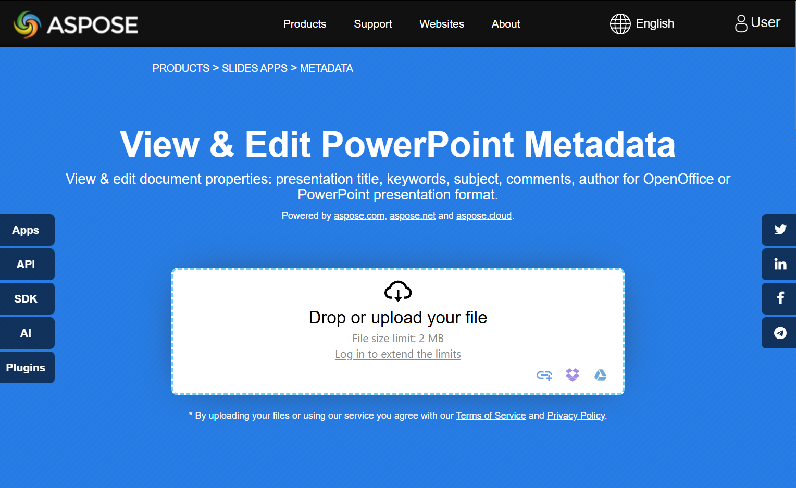

## **Introduzione**

Aspose.Slides per .NET supporta due tipi di proprietà del documento: **Integrate** e **Personalizzate**. Entrambi questi tipi di proprietà possono essere facilmente accessibili e gestiti tramite l'API di Aspose.Slides per .NET.

Aspose.Slides ti permette di lavorare con le proprietà dei documenti di presentazione attraverso l'interfaccia [IDocumentProperties](https://reference.aspose.com/slides/it/net/aspose.slides/idocumentproperties/). Un'istanza di questa interfaccia viene restituita dalla proprietà [Presentation.DocumentProperties](https://reference.aspose.com/slides/it/net/aspose.slides/presentation/documentproperties/). Gli esempi seguenti mostrano come leggere, modificare e gestire queste proprietà.

{} 
Nota che i campi **Application** e **Producer** non possono essere modificati, poiché questi campi mostreranno sempre "Aspose Ltd." e "Aspose.Slides for .NET x.x.x".
{} 

## **Gestire le proprietà della presentazione**

Microsoft PowerPoint fornisce una funzionalità per aggiungere proprietà ai file di presentazione. Queste proprietà del documento consentono di memorizzare informazioni utili insieme ai file. Esistono due tipi di proprietà del documento:

- Proprietà di sistema (integrate)
- Proprietà definite dall'utente (personalizzate)

Le proprietà **Integrate** contengono informazioni generali sul documento, come il titolo del documento, il nome dell'autore, statistiche del documento e altro.

Le proprietà **Personalizzate** sono definite dagli utenti come coppie **Nome/Valore**, dove sia il nome sia il valore sono specificati dall'utente.

Utilizzando Aspose.Slides per .NET, gli sviluppatori possono accedere e modificare sia le proprietà integrate sia quelle personalizzate.

Microsoft PowerPoint consente agli utenti di gestire le proprietà del documento facendo clic sull'icona Office, quindi selezionando **File → Info → Proprietà**. Dopo aver scelto **Proprietà avanzate**, appare una finestra di dialogo in cui è possibile gestire tutte le proprietà del documento del file di presentazione.

Nella finestra di dialogo **Proprietà**, sono presenti diverse schede, come **Generale**, **Riepilogo**, **Statistiche**, **Contenuti** e **Personalizzate**.  
Ogni scheda fornisce opzioni per configurare tipi specifici di informazioni relative al file PowerPoint. La scheda **Personalizzate** è utilizzata per gestire le proprietà definite dall'utente.

## **Accedere alle proprietà integrate**

Queste proprietà, esposte dall'interfaccia [IDocumentProperties](https://reference.aspose.com/slides/it/net/aspose.slides/idocumentproperties/), includono: **Creator** (Autore), **Description**, **Keywords**, **Created** (Data di creazione), **Modified** (Data di modifica), **Printed** (Data ultima stampa), **LastModifiedBy**, **SharedDoc** (indica se il documento è condiviso tra diversi produttori), **PresentationFormat**, **Subject**, **Title** e altre.

```cs
// Istanzia la classe Presentation che rappresenta un file di presentazione.
using Presentation presentation = new Presentation("AccessBuiltInProperties.pptx");

// Get a reference to the object of type IDocumentProperties associated with the presentation.
IDocumentProperties documentProperties = presentation.DocumentProperties;

// Display the Built-in properties.
Console.WriteLine("Category : " + documentProperties.Category);
Console.WriteLine("Content status : " + documentProperties.ContentStatus);
Console.WriteLine("Creation date : " + documentProperties.CreatedTime);
Console.WriteLine("Author : " + documentProperties.Author);
Console.WriteLine("Comments : " + documentProperties.Comments);
Console.WriteLine("Key words : " + documentProperties.Keywords);
Console.WriteLine("Last modified by : " + documentProperties.LastSavedBy);
Console.WriteLine("Manager : " + documentProperties.Manager);
Console.WriteLine("Modified date : " + documentProperties.LastSavedTime);
Console.WriteLine("Presentation format : " + documentProperties.PresentationFormat);
Console.WriteLine("Last print date : " + documentProperties.LastPrinted);
Console.WriteLine("Is shared between producers : " + documentProperties.SharedDoc);
Console.WriteLine("Subject : " + documentProperties.Subject);
Console.WriteLine("Title : " + documentProperties.Title);
```

## **Modificare le proprietà integrate**

Modificare le proprietà integrate dei file di presentazione è semplice quanto accedervi. È sufficiente assegnare una stringa a qualsiasi proprietà desiderata e il valore della proprietà verrà aggiornato. Nell'esempio seguente dimostriamo come modificare le proprietà integrate di un documento di presentazione.

```cs
// Istanzia la classe Presentation che rappresenta un file di presentazione.
using Presentation presentation = new Presentation("ModifyBuiltInProperties.pptx");

// Ottieni un riferimento all'oggetto di tipo IDocumentProperties associato alla presentazione.
IDocumentProperties documentProperties = presentation.DocumentProperties;

// Imposta le proprietà integrate.
documentProperties.Author = "Aspose.Slides for .NET";
documentProperties.Title = "Manage PowerPoint Presentation Properties";
documentProperties.Subject = "Modify Built-in Properties";
documentProperties.Comments = "Aspose description";
documentProperties.Manager = "Aspose manager";

// Salva la presentazione in un file.
presentation.Save("DocumentProperties_output.pptx", SaveFormat.Pptx);
```

## **Aggiungere proprietà personalizzate alla presentazione**

Le proprietà personalizzate della presentazione consentono agli sviluppatori di archiviare metadati aggiuntivi o informazioni specifiche all'interno di un file di presentazione. Aspose.Slides semplifica la creazione e la gestione di queste proprietà personalizzate tramite codice. Gli esempi seguenti mostrano come aggiungere proprietà personalizzate alle tue presentazioni.

```cs
// Istanzia la classe Presentation.
using Presentation presentation = new Presentation();

// Ottieni un riferimento all'oggetto di tipo IDocumentProperties associato alla presentazione.
IDocumentProperties documentProperties = presentation.DocumentProperties;

// Aggiungi proprietà personalizzate.
documentProperties["Reviewed by"] = "John Smith";
documentProperties["Confidentiality level"] = "Internal";
documentProperties["Document version"] = 2;

// Salva la presentazione in un file.
presentation.Save("CustomDocumentProperties_output.pptx", SaveFormat.Pptx);
```

## **Accedere e modificare le proprietà personalizzate**

Aspose.Slides consente inoltre agli sviluppatori di accedere alle proprietà personalizzate esistenti e di modificarne i valori facilmente. Questa funzionalità aiuta a mantenere metadati accurati e supporta aggiornamenti dinamici basati su input dell'utente o logica di business. Gli esempi di seguito illustrano come recuperare e aggiornare i valori delle proprietà personalizzate all'interno di una presentazione.

```cs
// Istanzia la classe Presentation che rappresenta un file PPTX.
using Presentation presentation = new Presentation("AccessAndModifyProperties.pptx");

// Ottieni un riferimento all'oggetto di tipo IDocumentProperties associato alla presentazione.
IDocumentProperties documentProperties = presentation.DocumentProperties;

// Access and modify the custom properties.
for (int i = 0; i < documentProperties.CountOfCustomProperties; i++)
{
    string propertyName = documentProperties.GetCustomPropertyName(i);
    object propertyValue = documentProperties[propertyName];

    // Visualizza il nome e il valore della proprietà personalizzata.
    Console.WriteLine("Custom property name : " + propertyName);
    Console.WriteLine("Custom property value : " + propertyValue);

    // Modifica il valore della proprietà personalizzata.
    documentProperties[propertyName] = "New Value " + (i + 1);
}

// Salva la presentazione in un file.
presentation.Save("CustomProperties_output.pptx", SaveFormat.Pptx);
```

## **Esempio live**

Prova l'app online [**View & Edit PowerPoint Metadata**](https://products.aspose.app/slides/it/metadata) per vedere come lavorare con le proprietà del documento usando l'API Aspose.Slides:

[](https://products.aspose.app/slides/it/metadata)

## **FAQ**

**Come posso rimuovere una proprietà integrata da una presentazione?**

Le proprietà integrate sono parte integrante della presentazione e non possono essere rimosse completamente. Tuttavia, è possibile modificarne i valori o impostarle su una stringa vuota, se la proprietà lo consente.

**Cosa succede se aggiungo una proprietà personalizzata che esiste già?**

Se aggiungi una proprietà personalizzata già esistente, il suo valore corrente verrà sovrascritto con quello nuovo. Non è necessario rimuovere o verificare la proprietà in anticipo, poiché Aspose.Slides aggiorna automaticamente il valore della proprietà.

**Posso accedere alle proprietà della presentazione senza caricare completamente il file?**

Sì, è possibile accedere alle proprietà della presentazione senza caricare completamente il file utilizzando il metodo `GetPresentationInfo` della classe [PresentationFactory](https://reference.aspose.com/slides/it/net/aspose.slides/presentationfactory/). Successivamente, utilizza il metodo `ReadDocumentProperties` fornito dall'interfaccia [IPresentationInfo](https://reference.aspose.com/slides/it/net/aspose.slides/ipresentationinfo/) per leggere le proprietà in modo efficiente, risparmiando memoria e migliorando le prestazioni.