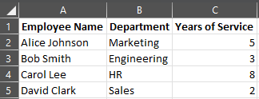

## **Introduzione**

Le presentazioni PowerPoint sono un modo potente per visualizzare e comunicare informazioni. Spesso vengono utilizzate in combinazione con cartelle di lavoro Excel, dove Excel funge da eccellente fonte di dati strutturati e PowerPoint eccelle nel visualizzare tali dati per un pubblico.

Esistono molti scenari pratici in cui combinare Excel e PowerPoint è essenziale: unioni di stampa, popolamento di tabelle dati, generazione di una diapositiva per ogni record di dati (generazione batch di diapositive), creazione di materiale formativo e consolidamento di più report Excel in un'unica presentazione, per citarne alcuni.

Fino ad ora, implementare tali funzionalità con l'API Aspose.Slides richiedeva l'uso di soluzioni di terze parti come Aspose.Cells. Sebbene questi strumenti siano robusti, possono risultare eccessivamente complessi e costosi per gli utenti che hanno bisogno solo di funzionalità di integrazione dati di base.

## **Come funziona**

Per rendere più semplice e fluido il lavoro con i dati Excel, Aspose.Slides ha introdotto nuove classi per leggere i dati da cartelle di lavoro Excel e importare contenuti in una presentazione. Questa funzionalità apre potenti nuove possibilità per gli utenti dell'API che desiderano utilizzare Excel come fonte di dati nei loro flussi di lavoro di presentazione.

La nuova funzionalità è progettata per l'accesso ai dati di uso generale e non è integrata nel Presentation Document Object Model (DOM). Ciò significa che *non consente la modifica o il salvataggio dei file Excel* — il suo unico scopo è aprire le cartelle di lavoro e navigare nel loro contenuto per recuperare i dati delle celle.

Al centro di questa funzionalità c'è la nuova classe [ExcelDataWorkbook](https://reference.aspose.com/slides/it/net/aspose.slides.excel/exceldataworkbook/). Questa classe consente di caricare una cartella di lavoro Excel da un file locale o da uno stream. Una volta caricata, fornisce diverse sovraccariche del metodo [GetCell](https://reference.aspose.com/slides/it/net/aspose.slides.excel/exceldataworkbook/getcell/), che è possibile utilizzare per recuperare celle specifiche in base alla loro posizione (ad esempio, indici di riga e colonna o intervalli denominati).

Ogni chiamata a [GetCell](https://reference.aspose.com/slides/it/net/aspose.slides.excel/exceldataworkbook/getcell/) restituisce un'istanza della classe [ExcelDataCell](https://reference.aspose.com/slides/it/net/aspose.slides.excel/exceldatacell/). Questo oggetto rappresenta una singola cella nella cartella di lavoro Excel e ti consente di accedere al suo valore in modo semplice e intuitivo.

#### **Importa un grafico Excel**

Il passo successivo per ampliare la funzionalità è la classe [ExcelWorkbookImporter](https://reference.aspose.com/slides/it/net/aspose.slides.import/excelworkbookimporter/). Questa classe di utilità fornisce funzionalità per importare contenuti da una cartella di lavoro Excel in una presentazione. Contiene diverse sovraccariche del metodo [AddChartFromWorkbook](https://reference.aspose.com/slides/it/net/aspose.slides.import/excelworkbookimporter/addchartfromworkbook/), che ti aiutano a recuperare il grafico selezionato dalla cartella di lavoro Excel specificata e ad aggiungerlo alla fine della collezione di forme fornita alle coordinate specificate.

#### **Importa una tabella Excel**

La classe [ExcelWorkbookImporter](https://reference.aspose.com/slides/it/net/aspose.slides.import/excelworkbookimporter/) contiene anche diverse sovraccariche del metodo [AddTableFromWorkbook](https://reference.aspose.com/slides/it/net/aspose.slides.import/excelworkbookimporter/addtablefromworkbook/). Questi metodi consentono di importare un intervallo di celle specificato da un foglio di lavoro specifico e aggiungerlo come tabella alla fine della collezione di forme fornita alle coordinate specificate.

In sintesi, è un'API leggera e semplice per leggere i dati Excel — esattamente ciò di cui molti sviluppatori hanno bisogno senza l'overhead di una libreria completa di elaborazione di fogli di calcolo.

## **Scriviamo il codice**

### **Esempio di scenario di unione di stampa**

Nel seguente esempio, implementeremo un semplice scenario di unione di stampa generando più presentazioni basate sui dati memorizzati in una cartella di lavoro Excel.

Per iniziare, abbiamo bisogno di due cose:
1. Una cartella di lavoro Excel contenente i dati



2. Modello di presentazione PowerPoint


```csharp
// Carica la cartella di lavoro Excel con i dati dei dipendenti.
ExcelDataWorkbook workbook = new ExcelDataWorkbook("TemplateData.xlsx");
int worksheetIndex = 0;

// Carica il modello di presentazione.
using Presentation templatePresentation = new Presentation("PresentationTemplate.pptx");

// Scorri le righe di Excel (escludendo l'intestazione alla riga 0).
for (int rowIndex = 1; rowIndex <= 4; rowIndex++)
{
    // Crea una nuova presentazione per ogni record dipendente.
    using Presentation employeePresentation = new Presentation();

    // Rimuovi la diapositiva vuota predefinita.
    employeePresentation.Slides.RemoveAt(0);

    // Clona la diapositiva modello nella nuova presentazione.
    ISlide slide = employeePresentation.Slides.AddClone(templatePresentation.Slides[0]);

    // Ottieni i paragrafi dalla forma target (si assume che l'indice della forma 1 sia usato).
    IParagraphCollection paragraphs = (slide.Shapes[1] as IAutoShape).TextFrame.Paragraphs;

    // Sostituisci i segnaposto con i dati da Excel.
    string employeeName = workbook.GetCell(worksheetIndex, rowIndex, 0).Value.ToString();
    IPortion namePortion = paragraphs[0].Portions[0];
    namePortion.Text = namePortion.Text.Replace("{{EmployeeName}}", employeeName);

    string department = workbook.GetCell(worksheetIndex, rowIndex, 1).Value.ToString();
    IPortion departmentPortion = paragraphs[1].Portions[0];
    departmentPortion.Text = departmentPortion.Text.Replace("{{Department}}", department);

    string yearsOfService = workbook.GetCell(worksheetIndex, rowIndex, 2).Value.ToString();
    IPortion yearsPortion = paragraphs[2].Portions[0];
    yearsPortion.Text = yearsPortion.Text.Replace("{{YearsOfService}}", yearsOfService);

    // Salva la presentazione personalizzata in un file separato.
    employeePresentation.Save($"{employeeName} Report.pptx", SaveFormat.Pptx);
}
```


### **Esempio di tabella Excel**

Nel secondo esempio, copiamo semplicemente i dati da una tabella Excel e li visualizziamo su una diapositiva PowerPoint in un formato più accattivante.

In questo esempio, riusiamo la stessa cartella di lavoro Excel del primo esempio, che contiene una semplice tabella dei dipendenti.

```csharp
// Carica la cartella di lavoro Excel contenente i dati dei dipendenti.
ExcelDataWorkbook workbook = new ExcelDataWorkbook("TemplateData.xlsx");
int worksheetIndex = 0;

// Crea una nuova presentazione PowerPoint.
using Presentation presentation = new Presentation();

// Aggiungi una forma tabella alla prima diapositiva.
ITable table = presentation.Slides[0].Shapes.AddTable(
    50, 200,
    new double[] { 200, 200, 200 },
    new double[] { 30, 30, 30, 30, 30 }
);

// Riempie la tabella PowerPoint con i dati dalla cartella di lavoro Excel.
for (int rowIndex = 0; rowIndex < 5; rowIndex++)
{
    for (int columnIndex = 0; columnIndex < 3; columnIndex++)
    {
        string cellValue = workbook.GetCell(worksheetIndex, rowIndex, columnIndex).Value.ToString();
        table[columnIndex, rowIndex].TextFrame.Text = cellValue;
    }
}

// Salva la presentazione risultante in un file.
presentation.Save("Table.pptx", SaveFormat.Pptx);
```


### **Esempio di importazione di un grafico Excel**

In questo esempio, importiamo un grafico dal primo foglio di lavoro della cartella Excel utilizzata nell'esempio precedente. Il grafico sarà collegato alla cartella di lavoro esterna nella presentazione risultante.

Innanzitutto, aggiungiamo un grafico a torta alla cartella di lavoro Excel basato sulla tabella dei dipendenti.


```csharp
// Crea una nuova presentazione PowerPoint.
using Presentation presentation = new Presentation();

// Ottieni la collezione di forme della prima diapositiva.
IShapeCollection shapes = presentation.Slides[0].Shapes;

// Importa il grafico denominato "Chart 1" dal primo foglio della cartella di lavoro e aggiungilo alla collezione di forme.
ExcelWorkbookImporter.AddChartFromWorkbook(shapes, 10, 10, "TemplateData.xlsx", "Sheet1", "Chart 1", false);

// Salva la presentazione risultante in un file.
presentation.Save("Chart.pptx", SaveFormat.Pptx);
```


### **Esempio di importazione di tutti i grafici Excel**

Immaginiamo di avere una cartella di lavoro Excel piena di grafici e di doverli importare tutti in una presentazione. Ogni grafico dovrebbe essere posizionato su una nuova diapositiva.

Il codice seguente itera su tutti i fogli di lavoro nel file Excel di origine, estrae i grafici da ciascun foglio e aggiunge ogni grafico a una diapositiva separata usando un layout di diapositiva vuoto. Nella presentazione risultante, verranno incorporati solo i dati del grafico, non l'intera cartella di lavoro.

```csharp
// Carica la cartella di lavoro Excel contenente i dati dei dipendenti.
ExcelDataWorkbook workbook = new ExcelDataWorkbook("ExcelWithCharts.xlsx");

// Crea una nuova presentazione PowerPoint.
using Presentation presentation = new Presentation();

// Recupera il layout della diapositiva vuota.
ILayoutSlide blankLayout = presentation.LayoutSlides.GetByType(SlideLayoutType.Blank);

// Ottieni i nomi di tutti i fogli di lavoro contenuti nella cartella di lavoro Excel.
IList<string> worksheetNames = workbook.GetWorksheetNames();

foreach (var name in worksheetNames)
{
    // Recupera un dizionario che mappa gli indici dei grafici ai nomi dei grafici per il foglio di lavoro.
    IDictionary<int, string> worksheetCharts = workbook.GetChartsFromWorksheet(name);
    foreach (var chart in worksheetCharts)
    {
        // Aggiungi una nuova diapositiva usando il layout vuoto.
        ISlide slide = presentation.Slides.AddEmptySlide(blankLayout);

        // Importa il grafico specificato dalla cartella di lavoro Excel nella collezione di forme della diapositiva.
        ExcelWorkbookImporter.AddChartFromWorkbook(slide.Shapes, 10, 10, workbook, name, chart.Key, false);
    }
}

// Salva la presentazione risultante in un file.
presentation.Save("Charts.pptx", SaveFormat.Pptx);
```

### **Esempio di importazione di una tabella Excel**

In questo esempio, importiamo una tabella formattata da un foglio di lavoro Excel direttamente in una presentazione PowerPoint.

Il foglio di lavoro Excel di origine contiene una tabella formattata con i dati dei dipendenti:


```csharp
// Crea una nuova presentazione PowerPoint.
using Presentation presentation = new Presentation();

// Ottieni la collezione di forme della prima diapositiva.
IShapeCollection shapes = presentation.Slides[0].Shapes;

// Importa la tabella dal primo foglio della cartella di lavoro e aggiungila alla collezione di forme.
ExcelWorkbookImporter.AddTableFromWorkbook(shapes, 10, 10, "TemplateData.xlsx", "Sheet1", "A1:C5");

// Salva la presentazione risultante in un file.
presentation.Save("FormattedTable.pptx", SaveFormat.Pptx);
```


## **Riepilogo**

Questo meccanismo, disponibile direttamente in Aspose.Slides, combina il lavoro con i dati Excel e le presentazioni in un unico luogo. Consente di creare diapositive con grafici visivi e dati presentati come tabelle Excel — senza librerie aggiuntive o integrazioni complesse.